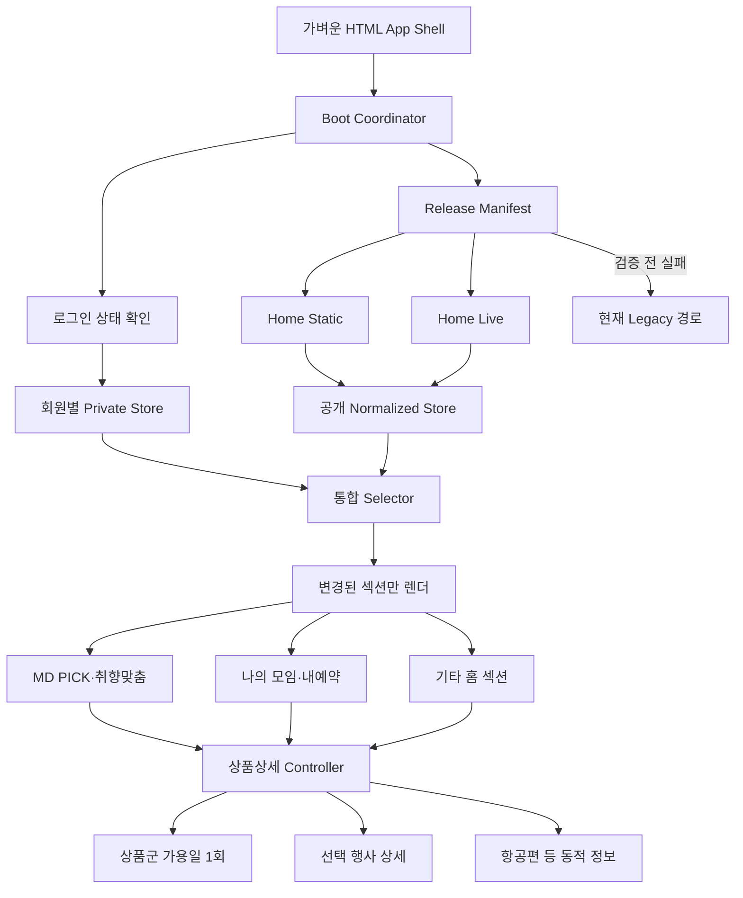

# 골프조인 메인페이지 최적화 최종 계획서

| 구분 | 내용 |
|---|---|
| 문서 버전 | 3.47 |
| 작성 기준일 | 2026-09-14 |
| 대상 화면 | `golfjoin_main.html`의 메인·신청 흐름과 `golfjoin_admin_dashboard.html`의 운영·분석·설정 화면, `golfjoin-sheet-api` |
| 현재 상태 | v65c 신규 신청 이메일 알림을 운영 반영했다. 서버 `golfjoin-sheet-api-00255-pac`, 관리자 HTML `73FEB4E5`가 운영 기준이며 메인 자산 `gha_cc961da10c7fd5dfbc822f4e`와 메인 HTML `CB76AC07`은 변경하지 않았다. Google Apps Script `MailApp`, Secret Manager, 수신 이메일 인증과 테스트 발송이 정상이다. 설정 조회 GET 라우팅 오류를 바로잡았고 Apps Script 응답 제한시간을 30초로 조정했다. 다음 자연 신규 신청 1건에서 상담대기 행·메일·발송 이력의 일치를 최종 확인한다. |
| 기본 원칙 | 한 단계를 검증하고 통과한 뒤 다음 단계를 시작한다. |

---

## 1. 이 계획서의 사용 방법

이 문서는 개발자뿐 아니라 운영 담당자도 현재 진행 상태를 확인할 수 있도록 모든 실행 항목에 체크박스를 사용한다.

- [ ] 작업을 시작하기 전에 해당 단계의 목적과 위험을 작업자 전원이 확인한다. — 설명: 무엇을 바꾸는지 모른 채 수정하면 성능은 좋아져도 기존 기능이 깨질 수 있다.
- [ ] 작업이 끝났다는 이유만으로 체크하지 않고, 각 단계의 통과 조건까지 확인한 뒤 체크한다. — 설명: 코드를 작성한 것과 운영에서 안전하게 동작하는 것은 서로 다르다.
- [ ] 한 단계의 필수 통과 조건이 실패하면 다음 단계를 시작하지 않는다. — 설명: 문제가 누적되면 어느 변경 때문에 장애가 났는지 찾기 어렵다.
- [ ] 운영 반영 전에는 반드시 현재 정상 버전과 직전 정상 버전의 복구 방법을 확인한다. — 설명: 문제가 생겼을 때 몇 분 안에 이전 상태로 돌아갈 수 있어야 한다.
- [ ] 계획 변경이 필요하면 체크박스를 임의로 삭제하지 않고 변경 이유와 결정일을 기록한다. — 설명: 나중에 같은 문제를 반복 검토하지 않기 위한 기록이다.

### 전체 진행 현황 대시보드

아래 체크박스는 각 단계의 세부 항목과 통과 조건이 모두 완료됐을 때만 체크한다.

- [x] 0단계 완료 — 기준선 고정과 복구 준비
- [x] 1단계 완료 — 테스트, 데이터 계약, 관측 장치
- [x] 2단계 완료 — 저위험 체감 성능 개선
- [x] 3단계 완료 — 소스 구조화와 빌드 기반 마련
- [x] 4단계 완료 — 통합 Release manifest와 발행 파이프라인
- [x] 5단계 완료 — Shadow 데이터 비교
- [x] 6단계 완료 — 비로그인 메인 V2 전환
- [x] 7단계 완료 — Normalized Store와 선택적 렌더링
- [x] 8단계 완료 — 로그인·개인 데이터 최적화와 보안
- [x] 9단계 완료 — 쓰기 후 정합성 보장
- [x] 10단계 완료 — 상품군 가용일 단일화
- [x] 11단계 완료 — 상품상세·여행기간·항공편 개선
- [x] 12단계 완료 — Builder·캘린더·딥링크의 정상 흐름 전체 상품 의존 제거, Legacy 장애 fallback 유지
- [x] 13단계 완료 — CSS/JS 외부 자산과 HTML 경량화
- [x] 14단계 완료 — 단계적 배포와 Legacy 축소 여부 판정·안전망 유지
- [x] 15단계 완료 — HOME 일반회원 SMS 인증과 신규가입 휴대폰 인증 운영 반영

### 후속 운영 개선: 카카오 신규가입 완료 지연 v56b

- [x] 최종 입력완료의 동기 작업을 코드 기준으로 분해하고 지연 위험 구간을 확정했다.
- [x] 검증된 카카오 프로필 핵심 저장과 세션 발급 순서를 유지했다.
- [x] 관리자 임시 명단 귀속은 동시성·소유권 충돌을 막기 위해 동기 처리로 유지했다.
- [x] 과거 신청서 전화번호 동기화와 후보 안내를 가입 완료 응답의 필수 경로에서 제거했다.
- [x] 후속 동기화 상태를 `pending/done`, 작업 revision, 재시도 횟수·시각, 개인정보 없는 오류 코드로 영속화했다.
- [x] 같은 revision만 결과를 확정하도록 하여 오래된 재시도가 최신 프로필을 덮어쓰지 못하게 했다.
- [x] 실제 가입·탈퇴 반복 없이 상태 시뮬레이션과 패키지 검증 `9/9`, 가입·재가입·세션·멱등 저장 핵심 회귀 `30/30`을 통과했다.
- [x] Cloud Function에 v56b 서버 파일을 배포했다. — `golfjoin-sheet-api-00250-dos`가 ACTIVE·Ready이고 트래픽 100%다.
- [x] v56b 불변 JavaScript를 GCS에 업로드했다. — 자산 revision `gha_1d89b64124ca9a47190d9a98` 로드를 확인했다.
- [x] ERP 편집기에서 v56b HTML `349C7263`으로 교체했다.
- [x] 기존 카카오 계정 로그인·새로고침·로그아웃·내예약과 일반회원·비로그인 핵심 흐름을 회귀 확인했다.
- [x] `member_pending_roster_candidates` 응답, 브라우저 콘솔, `join_member_profiles` 후속 동기화 헤더 6개를 운영에서 확인했다.
- [ ] 다음 자연 신규가입 1건이 발생했을 때 완료 체감과 후속 상태를 관찰한다. 인위적인 재가입은 배포 선행 조건이 아니다.

배포 실행서는 `deploy/stage56-kakao-signup/kakao-signup-latency-20260902-v56b/RUNBOOK.md`를 기준으로 한다.

### 최우선 후속 개선: 카카오 신규가입 잔여 지연 v58

- [x] v56b 이후에도 남은 입력 완료 직렬 경로를 브라우저·서버 단위로 다시 분해했다.
- [x] 브라우저 ERP 중복 확인, 직렬 중복검사, 서버 ERP 재시도 최대 7초, Sheets 직렬 저장을 잔여 지연 원인으로 확정했다.
- [x] 프로필 저장 전 세션 발급 금지와 카카오·ERP 신원 검증 유지 조건을 확정했다.
- [x] 가입·탈퇴 반복 없이 검증할 신규가입·응답 유실·재가입·중복·저장실패 시뮬레이션 계획을 수립했다.
- [x] v58a에서 브라우저 ERP 사전·사후 중복 왕복 제거, 중복검사 병렬화, 카카오 검증 병렬화를 구현한다.
- [x] 개인정보 없는 단계별 서버 시간과 ERP 재시도 횟수 관측을 추가한다.
- [x] 신규가입·응답 유실·탈퇴 후 재가입·중복·프로필 실패·멱등성 시뮬레이션과 독립 배포 패키지 검증을 통과했다.
- [x] 인증·멱등성·재가입 시뮬레이션과 기존 로그인 회귀를 통과한 뒤 서버→자산→메인 순서로 배포했다. — 서버 `00251-wab`, 자산 `gha_742a85824b8b154a3a724ddb`, HTML `8526DB12`
- [ ] 다음 자연 신규가입 1건의 로그로 v58b ERP·Sheets 추가 최적화 필요 여부를 판정한다.

상세 계획은 `docs/home-optimization/measurement/reports/20260903_kakao_signup_completion_latency_v58_plan.md`를 기준으로 한다.

### 최우선 공개 진입 수정: 비로그인 광고 상품상세 딥링크 v59

- [x] 광고 주소 형식과 대상 식별자 `goodSeq=30001104`, `eventSeq=30285516`이 상세 딥링크 계약에 맞는지 확인했다.
- [x] 현재 운영에서 `detailModal=false`, `loginModal=true`와 딥링크 매개변수 즉시 제거를 재현했다.
- [x] 원인을 `resumeJoinExternalDeepLinkOnce()`의 비로그인 `requireJoinLogin("detail")` 선실행으로 확정했다.
- [x] 상품상세를 공개 화면으로 열고 참여 신청·찜·나의 모임에서만 기존 로그인을 요구하도록 경계를 수정했다.
- [x] Product Discovery의 정확한 `goodSeq + eventSeq` 직접 조회와 상품 미발견 fallback을 유지했다.
- [x] `utm_source`, `utm_medium`, `utm_campaign`은 상세가 열린 뒤에도 남기고 딥링크 제어값만 제거하도록 확인했다.
- [x] 운영 v58a 기준 한 블록 격리 패치, 소스·패키지 회귀 `23/23`, 실제 후보 함수 브라우저 검증을 통과했다.
- [x] v59a 불변 JavaScript `gha_87a642371ea0623681f5eb2a`를 GCS에 업로드했다.
- [x] ERP 편집기에서 v59a HTML `158E2AC6`으로 교체했다.
- [x] 로그아웃 운영 URL에서 지정 상품 상세 즉시 열림, 로그인 미노출, UTM 보존을 확인했다.
- [x] 상세 안의 참여 신청·찜을 눌렀을 때는 로그인 모달이 정상 노출되는지 확인했다.

배포 실행서는 `deploy/stage59-public-detail-deeplink/public-detail-deeplink-20260903-v59a/RUNBOOK.md`를 기준으로 한다. 서버 배포는 필요하지 않으며 복구 HTML은 `8526DB12`다.

### 후속 분석 개선: GA4 인사이트 신뢰도 P0 v57

- [x] 검색·로그인 단계별 독립 사용자 수가 역전되면 100% 초과 순차 비율을 반환하지 않는 서버 계약을 구현했다.
- [x] 역전 상태를 `nonMonotonic`, `actionable=false`, 진단 메시지로 관리자 화면에 전달하고 자동 개선 권고에서 제외했다.
- [x] 이전 기간 방문자가 0명이면 `comparisonAvailable=false`로 KPI 증감과 비교 표·상세 열을 숨겼다.
- [x] 상품카드가 아닌 `new_schedule` 생성 CTA를 섹션 성과와 자동 권고에서 서버·화면 양쪽으로 제외했다.
- [x] 참여 신청 저장 성공 뒤 `golfjoin_apply_step_view · apply_step=complete`를 명시적으로 전송하도록 보강했다.
- [x] GA4 관련 회귀 `108/108`, 배포 계약 `32/32`, 소스 조립과 데스크톱·390px 화면 검증을 통과했다.
- [ ] v57a Cloud Function API를 배포하고 운영 응답의 `comparisonAvailable`, `nonMonotonic`, `actionable`을 확인한다.
- [ ] v57b 관리자 HTML을 Firebase Hosting에 배포하고 역전 진단·비교 숨김·섹션 제외를 확인한다.
- [ ] v57c 불변 JavaScript를 GCS에 업로드하고 ERP 메인 HTML을 직접 교체한다.
- [ ] 다음 자연 참여 신청 완료에서 `apply_step=complete`와 `join_apply_complete`가 함께 수집되는지 확인한다. 인위적인 신청 생성은 배포 선행 조건이 아니다.

배포 실행서는 `deploy/stage57-ga4-insights` 아래 API·관리자·메인 세 패키지의 `RUNBOOK.md`를 순서대로 사용한다.

### 다음 운영 개선: 신규 신청 이메일 알림 v65c — 운영 반영 완료, 자연 신청 검증 대기

#### 목표와 범위

- [x] 알림 대상은 이용자에게 보내는 메일이 아니라 운영자가 받는 신규 신청 알림으로 확정한다.
- [x] 대상 이벤트는 이용자의 `새 모임 생성`과 `기존 모임 참여 신청` 두 종류로 제한한다.
- [x] 관리자 추천일정 등록, 과거 데이터 재조회, 대시보드 새로고침, 견적 재생성은 신규 신청 메일을 만들지 않는다.
- [x] 대시보드의 상담대기 화면 렌더링이 아니라 서버의 신청 저장 성공을 발송 기준으로 사용한다.
- [x] 신청 저장은 성공했지만 이메일 발송이 실패해도 이용자의 신청 완료를 취소하거나 지연시키지 않는다.

#### 관리자 화면

- [x] 왼쪽 메뉴 하단에 톱니바퀴 아이콘의 `설정` 메뉴를 추가했다.
- [x] 설정 화면에 `신규 신청 이메일 알림` 카드와 활성화 스위치를 제공한다.
- [x] 수신 이메일은 최대 5개까지 등록하고 각 주소를 `인증 전 · 인증 완료 · 사용 중지`로 구분한다.
- [x] 신규 주소에는 인증 메일을 보내며 인증 완료된 주소만 실제 신청 내역을 받도록 한다.
- [x] 외부 도메인은 개인정보 오발송 위험 안내와 재확인을 거치고, 주소 삭제 전 확인창을 표시한다.
- [x] `새 모임 생성`, `참여 신청` 알림을 각각 켜고 끌 수 있게 하되 최초 기본값은 둘 다 켠다.
- [x] `테스트 메일 보내기`, `저장`, 마지막 수정 시각, 최근 발송 상태를 표시한다.
- [x] 최근 발송 내역은 신청 유형·신청 시각·수신처 마스킹·상태·실패 사유·재전송 버튼을 제공한다.

#### 이메일 내용

- [x] 제목은 `[골프조인 신규신청] {새 모임 생성|참여 신청} · {신청자명} · {출발일}` 형식으로 고정한다.
- [x] 본문에는 신청 구분, 신청 시각, 신청자명, 연락처, 회원 채널, 상품명, 국가·지역, 출발일·귀국일, 신청 인원, 객실 유형, 항공 요청, 인사말·요청사항, 신청 ID와 일정 ID를 표시한다.
- [x] 값이 없는 항목은 빈칸이 아니라 `미등록`으로 표시해 데이터 누락과 화면 오류를 구분한다.
- [x] 생년월일 전체, 카카오 ID, 인증 토큰, 여권 정보와 같은 불필요한 개인정보·비밀값은 메일에 넣지 않는다.
- [x] 이메일 하단의 `상담대기에서 확인` 버튼은 관리자 대시보드 로그인 후 해당 신청을 찾을 수 있는 안전한 내부 링크로 연결한다. 토큰이나 개인정보는 URL에 넣지 않는다.

#### 서버 처리와 중복 방지

- [x] `new_schedule_builder` 또는 `join_apply` 저장 응답이 실제 성공한 뒤에만 관리자 메일 작업을 만든다.
- [x] 현재 알림톡이 사용하는 비동기 Cloud Tasks 작업을 재사용하고 이메일은 독립 발송 기록으로 관리한다.
- [x] 기존 비동기 작업 안에서 알림톡과 이메일을 병렬 처리해 신청 완료 응답 시간이 합산되지 않게 한다.
- [x] 실제 메일 전송은 기존 시트 바운드 Google Apps Script 웹앱의 `MailApp`을 사용한다. Cloud Function은 메일 본문을 HMAC 서명해 서버 간 호출하고 공유 비밀값은 Apps Script의 Script Properties와 Secret Manager에만 저장한다.
- [x] API 시트 쓰기는 단순 `onEdit` 트리거를 발생시키지 않으므로, 시트 변경 감시가 아니라 신청 저장 성공 후 기존 비동기 Cloud Tasks에서 Apps Script 메일 작업을 호출한다.
- [x] Apps Script는 요청 시각·nonce·본문 전체 서명을 검증하고 동일 멱등키의 즉시 재시도를 6시간 차단한다.
- [x] 중복키는 `{신청종류}:{applicationId}:admin_application_email:v1:{recipientHash}`로 만들어 같은 신청·수신처에는 한 번만 전송한다.
- [x] 작업 처리 시 설정 버전과 인증 완료 수신처를 확인해 검증되지 않은 주소로 발송하지 않는다.
- [x] 수신처가 없거나 기능이 꺼져 있으면 `skipped`로 처리하고 신청 자체는 정상 완료한다.
- [x] 일시 오류는 지수형 재시도로 최대 5회 처리하고, 영구 오류·최종 실패는 관리자 화면에서 확인·수동 재전송할 수 있게 한다.
- [x] 재전송은 별도 요청 ID를 만들고 원본 신청 ID·수신처 멱등키를 유지한다.

#### 저장 데이터와 보안

- [x] 비공개 설정 저장소 `admin_notification_settings`를 두고 `enabled`, 이벤트별 사용 여부, 인증된 수신처, 설정 버전, 수정자·수정 시각을 저장한다.
- [x] 비공개 발송 기록 `admin_email_delivery_log`를 두고 메시지 ID, 신청 ID, 유형, 수신처 해시·마스킹 값, 상태, 시도 횟수, 제공자 메시지 ID, 안전한 오류 코드, 생성·발송 시각을 저장한다.
- [x] 두 저장소는 공개 조회 목록에서 제외하고 기존 관리자 세션을 통과한 전용 API로만 읽고 수정한다.
- [x] 로그·오류에는 신청자 전화번호, 이메일 본문, API 키를 남기지 않는다.
- [x] 첫 버전은 현재 단일 관리자 계정만 설정을 변경할 수 있게 하며, 다중 관리자 도입 시 `설정 관리자` 권한을 별도로 분리한다.

#### 상태 기준

| 상태 | 의미 | 운영 처리 |
|---|---|---|
| `queued` | 신청 저장 후 메일 작업이 생성됨 | 기다림 |
| `sending` | 발송 공급자 요청 처리 중 | 중복 발송 차단 |
| `sent` | 공급자가 정상 접수함 | 완료 표시 |
| `retrying` | 일시 오류로 자동 재시도 중 | 시도 횟수 표시 |
| `failed` | 최대 재시도 후 실패 | 원인 확인 후 수동 재전송 |
| `skipped` | 알림 꺼짐 또는 인증 수신처 없음 | 설정 안내, 신청은 정상 유지 |

#### 필수 검증과 배포 순서

- [x] 새 모임 생성과 참여 신청 제목·본문·누락값 변환 단위 테스트를 작성했다.
- [x] 동일 신청·수신처 멱등키와 발송 기록 잠금으로 Cloud Tasks 재시도 중복을 차단했다.
- [x] Apps Script 시간초과·동시 처리·일일 할당량·영구 오류 정책과 신청 응답 비동기 분리를 검증했다.
- [x] 설정 저장·인증·삭제·알림별 사용 중지·테스트 발송·실패 재전송을 PC와 모바일 폭에서 검증했다.
- [x] 이메일 본문 누락값, 긴 상품명, 특수문자, 한글 인코딩과 안전한 관리자 링크 구성을 검증했다.
- [x] 운영 반영 순서와 복구 절차를 v65b `RUNBOOK.md`로 고정했다.

#### v65c 운영 반영 체크리스트

- [x] 기존 Google Sheet Apps Script 프로젝트에 v65b 코드를 반영하고 Script Properties의 `GOLFJOIN_EMAIL_RELAY_SECRET`을 등록한 뒤 새 웹앱 버전을 배포했다.
- [x] 같은 메일 중계 비밀값과 이메일 인증용 난수를 Secret Manager에 저장하고 Cloud Function 서비스 계정에 접근 권한을 부여했다.
- [x] v65c Cloud Function `golfjoin-sheet-api-00255-pac`을 배포하고 최신 리비전 100% 트래픽·설정 API 200 응답을 확인했다.
- [x] v65b 관리자 HTML `73FEB4E5`를 Firebase Hosting에 배포했다.
- [x] `설정`에서 수신 이메일 인증과 테스트 발송 성공을 확인했다.
- [ ] `새 모임 생성`, `참여 신청`, `이메일 알림 사용` 세 스위치를 켜고 저장한 운영 상태를 확인한다.
- [ ] 다음 자연 발생 신청에서 상담대기 생성, 메일 1회 수신, 발송 이력 `sent`, 메일 버튼의 해당 신청 검색을 확인한다.

배포 파일과 명령은 `deploy/stage65-admin-email-notifications/admin-email-notifications-apps-script-20260914-v65b/RUNBOOK.md`를 기준으로 사용한다.
- [ ] 최초에는 운영자 이메일 1개로 테스트 메일을 확인한 후 알림을 켜고, 자연 신규 신청 1건으로 상담대기 행·메일 내용·발송 로그가 일치하는지 승인한다.
- [ ] 즉시 중지 스위치는 메일만 끄며 신청 저장, 상담대기, 알림톡에는 영향을 주지 않도록 한다.

#### 발송 방식 결정

- [x] 초기 운영은 별도 유료 공급자 대신 Google Apps Script `MailApp`을 사용한다. 발신 계정의 일일 잔여 할당량을 매번 확인하며, 할당량 부족은 신청 저장에 영향을 주지 않고 발송 이력에서 재처리한다. SMTP 비밀번호를 HTML이나 시트에 저장하지 않는다.

- [x] 개인 캐시 기능의 일반 사용자 확대 전제인 9단계 쓰기 정합성 검증을 완료했다. — 설명: 참여 성공 응답을 먼저 적용하고 오래된 조회를 폐기하므로 과거 인원으로 돌아가는 현상을 차단했다.

---

## 2. 초보자를 위한 핵심 용어

| 용어 | 쉬운 설명 |
|---|---|
| Manifest | 현재 사용해야 할 데이터 파일들의 주소와 버전을 적어 둔 작은 안내 파일 |
| Revision | 데이터가 언제 만들어졌는지 구분하는 버전 번호 |
| Static 데이터 | 상품명, 대표이미지, 지역처럼 자주 바뀌지 않는 정보 |
| Live 데이터 | 현재인원, 모집상태, 참여자처럼 자주 바뀌는 정보 |
| Private 데이터 | 내가 만든 일정, 내가 참여한 일정처럼 로그인 회원에게만 보여야 하는 정보 |
| Immutable 캐시 | 버전 URL이 바뀌기 전에는 파일 내용이 절대 바뀌지 않는다고 브라우저가 믿고 오래 보관하는 방식 |
| Fallback | 신규 방식이 실패하면 기존 정상 방식으로 돌아가는 안전장치 |
| Shadow 비교 | 신규 데이터를 화면에는 사용하지 않고 기존 데이터와 결과만 몰래 비교하는 검증 방식 |
| Normalized Store | 일정과 상품을 ID별로 한 번만 저장하고 여러 화면이 같은 값을 읽게 하는 중앙 상태 저장소 |
| E2E 테스트 | 실제 사용자처럼 로그인, 스크롤, 클릭, 모달 열기까지 브라우저에서 자동 확인하는 테스트 |
| LCP | 처음 화면의 중요한 큰 이미지나 콘텐츠가 표시되는 데 걸리는 시간 |
| INP | 클릭이나 터치 후 화면이 반응하기까지 걸리는 시간 |
| CLS | 로딩 도중 화면 요소가 갑자기 밀리거나 흔들리는 정도 |
| p75 | 사용자 100명 중 느린 쪽 25명을 포함해도 만족해야 하는 성능 기준 |
| Kill switch | 서버나 HTML을 다시 배포하지 않고 신규 기능을 즉시 끄는 원격 스위치 |
| Generation | 이전 요청과 최신 요청을 구분하는 번호. 늦게 도착한 이전 응답이 최신 화면을 덮지 못하게 한다. |
| Idempotency | 같은 신청 요청이 여러 번 도착해도 실제 저장은 한 번만 되게 하는 성질 |

---

## 3. 현재 확인된 기준선

아래 값은 기존 조사 결과이며 0단계에서 동일 조건으로 다시 측정해야 한다.

| 항목 | 현재 확인값 |
|---|---:|
| 홈 HTML | 약 2.72MB |
| 인라인 CSS | 약 848KB |
| 인라인 JavaScript | 약 1.61MB |
| 활성 홈 카드 | 약 215.7KB, 상품 요약 약 150개 |
| 상품군 catalog | 약 105.9KB, 상품군 28개·상품 66개 |
| `home_bootstrap_light` | 약 29.6KB |
| 전체 상품 요약 로컬 파일 | 약 5.71MB |
| 전체 상품 fallback | 약 16.1MB |
| 비로그인 콜드 진입 데이터 요청 | 보통 5~6건 |
| 로그인 콜드 진입 데이터 요청 | 보통 11~13건 |
| 조사한 MD PICK 대표이미지 13개 | 총 약 1.18MB, 평균 약 90.9KB |

현재 구조에서 확인된 주요 문제는 다음과 같다.

- [ ] 홈 카드와 상품군 manifest가 서로 다른 시점에 발행되는 혼합 리비전 문제를 기준선에 기록한다. — 설명: 새 카드가 이전 상품군 정보와 섞이면 상품 선택 결과가 달라질 수 있다.
- [ ] 정적 카드와 `home_bootstrap_light`가 같은 공개 일정 정보를 서로 다른 시점의 값으로 제공하는 문제를 기록한다. — 설명: 처음에는 3명으로 보였다가 API 응답 후 4명으로 바뀌는 재렌더가 발생할 수 있다.
- [x] 모든 MD PICK·취향맞춤 대표이미지가 `loading="lazy"`이고 MD PICK 렌더링도 중첩해서 지연되는 상태를 기록한다. — 설명: PC 로그인 콜드 3회에서 지연 프리로드가 14.62~17.00초에 시작됐지만 다운로드는 18~42ms임을 확인했다.
- [x] 8초 후 실행되는 MD PICK 프리로드를 기준선에 기록한다. — 설명: 지연 프리로드 시작 중앙값은 16,705ms로 초기 화면에는 너무 늦다.
- [ ] 상품군 상세 진입 시 구성 상품별 가용일과 상세 HTML을 여러 번 요청하는 상태를 기록한다. — 설명: 상품군이 없는 상품보다 상품군 상품이 느린 직접적인 이유다.
- [ ] `getBuilderProductSource()` 조회 과정에서 전체 상품 로더가 암묵적으로 시작될 수 있는 상태를 기록한다. — 설명: 작은 상세 작업 하나가 수 MB 다운로드를 일으킬 수 있다.
- [ ] 스크롤 중 여러 섹션의 `getBoundingClientRect()`와 문서 높이를 반복 측정하는 상태를 기록한다. — 설명: 모바일에서 스크롤 프레임이 끊길 수 있다.
- [ ] 로그인 회원 요청이 중복되거나 나의 모임을 열 때 다시 실행될 수 있는 상태를 기록한다. — 설명: 같은 데이터를 여러 번 받아 네트워크와 렌더링 비용이 증가한다.
- [ ] 전역 로딩 닫기 작업이 새로 열린 로딩까지 닫을 수 있는 경쟁 상태를 기록한다. — 설명: 이전 요청의 닫기 작업과 새 요청의 열기 작업이 겹치면 로딩 UI 상태가 틀어질 수 있다.

---

## 4. 최종 기술 결정

### 4.1 채택할 방향

- [ ] 한 번에 전면 재작성하지 않고 기존 기능 옆에 신규 구조를 세우는 Strangler 방식으로 진행한다. — 설명: 새 기능을 한 조각씩 검증하면서 기존 기능을 대체하는 방식이다.
- [ ] 기존 경로는 신규 경로가 안정화될 때까지 fallback으로 유지한다. — 설명: 신규 데이터가 실패해도 사용자는 기존 화면을 사용할 수 있다.
- [ ] 단, 한 화면 안에서 기존 경로와 신규 경로가 동시에 데이터 권위를 갖지 않게 한다. — 설명: 두 경로가 같은 카드를 번갈아 덮어쓰면 정합성과 스크롤 문제가 다시 발생한다.
- [ ] 부팅은 `준비 → 다운로드 → 검증 → 화면 반영`의 트랜잭션으로 관리한다. — 설명: 신규 데이터를 화면에 반영하기 전까지만 전체 legacy fallback을 허용한다.
- [ ] 화면 반영 이후의 일부 오류는 전체 fallback이 아니라 실패한 섹션 내부에서 처리한다. — 설명: 취향맞춤 하나가 실패했다고 이미 정상 표시된 메인 전체를 다시 그리면 안 된다.
- [ ] 정적 상품, 공개 실시간 일정, 회원 개인 데이터를 서로 다른 저장소와 캐시 정책으로 관리한다. — 설명: 바뀌는 속도와 보안 수준이 서로 다르기 때문이다.
- [ ] 공개 일정의 최종 권위는 `home-live` 한 곳에만 둔다. — 설명: 카드와 API가 서로 다른 현재인원을 제공하는 문제를 없앤다.
- [ ] 일정은 항상 `scheduleId`, 상품은 `goodSeq + eventSeq`, 상품군은 `familyId`를 정식 식별자로 사용한다. — 설명: 이름이나 휴대폰을 이용한 느슨한 매칭은 다른 일정이 섞이는 원인이 된다.
- [ ] 조회용 네트워크 요청과 캐시 조회 함수를 분리한다. — 설명: 값을 읽는 함수가 몰래 전체 상품 다운로드를 시작하지 못하게 한다.
- [ ] 읽기 작업은 영역별 skeleton을 사용하고 전역 차단 로딩은 쓰기 작업에만 사용한다. — 설명: 정보가 늦어도 사용자는 모달을 닫거나 다른 내용을 볼 수 있어야 한다.
- [ ] 신규 기능은 기능별 원격 플래그로 독립적으로 켜고 끈다. — 설명: 이미지 로더 문제 때문에 로그인 데이터 개선까지 모두 롤백할 필요가 없어야 한다.

### 4.2 당장 채택하지 않을 방향

- [ ] React/Vue 같은 프레임워크로 전체 페이지를 한 번에 다시 만들지 않는다. — 설명: 현재 장애 원인은 프레임워크 부재보다 데이터 중복과 암묵적 로딩에 가깝다.
- [ ] Service Worker를 초기 최적화 수단으로 도입하지 않는다. — 설명: 잘못된 캐시가 회원 브라우저에 오래 남아 긴급 롤백이 어려워질 수 있다.
- [ ] 모든 이미지를 `fetchpriority="high"`로 설정하지 않는다. — 설명: 중요 이미지끼리 네트워크를 서로 빼앗아 오히려 LCP가 느려진다.
- [ ] 모든 홈 데이터를 하나의 거대한 JSON으로 합치지 않는다. — 설명: 첫 화면에 필요하지 않은 국가·월·상품 데이터까지 다시 내려받게 된다.
- [ ] 인증 구조 없이 개인정보 API를 하나로 합치지 않는다. — 설명: 클라이언트가 보낸 회원 번호를 믿으면 다른 회원 데이터가 노출될 위험이 있다.
- [ ] JSON 대신 복잡한 바이너리 포맷을 우선 도입하지 않는다. — 설명: 현재는 데이터 중복 제거와 캐시 개선 효과가 훨씬 크고 장애 분석도 JSON이 쉽다.
- [ ] 전체 상품 fallback 코드를 조기에 삭제하지 않는다. — 설명: Builder·딥링크 등 놓친 소비자가 남아 있을 수 있다.
- [ ] 초기 단계에서 CSS/JS 외부 분리와 데이터 구조 변경을 동시에 하지 않는다. — 설명: 문제가 생겼을 때 원인을 구분하기 어렵다.

---

## 5. 목표 구조



### 부팅 트랜잭션 상태

```text
LEGACY_READY
  → V2_FETCHING
  → V2_VALIDATING
  → V2_COMMITTED
  → V2_RUNNING
```

- [ ] `V2_COMMITTED` 이전 실패는 신규 요청을 중단하고 legacy 경로로 전환한다. — 설명: 아직 신규 화면을 보여주지 않았으므로 안전하게 기존 방식으로 돌아갈 수 있다.
- [ ] `V2_COMMITTED` 이후에는 legacy 데이터가 신규 화면을 덮어쓰지 못하게 한다. — 설명: 화면 반영 후 두 경로를 섞으면 인원과 카드 순서가 다시 바뀐다.
- [ ] 반영 이후 한 섹션이 실패하면 그 섹션만 재시도 또는 오류 상태를 표시한다. — 설명: 메인 전체를 다시 로딩하지 않는다.
- [ ] 같은 세션에서 신규 부팅 실패가 반복되면 circuit breaker로 신규 시도를 중지한다. — 설명: 실패하는 요청을 페이지 안에서 계속 반복하지 않게 한다.

---

## 6. 주요 리스크와 개선된 대응책

| 리스크 | 심각도 | 더 나은 대응 방법 | 통과 기준 |
|---|---:|---|---|
| 신규·기존 경로가 같은 화면을 동시에 갱신 | 매우 높음 | 부팅 트랜잭션과 단일 화면 권위 적용 | 한 세션에서 renderer owner 1개 |
| manifest는 최신인데 참조 객체가 아직 없음 | 매우 높음 | 객체 선발행·검증 후 root를 마지막에 원자 교체 | 누락 객체 0건 |
| 홈 카드와 상품군의 리비전 불일치 | 매우 높음 | 같은 release ID로 묶고 계약 검증 | 핵심 필드 불일치 0건 |
| 다른 회원 데이터가 캐시에 남음 | 매우 높음 | 회원키+세션 generation 캐시, 로그아웃 즉시 폐기 | 회원 전환 E2E 노출 0건 |
| 늦은 이전 응답이 최신 선택을 덮음 | 높음 | AbortController, request generation, mutation watermark | 빠른 연속 선택 오류 0건 |
| 이미지 우선로딩이 메인 배너를 방해 | 중간 | high 우선순위는 실제 LCP 이미지 1개로 제한 | 기존 LCP 대비 악화 없음 |
| 이미지 변형본의 화질·호환성 문제 | 중간 | AVIF/WebP/JPEG fallback과 원본 보존 | 브라우저·기기별 깨짐 0건 |
| Shadow 요청이 사용자 네트워크를 낭비 | 중간 | CI/서버 비교 우선, 내부 사용자만 클라이언트 비교 | 일반 사용자 shadow 0건 |
| 상세 스냅샷이 오래된 동적 정보를 표시 | 높음 | 공개 공통정보만 저장하고 좌석·회원가는 실시간 유지 | 동적 핵심값 불일치 0건 |
| 전역 로딩이 화면 스크롤을 막음 | 높음 | 읽기는 영역 skeleton, 쓰기만 전역 잠금 | 느린 GET에서도 닫기·스크롤 가능 |
| 외부 JS/CSS 로딩 실패 | 높음 | 소스 모듈화 후 단일 HTML 산출을 먼저 적용 | 배포 방식 변경 전 E2E 100% 통과 |
| 긴 캐시 때문에 구버전이 남음 | 높음 | 버전 URL immutable, root manifest만 짧게 캐시 | URL과 revision 일치 100% |
| fallback이 오히려 요청을 두 배로 만듦 | 중간 | timeout 발생 시 V2 요청을 취소하고 한 경로만 실행 | fallback 시 중복 renderer 0개 |
| 압축 JSON 헤더 오류 | 중간 | `Content-Type`과 `Content-Encoding` 자동 검증 | 운영 브라우저 파싱 오류 0건 |
| 전체 상품 로더를 너무 빨리 제거 | 높음 | 호출 사유 로그 2주 0건 후 자동 호출만 OFF | 주요 E2E 전체 통과 |

---

## 7. 전체 작업 순서

### 0단계 — 기준선 고정과 복구 준비

목적: 개선 전 상태를 숫자와 파일로 남겨, 개선 효과와 장애 원인을 정확히 비교한다.

- [x] 현재 `golfjoin_main.html`, 서버 코드, 운영 manifest URL과 revision을 기록한다. — 설명: 문제가 생기면 어느 버전으로 돌아가야 하는지 바로 알 수 있다. 완료 기록: `docs/home-optimization/baseline/2026-08-05/BASELINE.md`
- [x] 현재 작업트리의 미커밋 변경 목록과 목적을 별도로 기록한다. — 설명: 기존 작업을 최적화 작업이 덮어쓰지 않게 한다. 완료 기록: `docs/home-optimization/baseline/2026-08-05/BASELINE.md`
- [x] 비로그인/로그인, PC/MO, 콜드/웜 캐시의 네트워크 HAR을 각각 3회 저장한다. — 설명: 8개 조합의 공식 3회 기준선과 중앙값·편차를 모두 확정했다. 완료 기록: `docs/home-optimization/measurement/PHASE0_GATE_REVIEW.md`
- [x] HAR·Performance trace 측정 실행서와 HAR 개인정보 제거 도구를 준비한다. — 설명: 초보자도 같은 조건을 재현할 수 있고, 로그인 HAR의 Cookie·회원정보·본문을 제거한 뒤 안전하게 분석할 수 있다. 완료 기록: `docs/home-optimization/measurement/PHASE0_MEASUREMENT_RUNBOOK.md`
- [x] PC 로그인 콜드 HAR run01을 개인정보 제거 후 분석한다. — 설명: 요청 121개·5.14MiB, 로그인 API 순차 지연, MD PICK 이미지가 약 14.62초에야 요청되는 원인을 확인했다. 완료 기록: `docs/home-optimization/measurement/reports/20260805_pc_login_cold_run01.md`
- [x] PC 로그인 콜드 HAR run02를 개인정보 제거 후 분석한다. — 설명: bootstrap이 빨라도 보조 회원 API가 8초대에야 시작됐고, MD PICK 요청 지연과 이미지 482,945 bytes 재전송을 확인했다. 완료 기록: `docs/home-optimization/measurement/reports/20260805_pc_login_cold_run02.md`
- [x] PC 로그인 콜드 HAR run03을 개인정보 제거 후 분석한다. — 설명: 보조 회원 API가 9.66초, MD PICK 지연 프리로드가 17.00초에 시작되는 같은 병목을 재확인했다. 완료 기록: `docs/home-optimization/measurement/reports/20260805_pc_login_cold_run03.md`
- [x] PC 로그인 콜드 HAR 3회의 중앙값과 편차를 확정한다. — 설명: MD PICK 지연 프리로드 시작 중앙값 16,705ms, 마지막 회원 API 종료 중앙값 11,650ms를 개선 전 기준으로 고정했다. 완료 기록: `docs/home-optimization/measurement/reports/20260805_pc_login_cold_3run_baseline.md`
- [x] HAR 개인정보 제거 도구가 HTTP/2 `:path` 헤더의 민감 쿼리도 제거하도록 보강하고 세 제거본을 재검증한다. — 설명: 구조화된 쿼리만 지우고 헤더 문자열에 회원정보가 남는 일을 막는다. 완료 기록: `docs/home-optimization/measurement/SANITIZER_PRIVACY_RECHECK.md`
- [x] PC 로그인 웜 HAR run01을 개인정보 제거 후 분석하고 콜드 중앙값과 비교한다. — 설명: 캐시로 전송량이 82.7% 줄었지만 지연 프리로드와 큰 아바타 비용은 남아 있음을 확인했다. 완료 기록: `docs/home-optimization/measurement/reports/20260805_pc_login_warm_run01.md`
- [x] PC 로그인 웜 HAR run02에서 앱 캐시 TTL 만료와 홈 카드 revision 변경을 분리 진단한다. — 설명: HTTP 캐시는 웜이어도 앱 캐시가 만료되면 회원 API 지연이 콜드 수준으로 돌아가며, 변경된 revision은 신규 JSON을 내려받는다. 동일 조건 통계에서는 제외한다. 완료 기록: `docs/home-optimization/measurement/reports/20260805_pc_login_warm_run02.md`
- [x] PC 로그인 웜 대체 run02는 측정 직전에 명시적으로 예열하고 60초 안에 수집한다. — 설명: HTTP 캐시와 회원 앱 캐시 상태를 run01과 같게 맞추고 공식 두 번째 표본으로 채택했다. 완료 기록: `docs/home-optimization/measurement/reports/20260805_pc_login_warm_run02_retry.md`
- [x] PC 로그인 웜 run03에서 고정 15초 예열이 느린 서버의 회원 캐시 완료를 보장하지 못하는 경우를 진단한다. — 설명: HTTP 캐시는 정상이지만 회원 API 6개가 실행돼 동일 조건 통계에서 제외했다. 완료 기록: `docs/home-optimization/measurement/reports/20260805_pc_login_warm_run03.md`
- [x] PC 로그인 웜 대체 공식 run03은 캐시 만료 후 예열하고 `home_stats` 완료를 확인한 뒤 수집한다. — 설명: 시간만 기다리지 않고 실제 마지막 회원 API 완료를 확인해 공식 run01·run02와 같은 앱 캐시 상태를 재현했다. 완료 기록: `docs/home-optimization/measurement/reports/20260805_pc_login_warm_run03_retry.md`
- [x] PC 로그인 웜 공식 3회의 중앙값과 편차를 확정한다. — 설명: MD PICK 지연 프리로드 중앙값 12,395ms와 Cloud Function 3개를 개선 전 웜 기준으로 고정했다. 완료 기록: `docs/home-optimization/measurement/reports/20260805_pc_login_warm_3run_baseline.md`
- [x] 측정 중 로컬 기능 소스의 해시가 바뀌면 즉시 기록하고 임의로 되돌리지 않는다. — 설명: 다른 작업의 변경을 최적화 작업이 덮어쓰지 않도록 측정 스냅샷과 현재 파일을 분리 관리한다. 완료 기록: `docs/home-optimization/baseline/2026-08-05/CONCURRENT_SOURCE_CHANGE.md`
- [x] 재배포 예정 알림톡 딥링크 변경의 목적과 대상 HTML 해시를 기록한다. — 설명: 배포 전후 성능 자료가 서로 다른 코드를 측정했다는 사실을 잃지 않게 한다. 완료 기록: `docs/home-optimization/baseline/2026-08-05/BASELINE.md` 6.18절
- [x] 알림톡 딥링크 HTML의 운영 반영을 응답 코드와 변경 마커로 확인한다. — 설명: 업로드를 마친 것과 실제 사용자가 받는 운영 HTML이 바뀐 것은 별개이므로 운영 응답을 직접 확인해야 한다. 완료 기록: `docs/home-optimization/baseline/2026-08-05/BASELINE.md` 6.18절
- [x] 알림톡 딥링크 HTML 배포 후 로그인 일반 진입 콜드·웜 성능 회귀를 확인한다. — 설명: 배포 직후 콜드 검사와 이후 현재 코드의 로그인 Cold·Warm 공식 기준선에서 초기 요청·이미지·회원 API 경로를 확인했고 치명적 기능 회귀 없이 기존 반복 렌더 병목이 유지됨을 확정했다. 완료 기록: `docs/home-optimization/baseline/2026-08-05/BASELINE.md` 6.18~6.23절 및 현재 `8A853...` 3회 보고서
- [x] 배포 후 첫 로그인 HTTP 콜드 표본을 분석하고 회원 앱 캐시가 남은 혼합 표본으로 분리한다. — 설명: 정적 파일만 새로 받은 측정을 기존의 모든 회원 API가 실행된 콜드 기준과 그대로 비교하면 잘못된 결론이 된다. 완료 기록: `docs/home-optimization/measurement/reports/20260805_pc_login_postdeploy_cold_run01.md`
- [x] 배포 후 로그인 공식 콜드 run01에서 기존과 같은 회원 API 6개를 재현하고 회귀를 비교한다. — 설명: 캐시 조건이 같아야 배포 전후 숫자를 공정하게 비교할 수 있다. 완료 기록: `docs/home-optimization/measurement/reports/20260805_pc_login_postdeploy_cold_run01_retry.md`
- [x] 알림톡 배포 버전의 콜드 run02·run03 추가 계획은 이후 스크롤 수정 배포로 중단하고, 현재 운영 버전 콜드 3회로 대체한다. — 설명: 서로 다른 HTML을 한 통계에 섞지 않고 실제 현 운영 코드에서 반복 여부를 확인했다.
- [x] 상세 모달의 화면 위치 고정·닫기 복원·딥링크 기준 좌표 변경을 별도 소스 경계로 기록한다. — 설명: 이 변경은 스크롤 체감과 Performance 결과에 직접 영향을 주므로 이전 운영 HTML과 섞어 비교하면 안 된다. 완료 기록: `docs/home-optimization/baseline/2026-08-05/BASELINE.md` 6.19절
- [x] 상세 모달 스크롤 수정 HTML의 운영 배포와 변경 마커를 확인한다. — 설명: 콜드 run02·run03은 run01과 반드시 같은 운영 코드를 측정해야 중앙값이 유효하다. 완료 기록: `docs/home-optimization/baseline/2026-08-05/BASELINE.md` 6.19절
- [x] 이전 알림톡 배포 버전의 콜드 run01을 현재 스크롤 수정 버전 통계에서 분리한다. — 설명: 서로 다른 HTML 버전의 세 숫자를 평균 내면 코드 변경 효과와 우연한 편차를 구분할 수 없다.
- [x] 현재 스크롤 수정 운영 버전에서 로그인 콜드 run01·run02·run03을 같은 조건으로 측정한다. — 설명: 현 운영 코드를 최적화의 실제 비교 기준으로 다시 고정했다. 완료 기록: `docs/home-optimization/measurement/reports/20260805_pc_login_scrollfix_cold_3run_baseline.md`
- [x] 현재 운영 버전 콜드 3회 중앙값과 배포 전 회귀를 판정한다. — 설명: 초기 로딩·전송량·MD PICK은 회귀가 없고 로그인 API 완료만 20.4% 늦음을 구분했다. 완료 기록: `docs/home-optimization/measurement/reports/20260805_pc_login_scrollfix_cold_3run_baseline.md`
- [x] Performance trace run01에서 일정 응답 후 `join_applications` 시작 전 처리와 메인 스레드 작업을 분리한다. — 설명: 실제 응답 완료 뒤 간격은 55.7ms였고, 초기 진입 중 전체 홈 렌더 3회와 MD PICK 단독 렌더 3회가 약 8.90초를 점유한 것이 더 큰 병목임을 확인했다. 완료 기록: `docs/home-optimization/measurement/reports/20260805_pc_login_scrollfix_performance_run01.md`
- [x] 같은 조건 Performance trace run02에서 반복 렌더 횟수와 점유 시간을 확인한다. — 설명: 전체 홈 렌더 2회 약 4.73초와 MD PICK 단독 렌더 2회 약 0.94초가 다시 나타났고, 한 번의 전체 렌더는 최대 3.77초였다. 완료 기록: `docs/home-optimization/measurement/reports/20260806_pc_login_scrollfix_performance_run02.md`
- [x] 같은 조건 Performance trace run03에서 반복 여부를 확인하고 3회 중앙값을 확정한다. — 설명: long task 중앙값 약 9.38초, 반복 렌더 중앙값 약 5.67초이며 같은 병목이 세 번 모두 재현됐다. 완료 기록: `docs/home-optimization/measurement/reports/20260806_pc_login_scrollfix_performance_3run_baseline.md`
- [x] Performance trace 주요 실행시간의 3회 편차와 원인을 확정해 개선 단계로 이관한다. — 설명: 상대 범위 29.4~84.6%와 데이터 도착 때마다 반복되는 전체 홈·MD PICK 렌더를 확인했다. 편차를 20% 이내로 줄이는 실제 코드 작업은 2단계에서 수행한다. 완료 기록: `docs/home-optimization/measurement/PHASE0_GATE_REVIEW.md`
- [x] 현재 운영 버전 콜드 run02의 네트워크 무게와 MD PICK 시점이 기존 기준 안인지 확인한다. — 설명: 두 번째 표본에서도 첫 결과가 우연이 아닌지 확인한다. 완료 기록: `docs/home-optimization/measurement/reports/20260805_pc_login_scrollfix_cold_run02.md`
- [x] 현재 스크롤 수정 운영 버전 로그인 콜드 run01의 주요 지표가 기존 기준의 20% 안인지 확인한다. — 설명: 첫 표본에서 요청 폭증이나 초기 로딩 회귀가 없는지 빠르게 차단한다. 완료 기록: `docs/home-optimization/measurement/reports/20260805_pc_login_scrollfix_cold_run01.md`
- [x] 배포 후 PC에서 상세 열기 전 좌표, 열린 동안 배경 고정, 닫은 후 좌표 복원, 로그인 딥링크 기준 위치를 검증한다. — 설명: 일반 상세는 1,287px, 딥링크는 605px를 정확히 복원했고 골프조인 영역 가로 넘침은 0건이었다. 완료 기록: `docs/home-optimization/measurement/reports/20260806_pc_scroll_deeplink_validation.md`
- [x] 실제 모바일 UA에서 상세 열기 전 좌표, 열린 동안 배경 고정, 닫은 후 좌표 복원과 나의 모임 카드 위치를 검증한다. — 설명: 열기 전 1,241px, 열린 동안 `top: -1241px`, 닫은 뒤 1,241px로 정확히 복원됐고 나의 모임과 해외조인 BEST 첫 카드가 모두 x=25px였다. 완료 기록: `docs/home-optimization/measurement/reports/20260806_mobile_scroll_layout_validation.md`
- [x] 모바일 검증 종료 시 새 로컬 HTML 해시를 별도 소스 경계로 기록하고 기존 기준선과 분리한다. — 설명: 측정 작업이 편집하지 않은 파일이 `D46F...`에서 `CFD15...`로 바뀌었으므로 사용자 변경을 보존하고 서로 다른 코드를 한 통계에 섞지 않는다. 완료 기록: `docs/home-optimization/baseline/2026-08-05/CONCURRENT_SOURCE_CHANGE.md` 7절
- [x] 새 로컬 HTML의 변경 목적과 운영 배포 여부를 확정한다. — 설명: 사용자가 상세 모달이 열릴 때 뒤 화면이 사라지는 문제 수정본이며 운영 배포를 완료했다고 확인해 이후 측정의 새 운영 경계로 연결했다.
- [x] 배포 후 주요 지표가 20% 이상 달라지거나 API 호출 수가 변하면 해당 공식 HAR 3회를 다시 측정하는 회귀 규칙을 확정한다. — 설명: 비교 대상 코드가 크게 달라졌다면 이전 평균을 새 코드의 기준으로 사용하지 않는다.
- [x] 로그인 상태 알림톡 딥링크의 회원 데이터 로딩·대상 탐색·모달 단일 실행·좌표 복원을 검증한다. — 설명: 대상 파라미터가 처리 후 제거되고 상세 모달 하나만 열린 뒤 나의 모임 기준 605px로 복원됐다. 완료 기록: `docs/home-optimization/measurement/reports/20260806_pc_scroll_deeplink_validation.md`
- [x] 로그아웃 후 로그인 복귀와 회원 데이터 강제 지연 상황의 알림톡 딥링크 검증을 1단계 E2E로 이관한다. — 설명: 실제 인증·지연 mock·단일 실행 검사는 성능 기준선이 아니라 자동 회귀 테스트이므로 1단계에서 수행한다.
- [x] 현재 환경에서 수집 가능한 LCP, INP 후보, CLS, JavaScript long task, 스크롤·상세 기준을 3회 이상 측정하고 계측 보완을 1단계로 이관한다. — 설명: 모바일 Web Vitals 3회, PC Performance trace 3회, 웜 상세 3회와 PC/MO 스크롤 검증을 완료했다. PC Web Vitals와 상세의 통합 계측은 1단계 관측 장치에서 보완한다.
- [x] 모바일 Performance trace에서 LCP·CLS 세션 윈도우·INP 후보를 자동 추출하는 측정 도구를 준비한다. — 설명: 사람이 화면의 숫자를 옮겨 적으며 생길 수 있는 오차를 막고 세 번의 결과를 같은 계산식으로 비교한다. 테스트 8/8 통과.
- [x] 모바일 로그인 콜드 Web Vitals run01을 분석한다. — 설명: LCP 1,295.655ms는 양호하지만 CLS 0.205466과 내예약 INP 후보 650.730ms는 개선이 필요하며, 초기 long task 합계는 17,093.711ms였다. 완료 기록: `docs/home-optimization/measurement/reports/20260806_mo_login_modalbgfix_vitals_run01.md`
- [x] run01의 CLS·INP 원인 요소와 실행 경로를 연결한다. — 설명: 첫 골프조인 영역 배치 이동이 CLS 대부분을 만들고, 내예약 첫 동기 렌더가 click handler를 약 560ms 점유했다.
- [x] run01 뒤 변경된 최신 HTML의 운영 배포를 새 측정 경계로 기록한다. — 설명: 배포 완료 메시지 직후 안정된 최신 로컬 해시는 `09BB...`이며 이전 `CFD15...` run01은 참고 자료로만 보존한다.
- [x] `09BB...` run01 저장 전 UI 수정 재배포를 새 측정 경계로 교체한다. — 설명: 아직 공식 표본이 없으므로 직전 버전을 건너뛰고 안정된 최신 `8A853...` 파일에서 시작한다.
- [x] `8A853...` 모바일 로그인 콜드 Web Vitals run01을 분석한다. — 설명: LCP 1,303.790ms는 양호하지만 CLS 0.209722, 내예약 INP 769.319ms, 초기 long task 합계 22.36초로 개선이 필요하다. 완료 기록: `docs/home-optimization/measurement/reports/20260806_mo_login_8a853_vitals_run01.md`
- [x] run01의 snapshot fallback 부트스트랩 재호출과 최대 CLS 시점을 연결한다. — 설명: `home_bootstrap_light`가 초기화와 보조 갱신에서 두 번 실행되고 `home_stats` 종료와 MD PICK·칩 최대 이동이 약 21.3초에 겹쳤다.
- [x] `8A853...` 모바일 로그인 콜드 Web Vitals run02를 분석한다. — 설명: LCP 1,372.751ms, CLS 0.205466, 내예약 INP 607.656ms, 초기 long task 합계 21.66초이며 snapshot 재호출 없이도 병목이 반복됐다. 완료 기록: `docs/home-optimization/measurement/reports/20260806_mo_login_8a853_vitals_run02.md`
- [x] run01·run02의 예비 반복 여부를 판정한다. — 설명: LCP·CLS·초기 long task는 상대 범위 5.2% 이내로 안정적이고, INP와 전체 기록 long task는 20%를 넘어 run03 확인이 필요하다.
- [x] `8A853...` 모바일 로그인 콜드 Web Vitals run03을 저장하고 3회 중앙값·편차를 판정한다. — 설명: LCP 중앙값 1,306.743ms, CLS 0.205466, 내예약 INP 607.656ms, 초기 long task 합계 22.36초이며 프런트 반복 렌더와 내예약 첫 동기 렌더를 우선 병목으로 확정했다. 완료 기록: `docs/home-optimization/measurement/reports/20260806_mo_login_8a853_vitals_3run_baseline.md`
- [x] `8A853...` 모바일 로그인 콜드 HAR run01을 개인정보 제거 후 분석한다. — 설명: 홈 카드 JSON은 2.03초에 준비됐지만 대표이미지 첫 요청이 11.11초에 시작돼 9.08초 지연됐고, 회원 일정 API와 참여 API 사이에도 4.00초 공백이 있었다. 완료 기록: `docs/home-optimization/measurement/reports/20260806_mo_login_cold_run01.md`
- [x] `8A853...` 모바일 로그인 콜드 HAR run02를 개인정보 제거 후 분석한다. — 설명: 대표이미지 요청 지연 8.89초, 일정→참여 API 공백 3.66초, 골프조인 이미지 6종 이중 전송이 반복됐다. 완료 기록: `docs/home-optimization/measurement/reports/20260806_mo_login_cold_run02.md`
- [x] `8A853...` 모바일 로그인 콜드 HAR run03과 3회 중앙값을 확정한다. — 설명: 대표이미지 요청 지연 중앙값은 8.89초이며 소스의 고정 8초 타이머가 직접 원인이다. 일정→참여 API 공백은 57ms~4.00초로 데이터 순서 의존 편차임을 확인했다. 완료 기록: `docs/home-optimization/measurement/reports/20260806_mo_login_cold_3run_baseline.md`
- [x] 모바일 로그인 웜 run01을 앱 캐시 웜·HTTP no-cache 진단 표본으로 분리한다. — 설명: 회원 API는 6개에서 3개로 줄었지만 108개 요청에 `no-cache`가 붙고 immutable 홈 카드도 재전송돼 공식 HTTP 웜 표본으로 사용할 수 없다. 완료 기록: `docs/home-optimization/measurement/reports/20260806_mo_login_warm_run01_diagnostic.md`
- [x] 모바일 로그인 웜 공식 대체 run01을 주소창 이동 방식으로 다시 측정한다. — 설명: 버전 홈 카드와 대표이미지는 0 bytes로 재사용되고 회원 API는 3개만 실행돼 HTTP·앱 캐시가 함께 웜인 표본으로 채택했다. 완료 기록: `docs/home-optimization/measurement/reports/20260806_mo_login_warm_run01_retry.md`
- [x] 모바일 로그인 웜 공식 run02를 같은 조건으로 측정한다. — 설명: 최초 필터 저장본은 제외하고 전체 119개 요청을 재측정해 전송량 편차 1.6%, 로그인 API 3개, 대표이미지 0 bytes를 반복 확인했다. 완료 기록: `docs/home-optimization/measurement/reports/20260806_mo_login_warm_run02_retry.md`
- [x] 모바일 로그인 웜 공식 run03과 3회 중앙값·편차를 확정한다. — 설명: 요청 118개, 전송량 548,650 bytes, Load 4,337ms를 중앙값으로 고정하고 Cold 대비 전송량 91.3% 감소를 확인했다. 완료 기록: `docs/home-optimization/measurement/reports/20260806_mo_login_warm_3run_baseline.md`
- [x] PC 비로그인 Cold run01을 측정한다. — 설명: 홈 카드가 준비된 뒤 대표이미지 첫 요청까지 7.07초, bootstrap 뒤 `home_stats` 시작까지 7.09초가 걸리고 회원 식별 요청은 0건임을 확인했다. 완료 기록: `docs/home-optimization/measurement/reports/20260806_pc_logout_cold_run01.md`
- [x] PC 비로그인 Cold run02를 같은 조건으로 측정한다. — 설명: 요청 122개, 상품이미지 14개·1,329,351 bytes가 같고 7개·3개·1개·3개 분할 요청과 통계 API 공백이 반복됐다. 완료 기록: `docs/home-optimization/measurement/reports/20260806_pc_logout_cold_run02.md`
- [x] PC 비로그인 Cold run03과 3회 중앙값을 확정한다. — 설명: Load 10,012ms, 홈 카드→첫 이미지 7,535ms, 첫→마지막 이미지 10,035ms를 기준으로 고정하고 네 단계 타이머 체인을 확정했다. 완료 기록: `docs/home-optimization/measurement/reports/20260806_pc_logout_cold_3run_baseline.md`
- [x] PC 비로그인 Warm run01 1차 저장본을 진단 표본으로 분리한다. — 설명: 비회원 앱 캐시는 웜이었지만 122개 중 121개 요청에 `no-cache`가 붙어 6,035,843 bytes를 다시 전송했으므로 공식 통계에서 제외한다. 완료 기록: `docs/home-optimization/measurement/reports/20260806_pc_logout_warm_run01_diagnostic.md`
- [x] PC 비로그인 Warm 공식 run01을 다시 측정해 채택한다. — 설명: 121개 중 108개가 0 bytes, 상품이미지 14개가 전부 0 bytes이며 전송량이 Cold 중앙값보다 91.3% 줄어 HTTP·앱 캐시가 함께 웜인 표본으로 확정했다. 완료 기록: `docs/home-optimization/measurement/reports/20260806_pc_logout_warm_run01_retry.md`
- [x] PC 비로그인 Warm 공식 run02를 같은 조건으로 측정한다. — 설명: 전송량 523,736 bytes로 run01과 0.015% 차이이고 상품이미지 14개·0 bytes, Load 8,384ms가 반복되어 핵심 캐시 수치의 안정성을 두 번째로 확인했다. 완료 기록: `docs/home-optimization/measurement/reports/20260806_pc_logout_warm_run02.md`
- [x] PC 비로그인 Warm 공식 run03과 3회 기준선을 확정한다. — 설명: 전송량 중앙값 523,674 bytes·Load 8,426ms·마지막 이미지 15,910ms이며 주요 지표 상대 범위가 12% 이내다. 핵심 이미지 묶음 뒤 마지막 이미지까지 8,815ms 고정 지연도 확정했다. 완료 기록: `docs/home-optimization/measurement/reports/20260806_pc_logout_warm_3run_baseline.md`
- [x] 모바일 비로그인 Cold run01을 측정한다. — 설명: 전송량 5,861,623 bytes·Load 10,489ms이며 홈 카드 뒤 첫 이미지 8,382ms, bootstrap 뒤 통계 요청 8,457ms 공백이 나타나 모바일 비로그인에서도 고정 지연 경로를 확인했다. 완료 기록: `docs/home-optimization/measurement/reports/20260806_mo_logout_cold_run01.md`
- [x] 모바일 비로그인 Cold run02를 같은 조건으로 측정한다. — 설명: 상품이미지 14개·1,329,239 bytes와 마지막 이미지 8,010ms 지연이 반복됐다. 전송량 증가 265KB는 조건부 `woman3.webp` 아바타 한 장임을 분리했다. 완료 기록: `docs/home-optimization/measurement/reports/20260806_mo_logout_cold_run02.md`
- [x] 모바일 비로그인 Cold run03과 3회 기준선을 확정한다. — 설명: 전송량 중앙값 6,028,228 bytes·Load 11,738ms이며 첫 13개 뒤 마지막 이미지 지연 8,009ms의 상대 범위가 0.05%다. DCL 24.0% 편차와 조건부 배경 중복도 별도 기록했다. 완료 기록: `docs/home-optimization/measurement/reports/20260806_mo_logout_cold_3run_baseline.md`
- [x] 모바일 비로그인 Warm 공식 run01을 측정한다. — 설명: 113개 중 102개와 상품이미지 14개가 0 bytes이고 전송량이 Cold 대비 91.3% 감소했다. 그러나 마지막 이미지는 앞선 묶음보다 7,998ms 늦어 Warm에서도 고정 타이머가 유지됐다. 완료 기록: `docs/home-optimization/measurement/reports/20260806_mo_logout_warm_run01.md`
- [x] 모바일 비로그인 Warm 공식 run02를 같은 조건으로 측정한다. — 설명: 전송량 522,804 bytes로 run01과 0.017% 차이이고 상품이미지 14개·0 bytes가 반복됐다. 핵심 묶음 뒤 마지막 이미지 지연도 8,028ms로 재현됐다. 완료 기록: `docs/home-optimization/measurement/reports/20260806_mo_logout_warm_run02.md`
- [x] 모바일 비로그인 Warm 공식 run03과 3회 기준선을 확정한다. — 설명: 전송량 중앙값 522,782 bytes·Load 9,925ms이며 핵심 이미지 묶음 뒤 마지막 이미지 지연 8,005ms의 상대 범위가 0.37%다. 첫 이미지 조기 등록 편차도 분리했다. 완료 기록: `docs/home-optimization/measurement/reports/20260806_mo_logout_warm_3run_baseline.md`
- [x] MD PICK과 취향맞춤 이미지 요청 시작 시점·응답 시간·표시 지연 경로를 기록한다. — 설명: 다운로드는 수십 ms지만 요청 등록이 약 8~17초 늦으며 고정 타이머와 idle 경로가 원인임을 PC/MO Cold·Warm HAR과 trace에서 확정했다. 완료 기록: `docs/home-optimization/measurement/PHASE0_GATE_REVIEW.md`
- [x] 로그인 회원의 초기 요청을 기록하고 나의 모임 재진입 API 비교를 1단계 자동 테스트로 이관한다. — 설명: 새 탭·같은 탭·Cold·Warm의 초기 회원 API 차이는 기록했으며, 마이메뉴 재진입 시 재호출 여부는 계측 가능한 E2E로 만든다.
- [x] 로그인 PC의 같은 탭 재진입 1회와 새 탭 초기 진입 2회에서 자산 증가를 기록한다. — 설명: 정식 HAR 전 단계로, 로그인 API가 최대 6개까지 단계적으로 늘고 대표이미지가 수 초 뒤 추가되는 현상을 숫자로 확인했다. 완료 기록: `docs/home-optimization/baseline/2026-08-05/BASELINE.md` 6.5절
- [x] 운영과 같은 게시판 소스보기 방식의 스테이징 페이지를 준비한다. — 설명: 이벤트 16에 Probe와 현재 `8A853...` 전체 HTML을 차례로 등록하고 PC·모바일에서 스크롤, 상품상세, 이미지, 닫기 후 위치 복원을 검증했다. 완료 기록: `docs/home-optimization/recovery/2026-08-06/STAGING_EVENT16_VALIDATION.md`
- [x] 현재 정상 버전으로 되돌리는 복구 경로를 문서화하고 검증한다. — 설명: 운영 페이지의 실제 HTML 복원 경험, 현재 `8A853...` 복구 ZIP의 4.253초 격리 복원, 이벤트 16의 Probe→전체 HTML 등록 및 PC/MO 기능 확인으로 검증했다. 같은 HTML을 의도적으로 다시 제거·재등록하는 반복 시험은 사용자 운영 결정에 따라 생략한다. 완료 기록: `docs/home-optimization/recovery/2026-08-06/REHEARSAL_RESULT.md`, `docs/home-optimization/recovery/2026-08-06/STAGING_EVENT16_VALIDATION.md`
- [x] 현재 `8A853...` 정상 소스를 새 복구 패키지로 고정하고 격리 복원 연습을 수행한다. — 설명: 27개 파일 복원, 핵심 해시 7/7, 구문 검사, 테스트 36/36을 4.253초에 완료했다. 이전 `A6AA...` 패키지는 역사적 복구본으로 분리했다. 완료 기록: `docs/home-optimization/recovery/2026-08-06/REHEARSAL_RESULT.md`

#### 0단계 통과 조건

- [x] 동일 조건 3회 측정의 중앙값·편차가 계산되고 허용 범위 초과 지표가 후속 개선 항목으로 등록되어 있다. — 모바일 INP 후보 27.5%, PC 반복 렌더 관련 실행시간 29.4~84.6%를 1·2단계로 이관했다.
- [x] 비로그인·로그인 PC/MO Cold·Warm 기준 네트워크 요청 목록이 저장되어 있다.
- [x] 현재 정상 버전의 로컬 복구와 게시판 재등록 경로가 검증되어 있다. — 로컬 격리 복원은 4.253초이며, 운영 HTML 실제 복원과 이벤트 16 전체 HTML 등록 후 PC/MO 정상 동작을 확인했다. 의도적인 원격 제거·재등록 시간 측정은 생략한다.

---

### 1단계 — 테스트, 데이터 계약, 관측 장치

목적: 성능을 바꾸기 전에 기존 기능이 깨졌는지 자동으로 알아낼 수 있게 한다.

- [x] 홈 정적 데이터, 공개 live, 상품군, 가용일, 상세 스냅샷의 JSON Schema를 정의한다. — 설명: 필요한 필드가 빠지거나 이름이 바뀌면 화면에 사용하기 전에 차단한다.
  - [x] 홈 매니페스트·홈 카드 V2·상품 출발 가능일·상품군 카탈로그·상품군 매니페스트 5종을 정의한다. 완료 기록: `docs/home-optimization/contracts/README.md`
  - [x] 공개 모임 live 응답 계약을 정의한다. 완료 기록: A 2명 생성+B 1명 참여, 생성자 누락, 참여자 아이콘 누락, ERP 번호 불일치, 인원·성별 불일치, 공개 개인정보 차단, 관리자 40명 제한을 검사한다.
  - [x] 상품상세 스냅샷 계약을 정의한다. 완료 기록: 상품·행사·원본 URL, 기간, 항공, 포함·불포함·참고, 일정, 이미지와 영역별 완전성 상태를 검사한다.
- [x] `scheduleId`, `goodSeq`, `eventSeq`, `familyId`, 가격, 출발일, 귀국일, 모집상태를 핵심 필드로 지정한다. — 설명: 이 값들은 한 건이라도 틀리면 다른 상품이나 일정으로 연결될 수 있다.
  - [x] 정적 홈·가용일·상품군에서 `goodSeq`, `eventSeq`, `familyId`, 가격, 출발일, 귀국일, 상태와 상호 참조 일치를 검사한다.
  - [x] 공개 live의 `scheduleId`, 생성자·참여자·현재인원·모집상태를 검사한다. 신규 계약 테스트 19/19, 전체 서버 테스트 55/55, 운영 `home_bootstrap_light` HTTP 200·계약 오류 0건 통과.
- [x] 현재 경로와 신규 경로의 핵심 필드를 비교하는 계약 테스트를 만든다. — 설명: 화면 모양뿐 아니라 실제 데이터가 같은지 검사한다. 완료 기록: 홈·공개 모임·상품상세 비교 9/9, 서버 전체 72/72 통과. 결과에는 원본 ID 대신 16자리 해시만 기록한다.
- [x] 비로그인, raw CookieData 로그인, 세션 로그인, 프로필 미완성, 로그아웃 후 다른 회원 로그인 E2E를 만든다.
  - [x] 시스템 Chrome 기반 PC·모바일 비로그인 smoke와 인증정보·산출물 Git 제외 설정을 만든다. 완료 기록: `tests/e2e/README.md`
  - [x] PC에서 메인·스크롤·MD PICK 이미지·상세 열기/닫기·배경 유지·정확한 위치 복원을 통과한다.
  - [x] 모바일 상세 닫기 후 정확한 위치 복원을 3회 연속 통과한다. 실제 흐름 실패에서 클릭 좌표 684px보다 늦게 저장한 잠금 좌표 696px·718px가 직접 원인임을 trace로 확정했다. 클릭 즉시 좌표를 저장·전달하도록 수정한 `DADBD331...` HTML을 운영 배포했고, 클릭·잠금·닫기 좌표를 ±3px로 확인하는 MO 강화 검사 3/3과 PC 회귀 1/1, 단위 2/2·서버 72/72를 통과했다. 기록: `docs/home-optimization/measurement/reports/20260806_e2e_mobile_scroll_restore_instability.md`
  - [x] raw CookieData 로그인, 세션 로그인, 프로필 미완성, 로그아웃 후 다른 회원 로그인 시나리오를 추가한다. 실제 계정 대신 합성 회원·합성 API만 사용하고 알 수 없는 쓰기 요청을 차단했으며 PC 4/4·MO 4/4를 통과했다. 완료 기록: `docs/home-optimization/measurement/reports/20260806_e2e_member_auth_deeplink_cache.md`
- [x] 일정 생성, 타인 일정 참여, 모집완료, 취소, 재로그인 E2E를 만든다. — A 2명 생성, B 1명 참여 3/4, 별도 참여자 포함 4/4, B 취소와 재로그인을 합성 API로 재현해 PC 4/4·MO 4/4를 통과했다. 취소 후 직전 공개 B 미리보기 아이콘이 남는 결함을 찾아 최신 요약 적용 전 이전 공개 미리보기를 제거하도록 최소 수정했고, `86836D71...` 운영 배포 후 PC/MO 운영 소스 포함·기본 2/2·참여자 8/8을 재확인했다. 완료 기록: `docs/home-optimization/measurement/reports/20260806_e2e_participant_lifecycle.md`
- [x] 상품카드와 상품상세의 참여자 아이콘, 현재인원, 성별 구성, 나·모임장 배지를 검사한다. — 메인 나의 모임·내예약·상품상세에서 3/4 남2/여1, 4/4 남2/여2, A `모임장`, B `나`, 모집완료 우선 필터를 PC/MO 모두 확인했다. 전체 회원 회귀 20/20 통과.
- [x] GCS 실패, API 5xx, 3초 이상 지연, 잘못된 JSON, manifest 참조 누락 테스트를 만든다.
  - [x] 상품군 manifest 네트워크 실패와 `home_bootstrap_light` 500·3초 지연 후 공개 카드·초기 로딩 종료·스크롤을 PC/MO에서 확인한다.
  - [x] 홈 manifest 활성 카드 404 시 기존 홈 카드, 버전·기존 카드 JSON 오류 시 전체 홈 요약으로 복구되는지 확인한다. 완료 기록: `docs/home-optimization/measurement/reports/20260806_e2e_home_fallback.md`
- [x] 상품상세를 빠르게 열고 닫기, 기간 연속 선택, 응답 도착 전 다른 상품 열기 테스트를 만든다.
  - [x] `/goods/goods_view` 응답을 5초 지연한 상태에서 모달을 먼저 닫고, 늦은 응답 후에도 닫힘·스크롤 복원을 PC/MO에서 확인한다.
  - [x] 첫 상품의 상세 요청 전체를 보류한 뒤 두 번째 상품을 열고, 첫 응답 도착 후에도 두 번째 제목·모달·스크롤 상태가 유지되는지 PC/MO에서 확인한다. 완료 기록: `docs/home-optimization/measurement/reports/20260806_e2e_detail_response_race.md`
  - [x] 상품군 기간을 빠르게 연속 선택했을 때 버튼 비활성화로 경합을 차단하고 마지막 클릭 기간 하나만 선택되는지 PC/MO에서 확인한다.
- [x] 로그아웃→로그인 복귀 중 회원 데이터 응답을 강제로 지연하고 알림톡 딥링크가 한 번만 열리는지 검사한다. — 2.5초 지연 후 PC/MO 모두 상세 1회, 추가 3초 재실행 0회, 처리된 URL 파라미터 제거를 통과했다.
- [x] 나의 모임을 닫았다가 다시 열 때 회원 API 재호출 목록과 캐시 사용 여부를 자동 비교한다. — PC/MO 모두 회원별 캐시 키는 정상이지만 첫 진입과 재진입에 공개 생성·회원 생성·회원 참여 읽기 3건이 동일하게 반복됨을 기준선으로 고정했다. 8단계에서 재호출 감소를 검토한다.
- [x] `Performance.mark` 기반으로 부팅, 이미지, 상세, 개인 데이터 시점을 기록한다. — 설명: 어느 단계가 느린지 추측이 아니라 숫자로 찾는다. 부팅 시작·초기 화면 조작 가능·홈 상품·bootstrap, MD PICK 첫 이미지, 회원 전용 데이터, 상세 표시·ERP·항공 완료를 정적 이름으로 기록한다. 브라우저 밖으로 자동 전송하지 않으며 로컬 PC/MO 4/4와 운영 PC/MO 공개·합성 로그인 4/4를 통과했다. 완료 기록: `docs/home-optimization/measurement/reports/20260807_performance_diagnostics_privacy.md`
- [x] 오류 로그에서 휴대폰, 이메일, 회원명, 전체 쿼리스트링을 제거한다. — 설명: 성능 로그 때문에 개인정보가 새로 노출되면 안 된다. 골프조인 코드의 직접 `console.warn/error/log` 135곳을 공통 마스킹 경로로 전환했고, 중첩 객체·JSON 문자열·절대/상대 URL·현재 회원값을 검사하는 단위·브라우저 테스트를 통과했다.

#### 1단계 통과 조건

- [x] 기존 경로의 주요 E2E가 모두 통과한다. — 기본·상세 경합 8/8, 공개 장애 fallback 10/10, 전체 회원 20/20, 참여자 수정 운영 배포 후 기본 2/2·참여자 8/8 통과.
- [x] 핵심 필드 계약 테스트 불일치가 0건이다. — 서버 계약·비교 테스트 72/72 통과.
- [x] 의도적으로 실패시킨 요청이 정해진 fallback 또는 영역 오류로 처리된다. — 공개 메인 장애 fallback PC 5/5·MO 5/5 통과.
- [x] 성능 로그에 개인정보가 포함되지 않는다. — 허용된 정적 mark 이름과 숫자 시각만 공개하고 `detail` payload를 사용하지 않는다. 합성 회원명·휴대폰·이메일·회원키·회원번호·전체 쿼리스트링 브라우저 마스킹은 로컬 및 운영 PC/MO에서 모두 통과했고, 관련 단위 포함 전체 단위 7/7을 통과했다.

---

### 2단계 — 저위험 체감 성능 개선

목적: 데이터 구조를 바꾸기 전에 현재 사용자가 느끼는 MD PICK, 스크롤, 상세 로딩 문제부터 줄인다.

#### 2-1. MD PICK·취향맞춤 이미지

- [x] MD PICK의 중첩 `requestIdleCallback` 대기를 제거하고 상품 데이터 준비 즉시 대표 섹션을 만든다. — 설명: 상품·상품군의 실제 성공/실패 상태가 모두 확정되면 약 3ms 대표 카드 렌더를 긴 후처리 전에 실행하고, 초기 로딩 때문에 실행할 수 없을 때만 `requestAnimationFrame` 한 번을 fallback으로 사용한다. 완료 기록: `docs/home-optimization/measurement/reports/20260807_phase2_mdpick_image_loading.md`
- [x] 고정 8초 이미지 프리로드를 제거한다. — 설명: 현재 국가의 보이지 않는 상품까지 8초 뒤 한꺼번에 요청하던 함수와 호출 경로를 제거했다.
- [x] 실제 LCP 이미지 1개에만 `fetchpriority="high"`를 적용한다. — 설명: 기준선에서 LCP로 확인한 히어로 배너를 eager/high로 지정하고 MD PICK 카드에는 high를 사용하지 않았다.
- [x] 화면 바로 아래 MD PICK 이미지는 첫 화면 페인트 후 바로 요청한다. — 설명: 현재 국가·팩의 카드 이미지를 eager로 지정했고 최종 후보 PC 예시에서 데이터 준비 후 약 13.9ms, 홈 상품 준비 후 약 55.4ms에 요청했다. `E0DFF60E...` 운영 배포 후 PC 3/3·MO 3/3 반복검사에서 100ms 이내를 통과했다.
- [x] 취향맞춤은 화면 1,000~1,500px 전부터 `IntersectionObserver`로 선행 요청한다. — 설명: 1,200px `rootMargin` 경계에서 후속 DOM을 만들고 활성 테마 이미지만 eager로 요청한다.
- [x] MD PICK 단독 렌더 앞에서 전체 모임 목록을 다시 계산하지 않는다. — 설명: DOM 생성 뒤 약 943ms를 사용하던 `getHomeJoinSections()`를 제거하고 MD PICK·취향맞춤 네비 칩만 갱신하는 경량 경로를 사용한다.
- [x] 선택되지 않은 국가·상품군·테마 이미지는 hover, focus, touchstart 시 prefetch한다. — 설명: 국가·골프팩/항공팩·취향맞춤 탭과 모바일 넘김 의도가 확인될 때만 낮은 우선순위 큐에 넣는다. `E6B5BC77...` 운영 페이지의 PC/MO 자동검증을 통과했다.
- [x] 취향맞춤 최초 DOM에는 활성 테마 TOP3만 생성한다. — 설명: 비활성 테마의 카드와 배경 이미지는 처음부터 만들지 않고 실제 전환·모바일 접근 시 생성한다. 최초 생성 순간 3장을 `E6B5BC77...` 운영 PC/MO에서 확인했다.
- [x] `legacy-active-hidden` 중복 테마 카드를 제거하되 기존 전환 기능을 E2E로 보존한다. — 설명: 정적·동적 중복 카드와 전용 CSS를 제거하고 PC/MO에서 태국/일본·골프팩/항공팩·휴양형/시내형 전환을 통과했다.
- [x] 이미지 영역에 `aspect-ratio`와 고정 배경색을 적용한다. — 설명: 기존 MD PICK 4:3, 취향맞춤 1.34:1 비율과 `#eef2f7` 배경을 유지하는지 확인했다.
- [x] 이미지 오류 시 JPEG 또는 현재 fallback 이미지가 표시되는지 확인한다. — 설명: 깨진 MD PICK·취향맞춤 이미지에 공통 연회색 대체 UI가 표시되는지 `E6B5BC77...` 운영 PC/MO 브라우저에서 확인했다.

#### 2-2. 네트워크 연결 준비

- [x] `storage.googleapis.com`과 Cloud Function 도메인에 필요한 `preconnect`를 검토하고 실제 절감 효과가 있을 때만 적용한다. — 설명: 운영 HTML에는 기존 힌트가 없었다. PC/MO에서 기존·가상 후보를 각 3회 비교했지만 GCS는 후보도 새 연결 6/6, Cloud Function은 기존부터 연결 재사용 6/6으로 추가 이득이 없었다. 불필요한 연결 비용을 피하기 위해 적용하지 않았다. 완료 기록: `docs/home-optimization/measurement/reports/20260807_phase2_preconnect_measurement.md`
- [x] MD PICK 백그라운드 prefetch 동시성을 2개 정도로 제한한다. — 설명: 낮은 우선순위 이미지 큐와 최대 동시 실행 2개를 적용해 화면에 필요한 요청을 숨겨진 이미지가 막지 않게 했다.
- [x] 데이터 절약 모드에서는 선행 이미지 로딩 범위를 줄인다. — 설명: `saveData`, `slow-2g`, `2g`에서는 사용자 선택 전 선행 이미지 요청을 시작하지 않는다.

#### 2-3. 읽기 로딩 UI

- [x] 상품 조회와 상세 조회에서는 전역 로딩 대신 해당 영역 skeleton을 사용한다. — 설명: MD PICK 출발 가능일 조회는 클릭한 카드에만, 상품군 여행기간 전환은 기간 선택 영역에만 연회색 안내를 표시한다. 메인 배경과 상세 모달 전체를 가리는 오버레이는 열지 않는다. 완료 기록: `docs/home-optimization/measurement/reports/20260807_phase2_read_loading.md`
- [x] 150ms 안에 끝나는 읽기 요청은 로딩 UI를 표시하지 않는다. — 설명: 아주 짧은 로딩이 깜빡이는 현상을 막는다. 클릭부터 영역 안내 삽입까지 140ms 이상인지 배포된 PC/MO 운영 페이지에서 1차 2/2와 반복 4/4로 확인했다.
- [x] 일정 생성·참여·취소 같은 쓰기 작업은 전역 로딩과 중복 제출 차단을 유지한다. — 설명: 읽기 두 경로만 분리하고 참여 신청·프로필 저장·후기 저장·찜 삭제 등 쓰기 경로는 기존 전역 차단을 유지했다.
- [x] 전역 로딩을 owner token과 reference count로 관리한다. — 설명: 각 작업에 고유 토큰을 발급하고 활성 토큰 Map 크기를 참조 수로 사용한다. 먼저 끝난 작업과 중복 종료가 다른 작업의 로딩을 닫지 않는 단위검사를 통과했다.
- [x] 느린 상세 응답 중에도 모달 닫기와 모달 내부 스크롤이 가능한지 확인한다. — 설명: 배포된 `99AC710E...`의 출발일·상품군 상세 읽기 응답만 의도적으로 지연한 PC/MO 운영 검사에서 메인 스크롤, 상세 내부 스크롤, 응답 전 닫기, 늦은 응답 후 미재오픈을 1차 2/2와 반복 4/4로 통과했다. 완료 기록: `docs/home-optimization/measurement/reports/20260807_phase2_read_loading.md`
- [x] 상품 하나에서 관측된 `/goods/goods_view` 3건의 `goodSeq`·`eventSeq`와 호출 이유를 분류하고, 같은 대상의 중복일 때만 합친다. — 설명: PC/MO 모두 `30001104:30285496`, `30001126:30285589`, `30001127:30285682` 세 고유 조합이었다. 선택 상품의 화면 상세과 기간 메타데이터 호출은 같은 Promise를 공유해 네트워크 1건이며, 나머지 2건은 다른 여행기간의 골프 일정 문구를 만드는 정상 요청이다. 중복 네트워크는 0건이므로 합치지 않았다. 완료 기록: `docs/home-optimization/measurement/reports/20260807_phase2_product_detail_cpu_and_requests.md`
- [x] 상품군 전환의 출발 가능일 조회가 15초를 넘긴 회차를 측정하고, 요청 수·캐시·직렬 대기를 분리한다. — 설명: 현재 운영 계측에서 상품코드 3개의 GCS 가용일 JSON은 병렬 3건으로 PC 약 16~18ms, MO 약 21~23ms에 완료됐고 fallback URL은 실행되지 않았다. 긴 대기는 가용일 파일이 아니라 후보 선택·전체 홈 렌더와 서로 다른 `goods_view` 응답에 있었다. 완료 기록: `docs/home-optimization/measurement/reports/20260807_phase2_product_detail_cpu_and_requests.md`

#### 2-4. 반복 렌더와 실행시간 편차

- [x] 초기 데이터가 연속 도착할 때 전체 홈 렌더 요청을 한 프레임으로 합친다. — 설명: 시작 시 `home_bootstrap_light`가 데이터를 적용하며 즉시 전체 렌더한 뒤 완료 처리에서 다시 예약하던 흐름을 데이터 반영 1회·예약 렌더 1회로 합쳤다. PC 운영 계측에서 약 3.8초 렌더 2회를 확인했고 `52E51876...` 후보에서 약 3.7초 렌더 1회로 줄였다.
- [x] 전체 홈 렌더와 MD PICK 단독 렌더가 같은 데이터를 중복 처리하지 않게 한다. — 설명: MD PICK은 상품 준비 직후 전용 경량 렌더가 담당하고, 시작 상품·bootstrap은 둘 다 완료된 뒤 `deferMdPick` 전체 렌더 한 번으로 나머지 섹션만 확정한다.
- [x] 최적화 후 같은 조건 Performance trace 3회의 주요 실행시간 상대 범위를 20% 이내로 줄인다. — 세부 이벤트 위치를 보강한 `B6D09D1A...` 배포본 MO 재추적에서 Long Task 총합은 206.3/209.8/207.8ms(상대 범위 약 1.7%), 최초 전체 레이아웃은 약 4.1%, HTML 파싱·인라인 평가 작업은 약 2.8%였다. 직전 한 회차의 추가 50ms는 특정 골프조인 함수가 아니라 재현되지 않은 V8 GC로 분리했고, 내비게이션 Long Task 미재발과 CLS 0.090487 3/3도 확인했다.
  - [x] 활성 일정이 없을 때 대표 상품 후보마다 겹침 검사를 반복하지 않는다. — 설명: 결과 규칙은 유지하면서 267개 대표 선택은 약 1,674ms에서 7~10ms, 기간별 79개 선택은 약 542~591ms에서 6~11ms로 줄었다. 활성 일정이 있는 경우와 전부 겹치는 fallback은 단위검사로 보존했다.
  - [x] 외부상품 로딩 시작의 닫힌 Builder 달력·전체 홈 동기 렌더를 제거하고 완료 렌더를 한 번으로 합친다. — 설명: 상세를 열기 전에 Builder 약 0.32초와 홈 약 3.49초를 다시 그리던 경로를 제거했다.
  - [x] 외부상품 완료 홈 렌더는 상세·Builder·여행지 모달이 열려 있으면 닫힐 때까지 보류한다. — 설명: PC/MO 후보 계측에서 열린 동안 0건, 닫은 뒤 정확히 1건을 확인했다.
  - [x] 초기 부팅 중 3~4초대 전체 홈 렌더의 호출 출처를 분류하고 같은 bootstrap 주기의 중복을 합친다. — 설명: 첫 호출은 `applyHomeBootstrapLightRows()`의 즉시 렌더, 두 번째는 `initializeGolfJoinHome()`의 bootstrap 완료 예약 렌더였다. 시작 호출만 `{ render: false }`로 데이터에 적용하고 완료 렌더를 모달 인식 예약으로 바꿨다. 백그라운드 재동기화의 기본 즉시 반영 동작은 그대로 유지했다.
  - [x] MD PICK 카드 클릭부터 상세 모달이 실제로 열리기 전까지도 예약 홈 렌더를 보류한다. — 설명: `52E51876...` 운영 MO에서 출발 가능일을 읽는 동안 bootstrap 렌더가 먼저 시작해 약 4.1초 동안 상세 표시를 막는 경합을 확인했다. `5F6B5C45...` 후보는 `mdpick-availability:*` 읽기 owner가 존재하면 렌더를 보류하고, 모달 닫기 또는 모달 미노출 읽기 종료 때 정확히 한 번 재개한다. 강제 지연 검사에서 모달 전 0회·열린 동안 0회·닫은 뒤 1회를 PC/MO 모두 통과했다.
  - [x] 초기 로컬 스냅샷 렌더를 네트워크 로더보다 먼저 실행해 유휴 예약 경합을 제거한다. — 설명: 로컬 데이터 화면은 PC 약 1.0ms, MO 약 0.9ms에 먼저 보이고, 최신 상품·bootstrap 결과만 완료 후 예약 렌더 한 번이 담당한다.
  - [x] 서버가 문서에 출력한 로그인 표식을 문서 파싱 단계별 최대 한 번만 읽는다. — 설명: 기존에는 카드와 섹션을 그릴 때마다 `documentElement.innerHTML` 전체를 복사·검색해 PC 약 2.2초, MO 약 4.4초가 걸렸다. 문서 로딩 중 최초 검색과 DOM 완성 후 확정 검색만 허용하고 이후 원문을 캐시한다. 공개 로컬 화면은 먼저 표시하며 로그인 관련 초기화만 DOM 완성 뒤 실행해 뒤쪽 CookieData도 놓치지 않는다. 세션 회원 우선 규칙은 유지한다.
  - [x] 비로그인 화면은 회원 전용 나의 모임·일정 겹침 식별 검사를 건너뛴다. — 설명: 로그인 회원의 필터 결과는 바꾸지 않고, 회원키가 없는 화면에서 절대로 참이 될 수 없는 검사를 수행하지 않는다.
  - [x] 화면 최상단에서는 모든 섹션의 위치를 읽지 않고 첫 실제 섹션을 바로 활성화한다. — 설명: 느린 MO 회차에서 불필요한 55.9ms 강제 레이아웃을 특정해 `B6D09D1A...`로 제거했다. 운영 배포 후 MO trace 3회 모두 해당 함수 Long Task가 없었고, 스크롤이 시작된 뒤와 딥링크 경로는 기존 계산을 유지한다.
  - [x] `B6D09D1A...` 운영 배포 후 기능 회귀를 다시 확인한다. — 설명: PC/MO 전체 HTML·변경 마커, CLS 6/6, 스크롤·이미지·페이지 오류, 운영 진단 6/6·스모크 8/8·fallback 10/10·회원/A-B 20/20을 통과했다.

#### 2단계 통과 조건

- [x] MD PICK 데이터 준비 후 첫 이미지 요청이 100ms 이내 시작된다.
  - [x] `E0DFF60E...` 후보를 PC/MO 운영 외곽 페이지와 공개 데이터에 결합한 반복검사에서 PC 3/3·MO 3/3 모두 100ms 이내를 통과한다.
  - [x] `E0DFF60E...` 운영 배포 후 PC/MO 실제 운영 페이지에서 다시 통과한다. — 운영 공개·합성 로그인 전체 진단 4/4와 공개 페이지 PC 3/3·MO 3/3 반복검사를 통과했다.
  - [x] `E6B5BC77...` 운영 배포 후에도 PC 3/3·MO 3/3 반복검사와 전체 진단 4/4를 다시 통과해 후속 TOP3·prefetch·fallback 변경이 첫 이미지 성능을 되돌리지 않았음을 확인했다.
- [x] 기존 메인 LCP가 10% 이상 악화되지 않는다. — 설명: 같은 브라우저 반복 조건에서 배포 전 중앙값 PC 1,608ms·MO 1,620ms 대비 `EF2E2B5B...` 배포 후 PC 1,468ms·MO 1,516ms로 각각 8.7%·6.4% 개선됐다.
- [x] 선택하지 않은 숨김 테마 이미지가 초기 네트워크를 점유하지 않는다. — 설명: 최초 동적 DOM은 활성 테마 3장뿐이며, 비활성 테마는 사용자 의도 또는 실제 전환 전까지 카드·배경 이미지를 만들지 않는 것을 운영 PC/MO에서 확인했다.
- [x] 이미지가 늦게 와도 CLS가 0.1 이하이다.
  - [x] `ADDFA904...` 운영 공개 PC/MO를 각 3회 측정하고 PC 0.041671·MO 0.319454를 확인했다.
  - [x] MO 이동값 0.303135의 주원인이 뒤쪽 `normalizeEmbeddedBoardContainer()` 실행 때 원사이트 게시판 래퍼가 49px 위로 이동하는 현상임을 요소·좌표만으로 확인했다.
  - [x] 운영 무변경 가상 조기 정규화에서 MO CLS 0.090487을 확인하고, `EF2E2B5B...` 실제 후보의 운영 껍데기 검증에서 CLS 0.1 이하 자동 판정을 통과했다.
  - [x] `EF2E2B5B...` 배포 후 PC/MO 각 3회 공식 재측정에서 CLS 0.1 이하를 확인했다. — PC 0.041671/0.020476/0.041671, MO 0.090487/0.090487/0.090487.
  - [x] `B6D09D1A...` 배포 후 완전 새 브라우저 PC/MO 각 3회에서도 CLS 0.1 이하를 확인했다. — PC 0.041671/0.041671/0.041671, MO 0.090487/0.090487/0.090487.
- [x] 느린 상세 GET 중 스크롤·닫기가 정상 작동한다. — 설명: 상세 응답을 5초 지연하고 먼저 닫는 PC/MO 스모크를 포함해 8/8을 통과했다.
- [x] 기존 국가, 골프팩·항공팩, 취향맞춤 전환 기능이 모두 동작한다. — 설명: PC/MO 진단에서 태국·일본, 골프팩·항공팩, 휴양형·시내형 전환과 중복 그룹 0개를 확인했다.

---

### 3단계 — 소스 구조화와 빌드 기반 마련

목적: 2.72MB 단일 파일의 기능 책임을 나누되, 운영 배포 방식은 아직 바꾸지 않는다.

- [x] 현재 파일을 기능별 원본 모듈로 분류할 디렉터리 구조를 설계한다. — 설명: 큰 HTML 한 장을 `boot`, `data`, `store`, `sections`, `detail`, `member`, `loading`, `performance` 책임별 작업 문서로 나눴다. 아직 안전하게 분류하지 못한 코드를 위한 `legacy` 자리도 마련했지만, 1차 분류 후 실제 활성 legacy 조각은 0개다.
- [x] 원본은 모듈로 관리하지만 첫 산출물은 현재와 동일한 단일 `golfjoin_main.html`로 만든다. — 설명: 개발할 때는 작은 파일로 찾고 고치되, 게시판에는 예전처럼 HTML 한 개만 올린다. 빌드 결과: `dist/golfjoin-main/golfjoin_main.html`.
- [x] 빌드 결과가 매번 동일하게 재현되는지 hash로 확인한다. — 완료 근거: 루트·조립 소스·빌드 산출물 모두 2,767,496 bytes, SHA-256 `B6D09D1AA648D567BBF0BB5CCBF4A98D9EA653E1648C28318C56596080C773FA`로 일치한다.
- [x] 인라인 이벤트와 전역 함수 목록을 작성하고 모듈 이동 중 호환 레이어를 둔다. — 설명: 다른 코드가 이름으로 호출하는 함수를 빠뜨리지 않도록 이름 있는 함수 1,851개, `window` 공개 대입 47개·고유 이름 40개, 정적 이벤트 연결 35개를 자동 목록으로 만들었다. 첫 구조화에서는 원래 하나의 `<script>` 안에서 원래 순서를 유지하므로 별도 호환 코드 없이 기존 전역 호출 시점이 보존된다.
- [x] 이벤트 리스너를 반복 생성하지 않도록 섹션 단위 event delegation을 검토한다. — 설명: 정적 연결을 자동 집계하고 중복 위험을 검토했다. 바이트 동일성이 목적인 이번 단계에서는 이벤트 동작을 바꾸지 않았으며, `resize` 6개 등 통합 후보는 7단계 선택적 렌더링에서 측정 후 다룬다. 완료 기록: `src/golfjoin-main/EVENT_DELEGATION_REVIEW.md`.
- [x] 빌드 전후 HTML의 핵심 UI와 API 요청 결과를 E2E로 비교한다. — 완료 근거: 운영 기준 후보 진단 12/12와 빌드 산출물을 직접 읽은 PC 6/6·MO 6/6가 모두 통과했다. 두 파일 자체도 바이트가 같으므로 UI·요청 코드가 달라질 여지가 없다.
- [x] 소스맵에는 개인정보나 운영 비밀값이 들어가지 않게 하고 외부 공개 여부를 결정한다. — 설명: 3단계에서는 소스맵을 만들지도 배포하지도 않는다. manifest는 상대 경로·크기·hash만, 의존성 목록은 코드 이름·위치만 기록한다.

#### 3단계 통과 조건

- [x] 빌드 전후 기능 E2E 결과가 동일하다. — 운영 기준 후보 12/12, 동일 바이트의 조립 산출물 12/12 통과.
- [x] 운영 배포 절차가 기존과 동일하게 유지된다. — 루트 파일을 자동 덮어쓰지 않으며 운영에는 단일 `golfjoin_main.html`만 등록한다.
- [x] 구문 오류와 누락된 전역 함수가 0건이다. — 단위검사 44/44, 빌드 E2E 12/12 및 자동 의존성 목록으로 확인했다.
- [x] 빌드 산출물 생성 방법과 복구 방법이 문서화되어 있다. — `src/golfjoin-main/README.md`와 `docs/home-optimization/measurement/reports/20260811_phase3_source_structure_and_build.md`에 기록했다.

---

### 4단계 — 통합 Release manifest와 발행 파이프라인

목적: 홈 카드, 상품군, 가용일이 서로 다른 시점의 데이터로 섞이지 않게 한다.

- [x] `release-manifest-v2` 스키마를 정의한다. — 완료: `contracts/release-manifest-v2.schema.json`과 데이터 계약 검증기에 등록했다.
- [x] `releaseRevision`, `staticRevision`, `liveRevision`, `familyRevision`, `availabilityRevision`, `detailRevision`을 포함한다. — 설명: 정적 상품, 실시간 모임, 상품군, 가용일, 상세 준비 상태가 각각 어느 버전인지 한눈에 확인한다.
- [x] 현재 버전과 `previousStableRevision`을 함께 기록한다. — 설명: 두 번째 발행은 첫 리비전을 직전 정상 버전으로 자동 연결하고, 롤백 후에는 롤백 전 버전을 다시 직전 버전으로 연결한다.
- [x] 모든 데이터 객체에 동일 release ID와 원본 snapshot watermark를 기록한다. — 설명: 다섯 객체 모두 `releaseRevision`, `sourceSnapshotWatermark`, 역할, 역할별 리비전을 본문에 기록하고 원격 재검증한다.
- [x] 모든 버전 객체를 먼저 업로드하고 크기, JSON Schema, 참조 URL을 검증한다. — 로컬 완료: 논리 JSON bytes·SHA-256·스키마·공통 stamp·GCS 메타데이터를 검증한다. 운영 GCS 확인은 배포 후 진행한다.
- [x] root manifest는 모든 검증이 끝난 뒤 마지막에 교체한다. — 로컬 가상 저장소에서 저장 순서와 누락 객체 차단을 통과했다.
- [x] GCS generation 조건부 갱신으로 동시에 실행된 두 발행이 서로 덮어쓰지 못하게 한다. — 설명: generation은 큰 정수도 손실되지 않도록 문자열 그대로 전달하며, 동시 두 발행 중 한 건만 root 교체에 성공하는 시험을 통과했다.
- [x] 객체 URL은 절대 GCS URL과 content hash를 사용한다. — 설명: 객체명에 실제 논리 JSON SHA-256을 넣고 manifest에도 전체 hash와 절대 URL을 기록한다.
- [x] 압축 객체는 올바른 `Content-Type: application/json`과 `Content-Encoding`을 자동 검사한다. — 설명: 가용일 묶음은 gzip으로 저장하며 잘못된 메타데이터나 내용 hash면 root 교체 전에 중단한다.
- [x] 이 단계에서는 브라우저가 신규 객체를 화면에 사용하지 않도록 기능 플래그를 기본 OFF로 둔다. — 계약이 `browserReadEnabled: false`만 허용하고 현재 `golfjoin_main.html`에 V2 URL·action이 없음을 자동 검사한다.

#### 4단계 통과 조건

- [x] root manifest가 참조하는 객체 누락이 0건이다. — 운영 GCS의 객체 5개를 각각 다시 읽어 HTTP 200, 동일 release ID와 동일 watermark를 확인했다.
- [x] 홈 카드·상품군·가용일 핵심 필드 불일치가 0건이다. — 첫 발행에서 빈 `status` 150건을 계약이 차단했고 Release V2 범위에서만 `available`로 정규화한 뒤 운영 데이터 계약 오류 0건을 확인했다.
- [x] 동시에 두 번 발행해도 root manifest가 손상되지 않는다. — generation 조건부 교체 자동시험과 연속 두 운영 발행에서 각 root·archive·객체 5개가 온전함을 확인했다.
- [x] 직전 정상 리비전으로 원격 전환할 수 있다. — 첫 리비전으로 롤백 후 객체 5개를 재검증하고 두 번째 최신 리비전으로 다시 복원했다.

---

### 5단계 — Shadow 데이터 비교

목적: 사용자 화면은 기존 데이터를 사용하면서 신규 데이터의 정확성만 검증한다.

- [x] CI 또는 서버에서 같은 원본 기준의 legacy와 V2 데이터를 비교한다. — `release-shadow.js`가 발행에 사용한 동일 snapshot으로 다섯 비교 영역을 만든다.
- [x] 가격, 날짜, 상태, 대표상품, 상품군, 일정 ID, 현재인원을 필드별로 비교한다. — 홈 상품·전체 가용일·신규 일정·참여 요약·상품군 대표와 구성원을 각각 비교한다.
- [x] 일반 사용자 브라우저에는 신규 데이터 shadow 다운로드를 실행하지 않는다. — Shadow는 관리자 인증이 필요한 Cloud Function POST와 CLI에만 연결했다.
- [x] 클라이언트 비교가 필요하면 내부 계정 또는 고정 1% 테스트 그룹에서만 실행한다. — 이번 단계에서는 클라이언트 비교 자체를 도입하지 않고 서버 비교만 채택했다.
- [x] 데이터 절약 모드, 느린 네트워크, 저사양 기기에서는 클라이언트 shadow를 실행하지 않는다. — 일반 사용자 기기에서 실행되는 Shadow 코드와 요청이 없다.
- [x] 비교 결과에는 식별자 hash만 기록하고 개인정보는 기록하지 않는다. — 원본 상품·행사·일정·상품군 ID와 참여자 이름이 보고서에 남지 않는 자동시험을 통과했다.
- [x] 불일치 발생 시 신규 발행을 실패 처리하고 root manifest를 전환하지 않는다. — publish 경로가 `compare → assert → publish` 순서를 강제하며 변조 시험이 발행 호출 전에 실패한다.

#### 5단계 통과 조건

- [x] 핵심 필드 불일치 0건이다. — 운영 run01의 다섯 비교 영역 전체에서 `fieldMismatchCount: 0`을 확인했다.
- [x] 누락 상품·누락 일정·누락 상품군 0건이다. — 상품 150, 일정·요약 각 5, 상품군 28 및 행사 11,260건의 양쪽 건수가 일치했다.
- [x] JSON Schema 오류 0건이다. — Shadow 강제 발행이 계약 검증과 객체 5개 원격 검증을 통과했다.
- [x] 최소 7일 또는 충분한 발행 횟수 동안 안정적으로 비교된다. — 초기 단독 비교·강제 발행, 신규 모임 2건, 타 이용자 참여, 상품업데이트와 최종 강제 발행까지 서로 다른 실제 변화 경로를 연속 통과했다.
  - [x] 실제 신규 모임 생성 후 비교 — 신규 일정 5→6건, 다섯 비교 영역의 누락·추가·필드 불일치 0건.
  - [x] 다른 이용자의 참여 신청 후 비교 — 참여 요약 5→6건, 참여 대상 2/4명, B 화면의 상품카드·상세 모달 UI 정상.
  - [x] 상품업데이트와 상품군 자동 재조정 후 비교 — 상품 150·상품군 28 유지, 지난 출발 행사 802건만 정리, 미래 행사 손실 0건.

---

### 6단계 — 비로그인 메인 V2 전환

목적: 첫 진입 데이터를 작고 명확한 세 경로로 정리한다.

목표 요청은 `release manifest`, `home-static`, `home-live`이다.

#### 현재 세부 진행

- [x] 6-1a — 기능 기본 OFF 상태로 V2 후보 로더와 manifest·객체 검증 기반을 구현했다. 쉬운 설명: 새 데이터 길의 입구와 안전검사만 만들었고 아직 화면에는 연결하지 않았다.
- [x] 6-1b — 실패·취소·위변조·중복 요청 단위 테스트와 운영 PC·MO 껍데기 후보 테스트를 통과했다. 쉬운 설명: 잘못된 파일이나 늦게 도착한 응답이 화면에 들어오지 못하는지 확인했다.
- [x] 6-1c — 기반 HTML을 운영에 배포하고 V2 요청 0건 및 기존 화면 동일성을 확인했다. PC·MO 응답의 배포 블록 hash가 같고, 로더 실행 호출 0회, V2 관찰 자산 0건, 오류 로그 0건이었다. 쉬운 설명: 꺼진 스위치가 실제 운영에서도 아무 동작도 만들지 않는 것을 확인했다.
- [x] 6-2 — 검증된 후보를 기존 화면 데이터에 한 번만 원자 적용하고 `V2_COMMITTED` 경계를 완성했다. 쉬운 설명: 필요한 파일이 모두 정상일 때만 화면을 새 데이터로 한 번에 바꾸고, 중간 실패 시 기존 화면 상태로 되돌린다.
  - [x] static 상품과 live 공개 모임 데이터를 모두 사전 변환·검증한다.
  - [x] 적용 직전 Legacy 상품·모임·참여자·캐시 상태를 스냅샷으로 보관한다.
  - [x] 중간 실패 시 전체 상태를 복원하고 렌더하지 않는다.
  - [x] 성공 시에만 `V2_COMMITTED` 뒤 전체 렌더를 한 번 예약한다.
  - [x] 모달 열림과 Legacy 상품 요청 진행 중 경합을 차단한다.
  - [x] 초기화 호출 0개와 기능 기본 OFF를 자동검사로 고정한다.
  - [x] `C39C619C...` 운영 배포 후 PC·MO V2 요청 0건과 기존 화면 동일성을 확인했다. PC·MO 코드 블록 hash 일치, 오류 0건, Release root OFF를 재확인했다.
- [x] 6-3 — 비로그인 내부 검증에서 카드 순서·가격·날짜·상태와 fallback을 비교했다. PC·Pixel 7의 Legacy↔V2 표시 결과가 같고, 객체 1 byte 손상 시 두 환경 모두 Legacy 화면을 그대로 유지해 4/4 통과했다. 쉬운 설명: 운영 스위치는 끈 채 테스트 안에서만 새 방식을 실행해 사용자가 보는 결과가 같은지 확인했다.
  - [x] 6-4 — 제한 활성화 후 요청 수·재다운로드·이중 렌더·모바일 LCP를 측정하고 긴급복구를 실전 검증했다. 쉬운 설명: 새 방식이 실제로 더 빠른지 확인하고, 문제가 생기면 HTML 재배포 없이 즉시 안전하게 되돌릴 수 있음을 확인했다.
  - [x] 6-4a — 초기화 호출을 연결하되 로컬 기본 스위치를 OFF로 고정했다. ON 시 상품군 catalog를 `home-static`에 포함해 별도 상품군 2요청 없이 manifest·static·live 3요청만 사용하고, 3.5초 초과·검증 실패·중간 적용 실패는 Legacy로 원자 복구한다. 쉬운 설명: 새 엔진의 전원선은 연결했지만 스위치는 꺼 두었고, 나중에 켜도 처음부터 필요한 재료 세 묶음만 받도록 정리했다.
  - [x] 6-4b — 서버 발행 코드를 먼저 배포해 상품군이 포함된 최신 Release를 만들고, 기본 OFF HTML을 배포한 뒤 PC·MO에서 V2 요청 0건과 Legacy 동일성을 확인했다. 쉬운 설명: 새 엔진이 준비된 상태로 들어가도 실제 고객 차는 아직 기존 엔진으로만 달리는지 확인했다.
    - [x] Cloud Function 서버 코드 배포와 전체검사를 완료했다.
    - [x] Shadow에서 상품 150·가용 행사 10,458·신규 일정 7·참여 요약 6·상품군 28건의 불일치 0건을 확인했다.
    - [x] `gjr_ce2d61076362dd3e8f26c053`을 발행하고 공개 root·home-static의 bytes·SHA-256·상품 150·embedded 상품군 28·리비전 일치를 확인했다.
    - [x] 기본 OFF `8DDF1DF2...` HTML을 배포했다.
    - [x] PC·MO V2 요청 0건, Legacy 카드·상세·스크롤·회원 화면 동일성을 확인했다. 운영 8/8·회원 20/20·A/B 참여자 8/8을 통과했다.
  - [x] 6-4c — 신규 모임·참여·상품갱신 이후 최신 Shadow 불일치 0건과 발행 객체를 다시 확인했다. 쉬운 설명: 전환 직전 데이터가 현재 운영 데이터와 정확히 같은지 마지막으로 대조했다.
  - [x] 6-4d — 익명 사용자 일부에만 로컬·원격 이중 조건으로 V2를 켰다. 쉬운 설명: 로그인 정보가 없는 가장 단순한 이용자부터 고정 1%만 새 길을 사용한다.
    - [x] 브라우저마다 `0~9999` 고정 버킷을 한 번 만들고 `0~99`인 익명 이용자만 1% 후보로 지정했다. 로그인 회원은 버킷이 1%여도 V2 요청을 만들지 않는다.
    - [x] 원격 ON은 정확한 현재 `releaseRevision`을 함께 보내야만 성공하고, 원격 OFF는 대상 리비전 없이 즉시 실행할 수 있게 했다. 쉬운 설명: 오래된 배포를 실수로 켜는 일은 막고, 문제 발생 시 끄는 명령은 가장 빠르게 실행한다.
    - [x] 초기 로컬 화면 렌더는 유지하면서 V2 결정 전 Legacy 홈 상품·상품군 요청만 보류한다. 원격 ON PC·MO에서 Release 요청 3건과 Legacy 핵심 요청 0건을 확인했다.
    - [x] 원격 OFF·99% 비대상·로그인 회원·검증 실패에서는 잠금을 반드시 해제하고 기존 데이터 경로를 이어서 실행한다.
    - [x] 배포 후보 `CE547BE550F820C39DD33156DDB0C26EDE8B95B61B46EDAD5596D547DCF9FA5A`를 생성하고 전체 회귀시험을 통과했다.
    - [x] Cloud Function 서버 파일을 운영에 배포했다.
    - [x] `status`에서 활성 Release `gjr_ce2d61076362dd3e8f26c053`, 객체 5개와 `browserReadEnabled=false`를 확인했다.
    - [x] 후보 `CE547BE5...` HTML을 배포하고 PC·MO V2 블록 33,350 bytes·SHA-256 `391ae9f1...` 일치, 99% 요청 0건, 1% 후보 원격 OFF 요청 1건과 기존 화면·스크롤을 확인했다.
    - [x] 17:10 최종 Shadow에서 상품 150·가용 행사 10,458·신규 일정 7·참여 요약 6·상품군 28건과 전체 불일치 0건을 확인했다. 현재 live 후보 리비전은 `ghl_d6b0524161d4e9e93770bffa`다.
    - [x] 재실행 Shadow 불일치 0건으로 `gjr_ed4dfaebc393d1d5aa90a5ff`을 발행했다. 공개 객체 5개의 HTTP 200·bytes·SHA-256 일치와 원격 gate OFF를 확인했다.
    - [x] 새 Release를 시험 브라우저 안에서만 가상 ON해 PC·MO 모두 Release 3요청·Legacy 핵심 요청 0건으로 적용되는 것을 확인했다.
    - [x] 정확한 현재 Release `gjr_ed4dfaebc393d1d5aa90a5ff`에 `gate-on`을 실행했다. 실제 PC·MO에서 99% 요청 0건, 익명 1% 요청 3건·Legacy 핵심 요청 0건, 합성 로그인 요청 0건과 이미지·상세·스크롤 복원을 확인했다.
  - [x] 6-4e — PC·MO Cold/Warm 각 3회에서 핵심 요청 3건, Warm static·live 재다운로드 0건, 확정 데이터 전체 렌더 1회와 LCP를 측정했다. PC LCP p75는 Cold 2,060ms·Warm 472ms, MO는 Cold 1,564ms·Warm 496ms였다. 쉬운 설명: 새 방식이 실제로 요청을 줄이고 빠르게 표시되는 것을 반복 숫자로 확인했다.
  - [x] 6-4f — 원격 OFF와 직전 Release rollback을 각각 실행해 즉시 Legacy로 복귀하고 최신 Release·익명 1% ON까지 재복원했다. 쉬운 설명: 문제가 생겼을 때 HTML을 다시 올리지 않고도 안전하게 되돌리고 정상화할 수 있음을 실제 운영에서 확인했다.
    - [x] `gjr_ed4...`에서 `gate-off`를 실행하고 PC·MO 1% 후보가 매니페스트 1건 뒤 `LEGACY_READY`로 복귀하는 것을 확인했다.
    - [x] 직전 정상 Release `gjr_ce2d...`로 rollback하고 root·공개 객체 5개·PC·MO Legacy 화면을 확인했다.
    - [x] 최신 Release `gjr_ed4...`로 다시 rollback하고 root·객체 5개·PC·MO Legacy 상태를 확인했다.
    - [x] 최신 Release에 `gate-on`을 다시 적용하고 PC·MO 99%·익명 1%·로그인 제외·상세·스크롤·렌더 횟수를 8/8 재확인했다.
  - [x] 6-5 — 상품별 전체 출발 가능일 shard 주소를 `home-static`에 복구하고 새 Release를 재발행했다. 쉬운 설명: 첫 카드 화면은 작게 유지하면서, 상품을 눌렀을 때 그 상품의 모든 출발일만 빠르고 정확하게 불러오도록 연결했다.
    - [x] 운영 `home-static` 150개 카드의 shard 주소가 0개인 누락을 발견했다.
    - [x] 현재 가용일 리비전의 상품별 GCS shard 150/150이 실제 존재함을 확인했다.
    - [x] 새 Release 생성 시 150개 주소를 넣고 주소 누락·다른 리비전을 발행 전에 차단하도록 수정했다.
    - [x] shard 주소가 달라지면 `home-static` 리비전도 달라져 캐시 혼용을 막는 시험을 추가했다.
    - [x] 과거 Release 계약은 유지해 기존 롤백 호환성을 보존했다.
    - [x] 서버 전체시험 106/106을 통과했다.
    - [x] 운영 Gate OFF와 공개 root·PC·MO Legacy 복귀 2/2를 확인했다.
    - [x] 서버 파일 2개를 반영하고 Cloud Function을 배포한 뒤 root OFF·PC·MO 2/2·홈 API를 확인했다.
    - [x] Shadow에서 다섯 영역 불일치 0건과 새 static `ghc_e466...`·shard 필수검사를 확인했다.
    - [x] `gjr_518610...`을 Gate OFF 기본값으로 발행하고 공개 객체 5/5 무결성을 확인했다.
    - [x] 공개 `home-static` shard 주소·실파일 150/150과 행사 10,458건, PC·MO 상품군 전체 출발일·여행기간 선택 UI 2/2를 확인했다.
    - [x] 새 Release 익명 1%를 다시 켜고 실제 PC·MO 8/8, 상품군 UI 2/2, Cold/Warm 각 3회를 통과했다.

- [x] manifest 검증 후 `home-static`과 `home-live`를 병렬로 요청한다.
- [x] `home-static`에는 첫 화면과 초기 홈 섹션에 필요한 상품 정보와 별도 요청을 없애기 위한 상품군 catalog를 포함한다.
- [x] 처음 필요하지 않은 대용량 출발일 데이터는 상품별 shard URL만 제공한다. — 초기 `home-static`에는 카드·상품군 최소 정보와 주소만 두고, 전체 행사 10,458건은 카드 클릭 시 필요한 상품 shard만 읽는다. 공개 카드·주소·실파일 150/150을 확인했다.
- [x] `home-live`를 공개 일정·현재인원·모집상태의 단일 권위로 사용한다. — 운영 객체 대조에서 `home-live`만 일정 7건·참여 요약 6건과 현재인원·성별구성을 포함했다.
- [x] 기존 카드 JSON에 실시간 공개 일정 스냅샷을 중복 저장하지 않는다. — 운영 `home-static` 150개 전체에서 일정·참여자·현재인원 관련 키가 0개임을 확인했다.
- [x] `home_stats`가 필요한 값은 `home-live`에 포함하거나 해당 섹션 진입 직전에 지연 요청한다. — PC는 V2 확정 2,265ms 뒤 3,774ms, MO는 2,561ms 뒤 4,061ms에 유휴 요청했으며 `home_bootstrap_light` 중복은 0건이었다.
- [x] manifest 또는 핵심 객체 검증 실패 시 `V2_COMMITTED` 전에 신규 요청을 취소하고 legacy로 전환한다.
- [x] fallback 시 V2 renderer가 DOM을 갱신하지 못하도록 owner를 폐기한다.
- [x] 웜 캐시에서는 동일 `home-static`을 다시 다운로드하지 않는다. — PC·MO 각 3회 측정에서 Warm static·live 네트워크 재다운로드가 모두 0건이었다.

#### 6단계 통과 조건

- [x] 비로그인 주요 카드 순서, 가격, 날짜, 모집상태가 기존과 100% 동일하다.
- [x] 초기 핵심 데이터 요청이 목표 구조로 동작한다.
- [x] 웜 진입에서 static 데이터 재다운로드가 없다.
- [x] V2 확정 데이터 전체 렌더는 한 번만 실행되고 기타 중복 전체 렌더는 없다. 초기 로컬 캐시 화면 1회는 네트워크 지연·fallback 중 빈 화면을 막기 위해 유지한다.
- [x] 모바일 LCP p75가 Cold 1,564ms·Warm 496ms로 2.5초 이하다.

---

### 7단계 — Normalized Store와 선택적 렌더링

목적: API 하나가 도착할 때마다 메인 전체를 다시 만드는 구조를 제거한다.

- [x] 7-A 착수 전에 현재 구조를 감사하고 전체 Store 재작성과 최소 선택적 갱신의 위험을 비교한다. — 현재는 `joins` 병합 과정에 생성자·참여자·공개 요약·회원 관계 보정이 집중돼 있어 이를 한 번에 entity Store로 옮기면 과거 A/B 참여자 아이콘 회귀 위험이 크다. 먼저 DOM 교체 범위만 줄이는 것으로 결정했다.
- [x] 짧은 시간의 홈 갱신 요청은 기존 `scheduleHomeRender()`가 한 번으로 합치는지 확인한다. — 일정 1건 합성 갱신에서 PC·MO 모두 `renderJoins()` 1회였다.
- [x] 일반 모임 섹션마다 `data-join-section` 기반 `renderFingerprint`를 유지한다.
- [x] fingerprint가 같은 형제 섹션은 기존 DOM 노드를 그대로 사용하고, 달라진 섹션만 교체한다.
- [x] DOM 교체 전후 가로 스크롤, 중앙 카드 순번, 선택 탭·필터 상태와 키보드 포커스를 보존한다.
- [x] 모바일 mandatory scroll snap 목록은 픽셀만 복원하지 않고 같은 카드 순번을 새 폭의 중앙 좌표로 다시 계산한다. — 합성 드래그에서 2번째 카드가 갱신 뒤에도 2번째로 유지됐다.
- [x] 나의 모임 단독 갱신도 같은 포커스·스크롤 복원 경로를 사용한다.
- [x] 현재 선택적 렌더 전후 카드·상품군·상세·회원 결과를 자동 비교한다. — 단위 67/67, Release V2·상품군·상세 통합 16/16, 로그인·A/B 참여자 20/20을 통과했다.
- [x] 7-A 배포 전에 직전 운영 HTML을 즉시 재배포할 수 있는 복구 파일을 만든다. — `backups/home-optimization/phase7/golfjoin_main_before_phase7_CE547BE5.html`, 2,802,222 bytes, SHA-256 `CE547BE550F820C39DD33156DDB0C26EDE8B95B61B46EDAD5596D547DCF9FA5A`를 확인했다.
- [x] 7-A 후보 HTML을 운영에 배포하고 PC·MO에서 동일 결과를 재확인한다. — `582BE881...` 운영 배포 후 선택적 렌더 2/2, Release 분기·상세 8/8, 로그인·A/B 참여자 20/20을 통과했다.
- [x] 전체 Normalized Store의 도입 여부를 판단하고 7-B로 보류한다. — 상품·일정·상품군을 한 번만 저장하는 장점은 있지만, 현재 일정 갱신과 INP가 목표 이내라 생성자·참여자·회원 관계 보정을 전면 이전할 위험을 정당화하지 못한다. 일정 갱신 p95·메모리·필드 INP가 목표를 넘을 때만 다시 착수한다.
- [x] 공개 일정과 회원 관계의 별도 entity 저장을 7-B와 함께 보류한다. — 같은 일정 복사본을 줄일 수 있으나 현재 참여자 보정 경로를 모두 이전해야 한다.
- [x] Store 직접 접근을 전용 selector 계층으로 전환하는 작업을 7-B와 함께 보류한다.
- [x] 내가 만든·참여한 일정 제외, 날짜 겹침 제외, 모집상태 필터의 selector 이전을 7-B와 함께 보류한다.
- [x] `dataRevision`, `userRevision`, `filterState`로 HTML 생성 자체를 생략할지 측정하고 보류한다. — 실제 DOM 교체는 이미 생략되고 일정 갱신·INP가 목표보다 충분히 낮아, 안전한 결과 비교용 HTML 계산을 유지한다.
- [x] 섹션 활성화 판정의 `IntersectionObserver` 이전 여부를 측정하고 현재 RAF를 유지한다. — 운영 PC·MO에서 활성 내비 계산 120회 p95가 모두 `0.1ms`여서 콜백 순서 변경 위험보다 절감 이득이 작다.
- [x] 헤더·내비 높이의 `ResizeObserver` 캐시 여부를 측정하고 현재 계산을 유지한다. — 활성 내비 전체 계산이 이미 p95 `0.1ms`이며 고정 내비 전환 시 실제 높이를 즉시 읽는 편이 안전하다.
- [x] 미지원 브라우저를 포함해 검증된 RAF 경로를 유지한다.
- [x] 화면 밖 섹션의 `content-visibility` 적용 여부를 검토하고 보류한다. — 현재 일반 모임 섹션이 2개이고 스크롤·딥링크 위치가 핵심이라 예상 이득보다 높이 추정 오차 위험이 크다.

#### 7단계 통과 조건

- [x] 일정 한 건 변경 시 홈 전체 DOM이 교체되지 않고 관련 섹션만 교체된다. — PC·MO에서 MD PICK·나의 모임 노드는 유지됐고 일반 모임은 변경된 `overseas` 중심으로 교체됐다.
- [x] 탭·포커스와 가로 카드 위치가 데이터 갱신 후 유지된다. — 모바일 합성 드래그의 중앙 카드 순번 `1 → 1`, PC·MO 포커스 유지가 확인됐다.
- [x] 스크롤 처리 p95가 4ms 이내이다. — `updateBestSectionControls("overseas")` 120회 실험실 계측에서 PC 0.1ms, MO 0.2ms였다.
- [x] INP p75가 200ms 이내이다. — 운영 동일 클릭 Event Timing 3회에서 PC `72/56/56ms`·p75 `72ms`, MO `64/56/48ms`·p75 `64ms`였다. 장기간 실제 고객 필드 INP는 별도 관측한다.
- [x] 선택적 렌더링 전후 카드 결과가 동일하다. — Release V2·상품군·상세 통합 16/16과 로그인·참여자 20/20을 통과했다.

---

### 8단계 — 로그인·개인 데이터 최적화와 보안

목적: 로그인 화면을 빠르게 하면서 다른 회원 정보가 섞이지 않게 한다.

- [x] 로그인 상태 확인 결과를 한 세션에서 재사용하되 세션 상태를 CookieData 캐시보다 우선한다. — 설명: 2-4 병목 제거 과정에서 서버 렌더 CookieData 원문을 문서 로딩 단계별 최대 1회만 검색하고 이후 캐시한다. 골프조인 스크립트 뒤에서 표식이 완성되는 경우도 DOM 완성 후 다시 확인하며, 검증된 세션 회원을 먼저 선택하는 기존 규칙을 유지했다. raw CookieData·세션 우선·추가정보·딥링크·A→B 회원 전환 PC/MO 20/20을 통과했다.
- [x] 같은 회원의 동일 API 요청은 Request Registry의 한 Promise로 합친다. — 생성 일정·참여 일정·찜을 PC·MO에서 각각 동시 2회 호출해도 네트워크 요청은 종류별 1회였다.
- [x] 공개 `home-live`에 이미 있는 새 모임 공개 목록의 중복 GET을 제거한다. — `home_bootstrap_light.newScheduleSummaries`가 정상 적용되면 회원 보조 로더가 공개 `new_schedule_applications`를 다시 읽지 않으며 PC·MO 0회를 확인했다. 요약 행을 전체 신청 행으로 재정규화하면 생성자 상세가 소실되는 회귀도 발견해, 공개 행은 `upsertLightNewScheduleSummary` 전용 경로로만 처리하고 참여자 요약·기억된 신청을 다시 병합하도록 교정했다.
- [x] 내가 만든 일정, 참여 일정, 참여 신청은 회원별 캐시에서 먼저 표시하고 백그라운드 재검증한다. — 60초 이내 같은 회원 캐시는 내예약을 즉시 그리고 중복 재조회를 생략한다.
- [x] 찜 데이터는 초기 메인에서 제외하고 찜 메뉴 접근 또는 유휴 시점에 요청한다. — 기존 유휴 로딩을 유지하면서 동일 요청 합치기와 회원 세대 검증을 추가했다.
- [x] 모든 개인 캐시 키에 `sessionGeneration + memberKey + dataType`을 포함한다. — 생성·참여·찜 캐시 3종을 PC·MO에서 검사했다.
- [x] 로그아웃과 회원 전환 시 이전 개인 요청을 중단하고 캐시를 즉시 폐기한다. — 실제 fetch 취소 대신 요청 세대를 올려 결과 적용을 차단하고 세 종류 캐시와 Request Registry를 즉시 비운다.
- [x] 이전 세대 응답은 도착해도 Store에 반영하지 않는다. — 요청 시작 시점의 세션 세대와 회원키가 현재 범위와 다르면 응답을 버린다.
- [x] 개인 응답에 `Cache-Control: private, no-store`를 적용한다. — 회원 action 또는 회원 식별자가 있는 GET/POST에 `private, no-store, max-age=0, must-revalidate`와 `Pragma: no-cache`를 설정했다. Cloud Function 배포 후 운영 OPTIONS에서 개인 경로 2/2 헤더 일치, 공개 `home_stats` 개인 헤더 없음과 CORS 출처를 확인했다.
- [x] 통합 개인 API는 same-origin BFF 또는 짧은 서명 토큰 검증 후에만 도입한다. — 현재 인증 근거가 없어 통합 개인 API를 새로 만들지 않았고 기존 조회만 최적화했다.
- [x] 서버는 클라이언트가 보낸 memberSeq·휴대폰만 믿지 않고 검증된 회원 세션과 일치하는지 확인한다. — HOME 일반회원은 ERP 등록 휴대폰 SMS 본인확인, 카카오 회원은 공식 access token을 Kakao 사용자 API에서 서버 검증한 뒤 각각 짧은 GolfJoin access token과 회전형 회원 세션으로 교환한다. 개인 조회·쓰기는 검증 토큰의 회원을 기준으로 처리하며 무토큰 요청은 Enforce에서 `401 member_token_required`로 거부된다. 구현·전환 근거는 `docs/home-optimization/STAGE8_MEMBER_AUTH_HANDOFF.md`와 `docs/home-optimization/STAGE30_MEMBER_AUTH_GATE_ROLLOUT.md`에 고정했다.
- [x] 대시보드 참여자 명단의 ERP 회원조회 구현을 회원 인증 설계의 참고 경로로 분석한다. — 관리자 인증 후 이름+휴대폰 정확 일치로 ERP `custSeq`를 찾아 `memberSeq`에 연결하는 경로는 확인했다. 다만 이는 회원 존재 확인이지 고객 본인 인증이 아니므로, 고객 세션에서 회원번호를 확정한 Secret Tour 백엔드만 직접 서명하거나 별도 내부 발급 서비스를 호출하도록 경계를 고정했다.
- [x] 운영 로그인·메인·마이페이지 Network에서 Secret Tour 서버의 세션 회원번호 접근 능력을 확인한다. — 외부 로그인 성공 응답이 `MCPC_TOURSOFT` 도메인 세션 쿠키를 발급하고, 이후 메인·마이페이지 문서가 모두 현재 회원의 `userSeq`를 서버 렌더링했다. 이 `userSeq`를 JWT `sub`와 GolfJoin `memberSeq`로 사용하는 계약을 확정하되, 요청값이 아닌 고객 세션에서 읽는다는 백엔드 코드 확인과 로그아웃 401 시험은 남겨 둔다.
- [x] Secret Tour 기존 로그아웃이 고객 세션을 실제로 무효화하는지 확인한다. — `/member/logout.json`이 `MCPC_TOURSOFT`를 1970년 만료로 제거하고 이후 메인 HTML이 `if ('')`로 회원값을 렌더링하지 않는 것을 확인했다. 따라서 새 토큰 엔드포인트는 기존 세션 유효 시에만 발급하고 로그아웃 상태에서는 401을 반환하도록 계약한다.
- [ ] Secret Tour 세션 쿠키의 `HttpOnly`·`Secure`·`SameSite` 적용 가능성을 별도 검토한다. — 제공된 Set-Cookie에는 세 속성이 보이지 않는다. 단, 카카오 로그인과 `www`/`m` 공유 동작에 영향을 줄 수 있어 테스트 환경 회귀시험 없이 운영 쿠키 속성을 직접 변경하지 않는다.
- [x] Secret Tour 백엔드 담당자 협의가 불가능한 동안 안전 경계를 유지하고 독립적으로 검증 가능한 인증 경로만 채택한다. — 고객 세션 쿠키 전송, 브라우저 자체 서명, ERP 존재 확인만을 근거로 한 발급, 관리자·알림톡 키 재사용은 계속 금지한다. 대신 HOME 일반회원 SMS 본인확인과 카카오 공식 access token 서버 검증을 사용해 Secret Tour 백엔드 변경 없이 회원 토큰을 발급한다.
- [x] HOME 일반회원은 ERP 등록 휴대폰 SMS 인증 후 5분 액세스 토큰과 24시간 회전형 세션을 발급받는다. — 로그인·신규가입 OTP, 재전송, 5회 실패 잠금, 번호 변경 무효화와 인증 완료 후 번호 잠금을 운영 검증했다.
- [x] 회원 인증 Report 식별자는 인증 전용 비밀키 HMAC 가명값으로만 기록한다. — 원문 회원번호·휴대폰·이메일 없이 요청 회원과 검증 회원의 일치 여부를 비교하도록 구현하고 서버 전체 184/184를 통과했다. Gate는 선배포 검증 전까지 `off`를 유지한다.
- [x] 카카오 회원은 브라우저 식별값이 아니라 Kakao access token을 서버에서 검증하고 GolfJoin 회원 세션으로 교환한다. — Kakao 사용자 ID와 Secret Tour 외부회원 ID의 일치를 확인한 경우에만 회원 토큰을 발급하며, 운영 `member_kakao_auth_exchange` 200과 카카오 회원의 SMS 미노출·개인 기능 정상 동작을 확인했다.
- [x] 회원 인증 Gate를 `off → report → enforce` 순서로 전환하고 복구 왕복을 검증한다. — 최종 Enforce revision은 `golfjoin-sheet-api-00231-yuz`, 즉시 Report 복구 revision은 `golfjoin-sheet-api-00230-qid`다. 토큰 없는 허용 Origin 보호 요청은 401, 정상 일반회원·카카오회원 요청은 200이며 운영 회귀에서 개인정보 혼입과 콘솔 오류가 0건이었다.

#### 8단계 통과 조건

- [x] 다른 회원 정보 노출 0건이다. — 브라우저 A→B 캐시 혼입 0건과 함께 서버 Enforce가 검증된 토큰 회원을 기준으로 개인 조회·쓰기를 처리한다. Report의 `mismatch`·`invalid` 0건, 일반회원·카카오회원 전환 회귀와 무토큰 401을 확인했다.
- [x] 로그아웃 후 이전 회원 일정 잔존 0건이다. — A 로그아웃 후 B 로그인과 B 참여 취소 후 재로그인 시 이전 일정·아이콘 잔존 0건을 PC·MO에서 확인했다.
- [x] 회원 전환 중 이전 응답 반영 0건이다. — 세션 세대·회원키가 다른 늦은 응답은 Store와 캐시에 기록되지 않는다.
- [x] 나의 모임 캐시 화면이 100ms 이내 표시된다. — 교정 운영본 최종 감사에서 PC 약 3.1ms, MO 약 4.1ms였다.
- [x] 나의 모임 누락과 중복 카드가 0건이다. — 교정 후보에서 로그인·딥링크·A 2명 생성/B 참여 3/4·모집완료 4/4·취소 회귀를 PC·MO 20/20 통과했다. 생성자·현재 회원 아이콘, 모임장·나 배지, 현재 인원과 성별 구성도 함께 비교했다.
- [x] 공개·개인 요청 중복이 기준선보다 감소한다. — 공개 생성 일정 재조회는 1→0회, 동시 동일 회원 조회는 데이터형별 2→1회, 60초 이내 내예약 재진입 조회는 3→0회다.

#### 8단계 운영 배포 결과

- [x] 교정 HTML `E454782A9F112FBA63F5CC3A426BFFE6205B481F470CAC085981A30317A4A391` 운영 배포
- [x] PC·MO 응답 HTTP 200과 공개 요약 전용 병합·회원 캐시 분리·참여자 재병합 코드 표식 4/4 확인
- [x] 요청 감사 PC·MO 2/2 — 공개 생성 일정 0건, 회원 builder·join·wish 각 1건, Registry 잔존 0건
- [x] 로그인·딥링크·A/B 참여자 PC·MO 20/20 — 3/4·4/4·모임장·나·성별·취소·재로그인 포함
- [x] 비로그인 메인·스크롤·MD PICK 이미지·상세 경합·상품군 기간 PC·MO 8/8
- [x] 실제 운영 화면 세로 스크롤 가능, 초기 로딩 닫힘, MD PICK 카드 4개·이미지 정상, 골프조인 루트 내부 가로 넘침 0px 확인
- [x] 서버 인증 세션과 조회 회원 일치 검증 — HOME 일반회원 SMS 세션과 카카오 공식 토큰 교환을 짧은 GolfJoin 회원 토큰으로 통합하고 Enforce 운영에서 개인 조회·쓰기와 무토큰 거부를 검증했다.
- [x] 8단계 최종 운영 상태 고정 — HTML `57A4BEC1`, 자산 `gha_3075b235e554d023f9db2336`, 서버 `golfjoin-sheet-api-00231-yuz`, Report 복구 `golfjoin-sheet-api-00230-qid`, 화면 복구 `7502BFEA`.

후보 상세 기록: `docs/home-optimization/measurement/reports/20260812_phase8_private_data_candidate.md`

---

### 9단계 — 쓰기 후 정합성 보장

목적: 일정 생성·참여 직후 새 GET을 기다리지 않아도 인원과 참여자 아이콘이 정확하게 보이게 한다.

#### 현재 작업 단위

- [x] 9-1 로컬 구현 — 생성·참여·관리자 상태변경 응답에 공개용 `scheduleSummary`, `participantSummary`, `mutationRevision`을 추가했다.
- [x] 9-1 로컬 검증 — 기존 공개 마스킹 경로를 재사용하고 서버 전체 테스트 112/112를 통과했다.
- [x] 9-1 운영 반영 — Cloud Function 배포 후 공개 읽기 API의 HTTP 200·CORS·경고 0건을 확인했다. 실제 생성·참여 응답 계약 확인은 최종 실사용 검증에 포함한다.
- [x] 9-2 로컬 구현·자동 검증 — 같은 사용자 작업은 같은 application ID를 재사용하고, 서버는 같은 ID를 원자 잠금으로 직렬화해 중복 저장을 차단한다.
- [x] 9-3 로컬 구현·자동 검증 — 성공 응답의 최신 요약을 화면에 즉시 적용하고, 변경 전 시작된 GET과 더 오래된 revision을 폐기한다.
- [x] 9-4 자동 회귀 — A 2명 생성+B 참여, 3/4·4/4·취소·재로그인 시나리오를 PC·MO 28/28로 검증했다. 운영 실데이터 최종 확인은 남아 있다.

- [x] 일정 생성·참여·상태변경 성공 응답에 `scheduleId`와 최신 일정 요약을 포함한다.
- [x] 응답에 현재인원, 모집상태, 참여자 공개 요약, `participantSummarySync` 결과를 포함한다.
- [x] 성공 응답을 즉시 현재 브라우저 상태에 반영한다.
- [x] 변경된 일정에 서버 mutation revision과 로컬 mutation watermark를 기록한다.
- [x] 변경 전에 시작된 GET 응답이 최신 일정 상태를 덮어쓰지 못하게 한다.
- [x] 신청 요청에 고유 application ID를 사용하고 서버 원자 잠금으로 동시 중복 제출을 방지한다.
- [x] 자동·수동 네트워크 재시도 시 동일 application ID와 동일 payload를 재사용한다.
- [x] `schedule_participant_summary` 동기화 실패를 성공으로 숨기지 않고 같은 ID의 보완 재시도 경로를 실행한다.
- [x] 성공 응답을 먼저 화면에 반영하고 이후 공개·회원 조회는 무효화된 새 세대에서 다시 확인한다.

#### 9단계 통과 조건

- [x] A회원 생성 후 B회원 참여 테스트에서 양쪽 화면의 현재인원과 참여자 아이콘이 일치한다.
- [x] 나·모임장 배지가 모든 카드와 상세에서 정확하다.
- [x] 성별 구성과 현재인원이 summary와 일치한다.
- [x] 중복 일정 생성·중복 참여 저장이 0건이다.
- [x] 오래된 GET 응답으로 화면이 되돌아가는 현상이 0건이다.

---

### 10단계 — 상품군 가용일 단일화

목적: 상품군 상품을 열 때 구성 상품 수만큼 요청하는 문제를 제거한다.

#### 현재 작업 단위

- [x] 10-0 현 구조 감사 — 운영 상품군 28개의 구성원 수와 상품별 가용일 요청 경로를 확인했다. 쉬운 설명: 현재 상품군 하나를 누를 때 평균 2~3개, 최대 5개 파일을 받는 구조다.
- [x] 10-0 용량 측정 — 단일 상품군 JSON은 평균 약 100KB·최대 약 580KB지만 gzip은 평균 약 3KB·최대 약 13.8KB였다. 쉬운 설명: 내용은 많아 보여도 실제 네트워크로 받는 크기는 매우 작다.
- [x] 10-0 분할 기준 재결정 — 250KB·500행사 월별 분할을 적용하지 않고 상품군당 gzip 1개를 유지하되 1MiB 또는 2,000행사 초과 시 발행을 생략하고 기존 경로를 사용한다. 쉬운 설명: 파일을 쪼개 요청을 다시 늘리지 않고, 데이터가 비정상적으로 커질 때만 안전장치가 작동한다.
- [x] 10-1 서버 발행 구현 — 상품군 catalog root를 바꾸기 전에 동일 가용일 리비전의 구성 상품 행사를 gzip 불변 객체로 저장하고 저장본을 다시 읽어 검증한다. 쉬운 설명: 새 안내판을 공개하기 전에 필요한 날짜 파일을 먼저 완성한다.
- [x] 10-2 브라우저 단일 요청 구현 — 가용일·상품군 리비전, 구성원, 행사 수를 확인해 상품별 캐시에 채우고 실패하면 기존 요청으로 자동 복구한다. 쉬운 설명: 새 빠른 길이 막혀도 사용자는 기존 길로 계속 상품을 볼 수 있다.
- [x] 10-3 자동 회귀검사 — 운영 28개 상품군 원본 대조 불일치 0건, 브라우저 80/80, 서버 118/118, PC·MO 단일 요청·fallback 4/4를 통과했다.
- [x] 10-4 운영 반영 — 서버 배포, 대시보드 상품업데이트, HTML 배포, PC·MO 네트워크·기간·상세 확인을 순서대로 진행한다.
  - [x] Cloud Shell 업로드 파일 7개 해시와 실제 파일 교체를 확인했다.
  - [x] Cloud Shell 문법·스키마·전체 테스트에서 147통과·1정상 생략·실패0을 확인했다. 업로드용 테스트 사본 때문에 일부 검사가 중복 실행된 상태이며 배포 전 임시 파일은 소스 밖으로 이동한다.
  - [x] Cloud Function을 배포하고 공개 bootstrap HTTP 200·허용 출처 일치·경고0을 확인했다.
  - [x] 대시보드 상품업데이트로 운영 상품군 가용일 객체를 발행하고 28개 파일·66개 상품·4,076행사를 기존 원본과 전수 대조했다.
  - [x] `CA9CFB31...` HTML을 배포하고 PC·MO 운영 요청·상세·기간·스크롤 및 기존 기능 회귀를 확인했다.

- [x] 상품군별 가용일을 하나의 gzip 버전 객체로 만드는 서버 경로를 구현했다. 운영 파일 생성은 10-4 상품업데이트에서 실행한다.
- [x] 상품군이 없는 단독 상품은 기존 goodSeq 단위 객체를 유지한다.
- [x] 상품군 캐시 키는 `availabilityRevision:familyRevision:familyId`, 단독 상품은 `availabilityRevision:goodSeq` 의미로 격리한다.
- [x] 실측에 따라 월별 shard를 보류하고 1MiB 또는 2,000행사 안전 상한을 적용한다. 상한 초과 상품군은 새 객체를 만들지 않고 기존 상품별 경로로 복구한다.
- [x] 신규 상품군 가용일 객체가 없거나 검증 실패 시 기존 2~5개 요청 경로로 fallback한다.
- [x] 같은 가용일 요청이 진행 중이면 여러 상세 모달이 하나의 Promise를 공유한다.
- [x] 발행기는 원본의 구성원·행사 수·goodSeq·날짜·가격·상태를 그대로 보존하고 계약 검증과 운영 데이터 전수 대조로 차이를 차단한다.

#### 10단계 통과 조건

- [x] 상품군 상세의 가용일 요청이 1건이다.
- [x] 현재 최대 상품군을 포함한 28개 상품군·66개 상품·4,076행사의 가격·날짜·상태 불일치가 0건이다.
- [x] 상품군이 없는 상품의 기존 동작이 유지된다.
- [x] 신규 객체 실패 시 legacy 가용일 경로가 PC·MO 모두 정상 작동한다.

---

### 11단계 — 상품상세·여행기간·항공편 개선

목적: 상세 모달을 즉시 열고 네트워크가 느려도 사용자가 기다리는 동안 화면을 사용할 수 있게 한다.

#### 현재 작업 단위

- [x] 11-0 현 구조 감사 — PC·MO 운영 3회에서 껍데기 p75는 각각 92.4ms·63.7ms였지만, 3개 기간 상품군이 `goods_view` 3건과 전체 상품 파일을 매번 함께 읽는 것을 확인했다. 쉬운 설명: 화면은 빨리 열려도 뒤에서 필요 이상의 큰 작업이 동시에 시작되고 있었다.
- [x] 11-1 모달 껍데기와 실제 행사 확정 분리 — 카드 제목·이미지·가격으로 화면을 즉시 열고, 신청 가능한 실제 날짜는 가용일 검증이 끝난 뒤 안전하게 연결한다. 쉬운 설명: 문부터 먼저 열어 주되 예약 대상은 확인된 상품만 사용한다.
- [x] 11-2 기간 메타데이터 단일화 — 골프 일수·홀수·출발 패턴을 상품업데이트 때 만들고 다른 기간의 상세 HTML 선요청을 제거한다. 쉬운 설명: 기간 버튼 글자를 만들려고 상품 페이지 여러 개를 다시 열지 않는다.
- [x] 11-3 암묵적 전체 로더 제거 — 상세의 단순 상품 조회가 `golfjoin_home_summary.json`을 몰래 시작하지 않도록 조회와 전체 로딩을 분리한다. 쉬운 설명: 상세 하나를 보는데 전체 상품 목록을 내려받지 않는다.
- [x] 11-4 공개 상세 스냅샷과 fallback — 공개 가능한 상세만 검증·발행하고 없거나 잘못되면 기존 `goods_view`로 자동 복구한다. 쉬운 설명: 빠른 저장본이 실패해도 지금 방식으로 계속 볼 수 있다.
- [x] 11-5 요청 세대·공유 요청 소비자 무효화·항공 재시도 — 빠른 기간 연속 선택에서는 마지막 선택만 반영하고, 닫힌 모달은 늦은 응답을 소비하지 않으며 항공편만 다시 읽을 수 있게 한다. 쉬운 설명: 여러 화면이 함께 쓰는 요청은 안전하게 끝내되 늦게 도착한 옛 화면은 현재 선택을 절대 덮지 못한다.
- [x] 11-6 후보 회귀검사 — PC·MO에서 상품군·단독상품·MD PICK·Builder·일반 모임·내예약, 스냅샷 성공·실패·재시도·늦은 응답·스크롤 잠금과 복원을 검증했다.
- [x] 11-7 운영 반영과 측정 — 서버→상품업데이트→Release 발행→HTML 순서로 반영하고 실제 네트워크 요청 수와 콜드·웜 p75를 확인했다.
  - [x] 서버 런타임·계약·시험 파일을 배포한다. 첫 상품업데이트에서 `normalizeProductFamilyGolfSummary is not a function`이 발생해 누락된 `product-family.js`·계약·회귀시험을 보완했고, 재배포 뒤 공개 API HTTP 200·경고 0건을 확인했다.
  - [x] 대시보드 상품업데이트를 다시 실행한다. 완료 시각 `2026-08-12T17:04:47+09:00`, 홈 카드 리비전 `ghc_bd5d86e1ec5b2e25eb01186f`을 확인했다.
  - [x] 공개 매니페스트·홈 카드·상세 스냅샷을 검증한다. 상품 메타 150개와 상세 JSON 150/150이 HTTP 200·계약·상품코드·리비전·비공개 필드·중복 주소 검사를 통과했다. 원본 카드의 빈 판매상태는 Release 생성기가 `available`로 정규화한 뒤 계약을 통과한다.
  - [x] Release V2 `shadow`의 `valid: true`, `issueCount: 0`과 detail index 150건을 확인한 뒤 `publish`한다. Shadow는 상품 150·출발 행사 10,343·새 모임 5·참여자 요약 6·상품군 28건에서 누락·추가·필드 불일치 0건이다. Gate OFF Release `gjr_e010727ecd2b7a7610a3c129`을 발행했고 객체 5/5의 HTTP·bytes·SHA-256·리비전과 상세 인덱스·스냅샷 150/150을 전수 검증했다.
  - [x] 후보 HTML `2549C749...`을 마지막에 배포하고 배포 코드·Gate OFF 기능 회귀를 확인한다. 배포 PC·MO의 핵심 함수 9/9가 후보와 정확히 일치했고, 비대상 Legacy와 대상 원격 OFF 분기가 4/4 통과했다. 새 Release 가상 ON 후보의 Legacy 동일성·손상 fallback·OFF/ON 분기·상품군 단일 요청도 PC·MO 10/10 통과했다.
  - [x] Gate OFF 실제 상세 흐름을 PC·MO에서 확인한다. PC·Pixel 7 모두 공개 상세 JSON 1건·`goods_view` 0건·전체 상품 재조회 0건, 모달 내부 스크롤·원래 위치 복원이 정상이다. 상세 껍데기는 PC 6.6ms·MO 16.8ms였다.
  - [x] 정확한 현재 Release를 대상으로 Gate ON하고 익명 1%·비대상 99%·로그인 제외·즉시 OFF 복구를 PC·MO에서 확인한다. 최초 Gate ON 8/8, 실제 Gate OFF 복구 6/6, 동일 Release Gate ON 재복원 8/8을 통과했다.
  - [x] 실제 네트워크 요청 수와 콜드·웜 p75를 3회 측정한다. 메인 콜드 LCP p75는 PC 1,704ms·MO 1,472ms, 웜은 PC 396ms·MO 388ms다. 상세 완료 p75는 PC 133.2ms·MO 178.6ms, 콜드 기간 전환은 157.6/94.3ms, 웜 기간 전환은 21.5/23.5ms이며 오류·깨진 이미지·Legacy 핵심 요청·웜 정적 재다운로드가 모두 0건이다.

- [x] 카드 데이터만으로 클릭 후 100ms 이내 상세 껍데기를 연다.
- [x] 제목, 대표이미지, 기본가격은 카드 데이터로 먼저 표시한다.
- [x] 여행기간 버튼은 상품군 catalog와 가용일만으로 만든다.
- [x] 골프 일수, 홀수, 출발요일 메타데이터를 대시보드 발행 시 계산한다.
- [x] 기간 설명을 채우기 위한 나머지 상품 상세 HTML 2~5건 요청을 제거한다.
- [x] 선택한 행사 상세만 요청한다.
- [x] 항공편 `flight_schedule` 응답이 모달 오픈과 스크롤을 막지 않게 한다.
- [x] 항공편은 해당 영역 skeleton과 재시도 버튼을 사용한다.
- [x] 포함사항, 불포함사항, 참고사항, 일정 설명, 시설 이미지는 검증된 공개 상세 스냅샷으로 발행한다.
- [x] 회원가, 개인 혜택, 실시간 좌석, 동적 항공편은 공개 스냅샷에 넣지 않는다.
- [x] 스냅샷이 없거나 오래됐거나 스키마가 틀리면 현재 `goods_view` 파싱 경로를 사용한다.
- [x] `getBuilderProductSource()`의 순수 캐시 조회와 명시적 전체 로딩 함수를 분리한다.
- [x] 기간 연속 선택마다 request generation을 증가시키고 이전 응답을 폐기한다.
- [x] 모달 닫기 시 해당 화면 소비자를 무효화해 늦은 응답 반영을 중단한다. 공유 Promise 자체는 다른 화면과 캐시를 보호하기 위해 강제 취소하지 않는다.
- [x] 상세 캐시 키에 `detailRevision + goodSeq + eventSeq`를 포함한다.

#### 11단계 통과 조건

- [x] 상세 껍데기가 클릭 후 100ms 이내 표시된다.
- [x] 콜드 상세 완료 p75가 1.5초 이내이다. — PC 133.2ms, MO 178.6ms.
- [x] 웜 기간 전환이 250ms 이내이다. — PC 21.5ms, MO 23.5ms.
- [x] 콜드 기간 전환 p75가 1초 이내이다. — PC 157.6ms, MO 94.3ms.
- [x] 항공편이 느려도 모달 닫기·탭 전환·내부 스크롤이 가능하다.
- [x] 일반 상세 진입에서 전체 상품 5.71MB/16.1MB 로더가 실행되지 않는다.
- [x] 선택한 기간과 다른 기간의 상세가 뒤늦게 표시되는 현상이 0건이다.

---

### 12단계 — Builder·캘린더·딥링크의 전체 상품 의존 제거

목적: 메인 이외 기능에서도 전체 상품 파일을 읽지 않게 한다.

#### 현재 작업 단위

- [x] 12-0 전체 상품 의존 감사 — 직접 호출자 9곳을 캘린더·Builder 4, MD PICK Builder 2, 빈 나의 모임 추천 1, 로그인 복귀·딥링크 2곳으로 확정했다. 현재 로더는 5.71MB·11,047행을 먼저 읽고 실패 시 16.1MB·17,565행으로 복구하지만, 실제 필요 범위는 월·지역·상품군 또는 한 상품이다. 완료 기록: `docs/home-optimization/measurement/reports/20260813_phase12_full_product_dependency_audit.md`
- [x] 12-1 product-discovery root·월 shard·지역 index·직접 상품 index 계약과 로컬 후보를 만든다. — 11,047개 일정의 월 shard·직접 조회표 1:1 동등성, 결정적 revision/hash, 중복·경계·경로 변조 차단을 확인했다. 8월 달력 최초 지연 전송 후보는 gzip 154,653 bytes로 기존 전체 요약 gzip 515,056 bytes보다 70.0% 작다.
- [x] 12-2 브라우저 소비·캐시·요청 세대·소비자 단위 fallback을 구현한다. — 설명: 메인 진입 때는 새 요청을 만들지 않고, 사용자가 캘린더·지역·딥링크를 열 때 필요한 작은 파일만 받는다. 파일이 없거나 손상되면 그 화면만 기존 전체 로더로 복구한다.
- [x] 12-3 PC·MO·Builder·캘린더·딥링크·로그인 복귀 회귀검사를 통과한다. — 프런트 93/93, 서버 147/147, 격리 브라우저 4/4, 운영 껍데기 결합 8/8, 승격본 최종 PC/MO 12/12를 통과했다.
- [x] 12-4 서버 발행·Shadow·제한 활성화·전체 로더 fallback 호출 0건을 검증한다. — 원자 발행, 독립 status·shadow·gate, 상품업데이트 연결, Cloud Function·HTML 배포, PC·MO ON/OFF 복구를 완료했다. 신규 경로는 manifest·index·8월·9월만 요청하고 7월·기존 전체 상품·경고·오류가 0건이다.
  - [x] 12-4-1 Stage 12 서버 파일·계약·시험을 운영 Cloud Function에 배포한다. — Cloud Shell 외부 브라우저 소스에 의존하던 서버 통합시험을 분리하고 로컬 서버 147/147·운영 배포를 완료했다. 기존 Release V2 Gate는 변경하지 않았다.
  - [x] 12-4-2 대시보드 상품업데이트로 product-discovery 최초 root를 `browserReadEnabled: false` 상태로 발행한다. — gzip 중복 해제 보완 서버에서 재실행해 `gpd_402802948174d965830460f6` OFF root 발행을 완료했다.
  - [x] 12-4-3 독립 status와 Shadow에서 객체 수·리비전·불일치 0건을 확인한다. — 일정 10,230개·월 8개·지역 45개·객체 10개, candidate/root 리비전 일치, `issueCount: 0`이다.
  - [x] 12-4-4 최신 상품 데이터로 Release V2를 Shadow·발행하고 정확한 새 `gjr_...` 대상으로 익명 1% Gate를 복원한다. — 새 Release `gjr_c3cda85611e37fdda9d8e682`, 객체 5개, generation `1786584548984017`, 브라우저 ON을 확인했다.
  - [x] 12-4-5 승격 HTML `51C94326...`을 배포하고 product-discovery OFF 상태의 기존 경로를 확인한다. — 운영 익명 PC에서 코드 포함·메인 렌더·세로 스크롤·오류 0건을 확인했다. 캘린더는 의도된 fallback 경고 1건 뒤 8월 날짜와 일정 표시, 종료 후 잠금 해제를 통과했다.
  - [x] 12-4-6 정확한 `gpd_...` 리비전만 Gate ON하고 PC·MO의 요청 범위와 전체 로더 호출 0건을 확인한다. — 수정 HTML `EC5C6E23...`에서 PC·MO 초기 요청 0건, 캘린더 manifest·index·8월·9월만 요청, 7월·기존 전체 상품·경고·오류 0건, 날짜 표시와 종료 후 스크롤을 통과했다.
  - [x] 12-4-7 Gate OFF 복구 후 같은 리비전을 다시 ON해 기능·성능·복구 조건을 닫는다. — 실제 Gate OFF PC·MO에서 manifest 1건·기존 fallback 1건과 날짜·스크롤 복구를 확인했다. 같은 `gpd_4028...` 재ON 후 PC·MO에서 manifest·index·8월·9월만 요청되고 7월·기존 전체 상품·경고·오류 0건임을 재확인했다.
- [x] 12-5 범위 종료 결정을 확정한다. — 사용자 결정으로 중앙 2주 관찰은 수행하지 않는다. 이를 관찰 완료로 오인하지 않고 Legacy 삭제 금지 조건으로 전환했다. Product Discovery Gate ON, 전체 상품 fallback, 즉시 Gate OFF 복구를 유지한다. 최종 종료 기록: `docs/home-optimization/measurement/reports/20260814_phase12_closure.md`

- [x] 전체 상품 인덱스를 월·지역 기준 shard로 분할한다. — 로컬 운영 스냅샷 11,047행을 2026-07~12의 6개 월 shard와 38개 지역 index로 정확히 분할했다.
- [x] 캘린더는 현재 월과 인접 월 데이터만 읽는다. — 설명: 달력 전체 기간을 한꺼번에 받지 않고 보고 있는 달 주변만 받는다.
- [x] Builder는 선택 지역·기간에 해당하는 shard만 읽는다. — 설명: 선택하지 않은 나라와 달의 상품은 내려받지 않는다.
- [x] 딥링크는 `goodSeq + eventSeq` 직접 조회를 사용한다. — 설명: 알림톡 등으로 한 상품을 열 때 1만 개 전체 목록 대신 해당 상품이 들어 있는 달만 찾는다.
- [x] 로그인 후 복귀, 빈 나의 모임 추천, MD PICK 모집 경로를 각각 별도 전환한다.
- [x] 각 전체 로더 호출에 호출자와 이유를 기록한다. — 개인정보 없이 소비자·이유·리비전·fallback 여부만 최대 50건 메모리에 남긴다.
- [x] 모든 소비자가 전환되기 전에는 전체 로더 fallback을 삭제하지 않는다. — 식별자가 없는 구형 딥링크 두 곳과 신규 경로 실패 복구용으로 유지한다.

#### 12단계 통과 조건

- [x] 메인, 상세, 기간 선택, Builder, 캘린더, 딥링크 E2E가 모두 통과한다.
- [x] 일반 사용자 정상 흐름에서 전체 상품 로더 호출이 0회이다. — 운영 PC·MO 검증과 2026-08-14 자동 재감사에서 초기 호출 0건을 확인했다. Product Discovery 장애와 식별자 없는 구형 딥링크 fallback은 의도적으로 제외한다.
- [x] 필요한 shard가 없거나 손상됐을 때 소비자별 fallback이 정상 작동한다.
- [ ] 호출 사유 로그가 최소 2주 동안 실제 트래픽에서 0건이다. — 중앙 관찰 미도입으로 미확인이다. 12단계 기능 전환 완료와 분리하고, 이 항목이 미확인인 동안 Legacy 물리 삭제를 금지한다.

---

### 13단계 — CSS/JS 외부 자산과 HTML 경량화

목적: 첫 방문뿐 아니라 재방문에서 큰 인라인 CSS/JS를 다시 다운로드하지 않게 한다.

- [x] 13-0 Stage 12 관찰 보류 결정과 Legacy fallback·Gate 복구 조건을 기록한다. — 현재 Product Discovery Gate는 ON이다. 중앙 관찰은 보류하되 Legacy 전체 상품 fallback과 즉시 Gate OFF 가능한 복구 수단을 유지하며 Legacy 삭제 조건은 14단계에서 재검토한다.
- [x] 13-1 현재 게시판의 CSP, 외부 script 허용, GCS CORS, MIME type을 스테이징에서 확인한다. — eventPlanSeq 18에서 실제 GCS Probe의 MIME·CORS·SRI·JS 실행·CSS 적용과 일반 재진입 캐시를 통과했다.
  - [x] 운영 응답의 CSP와 `nosniff`를 확인한다.
  - [x] 운영 페이지의 외부 script·stylesheet 실행 허용을 확인한다.
  - [x] GCS의 `www.secret-tour.com` 교차 출처 GET·OPTIONS를 확인한다.
  - [x] 작은 CSS/JS Probe를 실제 GCS에 올려 정확한 MIME·캐시·SRI 실행을 확인한다. — 원격 해시 2/2 일치, CSS/JS 요청 각 1건, JS `ok: true`, 재진입 `transferSize: 0`이다.
- [x] critical CSS만 인라인으로 남기고 나머지 CSS를 버전 파일로 분리한다. — PC·MO 초기 사용 규칙만 25,119-byte gzip으로 인라인하고 전체 CSS는 비차단 preload 후 합류한다.
- [ ] 초기 부팅 JavaScript만 먼저 로드하고 상세, Builder, 내예약 코드는 사용자 접근 시 불러온다.
- [x] 13-2 외부 자산 URL에 content hash를 포함하고 immutable 캐시를 사용한다. — `gha_c27406cf81e361a28044fc29` 불변 경로, SHA-256, SRI, 정확한 MIME 메타데이터를 생성했다.
- [x] 외부 자산 로딩 실패를 탐지하고 V2 부팅 전 안전 상태로 전환한다. — CSS·JS 실패 시 초기 로딩과 스크롤 잠금을 해제하고 복구 안내를 표시하며, 정상 운영 HTML로 5분 내 되돌릴 수 있다.
- [x] 13-3 외부 파일과 현재 단일 HTML을 동시에 수정하는 배포를 피한다. — 새 자산을 먼저 검증한 뒤 별도 경량 HTML 후보를 적용하며, 현재 `EC5C6E23...` 단일 HTML 복구본을 자동 보관한다.
- [x] 13-4 현재 JavaScript 실행 순서를 보존한 1차 경량 후보를 만들고 로컬 PC·MO에서 검증한다. — 실패 안내 안전장치를 포함한 보완 HTML은 2,874,808→267,744 bytes이며, 단위 97/97과 PC·MO 외부 자산 요청·실행·DOM·오류 0건 시험을 통과했다.
- [x] 13-5 전체 CSS/JS를 불변 URL에 선업로드하고 원격 무결성과 실패 안전장치를 검증한다. — 원격 hash·bytes·MIME·PC/MO CORS·immutable을 통과했고 정상 실행과 JS 503 강제 실패 시 안내·잠금 해제를 PC·MO 4/4로 확인했다.
- [x] 13-6 eventPlanSeq 18에 267KB 경량 HTML 후보를 적용해 실제 게시판 PC·MO 기능과 캐시를 검증한다. — 실패 안내가 정상 로드에서도 클릭을 가로막던 `display:flex` 기본값을 `display:none`으로 수정했다. 실제 PC·MO에서 MD PICK 상품상세, 3박5일→10박12일 상품군 기간 변경, 상세 이미지·일정, 모달 닫기·스크롤 복원을 통과했고 동일 주소 재방문에서 CSS·JS 캐시 사용을 CDP로 확인했다.
- [x] 13-7 운영 전환·즉시 복구 패키지를 고정하고 자동검사한다. — 최종 배포 `EEB447F9...`, 복구 `AB80599C...`, CSS `1499DBDB...`, JS `3855B14D...`와 manifest·사전검사 결과·5분 복구 런북을 날짜 고정 폴더에 보관했다. 원격 PC·MO Origin 4/4와 단위시험 101/101을 통과했다.
- [x] 13-8 고객용 운영에서 로그인·비로그인 핵심 회귀를 확인한다. — 비로그인 PC·MO와 로그인 내예약·모집완료·모집중·참여중·상품상세·중첩 모달 복원을 읽기 전용으로 검사했다. 내예약 null 입력 예외 두 곳을 보완한 최종 `EEB447F9`에서 로딩이 종료됐고 새 운영 탭의 경고·오류는 0건이다. 완료 기록: `docs/home-optimization/measurement/reports/20260813_phase13_production_cutover.md`
- [x] 13-9 운영 PC·MO에서 CSS·JavaScript 초기 사용량과 현재 전송 인코딩을 측정한다. — CSS 사용은 PC 15.3%·MO 18.3%, JavaScript 실행은 PC 18.4%·MO 18.6%이며 두 자산 모두 `Content-Encoding: identity`로 원본 전체를 전송하고 있었다.
- [x] 13-10 실행 내용과 순서를 바꾸지 않는 gzip 전송 후보와 복구 패키지를 만든다. — revision `gha_fa7df4e8e602419ba81a56ed`, 배포 `36B1DC68...`, 복구 `AB80599C...`를 고정했다. 전송 대상은 CSS 101,380 bytes와 JS 336,600 bytes이며 실제 HTTP PC·MO 2/2, 기존 identity 4/4, 단위시험 108/108을 통과했다. 완료 기록: `docs/home-optimization/measurement/reports/20260813_phase13_gzip_candidate.md`
- [x] 13-11 gzip CSS·JavaScript를 신규 GCS 불변 경로에 업로드하고 PC·MO Origin 원격 4/4를 통과한다. — `Content-Encoding: gzip`, 정확한 MIME·CORS·immutable·압축 해제 후 원본 해시가 모두 일치했다. 실제 Chromium PC·MO에서도 SRI·핵심 함수 실행과 자산 장애 복구 4/4를 통과했다.
- [x] 13-12 원격 검증이 끝난 `36B1DC68...` HTML을 운영 적용하고 로그인·비로그인·스크롤·상세를 재확인한다. — PC·MO gzip·SRI·스크롤·상품군 기간 변경·모달 위치 복원·재방문 캐시 3/3을 통과했다. 로그인 화면에서는 나의 모임·내 예약 3개 탭·참여중 상세·참여자 아이콘·`나` 배지·모달 잠금 해제를 확인했고 외부 자산 오류와 잔류 로딩은 0건이었다.
- [x] 13-13 PC·MO 초기 사용 규칙을 완전한 CSS 단위로 추출해 critical CSS 후보와 현 운영 즉시 복구본을 만든다. — `@media`·문자열·주석·keyframes를 안전하게 보존하고 전체 CSS는 preload 후 합류한다. 최초 후보 `1C26028F`는 이후 내예약 분류 수정으로 사용 중단했다. 새 후보 `03A74294`, 신규 자산 `gha_6a5960e126c4d272b8a5fa8f`, 복구 `36B1DC68`을 다시 고정했고 PC·MO 안전검사 10/10·단위시험 119/119와 FCP 45.6%/44.9% 개선을 확인했다.
- [x] 13-14 신규 gzip CSS·JS를 GCS 불변 경로에 업로드한 뒤 `03A74294...`를 eventPlanSeq 18에 적용해 실제 게시판 PC·MO 첫 표시·스크롤·상세·기간 변경·내예약 과거 모집완료 분류·캐시를 검증한다. — GCS·원격·Chromium 검증, 18번 비로그인·로그인 기능, 출발일 지난 모집완료 우돈타니 일정의 다녀온 일정 이동, 상세 복귀·잠금 해제·경고/오류 0건을 통과했다. 일반 재진입에서도 CSS·JavaScript가 모두 Chrome `memory cache`로 재사용됐다.
- [x] 13-15 스테이징 검증 후 같은 후보를 eventPlanSeq 3 운영에 적용하고 로그인·비로그인 회귀와 실제 성능을 재측정한다. — `03A74294` 운영 적용 후 PC 공개 화면과 로그인 모바일 390×844에서 신규 자산·Critical CSS·가로 넘침 0·MD PICK·상세 이미지 19개·기간 변경·나의 모임 4건·내예약 3개 탭·다녀온 일정 이동·상세 복귀·잠금 해제를 통과했다. 외부 자산 실패는 없고 복구는 필요하지 않았다.
- [x] 13-16 운영 배포본의 전송 예산을 계산하고 안전 압축만으로 목표에 도달 가능한지 검증한다. — HTML gzip 64,977B와 Critical CSS 25,119B는 통과했다. JavaScript는 336,658B이며 Terser 압축 시뮬레이션도 259,950B라서 압축만으로 200KB 목표에 도달하지 못한다. 운영에는 적용하지 않았다.
- [x] 13-17 초기 JavaScript 200KB 이하를 달성한다. — 최초 후보 `1E8050D8`은 eventPlanSeq 18에서 `나의 모임`·`내예약` 인라인 탭이 전환되지 않아 폐기했다. 정적 HTML과 동적 템플릿의 인라인 UI 함수 251개를 자동 수집해 브라우저에 명시적으로 연결하는 회귀 방지 장치를 추가했다. 보완 revision `gha_5bc35b4dfa142ab84486bdb4`, 배포 `5C09A3C5`, 복구 `03A74294`는 JS Brotli 188,425B로 200KiB 예산을 16,375B 여유 있게 통과했다. 단위 128/128, 로컬 PC·MO 정상·강제실패 4/4, GCS Origin·해시·실제 원격 Chromium 2/2, eventPlanSeq 19와 운영 eventPlanSeq 3의 PC·모바일 실제 터치·내예약 3개 탭·참여자·상세 이미지 19개·기간 전환·스크롤 복원을 통과했다.
- [x] 참여중 과거 일반 일정의 공개 모임 데이터 연결을 별도 데이터 정리 작업에서 확인한다. — 부모 일정과 요약이 없는 고아 참여 행으로 확인했고 사용자가 삭제했다. 동일 회원의 다른 참여 행은 지인 대신 추가일 수 있으므로 회원키 중복만으로 삭제하지 않는다.
- [x] 운영 전 최소 두 번의 스테이징 배포에서 캐시 갱신과 롤백을 검증한다. — Probe·외부화·gzip·Critical CSS 후보를 서로 다른 불변 revision으로 검증했고 실제 Gate OFF/ON과 HTML 복구본 전환 절차도 반복 통과했다.
- [x] 장기적으로 HTML 전송 크기, 초기 CSS, 초기 JS에 성능 예산을 적용한다. — HTML과 Critical CSS는 운영에서 통과했고 최종 JavaScript Brotli도 188,425B로 200KiB 기준을 통과했다. 자동 단위검사에서 압축 왕복·문법·전송 예산을 상시 검증한다.

#### 13단계 권장 성능 예산

| 자산 | 권장 목표 |
|---|---:|
| 초기 HTML 전송 크기 | 150KB 이하 목표 |
| critical CSS 전송 크기 | 30KB 이하 목표 |
| 초기 JavaScript 압축 전송 크기 | 200KB 이하 목표 |
| `home-static` 압축 크기 | 100KB 이하 권장 |
| `home-live` 압축 크기 | 40KB 이하 권장 |
| 초기 핵심 카드 이미지 합계 | 350KB 이하 권장 |

#### 13단계 통과 조건

- [x] 게시판 테스트 및 고객용 운영 환경에서 외부 CSS/JS가 안정적으로 로드된다. — eventPlanSeq 18과 고객용 eventPlanSeq 3의 실제 PC·MO에서 확인했다.
- [x] 웜 진입에서 동일 CSS/JS를 다시 다운로드하지 않는다. — 같은 브라우저가 페이지를 떠났다가 동일 주소로 재방문할 때 두 불변 자산의 캐시 사용을 확인했다.
- [x] 외부 자산 실패 시 빈 화면이 아니라 Critical CSS 화면과 전용 복구 안내가 표시되고 5분 이내 검증된 legacy HTML로 복구할 수 있다. — 전체 legacy JavaScript를 HTML에 중복 내장하면 외부화 효과가 사라지므로 자동 이중 적재 대신 장애 안내와 HTML 단독 복구를 채택했고 PC·MO 강제 실패 4/4를 통과했다.
- [x] HTML·CSS·JS 전송량이 기준선보다 유의미하게 감소한다. — 기존 identity 자산 약 2.61MB에서 현재 HTML·전체 CSS·JavaScript gzip 합계 약 503KB로 약 80.7% 감소했다. 다만 초기 JavaScript 200KB 권장 예산은 13-17에서 추가 축소한다.

---

### 14단계 — 단계적 배포와 Legacy 축소

목적: 실제 사용자에게 한 번에 적용하지 않고 작은 그룹부터 안전하게 확대한다.

#### 14-0 현재 실행 현황

- [x] 소스 조각 전체에서 Legacy 정의와 호출 위치를 자동 감사한다. — 결과: 8개 경로, 주 경로 3개·장애 fallback 4개·최후 복구 1개다.
- [x] 전체 상품 로더가 최초 화면에서 자동 실행되는지 확인한다. — 결과: 최초 부팅 호출 0개, 실패·딥링크 fallback 호출 5개다.
- [x] 즉시 삭제 가능한 경로가 있는지 판정한다. — 결과: 0개이므로 이번 단계에서는 Legacy 코드를 삭제하지 않는다.
- [x] 감사 결과와 삭제 조건을 별도 보고서와 JSON으로 고정한다. — `docs/home-optimization/measurement/reports/20260814_phase14_legacy_dependency_audit.md`, `artifacts/stage14-legacy-audit.json`
- [x] Release V2 비로그인 적용률을 1%에서 10%로 바꾼 후보를 만든다. — 배포 `B45F74A7`, revision `gha_48362bc64e0ce0b00aeafc79`
- [x] 현 운영 `5C09A3C5`를 복구본으로 포함하고 단위·로컬·원격 검사를 통과한다. — 단위 138/138·로컬 브라우저 4/4·GCS PC/MO Origin 4/4를 통과했다.
- [x] 테스트 게시판 PC·모바일과 10% 경계값을 확인한다. — eventPlanSeq 20에서 PC·모바일 bucket 999/1000 총 4/4를 통과했다.
- [x] 운영에 `B45F74A7`을 적용하고 같은 검사를 반복한다. — 운영 eventPlanSeq 3의 PC·모바일 경계 4/4와 로그인 Release 요청 0건을 통과했다.
- [x] 다음 확대 전에 10% 운영 상태의 기능·오류 신호를 확인하고 50% 후보를 만든다. — 배포 `9146A817`, revision `gha_a15f2d1627468db50f6191b4`; 적용률 기준만 1000→5000으로 변경했다.
- [x] 50% 후보가 현 운영 `B45F74A7`을 정확한 복구본으로 포함하는지 확인한다. — 복구 HTML SHA-256은 현 운영과 동일한 `b45f74a7...`다.
- [x] 50% 후보의 로컬 정합성과 경계값을 검증한다. — 단위 141/141, PC·MO bucket 4999/5000 총 4/4, JS Brotli 188,501B로 200KiB 예산을 통과했다.
- [x] 50% 후보 자산을 신규 불변 GCS revision에 업로드하고 PC·MO Origin 원격 검사를 통과한다. — CSS gzip·JavaScript Brotli의 HTTP 200, MIME, 압축, CORS, immutable, 전송 크기와 논리 해시를 4/4 확인했다.
- [x] eventPlanSeq 21에서 비로그인 bucket 4999/5000, 로그인 기존 경로와 핵심 UI를 검증한다. — PC·MO 경계 4/4, 로그인 Release 요청 0건, 상품상세·830px 복원·나의 모임·내예약 3개 탭·콘솔 오류 0건을 확인했다.
- [x] 운영에 50% 후보를 적용하고 같은 검사를 반복한다. — 운영 PC·MO 경계 4/4, 로그인 Release 요청 0건, 상품상세·나의 모임·내예약 및 오류 0건을 통과했다.
- [x] 현 운영 50%를 기준으로 비로그인 100% 후보를 만든다. — 배포 `9CE144E0`, revision `gha_1cfaac6fd28133e1c6042aa1`; 적용률 상수만 5000→10000으로 변경했고 현 운영 `9146A817`을 정확한 복구본으로 포함했다.
- [x] 100% 후보의 로컬 정합성·최고 경계·회원 제외·복구 경로를 검증한다. — 소스 조립 일치, 단위 145/145, PC·MO bucket 9999 2/2, 로그인 회원 `member_not_eligible`, Gate OFF, Legacy 감사 8개 경로, JS Brotli 188,395B를 통과했다. 유효 익명 bucket은 0~9999이므로 익명 미대상 bucket은 존재하지 않는다.
- [x] 100% 후보 자산을 신규 불변 GCS revision에 업로드하고 PC·MO Origin 원격 검사를 통과한다. — CSS gzip·JavaScript Brotli의 HTTP 200, MIME, 압축, CORS, immutable, 전송 크기와 논리 해시를 4/4 확인했다.
- [x] eventPlanSeq 22에서 비로그인 bucket 9999, 로그인 기존 경로와 핵심 UI를 검증한다. — PC·MO 실제 경로 2/2, MD PICK 이미지 19/19·기간 3개·기간 전환·830px 스크롤 복원, 로그인 나의모임과 내예약의 내가 만든 일정·참여중·다녀온 일정 및 참여정보를 확인했고 콘솔 오류는 0건이었다. Gate OFF는 동일 후보 로컬 관문에서 통과했다.
- [x] 운영에 100% 후보를 적용하고 같은 검사를 반복한다. — 운영 `9CE144E0`, revision `gha_1cfaac6fd28133e1c6042aa1`; PC·MO bucket 9999 2/2, Release 요청 각 3건·Legacy 핵심 요청 0건·페이지 실행 오류 0건, 단독 상세 이미지 23개·상품군 상세 이미지 19개·기간 3개·스크롤 복원, 로그인 나의모임·내예약 3개 탭과 참여정보를 통과했다.

- [x] Release V2는 원격 Gate 기본 OFF 상태로 먼저 배포하고 ON/OFF 복구를 검증했다.
- [x] 내부 테스트와 Shadow 비교를 먼저 통과했다.
- [x] 고정 사용자 hash 기준 비로그인 1%에 활성화했다. — 설명: 같은 사용자는 새로고침해도 같은 경로를 사용하므로 비교가 흔들리지 않는다.
- [x] 합의한 기능·오류·복구 관문을 통과한 뒤 10%로 확대한다. — 장기 중앙 관찰을 필수 관문으로 두지 않고 PC·MO 경계값과 로그인 회귀검증을 적용했다.
- [x] 동일 기준 통과 후 100%로 확대한다. — 운영 PC·MO와 로그인 회원 회귀검증까지 완료했다.
- [x] 세분화된 기능별 Gate는 이번 전환에 추가하지 않고 현행 Release V2·Product Discovery·HTML 복구의 3중 제어를 유지하기로 결정했다. — 설명: 이미 검증한 복구 경로 위에 새 제어 분기를 더하면 오히려 조합 오류가 늘 수 있으므로, 향후 각 기능을 독립 배포할 때 필요한 Gate만 추가한다.
- [x] Release V2와 Product Discovery Kill switch 사용 방법을 운영 담당자용 실행 명령으로 문서화했다.
- [x] 전체 상품 로더의 자동 최초 호출이 이미 0개임을 자동 감사로 확인했다. — Product Discovery 장애와 회원 딥링크 복구 호출은 유지한다.
- [x] Legacy는 지금 삭제하지 않고 최소 두 번의 안정 배포 주기와 2주 이상의 호출 0건이 확보될 때만 별도 작업으로 재검토한다. — 설명: 현재 전환 완료 조건은 안전한 미사용 상태이며, 관측 근거 없이 복구 코드를 지우지 않는다.
- [x] 긴급 fallback은 이번 전환에서 삭제하지 않고 유지한다.

#### 14단계 통과 조건

- [x] 각 확대 단계에서 핵심 데이터 불일치 0건이다. — 10%·50%·100% 경계검사, 로그인 제외, Shadow 비교와 운영 핵심 UI 검증을 통과했다.
- [x] 오류 신호가 기존보다 유의미하게 증가하지 않는다. — 5회 PC/MO 진입과 상세·기간·항공 검사에서 페이지 오류·깨진 이미지·Legacy 핵심 중복 요청이 모두 0건이다. 장기 실제 고객 오류율은 별도 운영 관측 대상이다.
- [x] LCP, INP, 상세 p75가 기존보다 10% 이상 악화되지 않는다. — 5회 p75 기준 PC/MO cold LCP `1,400/1,368ms`, warm `340/404ms`, 상세 완료 `135.5/175.8ms`, 실제 클릭 INP `64/64ms`로 통과했다.
- [x] Kill switch로 서버·HTML 재배포 없이 신규 기능을 끌 수 있다. — 원격 Gate ON/OFF와 비로그인 기존 경로 복귀를 실제 검증했다.
- [x] 이전 안정 revision으로 원격 복구할 수 있다. — Release rollback 왕복과 직전 운영 HTML `9146A817` 복구본을 검증했다.

---

## 8. 기능별 쉬운 동작 설명

### 비로그인 첫 진입

- [ ] 작은 안내 파일인 release manifest를 먼저 읽는다.
- [ ] manifest가 가리키는 상품 기본정보와 현재 모임 정보를 동시에 받는다.
- [ ] 상품 기본정보가 먼저 오면 카드를 표시하고 현재인원은 live 데이터가 도착할 때 정확히 합친다.
- [ ] 두 데이터가 모두 검증되기 전에는 신규 화면을 사용자에게 확정하지 않는다.
- [ ] 실패하면 현재 정상 경로로 한 번만 전환한다.

### 로그인 첫 진입

- [ ] 공개 메인은 로그인 확인을 기다리지 않고 먼저 준비한다.
- [ ] 로그인 확인 후 해당 회원 전용 Store만 추가한다.
- [ ] 내가 생성·참여한 일정은 공개 일정과 `scheduleId`로 연결한다.
- [ ] 다른 회원으로 바뀌면 이전 회원 전용 Store와 요청을 즉시 버린다.
- [ ] 개인 데이터가 늦어도 공개 메인 스크롤과 카드 클릭은 막지 않는다.

### 상품카드 이미지

- [ ] 화면에서 정말 중요한 한 장을 가장 먼저 받는다.
- [ ] 곧 보일 이미지는 사용자가 스크롤하기 전에 준비한다.
- [ ] 아직 선택하지 않은 탭의 이미지는 탭을 누르려 할 때 준비한다.
- [ ] 모바일에는 작은 이미지를, 큰 PC 카드에는 더 큰 이미지를 내려보낸다.

### 상품상세

- [ ] 클릭 즉시 빈 모달이 아니라 카드 정보가 포함된 상세 껍데기를 보여준다.
- [ ] 여행기간은 상품군 가용일 한 번으로 만든다.
- [ ] 포함사항과 이미지는 저장된 공개 상세에서 표시한다.
- [ ] 항공편처럼 늦을 수 있는 정보는 해당 영역에서 별도로 불러온다.
- [ ] 어느 요청이 느려도 모달 전체와 페이지 스크롤을 잠그지 않는다.

### 일정 생성·참여

- [ ] 성공 응답에 최신 현재인원과 참여자 요약을 함께 받는다.
- [ ] 화면은 새 GET을 기다리지 않고 성공 응답을 즉시 반영한다.
- [ ] 이전에 시작된 조회 응답은 최신 성공 상태를 되돌리지 못한다.
- [ ] 같은 참여 버튼을 여러 번 눌러도 같은 application ID로 한 번만 저장한다.

---

## 9. 필수 테스트 조합

### 사용자 상태

- [ ] 비로그인 상태를 테스트한다.
- [ ] 일반 로그인 상태를 테스트한다.
- [ ] 프로필 미완성 회원을 테스트한다.
- [ ] A회원 로그아웃 후 B회원 재로그인을 테스트한다.
- [ ] 세션 만료 상태를 테스트한다.

### 기기와 네트워크

- [ ] PC Chrome 계열을 테스트한다.
- [ ] Android 모바일 Chrome을 테스트한다.
- [ ] iPhone Safari를 테스트한다.
- [ ] 정상 네트워크를 테스트한다.
- [ ] 느린 4G를 테스트한다.
- [ ] 오프라인 전환과 API timeout을 테스트한다.
- [ ] 콜드 캐시와 웜 캐시를 각각 테스트한다.
- [ ] 데이터 절약 모드를 테스트한다.

### 주요 사용자 흐름

- [ ] 메인 진입 후 즉시 스크롤한다.
- [ ] MD PICK 국가와 골프팩·항공팩을 연속 전환한다.
- [ ] 취향맞춤 테마를 연속 전환한다.
- [ ] 상품카드를 연속해서 열고 닫는다.
- [ ] 여행기간을 빠르게 여러 번 변경한다.
- [ ] 항공편 응답이 느린 상태에서 모달을 닫는다.
- [ ] A회원이 2명 일정을 만들고 B회원이 1명 또는 2명으로 참여한다.
- [ ] 참여중과 모집완료 양쪽에서 카드와 상세 참여자를 비교한다.
- [ ] 내예약, 최근 본 상품, 찜한 상품을 연속해서 연다.
- [ ] 로그아웃 직후 다른 회원으로 로그인한다.

### 데이터 실패

- [ ] release manifest 404를 테스트한다.
- [ ] manifest의 잘못된 JSON을 테스트한다.
- [ ] manifest가 가리키는 객체 누락을 테스트한다.
- [ ] home-static만 실패하는 경우를 테스트한다.
- [ ] home-live만 실패하는 경우를 테스트한다.
- [ ] 개인 데이터 API만 실패하는 경우를 테스트한다.
- [ ] 상세 스냅샷만 실패하는 경우를 테스트한다.
- [ ] 상품군 가용일 V2만 실패하는 경우를 테스트한다.

---

## 10. 즉시 롤백 조건

다음 중 하나라도 발생하면 관련 기능 플래그를 즉시 OFF로 전환한다.

- [ ] 다른 회원의 개인정보 또는 일정이 보인다.
- [ ] 가격, 출발일, 귀국일, 모집상태, 상품군, 대표상품 불일치가 1건 이상 발생한다.
- [ ] 참여자 아이콘, 현재인원, 성별 구성, 나·모임장 배지가 서버 요약과 다르다.
- [ ] 일정 생성 또는 참여가 중복 저장된다.
- [ ] 이전 응답이 최신 사용자 선택이나 성공 상태를 덮어쓴다.
- [ ] manifest가 존재하지만 참조 객체가 없다.
- [ ] 신규 경로 실패 후 legacy fallback이 실행되지 않는다.
- [ ] 동일 화면에서 legacy와 V2 renderer가 동시에 DOM을 갱신한다.
- [ ] 브라우저 오류율이 기존보다 유의미하게 증가한다.
- [ ] LCP, INP, 상세 진입 p75가 기존보다 10% 이상 악화된다.
- [ ] 메인 또는 상세에서 전체 상품 로더가 예상하지 않게 실행된다.
- [ ] 모바일 스크롤 불가 또는 모달 닫기 불가가 재발한다.

### 롤백 실행 순서

- [ ] 문제가 난 기능 플래그 하나만 먼저 OFF로 전환한다.
- [ ] 문제가 계속되면 해당 V2 데이터 경로 전체를 OFF로 전환한다.
- [ ] root manifest를 `previousStableRevision`으로 전환한다.
- [ ] 브라우저 캐시가 아니라 revision URL이 바뀌었는지 확인한다.
- [ ] 장애 시작 시각, 영향 사용자, 오류 코드, 복구 시각을 기록한다.
- [ ] 원인을 확인하기 전 legacy 코드나 운영 데이터를 급하게 삭제하지 않는다.

---

## 11. 최종 성능·정합성 완료 기준

- [x] 모바일 LCP p75가 2.5초 이내이다. — 100% 운영 5회 기준 Cold `1,368ms`, Warm `404ms`.
- [x] INP p75가 200ms 이내이다. — PC·모바일 모두 `64ms`.
- [x] CLS가 0.1 이내이다. — 운영 반복 측정 PC 최대 `0.041671`, 모바일 `0.090487`. 권장 목표 0.05는 후속 개선 목표이며 통과 기준은 0.1이다.
- [x] MD PICK 데이터 준비 후 첫 대표이미지 요청이 100ms 이내 시작된다. — 2단계 운영 PC·모바일 회귀검증 통과.
- [x] 스크롤 처리 p95가 4ms 이내이다. — 선택적 렌더 후보 PC `0.1ms`, 모바일 `0.2ms`.
- [x] 상세 모달 껍데기가 100ms 이내 표시된다. — PC `7.4ms`, 모바일 `28.5ms`.
- [x] 상품군 가용일 요청이 1건이다. — 상품군당 gzip 객체 1건과 Promise 공유를 운영 적용했다.
- [x] 콜드 상세 완료 p75가 1.5초 이내이다. — PC `135.5ms`, 모바일 `175.8ms`.
- [x] 웜 여행기간 전환이 250ms 이내이다. — PC `24.6ms`, 모바일 `22.4ms`.
- [x] 콜드 여행기간 전환 p75가 1초 이내이다. — PC `34.2ms`, 모바일 `40.4ms`.
- [x] 나의 모임 캐시가 100ms 이내 표시된다. — PC `3.1ms`, 모바일 `4.1ms`.
- [x] 일반 메인·상세·기간 선택에서 전체 상품 로더 호출이 0회이다.
- [x] 핵심 데이터 불일치가 0건이다. — Shadow와 단계별 운영 회귀에서 확인했다.
- [x] 개인정보 노출이 0건이다. — 개인 API Enforce와 개인정보 없는 HMAC 로그를 확인했다.
- [x] 중복 신청이 0건이다. — 중복 쓰기·참여자 중복 표시 회귀를 통과했다.
- [x] 회원 전환 후 이전 회원 데이터 잔존이 0건이다. — 로그아웃·재로그인과 일반·카카오 회원 전환을 확인했다.
- [x] 서버·HTML 재배포 없이 기능별 원격 롤백이 가능하다. — Gate와 revision 트래픽 전환을 사용한다.
- [x] 현재 정상 버전과 직전 정상 버전이 모두 복구 가능하다. — Enforce↔Report와 운영↔화면 복구본 왕복을 완료했다.

---

## 12. 최종 승인 체크리스트

### 개발 승인

- [x] 각 단계의 작업·검토 역할을 Codex와 운영 확인자인 사용자로 구분했다.
- [x] 현재 미커밋 변경을 기준선에 포함했다.
- [x] 데이터 계약과 E2E·운영 회귀검사를 준비하고 실행했다.
- [x] fallback과 Kill switch를 실제로 시험했다.
- [x] 다음 단계로 넘어갈 통과 조건을 모두 충족했다.

### 운영 승인

- [x] 운영 담당자가 기능 플래그를 끄는 방법을 확인했다.
- [x] 직전 정상 revision으로 전환하는 방법을 확인하고 왕복 시험했다.
- [x] 장애 발생 시 확인할 지표와 로그 위치를 확인했다.
- [x] 테스트 계정과 실제 회원 개인정보를 구분해 사용한다.
- [x] 단계적 배포 비율과 관찰 범위를 승인했다. — 장기 2주 관찰은 필수 범위에서 제외하고 Legacy 물리 삭제 금지 조건으로 대체했다.

### 최종 배포 승인

- [x] 핵심 데이터 불일치 0건을 확인했다.
- [x] 개인정보 노출 0건을 확인했다.
- [x] 중복 쓰기 0건을 확인했다.
- [x] 성능 기준이 기존보다 악화되지 않았음을 확인했다.
- [x] 모바일 스크롤과 모든 주요 모달 닫기를 확인했다.
- [x] 화면 복구와 서버 Report↔Enforce 롤백 연습을 완료했다.

---

## 13. 변경 이력

| 날짜 | 버전 | 변경 내용 | 작성자 |
|---|---|---|---|
| 2026-08-04 | 1.0 | 메인페이지 최적화 최종 계획 수립 | Codex |
| 2026-08-05 | 1.1 | 0단계 기준선·미커밋 변경 기록 완료, 운영 노출 차단 상태 기록 | Codex |
| 2026-08-05 | 1.2 | 운영 HTML 재등록 확인, 비로그인 PC 반복 이동·MD PICK 이미지·가로 넘침 부분 기준선 추가 | Codex |
| 2026-08-05 | 1.3 | 상품군 상품 웜 상세 진입 3회 측정과 전역 로딩·스크롤 잠금 기준선 추가 | Codex |
| 2026-08-05 | 1.4 | 로그인 PC 초기·웜 진입 자산 3개 표본, 최대 6개 회원 API와 대표이미지 지연 구간 기준선 추가 | Codex |
| 2026-08-05 | 1.5 | 현재 정상 로컬 소스 스냅샷 생성과 2.383초 격리 복구 연습 결과 추가 | Codex |
| 2026-08-05 | 1.6 | HAR·Performance 측정 실행서와 개인정보 제거 도구 및 테스트 추가 | Codex |
| 2026-08-05 | 1.7 | PC 로그인 콜드 HAR run01 분석과 MD PICK 14.62초 요청 지연 원인 확정 | Codex |
| 2026-08-05 | 1.15 | 웜 run03을 앱 캐시 미예열 진단 표본으로 분리하고 `home_stats` 완료 기반 공식 재측정 절차 및 두 번째 동시 소스 변경 기록 보강 | Codex |
| 2026-08-05 | 1.16 | PC 로그인 웜 공식 run03 채택, 공식 3회 중앙값·편차와 개인정보 검증 완료 | Codex |
| 2026-08-05 | 1.17 | 알림톡 딥링크 HTML 변경 목적·해시와 배포 전후 기준선 분리 및 회귀 검증 절차 추가 | Codex |
| 2026-08-05 | 1.18 | 알림톡 딥링크 HTML 운영 반영 확인값 기록 및 배포 후 회귀 측정 단계 시작 | Codex |
| 2026-08-05 | 1.19 | 배포 후 첫 콜드 HAR을 HTTP 콜드·앱 캐시 웜 진단 표본으로 분리하고 대체 측정 조건 보강 | Codex |
| 2026-08-05 | 1.20 | 배포 후 공식 콜드 run01 채택, 로그인 API 26.5% 지연의 추가 2회 검증 및 세 번째 로컬 변경 경계 기록 | Codex |
| 2026-08-05 | 1.21 | 상세 모달 스크롤 고정·복원·딥링크 기준 좌표 변경을 별도 배포 경계와 PC·MO 검증 항목으로 반영 | Codex |
| 2026-08-05 | 1.22 | 상세 모달 스크롤 수정 운영 반영 확인, 이전 콜드 표본 분리 및 현재 버전 콜드 기준 재시작 | Codex |
| 2026-08-05 | 1.23 | 스크롤 수정 운영 버전 콜드 run01 채택, 주요 지표 20% 이내 및 개인정보 0건 확인 | Codex |
| 2026-08-05 | 1.24 | 스크롤 수정 운영 버전 콜드 run02 채택, 로그인 API 완료 20.4% 경계값과 2.62초 처리 구간 기록 | Codex |
| 2026-08-05 | 1.25 | 현재 운영 버전 콜드 3회 기준 확정, 초기 성능 회귀 없음과 로그인 데이터 처리 공백 3회 반복 판정 | Codex |
| 2026-08-05 | 1.26 | Performance trace run01 분석, 응답 후 간격 55.7ms와 반복 홈·MD PICK 렌더 약 8.90초 병목 확인 | Codex |
| 2026-08-06 | 1.27 | Performance trace run02 분석, 반복 렌더 약 5.67초 재현과 최대 단일 홈 렌더 3.77초 확인 | Codex |
| 2026-08-06 | 1.28 | Performance trace 3회 기준 확정, 반복 렌더 중앙값 약 5.67초와 수치 편차 조건 미통과 기록 | Codex |
| 2026-08-06 | 1.29 | PC 상세 스크롤·로그인 딥링크 운영 검증 통과, 모바일 UA 및 정식 Web Vitals 제한 기록 | Codex |
| 2026-08-06 | 1.30 | 모바일 UA 운영 검증 통과, 문서 가로 넘침 0px·카드 시작선 일치·상세 좌표 1,241px 정확 복원 기록 | Codex |
| 2026-08-06 | 1.31 | 모바일 검증 후 감지한 새 로컬 HTML 해시를 별도 소스 경계로 기록하고 기존 trace 기준선과 분리 | Codex |
| 2026-08-06 | 1.32 | `CFD15...` HTML을 상세 모달 배경 보존 수정 운영 배포본으로 확정하고 다음 Web Vitals 측정 경계로 연결 | Codex |
| 2026-08-06 | 1.33 | 모바일 URL 지원과 LCP·CLS 세션 윈도우·INP 후보 자동 추출을 trace 분석기에 추가, 측정 도구 8/8 통과 | Codex |
| 2026-08-06 | 1.34 | 모바일 로그인 콜드 Web Vitals run01 분석, CLS 0.2055와 내예약 INP 650.7ms의 원인 경로 확정 | Codex |
| 2026-08-06 | 1.35 | 최신 `09BB...` HTML 운영 배포를 새 측정 경계로 확정, 이전 run01을 참고 표본으로 분리하고 공식 3회 측정 재시작 | Codex |
| 2026-08-06 | 1.36 | run01 저장 전 UI 수정 재배포된 `8A853...` 파일로 공식 Web Vitals 3회 측정 경계 이동 | Codex |
| 2026-08-06 | 1.37 | `8A853...` 공식 run01 분석, CLS 0.2097·내예약 INP 769.3ms와 snapshot 부트스트랩 2회 경로 확인 | Codex |
| 2026-08-06 | 1.38 | `8A853...` 공식 run02 분석, snapshot 재호출 없이 CLS·내예약 INP·초기 long task 병목 반복 확인 | Codex |
| 2026-08-06 | 1.39 | `8A853...` 공식 run03과 모바일 로그인 3회 기준 확정, 반복 홈 렌더·내예약 동기 렌더·초기 CLS 우선순위 및 0단계 미통과 사유 기록 | Codex |
| 2026-08-06 | 1.40 | 모바일 로그인 콜드 HAR run01 분석, 대표이미지 요청 9.08초 지연·로그인 API 4.00초 공백·콜드 중복 이미지 기록 | Codex |
| 2026-08-06 | 1.41 | 모바일 로그인 콜드 HAR run02 분석, 대표이미지·API 공백·중복 이미지의 2회 반복과 전송량 차이 원인 기록 | Codex |
| 2026-08-06 | 1.42 | 모바일 로그인 콜드 HAR run03·3회 기준 확정, 8초 프리로드 직접 원인·데이터 순서 의존 API 편차·조건부 중복 판정 | Codex |
| 2026-08-06 | 1.43 | 모바일 로그인 웜 run01을 앱 캐시 웜·HTTP no-cache 진단 표본으로 분리하고 주소창 이동 기반 공식 재측정 절차로 수정 | Codex |
| 2026-08-06 | 1.44 | 모바일 로그인 웜 공식 run01 채택, 전송량 91.2%·Load 48.4% 감소와 홈 카드·대표이미지 0 bytes 재사용 확인 | Codex |
| 2026-08-06 | 1.45 | 모바일 로그인 웜 공식 run02 채택, 요청·전송량·API·대표이미지 캐시 재현과 `30001242` 약 8.3초 고정 지연 반복 확인 | Codex |
| 2026-08-06 | 1.46 | 모바일 로그인 웜 run03·3회 기준 확정, Cold 대비 전송량 91.3%·Load 55.8% 감소와 공용 이미지 304 왕복 후보 기록 | Codex |
| 2026-08-06 | 1.47 | PC 비로그인 Cold run01 채택, 대표이미지 7.07초 지연·네 단계 분할 요청·비회원 통계 API 7.09초 공백 확인 | Codex |
| 2026-08-06 | 1.48 | PC 비로그인 Cold run02 채택, 요청·상품이미지 고정과 네 단계 분할·통계 API 공백의 두 번째 반복 확인 | Codex |
| 2026-08-06 | 1.49 | PC 비로그인 Cold run03·3회 기준 확정, 대표이미지 10.04초 타이머 체인과 통계 API 7.61초 시작 공백 확정 | Codex |
| 2026-08-06 | 1.50 | PC 비로그인 Warm 1차 저장본의 121/122 no-cache를 확인해 공식 표본에서 제외하고 재측정 조건 보강 | Codex |
| 2026-08-06 | 1.51 | PC 비로그인 Warm 공식 run01 채택, 전송량 91.3% 감소·상품이미지 0 bytes·HTML 93.7% 비중 확인 | Codex |
| 2026-08-06 | 1.52 | PC 비로그인 Warm 공식 run02 채택, 전송량 0.015%·Load 0.5% 편차와 마지막 이미지 약 8.9초 지연 반복 확인 | Codex |
| 2026-08-06 | 1.53 | PC 비로그인 Warm run03·3회 기준 확정, 전송량 523,674 bytes·Load 8,426ms·마지막 이미지 15.91초 기준 고정 | Codex |
| 2026-08-06 | 1.54 | 모바일 비로그인 Cold run01 채택, 홈 카드→첫 이미지 8.38초·bootstrap→통계 8.46초 고정 지연 확인 | Codex |
| 2026-08-06 | 1.55 | 모바일 비로그인 Cold run02 채택, 마지막 이미지 8.01초 지연 반복과 265KB 조건부 아바타 전송량 분리 | Codex |
| 2026-08-06 | 1.56 | 모바일 비로그인 Cold run03·3회 기준 확정, 마지막 이미지 8.009초 고정과 DCL·통계 응답 편차·조건부 배경 중복 기록 | Codex |
| 2026-08-06 | 1.57 | 모바일 비로그인 Warm run01 채택, 전송량 91.3% 감소·상품이미지 0 bytes에도 마지막 이미지 7.998초 지연 확인 | Codex |
| 2026-08-06 | 1.58 | 모바일 비로그인 Warm run02 채택, 전송량 0.017% 편차·상품이미지 0 bytes·마지막 이미지 8.028초 지연 반복 | Codex |
| 2026-08-06 | 1.59 | 모바일 비로그인 Warm run03·3회 기준 확정, 전송량 522,782 bytes·마지막 이미지 8.005초 기준과 조기 이미지 편차 분리 | Codex |
| 2026-08-06 | 1.60 | 현재 `8A853...` 복구 ZIP 생성·27개 파일 격리 복원·핵심 7/7·서버 테스트 36/36을 4.253초에 검증 | Codex |
| 2026-08-06 | 1.61 | 이벤트 16 게시판 스테이징 확보·`8A853...` 전체 HTML 등록·PC/MO 스크롤·상품상세·이미지·위치 복원 검증 완료 | Codex |
| 2026-08-06 | 1.62 | 의도적인 HTML 제거·재등록 반복 시험을 제외하고 실제 운영 복원·격리 복원·이벤트 16 등록 검증을 복구 근거로 확정 | Codex |
| 2026-08-06 | 1.63 | 0단계 최종 감사 완료, HAR 8개 조합·Web Vitals·Performance·상세·복구 기준을 확정하고 개선·E2E 항목을 1·2단계로 이관 | Codex |
| 2026-08-06 | 1.64 | 1단계 착수, 홈·가용일·상품군 JSON Schema 5종과 개인정보 비노출 검증기·테스트 9개 추가, 서버 전체 45/45 통과 | Codex |
| 2026-08-06 | 1.65 | 공개 홈·참여자 요약 계약 2종과 A 생성·B 참여 교차 검증 추가, 신규 계약 19/19·서버 전체 55/55·운영 응답 오류 0건 통과 | Codex |
| 2026-08-06 | 1.66 | 상품상세 스냅샷 계약과 상품·행사·원본 URL·기간·항공·본문·이미지 교차 검증 추가, 신규 계약 27/27·서버 전체 63/63 통과 | Codex |
| 2026-08-06 | 1.67 | 홈·공개 모임·상품상세 현재/신규 경로 핵심 필드 비교기와 식별자 해시 로그 추가, 비교 9/9·서버 전체 72/72 통과 | Codex |
| 2026-08-06 | 1.68 | Playwright 비로그인 PC/MO smoke 기반 추가, PC 통과·모바일 정확 스크롤 복원 3회 중 1회 통과의 간헐 불일치를 미해결 E2E로 기록 | Codex |
| 2026-08-06 | 1.69 | 모바일 스크롤 실패를 클릭 684px 대비 늦은 잠금 696px·718px로 확정, 클릭 즉시 좌표 전달 최소 수정·단위 2/2·서버 72/72 통과 및 운영 검증 대기 기록 | Codex |
| 2026-08-06 | 1.70 | 스크롤 수정 운영 배포 후 클릭·잠금·닫기 좌표 MO 강화 검사 3/3과 PC 1/1 통과, 모바일 상세 복원 항목 완료 | Codex |
| 2026-08-06 | 1.71 | 상세 GET 5초 지연 중 닫기와 이전 응답 전 다른 상품 열기 경합 E2E 추가, PC/MO 통과 및 상품 하나의 상세 요청 3건을 2단계 관측 후보로 등록 | Codex |
| 2026-08-06 | 1.72 | 모바일 이전 응답 경합 독립 3/3 통과, 출발 가능일 조회 15초 초과와 상품 상세 요청 3건을 상태 정확성과 분리한 2단계 성능 항목으로 등록 | Codex |
| 2026-08-06 | 1.73 | 상품군 여행기간 연속 선택의 중복 실행 차단·마지막 선택·제목·스크롤을 PC/MO에서 통과하고 상품상세 경합 E2E 항목 완료 | Codex |
| 2026-08-06 | 1.74 | 기본·지연 닫기·이전 응답 경합·기간 연속 선택의 PC 4/4·MO 4/4 전체 회귀 묶음 8/8 통과 | Codex |
| 2026-08-06 | 1.75 | 상품군 manifest 실패·bootstrap 500/3초 지연·manifest 참조 누락·잘못된 홈 카드 JSON fallback을 PC 5/5·MO 5/5, 총 10/10 통과 | Codex |
| 2026-08-06 | 1.76 | 합성 회원 로그인·세션 우선·프로필 미완성·회원 전환·2.5초 지연 딥링크 단일 실행·내예약 재진입 API/캐시 비교를 PC 6/6·MO 6/6, 총 12/12 통과 | Codex |
| 2026-08-06 | 1.77 | A 2명 생성·B 참여 3/4·모집완료 4/4·취소·재로그인 및 메인·내예약·상세 참여자 UI를 PC 4/4·MO 4/4 통과, 취소 후 이전 공개 B 아이콘 잔존 최소 수정·단위 3/3·전체 회원 20/20 통과 | Codex |
| 2026-08-07 | 1.78 | `86836D71...` 참여자 정합성 수정 운영 배포 확인, PC/MO 운영 소스에 최신 코드 포함·구버전 단독 코드 없음 및 기본 2/2·참여자 생명주기 8/8 재통과 | Codex |
| 2026-08-07 | 1.79 | `0433224F...` 개인정보 안전형 성능 mark·로그 마스킹 구현, 관측 PC/MO 4/4·단위 7/7·기본/경합 8/8·fallback 10/10·회원 20/20·참여자 8/8·서버 72/72 통과, 운영 배포 확인 대기 | Codex |
| 2026-08-07 | 1.80 | `0433224F...` 운영 배포와 PC/MO 소스 반영 확인, 운영 공개·합성 로그인 진단 4/4·배포 후 기본 메인 회귀 2/2·단위 7/7 통과로 1단계 완료 및 2단계 착수 준비 | Codex |
| 2026-08-07 | 1.81 | 2-1 첫 단위로 MD PICK 중첩 idle·8초 프리로드·취향맞춤 중복 카드 제거, 히어로 LCP 우선순위·활성 MD PICK eager 적용, PC/MO 100ms 요청·전환·회귀 검증 통과 및 `D1BA1B9C...` 운영 배포 대기 | Codex |
| 2026-08-07 | 1.82 | `D1BA1B9C...` 운영 100ms 미달을 기록하고 상품·상품군 상태 기반 렌더, 취향맞춤 1,200px 지연 렌더, MD PICK 네비 경량 갱신으로 `getHomeJoinSections()` 약 943ms 선행 병목을 제거했다. `965F53BA...` 후보는 PC/MO 운영 셸 100ms·진단 6/6·기본 8/8·fallback 10/10·참여자 8/8·회원 20/20·단위 10/10을 통과했고 운영 배포를 대기한다. | Codex |
| 2026-08-07 | 1.83 | `965F53BA...` 운영 반영 후 MO 초기 정적 렌더가 최종 성능 마크를 선점하는 경합을 발견했다. `data-ready` 이후에만 마크·이미지 관찰을 시작하고 대표 카드를 긴 후처리 전에 즉시 렌더하며 선행 이미지 요청은 0ms로 판정하도록 보정한 `E0DFF60E...` 후보가 PC 3/3·MO 3/3 반복 100ms와 전체 진단 6/6·단위 10/10을 통과했다. | Codex |
| 2026-08-07 | 1.84 | `E0DFF60E...` 운영 배포와 PC/MO 소스 반영을 확인했다. 운영 공개·합성 로그인 전체 진단 4/4와 공개 페이지 PC 3/3·MO 3/3 반복검사를 통과해 데이터 준비 직후 대표 카드·첫 이미지 100ms 단위를 완료했고, 2-1의 남은 선택 전 이미지·TOP3 DOM·오류 fallback 검증으로 이동했다. | Codex |
| 2026-08-07 | 1.85 | `E6B5BC77...` 후보에 interaction prefetch 동시 2개·데이터 절약/2G 차단, 취향맞춤 최초 활성 TOP3 DOM, 비활성 테마 지연 생성, 오류 이미지 fallback 검증을 추가했다. 후보 핵심 2/2·전체 진단 6/6·단위 12/12·fallback 10/10·회원 20/20을 통과했고 기본 상품군 기간 응답 지연과 참여자 HTML `ECONNRESET` 각 1건은 단독 재검사를 통과했다. | Codex |
| 2026-08-07 | 1.86 | `E6B5BC77...` 운영 배포와 PC/MO 소스 반영을 확인했다. 운영 공개·합성 로그인 전체 진단 4/4와 공개 페이지 PC 3/3·MO 3/3 반복검사에서 첫 이미지 100ms, 최초 테마 DOM 3장, 선택 전 prefetch, 테마 전환, 이미지 fallback을 모두 통과해 2-1을 완료하고 2-2 preconnect 검토로 이동했다. | Codex |
| 2026-08-07 | 1.87 | GCS·Cloud Function preconnect 기존/가상 후보를 PC/MO 각 3회, 총 12회 측정했다. GCS 후보는 연결 재사용 0/6으로 일관된 이득이 없고 Cloud Function은 기존부터 6/6 재사용돼 추가 이득이 없어 미적용으로 2-2를 완료하고 2-3 읽기 로딩 UI로 이동했다. | Codex |
| 2026-08-07 | 1.88 | `99AC710E...` 후보에서 MD PICK 출발일·상품군 기간 읽기를 150ms 지연 영역 로딩으로 분리하고 쓰기 전역 로딩을 소유자 토큰·참조 수로 보강했다. 단위 17/17·후보 진단 8/8·기본 8/8·fallback 10/10·회원 20/20·참여자 8/8을 통과해 운영 배포를 대기한다. | Codex |
| 2026-08-07 | 1.89 | `99AC710E...` 운영 배포와 PC/MO 소스 반영을 확인했다. 읽기 로딩 운영 2/2·반복 4/4, 운영 전체 진단 6/6, 단위 17/17, 기본 8/8, 회원·인증·캐시·A/B 참여자 20/20을 통과해 2-3 첫 배포 단위를 확정하고 요청 중복·장기 지연 관측으로 이동한다. | Codex |
| 2026-08-07 | 1.90 | 운영 상세 3건이 서로 다른 상품군 구성원이며 네트워크 중복 0건임을 확정했다. `0F8FD112...` 후보는 활성 일정 목록을 1회 읽어 후보 선택을 1.67초에서 7~10ms로 줄이고, 외부상품 동기·중복 홈 렌더를 합쳐 모달 열린 동안 0건·닫은 뒤 1건으로 보류한다. 단위 21/21·후보 진단 8/8·기본 8/8·fallback 10/10·회원 20/20을 통과해 운영 배포를 대기한다. | Codex |
| 2026-08-07 | 1.91 | `0F8FD112...` 운영 반영과 PC/MO 핵심 동작을 확인했다. 호출 경로 계측으로 PC 시작 과정의 `home_bootstrap_light` 즉시 렌더와 완료 예약 렌더가 약 3.8초씩 연속 실행됨을 확정했고, `52E51876...` 후보에서 시작 데이터 반영은 유지하며 전체 렌더를 2회에서 1회로 합쳤다. 단위 23/23·후보 진단 12/12·기본 8/8·fallback 10/10·회원 20/20과 PC/MO 상품 상세 계측을 통과해 운영 배포를 대기한다. | Codex |
| 2026-08-07 | 1.92 | `52E51876...` 운영 배포와 PC/MO 소스 반영, bootstrap 대형 렌더 2회→1회를 확인했다. MO에서 카드 클릭 후 모달이 열리기 전 `mdpick-availability` 읽기와 예약 렌더가 경합해 약 4.1초 지연되는 조건을 찾았다. `5F6B5C45...` 후보는 읽기 owner까지 렌더 보류 조건에 포함하고 모달 미노출 실패 경로의 재개도 보장한다. 강제 경합 PC/MO·단위 24/24·진단 12/12·기본 8/8·fallback 10/10·회원 20/20을 통과해 운영 배포를 대기한다. | Codex |
| 2026-08-07 | 1.93 | `5F6B5C45...` 운영 반영 후 클릭 준비 구간 보호와 상세 요청 중복 0건을 확인했다. `8AE2DF53...` 후보는 초기 로컬 화면을 네트워크 전에 직접 렌더하고 상품·bootstrap 완료 렌더를 합치며, 반복적인 전체 HTML CookieData 검색을 페이지당 1회로 줄였다. 후보 전체 렌더는 PC 약 2ms·MO 약 8.2ms, 로컬 화면은 PC 약 1.0ms·MO 약 0.9ms였고 단위 26/26·진단 11/12+단독 1/1·기본 8/8·fallback 10/10·회원 20/20을 통과해 운영 배포를 대기한다. | Codex |
| 2026-08-07 | 1.94 | `8AE2DF53...` 운영 배포 후 초기 렌더·상세·스크롤은 통과했지만 뒤쪽에서 늦게 파싱된 CookieData의 최초 없음 결과가 고정돼 raw 로그인·추가정보·딥링크가 실패하는 경계를 발견했다. `ADDFA904...` 후보는 공개 로컬 렌더 뒤 로그인 초기화만 DOM 완성까지 기다리고 문서 검색을 로딩 단계별 최대 1회로 제한한다. 단위 27/27·후보 진단 12/12·실패 시나리오 반복 12/12·회원 및 A/B 참여자 20/20·fallback 재검사 2/2를 통과했고 PC 2.3ms·로컬 PC/MO 1.2/1.1ms·클릭 중 렌더 0회·상세 중복 0건을 유지했다. | Codex |
| 2026-08-11 | 1.95 | `ADDFA904...` 운영 배포와 변경 마커를 확인했다. 운영 로컬 화면 PC 1.4ms·MO 1.1ms, 클릭 전 후속 렌더 합계 PC 9.5ms·MO 6.8ms, 클릭·상세 중 렌더 0회·닫은 뒤 1회·상세 중복 0건을 확인했다. 운영 진단 6/6·기본 8/8·fallback 10/10·raw 로그인·추가정보·딥링크·회원 캐시·A/B 참여자 20/20을 통과해 기능 회귀 검증을 완료하고, 2단계 공식 Performance trace·LCP·CLS 3회 재측정으로 이동한다. | Codex |
| 2026-08-11 | 1.96 | 운영 공개 3회에서 PC CLS 0.041671·MO CLS 0.319454를 확인했다. MO 주원인은 약 3만 줄 뒤 정규화가 원사이트 게시판 래퍼를 49px 늦게 올리는 것이었다. 기존 정규화를 첫 스타일 전에 실행하는 `EF2E2B5B...` 후보는 운영 무변경 가상 적용에서 MO CLS 0.090487, 실제 후보 PC/MO 진단 12/12·단위 및 문법 28/28을 통과해 배포를 대기한다. | Codex |
| 2026-08-11 | 1.97 | `EF2E2B5B...` 운영 배포 후 PC/MO CLS 3/3, LCP 무회귀, 운영 회귀 44/44를 통과했다. DevTools trace로 느린 MO 회차의 최상단 섹션 내비게이션 전체 위치 계산 55.9ms를 특정했다. `B6D09D1A...` 후보는 최상단 빠른 경로로 해당 Long Task를 제거했고 후보 CLS 0.080362 3회·단위/문법 29/29·후보 진단 12/12를 통과했다. 남은 실행시간 편차는 대형 인라인 HTML의 초기 파싱·스타일·레이아웃 구조로 분리했다. | Codex |
| 2026-08-11 | 1.98 | `B6D09D1A...` 운영 배포와 PC/MO 전체 HTML·마커를 확인했다. 완전 새 브라우저에서 PC CLS 0.041671 3/3·MO CLS 0.090487 3/3, 스크롤·이미지·페이지 오류 0건을 통과했고 MO trace 3회에서 기존 55.9ms 내비게이션 Long Task가 사라졌다. 운영 회귀 44/44도 재통과했다. 남은 Long Task 총합 상대 범위는 약 24.5%로, 2.72MB 단일 HTML의 초기 파싱·스타일·레이아웃을 다음 구조 단계에서 개선하도록 2-4를 진행 상태로 유지했다. | Codex |
| 2026-08-11 | 1.99 | trace 요약에 안전한 세부 이벤트 경로를 추가하고 MO 운영 페이지를 새 브라우저로 3회 재추적했다. Long Task 총합 상대 범위 약 1.7%, 최초 레이아웃 약 4.1%, HTML 파싱·인라인 평가 약 2.8%로 20% 조건을 통과했다. 직전 추가 50ms는 재현되지 않은 V8 GC로 분리하고 최상단 내비게이션 Long Task 미재발·CLS 0.090487 3/3·오류 0건을 확인해 2단계를 완료했다. | Codex |
| 2026-08-11 | 2.00 | 운영 `B6D09D1A...`를 기능별 소스 15개로 기계적으로 분류하고, 2,767,496 bytes와 전체 SHA-256이 같은 단일 HTML로 재조립하는 빌드·검증·복구 경로를 마련했다. 함수 1,851개·고유 전역 40개·정적 이벤트 35개를 목록화하고 단위 44/44·조립 산출물 PC/MO E2E 12/12를 통과해 3단계를 완료했다. | Codex |
| 2026-08-11 | 2.01 | `release-manifest-v2`와 관리자 전용 publish/status/rollback을 구현했다. 다섯 불변 객체·공통 watermark·content hash·gzip 메타데이터 검증 후 root를 generation 조건으로 마지막 교체하며, 동시 발행·누락 차단·직전 리비전 롤백을 가상 GCS에서 통과했다. 서버 88/88·메인 44/44 및 브라우저 OFF를 확인했고 4단계 통과 조건은 실제 GCS 검증 전까지 열어 둔다. | Codex |
| 2026-08-11 | 2.02 | Release V2를 Cloud Function에 배포하고 운영 GCS에서 두 발행본·불변 archive·객체 5개·gzip 저장 메타데이터를 검증했다. 첫 발행 시 운영 대표 카드 150개의 빈 상태값을 계약이 차단했고 V2 발행본에만 `available`을 적용해 계약 오류 0건과 서버 92/92를 확인했다. 첫 리비전 롤백과 두 번째 최신 리비전 재복원을 완료했으며 PC·MO 운영 HTML의 V2 참조 0건, 공개 홈 POST API 2/2 정상, 브라우저 OFF를 확인해 4단계를 완료했다. | Codex |
| 2026-08-11 | 2.03 | 5단계 서버 전용 Shadow 비교를 구현했다. 같은 snapshot의 홈 상품·전체 가용일·공개 일정·참여 요약·상품군을 필드별로 비교하고 보고서에는 hash 식별자만 남긴다. 관리자 `shadow` 명령과 publish 전 강제 차단을 연결했으며 변조·개인정보 누출·호출 순서·HTML 미연결을 포함한 서버 99/99를 통과했다. 운영 배포와 첫 실제 비교 전까지 5단계 통과 조건은 열어 둔다. | Codex |
| 2026-08-11 | 2.04 | Shadow 서버 비교를 운영 배포하고 단독 비교와 Shadow 강제 발행을 통과했다. 홈 상품 150·가용 행사 11,260·신규 일정 5·참여 요약 5·상품군 28건의 누락·추가·필드 불일치가 모두 0건이었고 Shadow 단독 실행 전후 root 불변, 발행 후 객체 5개·archive·공개 API 2/2·PC/MO 미연결을 확인했다. 실제 데이터 변화 후 후속 표본 또는 7일 관찰 전까지 5단계는 진행 상태로 유지한다. | Codex |
| 2026-08-11 | 2.05 | A 이용자의 실제 신규 모임 생성 후 Shadow 후속 표본을 채택했다. 신규 일정은 5→6건으로 증가했고 홈 상품 150·가용 행사 11,260·신규 일정 6·참여 신청 기반 공개 요약 5·상품군 28건에서 양쪽 건수와 핵심 필드가 모두 일치했다. 공개 요약은 물리적인 `schedule_participant_summary` 행 수가 아니라 참여 신청이 있는 일정 집계이므로, 참여 전 5건 유지는 정상으로 판정했다. | Codex |
| 2026-08-11 | 2.06 | A 이용자가 두 번째 모임을 의도적으로 생성한 뒤 B 이용자가 참여한 표본을 승인했다. 신규 일정 7·참여 신청 기반 공개 요약 6건에서 Legacy·V2의 누락·추가·필드 불일치가 모두 0건이었고, 참여 대상은 2/4명·남은 자리 2명으로 집계됐다. B 화면 상품카드와 상세 모달의 모임장·나 아이콘, 현재인원, 성별 구성도 정상 확인했다. | Codex |
| 2026-08-11 | 2.07 | 대시보드 상품업데이트와 상품군 자동 재조정 후 Shadow 표본을 통과했다. 홈 상품 150·가용 행사 10,458·신규 일정 7·참여 요약 6·상품군 28건의 양쪽 결과가 일치했다. 가용 행사 802건 감소는 모두 새 생성일 이전인 8월 4~10일 출발분이며 미래 행사 손실·신규 이상 행사·객체 읽기 실패가 각각 0건임을 150개 상품 객체 대조로 확인했다. | Codex |
| 2026-08-11 | 2.08 | 실제 변경 표본 뒤 Shadow 강제 최종 발행을 통과해 5단계를 완료했다. `gjr_fe607f38e58f04129d6a3494`의 root·archive 일치, 객체 5개 HTTP 200, bytes·SHA-256·release ID·watermark 일치, 가용일 gzip 저장을 독립 검증했다. 공개 홈 API 2/2와 PC·MO 운영 페이지는 정상이고 V2·Shadow 브라우저 참조는 계속 0건이다. | Codex |
| 2026-08-11 | 2.09 | 6단계 6-1의 기능 기본 OFF V2 부트스트랩 기반을 구현했다. manifest 검증 뒤 static·live 병렬 로드, 신뢰 URL·bytes·SHA-256·release stamp 검증, owner 취소와 세션 fallback을 추가했다. 전체 단위 테스트 52/52와 운영 PC·MO 껍데기 후보 테스트 2/2를 통과했으며, 자동 시작과 화면 적용은 아직 연결하지 않았다. | Codex |
| 2026-08-11 | 2.10 | `8CD637AF...` HTML 운영 배포 후 6-1을 완료했다. PC·MO 응답의 V2 코드 블록이 로컬과 정확히 일치했고 블록 SHA-256도 같았다. 로더 실행 호출 0회, V2 자산 요청 0건, 오류 로그 0건이며 기존 카드와 PC 상세 모달·스크롤 복원이 정상이다. 기능과 원격 플래그는 계속 OFF 상태다. | Codex |
| 2026-08-11 | 2.11 | 6-2 원자 커밋 기반을 구현했다. static·live 사전 변환, Legacy 전체 상태 스냅샷, 실패 rollback, 모달·Legacy 요청 경합 차단, 동일 릴리스 중복 렌더 방지를 추가했다. 전용 15/15와 전체 59/59를 통과했으며 최종 `C39C619C...` HTML에도 초기화 호출은 0개라 기능은 계속 OFF다. | Codex |
| 2026-08-11 | 2.12 | `C39C619C...` 운영 배포 후 6-2를 완료했다. PC·MO 배포 블록 hash 일치, 트랜잭션 초기화 호출 0회, V2 요청 0건, 오류 로그 0건을 확인했다. PC 상세 모달·스크롤 복원과 Pixel 7 User-Agent MO 서버 응답이 정상이며 Release root는 `browserReadEnabled=false`를 유지한다. | Codex |
| 2026-08-11 | 2.13 | 6-3 테스트 전용 Legacy↔V2 화면 비교를 완료했다. PC·Pixel 7에서 MD PICK·취향맞춤·마감임박·곧출발·맞춤조인·해외조인BEST의 순서·가격·날짜·표시 상태가 같았고, homeCards 1 byte 손상 시 V2_FALLBACK과 Legacy DOM 무변경을 확인해 4/4 통과했다. Legacy 152행과 V2 150행 차이는 같은 goodSeq의 이전 행사 2행 중복이며 고유 상품과 표시 결과는 같다. 운영 초기화와 원격 플래그는 계속 OFF다. | Codex |
| 2026-08-11 | 2.14 | 6-4a에서 V2 시작 함수를 실제 초기화에 연결하되 기본값을 OFF로 고정했다. 순수 V2 시작 시 상품군 manifest·catalog 2요청이 다시 필요해지는 숨은 의존성을 제거하려고 상품군 catalog를 `home-static`에 포함했으며, ON 경로는 manifest 뒤 static·live 병렬 3요청·3.5초 제한·원자 커밋을 사용한다. 기본 OFF 0요청과 강제 ON 3요청, 누락·손상 fallback을 자동화했고 메인 62/62·서버 101/101·진단 16/16·스모크 8/8·장애 복구 10/10을 통과했다. `8DDF1DF2...` HTML과 새 발행 코드는 OFF 운영 배포를 대기한다. | Codex |
| 2026-08-11 | 2.15 | 6-4a 서버 코드를 운영 배포하고 Shadow 다섯 영역 불일치 0건을 통과한 뒤 `gjr_ce2d61076362dd3e8f26c053`을 발행했다. 공개 GCS에서 root와 home-static HTTP 200, 329,519 bytes·SHA-256 일치, 상품 150건, embedded 상품군 28건·구성원 66건, static·family 리비전 일치와 브라우저 OFF를 독립 검증했다. 6-4b의 남은 작업은 `8DDF1DF2...` 기본 OFF HTML 배포와 PC·MO V2 요청 0건 확인이다. | Codex |
| 2026-08-11 | 2.16 | 기본 OFF `8DDF1DF2...` HTML을 운영 배포했다. PC·MO V2 블록 30,632 bytes와 SHA-256 `38a966a8...`이 로컬과 같고, 자동 시작 OFF·초기화 호출 1회·상태 `LEGACY_READY`·V2 요청 0건을 확인했다. 운영 공개·상세·스크롤·합성 로그인 8/8, 회원·내예약·딥링크 20/20, A 생성·B 참여 8/8을 통과해 6-4b를 완료했다. 15:49 Shadow와 15:51 Release가 이전 신규 모임·타 이용자 참여·상품갱신 뒤 최신 상태를 포함하므로 6-4c도 완료하고 제한 ON 준비로 이동한다. | Codex |
| 2026-08-11 | 2.17 | 6-4d의 익명 고정 1% 로컬 gate와 관리자 원격 ON/OFF gate를 구현했다. V2 판단 전 Legacy 홈·상품군 요청을 보류해 원격 ON PC·MO에서 manifest·static·live 3요청과 Legacy 핵심 요청 0건을 확인했다. 원격 OFF·99% 비대상·로그인·검증 실패는 Legacy로 안전하게 이어진다. 후보 `CE547BE5...`에 대해 메인 65/65·서버 103/103·V2 8/8·스모크 8/8·fallback 10/10·회원 20/20·참여자 8/8을 통과했다. 서버와 HTML은 아직 배포 전이며 원격 gate는 OFF다. | Codex |
| 2026-08-11 | 2.18 | 서버와 `CE547BE5...` HTML을 운영 배포하고 원격 OFF 상태를 검증했다. PC·MO V2 블록 33,350 bytes·SHA-256 `391ae9f1...` 일치, 99% 비대상 요청 0건, 1% 후보 매니페스트 1건 뒤 Legacy 사용, 운영 검사 최종 10/10을 통과했다. 마지막 Shadow는 다섯 영역 불일치 0건이며 실제 ON 전 새 Release 발행을 대기한다. | Codex |
| 2026-08-11 | 2.19 | 최종 Shadow 뒤 `gjr_ed4dfaebc393d1d5aa90a5ff`을 발행하고 공개 객체 5개의 bytes·SHA-256을 검증한 뒤 익명 1% gate를 켰다. 실제 PC·MO에서 99% 비대상 Release 요청 0건, 1% 익명 3건·Legacy 핵심 요청 0건, 합성 로그인 회원 0건을 확인했다. V2 대표이미지·상세 열기/닫기·스크롤 복원과 페이지 오류 0건도 통과해 6-4d를 완료하고 6-4e 측정으로 이동한다. | Codex |
| 2026-08-11 | 2.20 | 실제 익명 1% V2에서 PC·MO Cold/Warm 각 3회를 측정했다. PC LCP p75는 Cold 2,060ms·Warm 472ms, MO는 Cold 1,564ms·Warm 496ms이고 Warm static·live 재다운로드는 모두 0건이었다. 모든 회차가 Release 3요청·Legacy 핵심 요청 0건·스크롤 가능·오류 및 깨진 이미지 0건을 유지했다. 임시 계수 브라우저에서 초기 로컬 캐시 렌더 1회와 확정 V2 전체 렌더 1회, 기타 중복 0회를 확인해 6-4e를 완료했다. | Codex |
| 2026-08-11 | 2.22 | 6-4f 복구 시험에서 `gjr_ed4...`의 gate를 OFF한 뒤 직전 `gjr_ce2d...`로 실제 rollback했다. root는 OFF·객체 5개를 유지했고, 5개 공개 객체의 HTTP 200·bytes·SHA-256 일치와 PC·MO `LEGACY_READY` 2/2를 확인했다. 최신 `gjr_ed4...` 재복원과 익명 1% ON 재확인은 대기 중이다. | Codex |
| 2026-08-11 | 2.23 | 직전 `gjr_ce2d...`에서 최신 `gjr_ed4...`로 다시 rollback해 복원했다. 공개 root가 최신·직전 리비전, 객체 5개와 Gate OFF를 정확히 제공하고 PC·MO가 `LEGACY_READY`로 동작하는 것을 2/2 확인했다. 익명 1% Gate ON 재적용과 최종 분기 검증만 남았다. | Codex |
| 2026-08-11 | 2.24 | 최신 `gjr_ed4...`에 익명 1% Gate를 다시 켰다. 공개 root ON·객체 5개를 확인하고 PC·MO에서 99% Release 요청 0건, 익명 1% 정확히 3건·Legacy 핵심 요청 0건, 로그인 회원 0건, 상세·스크롤·확정 렌더 1회를 최종 8/8 통과해 6-4f와 6-4 전체를 완료했다. | Codex |
| 2026-08-11 | 2.25 | 6단계 일반 항목 감사에서 운영 `home-static` 150개 카드의 상품별 가용일 shard 주소가 모두 누락된 잠재 회귀를 발견했다. 현재 shard 실파일 150/150은 존재한다. 새 Release 생성 시 주소를 강제하고 누락·리비전 불일치를 root 전환 전에 차단하되 과거 Release 롤백 계약은 유지하도록 수정해 서버 106/106을 통과했다. 6-5로 분리했으며 Gate OFF·서버 배포·새 발행을 대기한다. | Codex |
| 2026-08-11 | 2.26 | `gjr_ed4...`의 익명 1% Gate를 OFF하고 공개 root generation `1786438564179750`, 객체 5개와 PC·MO `LEGACY_READY` 2/2를 확인했다. 고객의 V2 shard 누락 경로 노출을 중단했으며 수정 서버 파일 2개의 운영 반영을 대기한다. | Codex |
| 2026-08-11 | 2.27 | shard 참조 복구 서버 파일 2개를 Cloud Function에 배포했다. 공개 root는 `gjr_ed4...`·Gate OFF·객체 5개를 유지하고 PC·MO Legacy 2/2, 공개 홈 API HTTP 200·신규 일정 7·참여 요약 6·경고 0건을 확인했다. 새 후보 Shadow 실행을 대기한다. | Codex |
| 2026-08-11 | 2.28 | 배포된 shard 복구 코드로 Shadow를 실행해 상품 150·가용 행사 10,458·신규 일정 7·참여 요약 6·상품군 28건의 누락·추가·필드 불일치 0건을 확인했다. 새 static `ghc_e466becd6564730ff3e4d08f`가 기존과 분리됐고 후보 생성 중 shard 주소 필수검사를 통과했다. Gate OFF 새 Release 발행을 대기한다. | Codex |
| 2026-08-11 | 2.29 | `gjr_518610be0c28e8b5057a7c2e`를 Gate OFF로 발행했다. 공개 객체 5/5 bytes·SHA-256, 카드·주소·실파일 150/150, shard 행사 합계 10,458건을 확인했다. 가상 ON PC·MO에서 상품군 shard 로드, 상세 여행기간 버튼 2개 이상·서로 다른 goodSeq·단일 선택 상태를 2/2 통과해 익명 1% 재활성화 준비를 완료했다. | Codex |
| 2026-08-11 | 2.30 | shard 복구 Release `gjr_518610...`의 익명 1% Gate를 켰다. 실제 PC·MO 99%·1%·로그인 제외·상세·스크롤·렌더 8/8과 상품군 UI 2/2를 통과했다. 최종 Cold/Warm 각 3회에서 PC LCP p75 1,824/392ms, MO 1,500/396ms, Warm static·live 재다운로드·오류·깨진 이미지 0건을 확인해 6-5와 6단계 전체를 완료했다. | Codex |
| 2026-08-11 | 2.31 | 7단계 위험 감사를 거쳐 전체 Normalized Store 재작성을 7-B로 보류하고 7-A 선택적 DOM 갱신을 구현했다. 섹션 fingerprint로 변경 없는 형제 DOM을 유지하고 교체 섹션의 포커스·가로 중앙 카드 순번을 복원한다. 일정 1건 갱신은 렌더 1회, 스크롤 처리 p95 PC 0.1ms·MO 0.2ms였고 단위 67/67·통합 16/16·회원 20/20을 통과했다. 후보 HTML 운영 배포와 실제 사용자 INP p75 확인 전까지 7단계 전체 완료는 열어 둔다. | Codex |
| 2026-08-11 | 2.32 | `gjr_518610...` 익명 1% Gate ON을 운영 PC·MO 8/8로 재확인했다. 7-A 배포 직전 안전장치로 현재 후보에서 선택적 렌더 변경만 역적용해 직전 운영본 `CE547BE5...`를 2,802,222 bytes와 동일 SHA-256으로 재생성하고 전용 복구 파일·생성 도구를 확보했다. 7-A 후보 `582BE881...` 운영 배포를 대기한다. | Codex |
| 2026-08-12 | 2.33 | `582BE881...` 7-A HTML을 운영 배포했다. 배포된 코드 자체로 PC·MO 선택적 렌더 2/2, Release 99%·1%·로그인 제외·상세·스크롤 8/8, 로그인·딥링크·A/B 참여자 20/20을 통과했다. 운영 동일 클릭 Event Timing 3회는 PC p75 72ms·MO p75 64ms이고 렌더는 매회 1회였다. 7-A 통과 조건을 완료하고 7단계 잔여 항목 재감사로 이동한다. | Codex |
| 2026-08-12 | 2.34 | 7단계 잔여 항목을 운영 수치로 재감사했다. 활성 내비와 스크롤 보조 계산 120회 p95가 PC·MO 모두 0.1ms이고 일반 모임 섹션은 2개라 Observer·높이 캐시·`content-visibility` 재작성 이득이 작다. 딥링크·고정 내비·참여자 정합성 위험을 피하려고 검증된 RAF를 유지하고 Normalized Store는 7-B 조건부 백로그로 확정해 7단계를 완료했다. | Codex |
| 2026-08-12 | 2.35 | 8단계 브라우저 개인 데이터 후보를 구현했다. 같은 회원의 생성·참여·찜 요청을 종류별 Promise 1개로 합치고 병렬화했으며 공개 생성 일정 중복 GET과 60초 이내 내예약 재조회 3건을 제거했다. 세션 세대·회원키·데이터형 캐시, 회원 전환 무효화, 늦은 응답 폐기와 개인 응답 `private, no-store`를 추가했다. 후보 진단 28/28·회원 20/20·fallback 10/10·기본 8/8·메인 72/72·서버 109/109를 통과했다. Secret Tour 세션을 검증할 BFF/서명 토큰이 없어 서버 신원 검증은 미완료로 명시하고 서버·HTML 배포 및 운영 검증을 대기한다. | Codex |
| 2026-08-12 | 2.36 | 8단계 Cloud Function을 운영 배포했다. Cloud Shell의 서버 테스트는 개인 캐시 헤더 3건을 포함해 pass 99·fail 0·서버 단독 HTML 검사 1건 정상 skip이었고, 운영 OPTIONS에서 회원 action과 회원 식별자 시트 조회는 `private, no-store, max-age=0, must-revalidate`·`Pragma: no-cache`, 공개 `home_stats`는 개인 캐시 헤더 없음, 세 경로 CORS 출처 일치를 확인했다. `30FE0097...` HTML 배포와 운영 회원 요청 수·UI 검증을 대기한다. | Codex |
| 2026-08-12 | 2.37 | `30FE0097...` 운영 HTML 배포 후 회원 전체 회귀검사에서 공개 요약 행을 전체 builder 행으로 재처리하면 생성자 프로필 필드가 빈 값으로 덮일 수 있음을 발견했다. 공개 추가 GET 0건은 유지하면서 공개 요약은 light 병합기로만 처리하고 회원 전용 캐시는 회원 전체행만 저장하도록 수정했다. `E454782A...` 후보는 소스 일치, 단위 72/72, 회원 A/B PC·MO 20/20, 8단계 요청 감사 2/2를 통과했으며 운영 HTML 재배포를 대기한다. | Codex |
| 2026-08-12 | 2.38 | 교정 `E454782A...` HTML을 운영 배포했다. 실제 운영본 코드 표식 4/4, 요청 감사 PC·MO 2/2, 로그인·딥링크·A/B 참여자 20/20, 비로그인 메인·스크롤·MD PICK·상세 경합·상품군 기간 8/8을 통과했다. 공개 생성 일정 재조회 0건, 회원 조회 종류별 1건, 나의 모임 즉시 표시 PC 3.1ms·MO 4.1ms였으며 운영 화면의 세로 스크롤·이미지·로딩 종료도 직접 확인했다. 8단계 성능·클라이언트 정합성 배포를 완료하고 서버 인증 세션 대조만 별도 보안 잔여로 유지한다. | Codex |
| 2026-08-12 | 2.39 | 9단계 9-1 서버 후보를 구현했다. 일정 생성·참여·관리자 상태변경 저장 응답에 기존 공개 마스킹을 거친 최신 일정/참여자 요약과 mutation revision을 포함한다. 행 저장 뒤 참여자 요약 동기화가 실패하면 `writeCommitted` 오류로 명시하고 Apps Script 재저장을 차단해 중복 위험을 줄였다. 전용 회귀검사 3건을 추가했고 서버 전체 112/112를 통과했다. Cloud Function 운영 배포와 실제 응답 확인을 대기한다. | Codex |
| 2026-08-12 | 2.40 | 9-1 서버를 운영 반영하고 공개 읽기 API의 HTTP 200·CORS·경고 0건을 확인했다. 9-2 동일 application ID·payload 재시도, 브라우저 보류 작업 복구, 서버 GCS generation 원자 잠금을 추가하고 9-3 성공 응답 즉시 반영·mutation watermark·오래된 GET 폐기를 연결했다. 최종 후보는 서버 113/113·브라우저 75/75·회원/참여자 28/28·fallback 10/10·smoke 8/8을 통과했다. `6046D6B4...` 서버 보강본과 `777AA240...` HTML 배포 및 실제 A 생성→B 참여 검증을 대기한다. | Codex |
| 2026-08-12 | 2.41 | `6046D6B4...` 서버 보강본을 운영 배포했다. 배포 직후 공개 `home_bootstrap_light`와 `home_stats`는 모두 HTTP 200·허용 출처 일치로 응답했고 bootstrap은 `sheets_api`, 참여자 요약 6행, 경고 0건이었다. 최종 `777AA240...` HTML은 소스 조립 일치와 직전 운영본 `E454782A...` 복구본을 재확인했으며 HTML 배포와 실제 A 생성→B 참여 검증을 대기한다. | Codex |
| 2026-08-12 | 2.42 | `777AA240...` HTML을 운영 배포했다. 배포 페이지에서 9단계 코드 표식 5/5를 확인하고 운영본 자체로 회원·A/B 참여자 PC·MO 20/20, 네트워크 실패·지연 fallback 10/10, 비로그인 진입·스크롤·MD PICK·상세 경합·상품군 기간 8/8을 통과했다. 실제 A 생성→B 참여 1건의 저장 응답·시트 중복·새로고침 유지 확인만 남았다. | Codex |
| 2026-08-12 | 2.43 | 운영 A회원 2명 생성→B회원 1명 참여 실사용 검증을 완료했다. 생성·참여·요약 행은 각각 1건이고 target schedule/application, goodSeq `30001242`, eventSeq `30269529`가 일치했다. 화면과 캐시 우회 bootstrap 모두 3/4명·남은 1자리·아이콘 3개·남성 2/여성 1이며 A `모임장`, B `나`, 상세·내예약·새로고침 유지가 정상이다. 중복 저장과 오래된 GET 되돌림이 0건이므로 9단계를 완료했다. | Codex |
| 2026-08-12 | 2.44 | 10단계 상품군 가용일 구조와 운영 데이터 28개 상품군을 감사했다. 기존 요청은 평균 2.36개·최대 5개이고 단일화 원본은 평균 약 100KB·최대 약 580KB지만 gzip은 평균 약 3KB·최대 약 13.8KB였다. 월별 분할은 요청 수를 다시 늘리므로 상품군당 gzip 1개, 1MiB·2,000행사 안전 상한, 리비전·구성원·행사 수 검증, 실패 시 기존 상품별 자동 fallback 구조로 확정하고 서버·브라우저 구현을 시작했다. | Codex |
| 2026-08-12 | 2.45 | 10단계 서버·브라우저 후보 구현을 완료했다. catalog root 전환 전 gzip 불변 객체를 저장·재검증하며 브라우저는 상품군당 한 번 요청해 상품별 캐시를 채우고 같은 Promise를 공유한다. 파일 누락·계약 불일치·상한 초과 시 기존 goodSeq 요청으로 자동 복구한다. 운영 28개 상품군 원본 대조 불일치 0건, 브라우저 80/80·서버 118/118·PC/MO 단일 요청/fallback 4/4를 통과했다. 최종 HTML은 2,833,474 bytes·`CA9CFB31...`이고 운영 반영을 대기한다. | Codex |
| 2026-08-12 | 2.46 | 10단계 서버 파일 7개의 Cloud Shell 업로드 해시와 실제 파일 교체를 확인했다. JavaScript 문법·상품군 가용일 JSON Schema 검사가 정상이며 전체 테스트는 업로드용 테스트 사본의 중복 실행을 포함해 148개 중 147통과·Cloud Function 단독 HTML 검사 1정상 생략·실패0이다. 임시 업로드 파일을 배포 소스 밖에 보존한 뒤 Cloud Function 배포를 진행한다. | Codex |
| 2026-08-12 | 2.47 | 10단계 Cloud Function을 운영 배포했다. 배포 직후 공개 `home_bootstrap_light`는 HTTP 200, CORS `https://www.secret-tour.com`, `sheets_api`, 새 모임 요약 5건, 참여자 요약 7건, 경고0으로 정상이다. 새 브라우저 코드는 아직 배포하지 않았으며 대시보드 상품업데이트로 현재 상품군 가용일 객체를 먼저 발행한다. | Codex |
| 2026-08-12 | 2.48 | 대시보드 상품업데이트로 가용일 `gpa_1b402...`, 상품군 `pfc_9752...` 운영 객체를 발행했다. 상품군 파일 28/28은 HTTP 200·gzip·1년 immutable·독립 generation이며 구성 상품 66/66과 전체 4,076행사의 리비전·날짜·가격·상태가 기존 상품별 원본과 정확히 일치한다. 저장 gzip은 평균 3,004B·최대 13,801B이고 문제0건이므로 `CA9CFB31...` HTML 배포 단계로 이동한다. | Codex |
| 2026-08-12 | 2.49 | `CA9CFB31...` HTML을 운영 배포했다. 실제 운영에서 상품군 단일 요청·강제 404 fallback·상세·기간·스크롤 PC/MO 4/4, 비로그인 8/8, 기존 fallback 10/10, 로그인·내예약·딥링크 20/20, A/B 참여자 8/8로 총 50/50을 통과했다. 실제 로그인 Chrome에서도 모바일 MD PICK 카드 4개·대표이미지·가격·로딩 종료를 확인했다. 데이터 불일치·페이지 오류·기존 기능 회귀가 0건이므로 10단계를 완료하고 11단계 감사로 이동한다. | Codex |
| 2026-08-12 | 2.50 | 11-1~11-6 후보 구현과 회귀검사를 완료했다. 카드 정보 상세 껍데기는 PC·MO 모두 100ms 이내 열리고 가용일·상세·항공을 기다리는 동안 배경 위치 고정, 모달 내부 사용, 닫기와 정확한 위치 복원이 유지된다. 다른 기간 `goods_view` 선요청과 상세의 암묵적 전체 상품 로더를 제거하고 공개 상세 스냅샷·엄격 계약·기존 경로 fallback을 연결했다. 운영 HTML은 `CA9CFB31...`을 유지하며 후보는 2,849,746 bytes·`2549C749...`이다. 프런트 80/80, 서버 126/126, 상세 조합 PC·MO 14/14, 실제 상품 HTML 파싱 6/6을 통과해 11-7 서버→상품업데이트→Release→HTML 운영 반영을 대기한다. | Codex |
| 2026-08-12 | 2.51 | 11-7 서버 배포 후 누락된 `product-family.js`로 첫 상품업데이트가 중단된 원인을 확정하고 최신 모듈·계약·export 회귀시험을 보완해 서버 127/127 통과 후 재배포했다. 두 번째 상품업데이트는 성공했고 새 홈 카드 `ghc_bd5d86...`의 상품 메타 150개와 상세 스냅샷 150/150을 전수 요청해 HTTP·계약·상품코드·리비전·비공개 필드·중복 주소 오류 0건을 확인했다. Release 상태 정규화 뒤 홈 카드 계약도 통과했으며 Shadow 실행을 대기한다. | Codex |
| 2026-08-12 | 2.52 | 첫 Stage 11 Shadow가 `homeBootstrapLightV1` 계약에서 안전 중단됐다. 캐시 우회 최신 원본을 검사해 공개 일정 5건과 연결되지 않는 `new_schedule` 참여자 요약 1건(`goodSeq 30001089`, `eventSeq 30276903`)의 `orphan_participant_summary`가 원인임을 확정했다. 시트 행은 삭제하지 않고 Sheets API·Apps Script·GCS snapshot 공통 정제에서 고아 새 모임 요약만 제외하며 원천 집계도 대상 일정 없는 신청을 차단했다. 실제 원본은 일정 5·요약 7→6, 계약 오류 1→0이며 전용 2/2·서버 전체 129/129를 통과해 보완 서버 배포를 대기한다. | Codex |
| 2026-08-12 | 2.53 | Shadow 고아 요약 보완 서버를 운영 배포했다. Cloud Shell은 업로드 해시 2/2, 전용 2/2, 전체 pass 124·fail 0·Cloud Function 단독 HTML 검사 정상 skip 1을 통과했다. 배포 후 캐시 우회 운영 `home_bootstrap_light`는 HTTP 200·`sheets_api`·일정 5건·참여자 요약 6건(new_schedule 4/recommended 2)·경고 0건이고 `homeBootstrapLightV1` 계약 오류 0건이다. 상품업데이트 재실행 없이 Shadow 재검증으로 이동한다. | Codex |
| 2026-08-12 | 2.54 | 보완 서버의 Release Shadow `gjs_24f6a03407c598ead4db8c7a`가 `valid: true`, `issueCount: 0`으로 통과했다. Legacy와 후보 사이 상품 150·가용 행사 10,343·새 모임 5·참여자 요약 6·상품군 28건의 누락·추가·필드 불일치는 모두 0건이며 브라우저에서 실행되지 않은 서버 사전검증임을 확인했다. Gate OFF Publish와 상세 인덱스 150건 검증을 대기한다. | Codex |
| 2026-08-12 | 2.55 | Gate OFF Release `gjr_e010727ecd2b7a7610a3c129`을 발행했다. root·archive 일치, 객체 5/5 HTTP 200·bytes·SHA-256·공통 stamp, 상세 인덱스 `ready` 150건과 실제 스냅샷 150/150의 계약·상품·행사·리비전·비공개 필드·중복 주소를 전수 검사해 오류 0건을 확인했다. 상품군당 단일 shard로 교정한 새 Release 가상 ON 후보는 PC·MO Legacy 동일성·손상 fallback·OFF/ON 분기·기간 UI를 10/10 통과했다. 후보 HTML 2,849,746 bytes·`2549C749...` 배포를 대기한다. | Codex |
| 2026-08-12 | 2.56 | `2549C749...` HTML을 운영 배포했다. PC·MO 배포 코드 핵심 함수 9/9와 Gate OFF 분기 4/4를 통과했다. Gate OFF 격리 PC·Pixel 7 실운영 상세도 2/2 통과했으며 껍데기 6.6/16.8ms, 공개 스냅샷 각 1건, `goods_view`·전체 상품 재조회 각 0건, 모달 내부 스크롤·원래 위치 복원이 정상이다. Gate ON 익명 1% 검증으로 이동한다. | Codex |
| 2026-08-12 | 2.57 | `gjr_e010...` Gate ON 후 비대상 99%·익명 1%·로그인 제외·Release 3요청·상세·스크롤·단일 렌더를 PC·MO 8/8 통과했다. 메인 콜드/웜과 상세·기간·항공을 각 3회 측정해 콜드 LCP p75 PC 1,704ms·MO 1,472ms, 상세 완료 133.2/178.6ms, 콜드 기간 157.6/94.3ms, 웜 기간 21.5/23.5ms를 확인했다. Legacy 요청·웜 정적 재다운로드·`goods_view`·전체 로더·오류·깨진 이미지는 0건이며 실제 OFF→ON 복구만 남았다. | Codex |
| 2026-08-13 | 2.58 | `gjr_e010...` Gate를 실제 OFF해 root-last generation 교체를 확인했다. 운영 PC·Pixel 7에서 비대상 Legacy 0 Release 요청, 강제 1%의 root 1건 후 원격 OFF 복귀, 공개 상세 각 1건·`goods_view`/전체 로더 각 0건, 내부 스크롤·위치 복원을 6/6 통과했다. 동일 Release Gate ON 재복원만 남았다. | Codex |
| 2026-08-13 | 2.59 | 동일 `gjr_e010...` Gate를 다시 ON하고 root-last generation `1786578895779042`, 객체 5개를 확인했다. 최종 PC·Pixel 7에서 비대상 99%·익명 1%·로그인 제외·Release 3요청·Legacy 0요청·상세 스냅샷·스크롤·단일 렌더를 8/8 재통과했다. Stage 11의 기능·성능·실전 복구 조건을 모두 닫고 11단계를 완료했다. | Codex |
| 2026-08-13 | 2.60 | 12-0 전체 상품 의존 감사를 완료했다. `ensureExternalGolfJoinProductsLoaded()` 직접 호출자 9곳과 홈 요약 5,706,480 bytes·11,047행, 전체 파일 16,102,995 bytes·17,565행을 확인했다. 호출자를 월·지역 shard 4곳, 현재 상품군 캐시 2곳, 직접 상품 조회 3곳으로 분류하고 기존 전체 로더를 소비자별 fallback으로 유지하는 단계적 전환안을 확정했다. | Codex |
| 2026-08-13 | 2.61 | 12-1 `product-discovery` 계약과 결정적 후보 생성기를 완성했다. 실제 11,047개 일정을 6개 월 shard·38개 지역 index·11,047개 직접 조회표로 무손실 분할하고 개수·월 경계·중복·URL·SHA-256 계약을 적용했다. 입력 순서와 객체 키 순서가 달라도 같은 `gpd_3742...`를 생성하며 서버 전체 시험 133/133을 통과했다. 8월 달력 최초 지연 전송량은 gzip 154,653 bytes로 기존 전체 요약 gzip 515,056 bytes보다 70.0% 작고, 첫 화면 요청 수는 증가하지 않는다. | Codex |
| 2026-08-13 | 2.62 | 12-2 브라우저 지연 로더를 구현했다. 초기 진입 0요청을 유지하고 캘린더 현재±1개월, Builder 지역·기간, `goodSeq+eventSeq` 직접 복귀만 필요한 shard를 읽도록 전환했다. Promise 중복 제거·메모리 캐시·소비자 generation·SHA-256 검증·게이트 OFF/손상 시 기존 전체 로더 복구를 적용했고 단위·연결 12/12와 PC/MO 격리 4/4를 통과했다. | Codex |
| 2026-08-13 | 2.63 | 12-3 전체 회귀와 12-4 로컬 발행 구현을 완료했다. 상품업데이트 시작 전 discovery를 OFF하고 불변 gzip 객체·archive를 검증한 뒤 generation 조건으로 root를 마지막에 교체한다. 독립 status·shadow·gate CLI와 정확한 `gpd_...` 대상 ON 제한을 추가했다. 운영 스냅샷은 11,047행·6개월·38지역이며 8월 최초 로드는 154,673 bytes로 전체 gzip 513,792 bytes보다 69.9% 작다. 승격 HTML `51C94326...`와 소스가 일치하고 프런트·서버·PC/MO 전체 시험을 통과했다. 운영 배포와 OFF 발행·Shadow·ON/OFF 복구 검증은 남아 있다. | Codex |
| 2026-08-13 | 2.64 | Stage 12 Cloud Function 서버를 운영 배포했다. 첫 Cloud Shell 전체시험은 서버 배포 폴더 밖 브라우저 소스 경로를 읽는 통합시험 2건만 실패해 `&&`가 실제 배포를 안전하게 차단했다. 브라우저 검증을 프런트 시험에 유지하고 서버 시험의 외부 경로 의존만 제거해 로컬 147/147을 재통과한 뒤 배포를 완료했다. 기존 Release V2 `gjr_e010...` Gate는 그대로 ON이며 product-discovery 최초 OFF 발행을 위한 대시보드 상품업데이트로 이동한다. | Codex |
| 2026-08-13 | 2.65 | 최초 product-discovery 상품업데이트가 `incorrect header check`에서 안전 중단됐다. 불변 gzip 객체 저장 뒤 GCS SDK 기본 다운로드가 논리 JSON으로 자동 해제했는데 검증기가 메타데이터만 보고 다시 gunzip한 것이 원인이다. root-last 구조로 브라우저 root는 교체되지 않았다. 모든 원격 검증 다운로드에 `decompress: false`를 명시하고 테스트 저장소가 GCS 자동 해제를 재현하도록 보강해 전용 7/7·서버 전체 147/147을 통과했다. 보완 파일 2개 재배포 뒤 상품업데이트를 다시 실행한다. | Codex |
| 2026-08-13 | 2.66 | gzip 원본 검증 보완 파일 2개를 Cloud Function에 재배포했다. 보완본은 GCS 원격 검증 다운로드에서 자동 압축 해제를 명시적으로 끄고, 테스트 저장소도 SDK 기본 자동 해제를 재현해 같은 중복 gunzip 회귀를 차단한다. 기존 Release V2와 HTML은 변경하지 않았으며 실패 후 product-discovery root 상태를 읽기 전용으로 확인한 뒤 상품업데이트를 재실행한다. | Codex |
| 2026-08-13 | 2.67 | 보완 배포 직후 product-discovery status를 읽기 전용으로 확인했다. root는 `exists: false`, generation·revision은 비어 있고 event·month·region·objectCount는 모두 0이라 첫 실패가 root-last 교체 전 안전하게 중단됐음을 확인했다. 기존 Release V2 `gjr_e010...`와 고객 HTML은 그대로이며 대시보드 상품업데이트를 한 번 재실행해 최초 OFF root를 발행한다. | Codex |
| 2026-08-13 | 2.68 | gzip 보완 서버에서 대시보드 상품업데이트를 한 번 재실행해 성공 알림을 확인했다. 같은 오류는 재발하지 않았고 추가 클릭은 하지 않았다. 신규 product-discovery는 설계상 OFF root로 발행되므로 status에서 root·객체·집계·gate를, Shadow에서 현재 홈 요약과 리비전·개수 불일치 0건을 확인한 뒤 12-4-2를 닫는다. | Codex |
| 2026-08-13 | 2.69 | Product Discovery 최초 OFF 발행을 검증했다. root `gpd_402802948174d965830460f6`, generation `1786584142389875`, 일정 10,230개·월 8개·지역 45개·객체 10개이며 `browserReadEnabled: false`다. 서버 postpublish Shadow는 candidate/root 리비전과 모든 개수가 일치하고 `browserExecuted: false`, `valid: true`, `issueCount: 0`이다. 12-4-2·3을 완료하고 최신 상품 데이터의 Release V2 Shadow·발행으로 이동한다. | Codex |
| 2026-08-13 | 2.70 | 최신 상품 데이터로 Release V2 Shadow와 발행을 완료했다. 상품 150·가용 행사 10,230·신규 일정 5·참여 요약 6·상품군 28건은 양쪽 개수와 필드가 모두 일치하며 누락·추가·불일치가 0건이다. 새 OFF Release는 `gjr_c3cda85611e37fdda9d8e682`, 직전 정상본은 `gjr_e010727ecd2b7a7610a3c129`, 객체 5개·root-last이며 정확한 새 리비전 Gate ON을 대기한다. | Codex |
| 2026-08-13 | 2.71 | 새 Release `gjr_c3cda85611e37fdda9d8e682`를 정확한 대상으로 Gate ON했다. generation `1786584548984017`, 객체 5개, root-last, 직전 정상본 `gjr_e010...` 연결을 유지한다. Stage 12 승격 HTML은 소스 baseline·조립본·현재 파일이 모두 SHA-256 `51C943266F25...`, 2,874,285 bytes로 일치하고 프런트 단위시험 93/93을 재통과했다. Product Discovery는 OFF인 채 HTML 배포와 기존 경로 검증으로 이동한다. | Codex |
| 2026-08-13 | 2.72 | `51C94326...` HTML을 운영 배포하고 Product Discovery OFF 경로를 익명 PC에서 검증했다. Stage 12 코드 포함, 페이지 높이 6,416px, 섹션 이동과 사용자 스크롤, MD PICK·맞춤여행·마감임박·곧출발·BEST 렌더, 콘솔 오류 0건을 확인했다. 곧출발 캘린더를 열면 OFF root를 거부하고 소비자 단위 fallback 경고 1건 뒤 기존 전체 상품 로더로 정상 복구해 2026년 8월 참여 가능 날짜를 표시했다. 모달 종료 후 body 고정과 overflow 잠금도 해제돼 12-4-5를 완료했다. | Codex |
| 2026-08-13 | 2.73 | Product Discovery `gpd_4028...` Gate ON PC 시험에서 초기 진입 신규 요청 0건은 통과했다. 캘린더 진입 시 8·9월 shard는 정상 응답했으나, 현재 월 전후 범위에 포함된 미발행 7월 shard 실패가 소비자 전체 fallback을 유발해 기존 `golfjoin_home_summary.json`까지 호출되는 경계 오류를 확인했다. Gate OFF를 요청하고 발행 index의 실제 월 목록과 교집합인 shard만 요청하도록 수정했다. 신규 회귀시험은 7·8·9월 요청 중 8·9월만 로드하고 경고·전체 fallback이 0건임을 고정하며 프런트 94/94를 통과했다. 수정 HTML은 SHA-256 `EC5C6E23692EEB62B68DB67B68E62D400A239A24D42E2B884F39FF165BF50F7E`, 2,874,808 bytes다. | Codex |
| 2026-08-13 | 2.74 | Product Discovery를 정확한 `gpd_402802948174d965830460f6`에서 Gate OFF로 복구했다. generation `1786586517529614`, 일정 10,230·월 8·지역 45·객체 10개를 유지하고 `browserReadEnabled: false`, root-last를 확인했다. 수정 HTML의 소스·조립본 SHA-256 `EC5C6E23...`, 2,874,808 bytes 일치와 단위시험 94/94를 다시 통과해 운영 HTML 배포 준비를 완료했다. | Codex |
| 2026-08-13 | 2.75 | 수정 HTML `EC5C6E23...`을 운영 배포하고 Product Discovery Gate OFF를 PC·412×915 모바일에서 검증했다. 두 화면 모두 초기 Discovery 요청 0건, 캘린더 진입 시 OFF manifest 1건과 기존 `golfjoin_home_summary.json` fallback 1건, 2026년 8월·참여 가능 날짜, JavaScript 오류 0건을 확인했다. 모달 종료 후 `modal-open`이 제거되고 800/600px 재스크롤이 가능해 잠금 해제도 통과했다. 같은 `gpd_4028...` Gate ON 재시험을 대기한다. | Codex |
| 2026-08-13 | 2.76 | 같은 Product Discovery `gpd_402802948174d965830460f6`을 Gate ON하고 수정 HTML의 신규 경로를 PC·모바일 반응형 화면에서 검증했다. 두 화면 모두 초기 요청 0건이며 캘린더 진입 후 manifest·index·2026-08·2026-09만 요청했다. 미발행 2026-07과 기존 `golfjoin_home_summary.json`, 현재 페이지 경고·오류는 0건이다. 8월과 참여 가능 날짜, 모달 종료 후 800/600px 스크롤도 정상이라 12-4-6을 완료하고 최종 OFF→ON 복구시험으로 이동한다. | Codex |
| 2026-08-13 | 2.77 | 12-4-7 최종 복구시험에서 Product Discovery `gpd_4028...`을 실제 Gate OFF했다. PC·모바일 모두 초기 Discovery 요청 0건, 캘린더 진입 후 OFF manifest 1건·기존 `golfjoin_home_summary.json` fallback 1건, 2026년 8월·참여 가능 날짜, 예상된 OFF 경고 외 오류 0건을 확인했다. 모달 종료 후 `modal-open` 제거와 800/600px 스크롤도 정상이다. 같은 리비전 Gate ON 재복원을 대기한다. | Codex |
| 2026-08-13 | 2.78 | Product Discovery `gpd_4028...`을 같은 리비전으로 최종 Gate ON했다. PC·모바일 모두 초기 요청 0건, 캘린더 manifest·index·2026-08·2026-09만 요청했고 미발행 7월·기존 `golfjoin_home_summary.json`·현재 페이지 경고·오류는 0건이다. 8월·참여 가능 날짜와 모달 종료 후 800/600px 스크롤을 재통과해 12-4 및 12-4-7을 완료했다. Stage 12 전체 완료 전 2주 실제 트래픽 관찰을 12-5로 분리했다. | Codex |
| 2026-08-13 | 2.79 | 사용자는 별도 중앙 관찰 장치 없이 다음 단계로 진행하기로 결정했다. 12-5의 2주 실제 트래픽 집계는 보류하되 현재 Product Discovery Gate ON은 유지하고, Legacy 전체 상품 fallback과 즉시 Gate OFF 가능한 복구 수단을 보존하며 Legacy 삭제 조건은 14단계에서 재검토한다. 이 잔여 위험과 조건을 삭제하지 않고 기록한 상태로 13단계 CSP·외부 script·GCS CORS·MIME 사전검사를 시작한다. | Codex |
| 2026-08-13 | 2.80 | 13단계 CSP·외부 태그·GCS CORS 사전검사를 통과했다. 현재 소스와 운영 HTML `EC5C6E23...`의 바이트 일치를 재확인하고, 내용 hash·SRI·immutable URL·원본 복구본을 포함한 외부 CSS/JS 후보 `gha_c27406cf81e361a28044fc29`를 생성했다. HTML은 2,874,808→265,264 bytes로 축소됐으며 단위 97/97과 PC·MO 로컬 브라우저 시험을 통과했다. 운영에는 아직 적용하지 않았고 작은 GCS Probe 확인을 다음 관문으로 둔다. | Codex |
| 2026-08-13 | 2.81 | 13단계 실제 GCS Probe를 eventPlanSeq 18 모바일 테스트 페이지에서 통과했다. CSS/JS 원격 해시 2/2, 정확한 MIME, PC·MO CORS, immutable 캐시, SRI, CSS revision 적용과 JS `ok: true`를 확인했다. 태그·요청은 각 1개이며 일반 재진입에서 두 자산 모두 `transferSize: 0`으로 캐시 재사용됐다. 스크롤 상태도 유지됐고 운영 HTML은 변경하지 않았다. | Codex |
| 2026-08-13 | 2.82 | 전체 CSS 853,185 bytes와 JS 1,756,777 bytes를 불변 URL에 선업로드하고 원격 hash·bytes·MIME·PC/MO CORS·immutable을 2/2 확인했다. 실제 GCS 정상 실행과 JavaScript 503 강제 실패를 PC·MO에서 4/4 통과했으며, 실패 시 초기 오버레이와 스크롤 잠금을 제거하고 복구 안내를 표시한다. 단위 97/97이며 운영 HTML은 아직 변경하지 않았다. | Codex |
| 2026-08-13 | 2.83 | eventPlanSeq 18 경량 HTML에서 복구 안내가 기본 `display:flex`로 클릭을 막던 문제를 찾아 기본 `display:none`, 실제 실패 때만 `display:flex`로 보완했다. 단위 97/97과 로컬 정상·강제실패 PC·MO 4/4를 재통과했고, 실제 게시판 PC·MO에서 상품상세·상품군 기간 변경·이미지·일정·스크롤 복원을 확인했다. 동일 주소 재방문 시 외부 CSS·JS 브라우저 캐시도 통과했다. 운영 메인 HTML은 아직 변경하지 않았다. | Codex |
| 2026-08-13 | 2.84 | 고객용 운영 전환 전에 배포·복구·CSS·JS 원본과 manifest를 `production-cutover-20260813` 패키지로 고정했다. 복구 HTML `EC5C6E23...`이 현재 정상 파일과 동일함을 자동검사하며, PC·MO Origin의 원격 bytes·SHA-256·MIME·CORS·immutable 4/4와 단위시험 98/98을 통과했다. 초보자용 전환·장애 판정·5분 HTML 단독 복구 런북도 준비했으며 운영 메인 HTML은 아직 변경하지 않았다. | Codex |
| 2026-08-13 | 2.85 | 고객용 eventPlanSeq 3에 `F1DF1335` 경량 HTML을 운영 전환했다. 실제 PC·MO에서 고정 CSS·JS·SRI, 세로 스크롤, 모바일 가로 넘침 없음, MD PICK 상품군 상세, 3박5일→10박12일 변경, 이미지·일정, 닫기·뒤로가기 스크롤 복원과 PC 재방문 캐시를 통과했다. JavaScript 오류는 0건이고 대표이미지 7개도 실제 픽셀로 로드됐다. 검사 브라우저가 로그아웃 상태여서 회원 전용 나의 모임·내예약 확인만 남았다. | Codex |
| 2026-08-13 | 2.86 | 로그인 내예약 검증에서 공개 모임 연결값이 없을 때 발생하던 null 예외 두 곳을 회귀시험과 함께 보완하고, 최종 외부 자산 `gha_74b1bc7a8f3c58bfe927ac4f`와 경량 HTML `EEB447F9`를 운영 반영했다. 내예약 로딩 종료, 모집완료 4/4·모집중 3/4·2/4의 참여 아이콘·성별, 상품상세 3명, 중첩 모달 복원과 본문 스크롤을 통과했고 새 운영 탭의 경고·오류는 0건이다. 과거 참여 일정 1건의 `0/4`는 기존 데이터 연결 이상으로 분리 기록했으며, 복구본은 `AB80599C`이다. | Codex |
| 2026-08-13 | 2.87 | 운영 PC·MO coverage에서 초기 CSS 사용 15.3%/18.3%, JavaScript 실행 18.4%/18.6%와 현재 identity 전송 2,610,356 bytes를 확인했다. 실행 순서를 건드리지 않는 gzip 후보 `gha_fa7df4e8e602419ba81a56ed`를 만들어 437,980 bytes로 83.2% 줄였고, 압축 해제 원본 해시·SRI·실제 HTTP PC·MO 2/2·기존 identity 4/4·단위시험 108/108을 통과했다. 배포 `36B1DC68`, 복구 `AB80599C` 패키지를 준비했으며 GCS 원격 검증 전이라 운영에는 아직 적용하지 않았다. | Codex |
| 2026-08-13 | 2.88 | gzip CSS·JavaScript를 신규 불변 GCS revision `gha_fa7df4e8e602419ba81a56ed`에 업로드했다. PC·MO Origin별 HTTP 200·MIME·CORS·`Content-Encoding: gzip`·immutable·압축 전후 크기와 원본 SHA-256을 4/4 확인했고, 실제 Chromium에서도 원격 자산 SRI·핵심 함수 실행·장애 복구를 PC·MO 4/4 통과했다. 운영 HTML은 아직 기존 `EEB447F9`이며 검증된 `36B1DC68` 전환과 로그인·비로그인 최종 확인만 남았다. | Codex |
| 2026-08-13 | 2.89 | `36B1DC68` gzip HTML을 eventPlanSeq 3 운영에 적용했다. 실제 PC·MO에서 신규 revision CSS·JS 1회 요청·gzip·SRI·스크롤·모바일 가로 넘침·상품군 상세 기간 전환·모달 위치 복원·재방문 캐시를 3/3 통과했다. 기존 로그인 상태에서도 나의 모임·내 예약 3개 탭·참여중 상세·참여자 아이콘·`나` 배지·모달 종료 후 잠금 해제를 확인했고 잔류 로딩과 외부 자산 오류는 0건이었다. `AB80599C` 복구본은 그대로 보존하며 13단계 gzip 운영 전환을 완료 처리했다. | Codex |
| 2026-08-13 | 2.90 | 운영 PC·MO CSS coverage 합집합을 완전한 규칙 단위로 추출하는 critical CSS 후보를 구현했다. gzip 25,119B로 30KB 예산을 통과했고 전체 CSS 지연·합류 전후 2px 이내·실패 안내·현 운영 복구를 PC·MO 6/6 확인했다. 150ms/200KBps 조건 각 5회에서 FCP가 PC·MO 모두 1,156→616ms로 540ms·46.7% 개선됐으며 오류는 0건이다. 후보 `1C26028F`, 복구 `36B1DC68` 패키지를 준비했으며 eventPlanSeq 18 검증 전까지 운영에는 적용하지 않는다. | Codex |
| 2026-08-13 | 2.91 | 출발일이 지난 모집완료 일정은 내예약의 내가 만든 일정·참여중에서 제외하고 다녀온 일정으로 이동하도록 수정했다. 출발 당일은 기존 탭에 유지하며 다음 날부터 이동하고, 과거 모집중 일정은 자동 이동하지 않는다. 부모 일정·요약이 없는 고아 참여 행은 사용자가 삭제했고 동일 회원의 참여 행은 지인 대신 추가일 수 있어 중복 회원키만으로 정리하지 않는 원칙을 확정했다. 변경 전 critical 후보 `1C26028F`는 사용 중단하고 신규 gzip 자산 `gha_6a5960e126c4d272b8a5fa8f`와 후보 `03A74294`, 운영 복구 `36B1DC68`을 재생성했다. PC·MO 안전검사 10/10·단위시험 119/119를 통과했고 FCP는 PC 45.6%, MO 44.9% 개선됐다. GCS 선업로드와 eventPlanSeq 18 실게시판 검증을 대기한다. | Codex |
| 2026-08-13 | 2.92 | 신규 gzip CSS·JavaScript를 `gha_6a5960e126c4d272b8a5fa8f` 불변 경로에 업로드했다. PC·MO Origin별 HTTP 200·`Content-Encoding: gzip`·압축 해제 원본 SHA-256·정확한 MIME·CORS·1년 immutable 캐시를 4/4 확인했고 실제 Chromium의 원격 자산 실행·SRI·장애 복구도 4/4 통과했다. 운영 3번은 변경하지 않았으며 `03A74294`를 eventPlanSeq 18에 적용하는 실게시판 검증으로 이동한다. | Codex |
| 2026-08-13 | 2.93 | `03A74294`를 eventPlanSeq 18에 적용해 비로그인 PC Critical CSS·전체 CSS 합류·MD PICK 4개·상세 이미지 19개·3박5일→10박12일·닫기 후 690px 복원을 통과했다. 권태호 로그인에서는 내가 만든 일정 미래 2건, 참여중 미래 2건, 출발일이 지난 모집완료 우돈타니 일정이 다녀온 일정 1건으로 이동했다. 다녀온 일정 상세 이미지 19개·깨짐 0개, 상세 종료 후 다녀온 탭 유지, 내예약 종료 후 잠금 해제와 경고·오류 0건을 확인했다. 모바일 주소의 1200px 바깥 틀은 운영 3번과 동일한 데스크톱 User-Agent 템플릿이며 실제 모바일 반응형 로컬검사는 5/5다. 신규 revision 재진입 캐시 수치만 남기고 운영 3번은 변경하지 않았다. | Codex |
| 2026-08-13 | 2.94 | 18번 일반 재진입에서 신규 revision의 CSS와 JavaScript가 모두 Chrome `memory cache`로 재사용됨을 확인했다. 원격 메타데이터의 1년 immutable 설정뿐 아니라 실제 브라우저 캐시 동작까지 통과해 13-14를 완료했다. 배포 묶음 상태를 `production-deployment-ready`로 승격했으며 운영 3번은 아직 `36B1DC68` 상태다. 다음은 `03A74294` 운영 적용과 즉시 회귀검증이다. | Codex |
| 2026-08-13 | 2.95 | `03A74294`를 운영 eventPlanSeq 3에 적용했다. PC 공개 화면은 신규 CSS·JavaScript·Critical CSS·MD PICK·상품군 3박5일→10박12일·상세 이미지 19개·830px 복원을 통과했다. 로그인 모바일 390×844는 가로 넘침 0, 나의 모임 4건, 내예약 미래 생성·참여 각 2건, 과거 모집완료 우돈타니의 다녀온 일정 이동, 상세 복귀 후 탭 유지와 잠금 해제를 통과했다. 외부 자산 실패와 깨진 이미지는 0건이고 복구는 불필요해 13-15를 완료했다. | Codex |
| 2026-08-13 | 2.96 | 운영 `03A74294`의 전송 예산을 감사했다. HTML gzip 64,977B와 Critical CSS 25,119B는 목표를 통과했고 전체 CSS는 101,380B다. JavaScript는 336,658B로 200KB 목표를 131,858B 초과했다. `terser@5.50.0` 안전 압축 시뮬레이션은 문법을 통과했지만 259,950B로 여전히 55,150B가 커서 운영에는 적용하지 않았다. 가장 큰 혼합 모듈을 통째 지연 로딩하지 않고 core와 상세·Builder·캘린더 상호작용을 먼저 분리하는 13-17을 확정했다. | Codex |
| 2026-08-13 | 2.97 | 코드 분할 전에 전송 형식을 함께 검토해, 실행 순서·최상위 전역 구조·Critical CSS를 보존한 Terser 5.50.0 축소+Brotli quality 11 후보를 만들었다. JS 전송량은 336,658B에서 185,837B로 줄어 200KB 목표를 18,963B 여유 있게 통과한다. 신규 불변 revision `gha_ee9976b2141ade743ceb62b3`, 배포 `1E8050D8`, 현재 운영과 동일한 복구 `03A74294`를 고정했고 소스 일치·단위 127/127·PC/MO 압축 실행 및 강제실패 4/4를 통과했다. 운영은 변경하지 않았고 GCS 업로드와 eventPlanSeq 18 실검증을 다음 관문으로 둔다. | Codex |
| 2026-08-13 | 2.98 | 신규 revision `gha_ee9976b2141ade743ceb62b3`에 CSS gzip과 축소 JavaScript Brotli를 선업로드했다. PC·MO Origin HTTP·MIME·CORS·immutable 4/4, CSS gzip 101,380B·JS Brotli 185,837B 압축 해시와 압축 해제 논리 해시를 모두 확인했다. 실제 원격 GCS 자산을 사용하는 데스크톱·모바일 Chromium도 SRI·핵심 전역 실행·Critical CSS 합류·모바일 가로 넘침 0을 2/2 통과했다. 운영 `03A74294`는 변경하지 않았으며 `1E8050D8`의 eventPlanSeq 18 실환경 검증으로 이동한다. | Codex |
| 2026-08-13 | 2.99 | `1E8050D8`을 eventPlanSeq 18에서 검증하던 중 실제 게시판 실행 범위에서 `나의 모임`·`내예약` 인라인 탭 함수가 연결되지 않는 문제를 발견해 운영 배포 전에 후보를 폐기했다. 정적 HTML과 동적 템플릿의 인라인 UI 함수 251개를 자동 수집·명시 연결하고 범위 격리 회귀시험을 추가한 `5C09A3C5`, revision `gha_5bc35b4dfa142ab84486bdb4`를 새로 만들었다. JS Brotli는 188,425B로 200KiB 예산을 통과하며 단위 128/128·로컬 4/4·원격 Chromium 2/2를 통과했다. eventPlanSeq 19에서 PC 공개 상품상세 이미지 19개·상품군 기간 전환·830px 스크롤 복원, 로그인 PC 나의 모임과 내예약 3개 탭·과거 모집완료의 다녀온 일정 이동·상세 복귀, 로그인 모바일 390×844·가로 넘침 0·생성 일정 2건의 인원 및 성별 구성을 확인했다. 운영은 여전히 `03A74294`다. | Codex |
| 2026-08-13 | 3.00 | `5C09A3C5` 운영 적용 후 PC 공개·상품상세·기간 변경·832px 복원과 로그인 PC 나의 모임·내예약 3개 탭은 정상 통과했다. 로그인 모바일 데이터와 가로 넘침도 정상이었지만 Chrome 원격 클릭이 탭 전환을 완료하지 못해 즉시 `03A74294`로 복구했다. 복구본에서도 같은 원격 클릭이 동일한 `Input.dispatchMouseEvent` 시간초과를 보여 후보 코드 오류가 아니라 제어 경로 한계임을 확인했다. 운영 revision은 `gha_6a5960e126c4d272b8a5fa8f`로 복원됐고 신규 revision 요청은 0건이다. 사용자가 실제 모바일에서 복구본의 내가 만든 일정·참여중·다녀온 일정 전환을 모두 정상 확인했다. 후보 판정은 eventPlanSeq 19의 실제 모바일 터치 확인 전까지 보류한다. | Codex |
| 2026-08-13 | 3.01 | 사용자가 eventPlanSeq 19의 `5C09A3C5` 후보에서 모바일 나의 모임·내예약 탭을 실제로 터치해 모두 정상임을 확인했다. 동일 자동 클릭 시간초과가 후보와 정상 복구본 양쪽에서 발생한 점과 수동 비교 결과를 합쳐 후보 코드 오류 판정을 철회했다. 후보를 `production-redeployment-ready`로 승격했으며 운영은 안전한 `03A74294`를 유지한다. 다음은 `5C09A3C5` 운영 재적용과 PC·모바일 최종 회귀검사다. | Codex |
| 2026-08-13 | 3.02 | `5C09A3C5`를 운영 eventPlanSeq 3에 재적용했다. 실제 로그인 PC에서 신규 revision CSS·JavaScript 각 1개와 기존 revision 요청 0건, 나의 모임 참여중 탭 카드 2건, 상품상세 이미지 19/19·깨짐 0, 10박 12일 전환, 모달 잠금과 1,330.9px 위치 복원, 브라우저 오류 0건을 확인했다. 실제 모바일 운영 탭 최종 확인만 남았다. | Codex |
| 2026-08-14 | 3.03 | 사용자가 `5C09A3C5` 운영 모바일에서 나의 모임·내예약 탭, 참여자·상품상세와 스크롤 복원을 모두 정상 확인했다. PC 자동검증, eventPlanSeq 19 실제 터치 비교와 운영 모바일 최종 확인을 합쳐 `production-deployed-verified`로 확정했다. JS Brotli 188,425B의 200KiB 예산, 복구본 `03A74294`, 오류 0건을 유지하며 13-17과 13단계를 완료했다. | Codex |
| 2026-08-14 | 3.04 | 14단계 Legacy 의존성을 자동 감사했다. 8개 경로는 주 경로 3개·장애 fallback 4개·최후 복구 1개이며 즉시 삭제 후보는 0개다. 전체 상품 로더는 초기 부팅 호출 0개이고 Product Discovery 장애 복구 3개·회원 딥링크 복구 2개만 남아 있어 초기 성능을 해치지 않는다. Legacy 삭제 없이 Release V2 비로그인 적용률을 1%에서 10%로 확대하는 저위험 후보를 다음 작업으로 확정했다. | Codex |
| 2026-08-14 | 3.05 | Release V2의 비로그인 적용 기준만 100→1000 basis points로 변경했다. 로그인·Product Discovery·상세·가용일·전체 상품 fallback은 그대로 유지하며 소스 비교로 다른 기능 코드 변경이 없음을 확인했다. `B45F74A7`, revision `gha_48362bc64e0ce0b00aeafc79` 패키지는 현 운영 `5C09A3C5`를 복구본으로 포함하고 단위 135/135·PC/MO 로컬 브라우저 4/4·JS Brotli 188,361B를 통과했다. 운영은 아직 1%이며 GCS 선업로드와 eventPlanSeq 19 검증이 다음 관문이다. | Codex |
| 2026-08-14 | 3.06 | `gha_48362bc64e0ce0b00aeafc79` CSS gzip·JavaScript Brotli를 GCS에 선업로드했다. PC·MO Origin 각각에서 HTTP 200, 정확한 MIME과 Content-Encoding, CORS, immutable, 전송 bytes와 압축 해제 논리 SHA-256을 4/4 통과했다. 운영 `5C09A3C5`는 아직 변경하지 않았으며 `B45F74A7`을 eventPlanSeq 19에 저장해 실제 Origin SRI·실행·10% 경계·UI를 검증하는 단계로 이동한다. | Codex |
| 2026-08-14 | 3.07 | 사정에 따라 테스트 게시판을 eventPlanSeq 20으로 변경하고 14단계 후보를 다시 검증했다. 단위시험 138/138, 실제 20번 PC·모바일의 bucket 999 신규 Release V2와 bucket 1000 기존 경로 총 4/4, 상세 열기/닫기, 외부 자산 오류 0건, 앱 가로 넘침 0px를 통과했다. `B45F74A7`은 운영 전환 준비 완료이며 운영은 아직 `5C09A3C5`·비로그인 1%다. | Codex |
| 2026-08-14 | 3.08 | `B45F74A7`을 운영 eventPlanSeq 3에 적용해 Release V2 비로그인 10% 전환을 완료했다. 운영 PC·모바일의 bucket 999 신규 경로와 bucket 1000 기존 경로 총 4/4, 신규 요청 3건·비대상 요청 0건, revision·Critical CSS·외부 자산 오류 0건, 상세 열기/닫기·830px 스크롤 복원·가로 넘침 0px를 통과했다. 로그인 Chrome에서는 Release 요청 0건과 기존 홈 데이터 경로, 마이메뉴→내 예약 및 3개 탭을 확인했다. 즉시 복구본 `5C09A3C5`를 유지하며 다음은 50% 확대 전 확인 단계다. | Codex |
| 2026-08-14 | 3.09 | 현 운영 10% 패키지를 기준으로 Release V2 비로그인 적용률 상수만 1000→5000 basis points로 변경한 50% 후보 `9146A817`, revision `gha_a15f2d1627468db50f6191b4`를 만들었다. 로그인·Product Discovery·상세·가용일·Legacy fallback은 그대로 유지했다. 후보는 현 운영 `B45F74A7`을 복구본으로 포함하고 소스 일치, Legacy 감사, 단위 141/141, PC·MO bucket 4999/5000 총 4/4, JS Brotli 188,501B·200KiB 예산을 통과했다. 운영은 아직 `B45F74A7`·10%이며 다음 관문은 GCS 선업로드와 eventPlanSeq 20 실검증이다. | Codex |
| 2026-08-14 | 3.10 | 50% 후보 revision `gha_a15f2d1627468db50f6191b4`의 CSS gzip과 JavaScript Brotli를 GCS에 선업로드했다. PC·MO Origin 각각에서 HTTP 200, 정확한 MIME·Content-Encoding·CORS·immutable, 전송 크기와 압축 해제 논리 SHA-256을 총 4/4 통과했다. 운영 `B45F74A7`·비로그인 10%는 그대로 유지하며 다음 관문은 후보 `9146A817`을 eventPlanSeq 20에 저장해 실제 Origin·SRI·경계값·UI를 검증하는 단계다. | Codex |
| 2026-08-14 | 3.11 | 테스트 게시판을 eventPlanSeq 21로 변경하고 50% 후보 `9146A817`을 실제 사이트에서 검증했다. 비로그인 PC·MO의 bucket 4999 신규 경로와 bucket 5000 기존 경로 총 4/4, MD PICK 상품상세 이미지·기간 카드·닫기 후 830px 복원·외부 에셋 오류와 콘솔 오류 0건을 통과했다. 로그인 Chrome에서는 Release 요청 0건, 나의 모임, 내예약 열기와 내가 만든 일정·참여중·다녀온 일정 탭을 확인했으며 3/4명·남성 2명/여성 1명 참여정보도 정상이다. 운영은 아직 `B45F74A7`·10%이며 후보를 운영 전환 준비 완료로 승격했다. | Codex |
| 2026-08-14 | 3.12 | `9146A817`을 운영 eventPlanSeq 3에 적용해 Release V2 비로그인 50% 전환을 완료했다. 운영 PC·MO의 bucket 4999 신규 경로와 bucket 5000 기존 경로 총 4/4, revision `gha_a15f...`, 상품상세 이미지 19개·기간 3개·830px 복원, 외부 에셋 및 콘솔 오류 0건을 통과했다. 로그인 Chrome에서는 Release 요청 0건, 약 10초 이내 나의 모임 비동기 합류, 내예약 3개 탭과 3/4명·남성 2명/여성 1명 정보를 확인했다. 직전 운영 `B45F74A7`을 즉시 복구본으로 유지하며 다음은 100% 후보의 로컬 준비 단계다. | Codex |
| 2026-08-14 | 3.13 | 현 운영 50% `9146A817`을 기준으로 적용률 상수만 5000→10000으로 바꾼 비로그인 100% 후보 `9CE144E0`, revision `gha_1cfaac6fd28133e1c6042aa1`을 만들었다. 복구 HTML은 현 운영과 같은 `9146A817`이며 단위 144/144, 소스 조립·Legacy 감사, PC·MO 최고 bucket 9999·Gate OFF 2/2, 로그인 회원 제외, JS Brotli 188,395B를 통과했다. 100%에는 유효 익명 미대상 bucket이 없으므로 bucket 10000 검사를 제거하고 회원 제외·원격 Gate OFF를 안전 경계로 고정했다. 운영은 아직 50%이며 GCS 업로드와 eventPlanSeq 21 검증이 다음 관문이다. | Codex |
| 2026-08-14 | 3.14 | 100% 후보 revision `gha_1cfaac6fd28133e1c6042aa1`의 CSS gzip·JavaScript Brotli를 GCS에 선업로드했다. PC·MO Origin 각각에서 HTTP 200, 정확한 MIME·Content-Encoding·CORS·1년 immutable·전송 크기·압축 해제 논리 SHA-256을 총 4/4 통과했다. 운영 `9146A817`·비로그인 50%는 그대로 유지하며 다음 관문은 후보 `9CE144E0`을 eventPlanSeq 21에 저장해 실제 Origin·SRI·bucket 9999·로그인 회원 경로·핵심 UI를 검증하는 단계다. | Codex |
| 2026-08-14 | 3.15 | 사정에 따라 테스트 게시판을 eventPlanSeq 22로 변경하고 100% 후보 `9CE144E0`을 실제 사이트에서 검증했다. 비로그인 PC·MO bucket 9999 실제 Release V2 경로 2/2, MD PICK 상품상세 이미지 19/19·기간 3개·10박12일 전환·830px 스크롤 복원·앱 가로 넘침 0px·콘솔 오류 0건을 통과했다. 로그인 Chrome에서는 나의모임, 참여중인 모임, 내예약의 내가 만든 일정·참여중·다녀온 일정과 3/4명·남성 2명/여성 1명 정보를 확인했다. 패키지를 운영 배포 준비 완료로 승격했으며 운영은 아직 `9146A817`·비로그인 50%다. | Codex |
| 2026-08-14 | 3.16 | `9CE144E0`을 운영 eventPlanSeq 3에 적용해 Release V2 비로그인 100% 전환을 완료했다. 운영 PC·MO bucket 9999 실제 신규 경로 2/2, Release 요청 각 3건·Legacy 핵심 요청 0건·페이지 실행 오류 0건을 확인했다. 단독 상세 이미지 23개·1,398px 복원, 상품군 상세 이미지 19개·기간 3개·10박12일 전환·823px 복원, 로그인 나의모임과 내예약 3개 탭·참여인원·성별구성·지난 일정 분류도 통과했다. 직전 운영 `9146A817`은 즉시 복구본으로 유지한다. | Codex |
| 2026-08-14 | 3.17 | 100% 운영 전환 후 동일 조건 성능을 보강 측정했다. PC·MO cold/warm 각 5회에서 LCP p75는 `1,400/1,368ms`·`340/404ms`, 스크롤 가능·오류·깨진 이미지·Legacy 핵심 요청 0건이었다. 상품군 상세 5회 p75는 모달 `7.4/28.5ms`, 완료 `135.5/175.8ms`, 첫 기간 전환 `34.2/40.4ms`, 재선택 `24.6/22.4ms`이고 `goods_view`·전체 로더·페이지 오류는 0건이다. 실제 클릭 Event Timing 5회 INP p75는 PC·MO 모두 64ms이며 관련 렌더는 매회 1회였다. 14단계 통과 조건을 모두 닫고 Legacy는 관측 근거가 생길 때까지 안전망으로 유지하기로 확정했다. | Codex |
| 2026-08-14 | 3.18 | 남은 8·12단계 경계를 재감사했다. Product Discovery 주 경로와 초기 전체 상품 로더 0건은 완료됐지만 중앙 관측을 도입하지 않기로 한 결정 때문에 Legacy 호출 2주 0건은 증명할 수 없어 삭제를 금지한다. 회원 인증에서는 HTML `CookieData`, 브라우저 `sessionStorage`, 관리자 HMAC, ERP 서버 쿠키, CORS 중 어느 것도 고객 신원을 서버에 증명하지 못함을 확인했다. Secret Tour same-origin 토큰 발급·최소 claims·Cloud Function 검증·점진 Gate·A/B 공격 테스트를 `STAGE8_MEMBER_AUTH_HANDOFF.md`에 구현 가능한 체크리스트로 고정했으며, 외부 인증 연동 전에는 신원 검증 코드를 추측해 추가하지 않는다. | Codex |
| 2026-08-14 | 3.19 | 로그인된 운영 Chrome에서 제안 회원 토큰 주소 `/event/web/golfjoin/member-token`을 직접 확인했으나 현재 404였다. Secret Tour 공통 JavaScript 5개도 정상 응답했지만 JWT·Bearer·Authorization·회원 토큰 코드는 0건이었다. 서버 내부에서 세션 `memberSeq`를 직접 읽고 5분 토큰을 발급할 수 있는지 확인하는 질문·소스 검색법·합격/불합격 예시·응답 계약·로그인/로그아웃/Network 점검법을 `STAGE8_MEMBER_AUTH_BACKEND_CHECK.md`에 추가했다. 토큰 원문을 출력하지 않고 claims·만료·캐시 헤더를 검사하는 DevTools용 `check-secret-tour-member-token.browser.js`도 준비했으며, 엔드포인트와 키 방식이 확정되기 전에는 Cloud Function 인증 코드를 선배포하지 않는다. | Codex |
| 2026-08-14 | 3.20 | 대시보드의 참여자 명단 추가 회원조회 경로를 프런트부터 Cloud Function·ERP 세션·Google Sheet 저장까지 추적했다. 관리자 토큰으로 보호된 Cloud Function이 ERP 직원 계정으로 로그인하고 이름+휴대폰 정확 일치 고객의 `custSeq/custId`를 `memberSeq/memberId`에 연결함을 확인했다. 이 경로의 ERP 매핑·서버 조회·짧은 서명 구현은 참고하되, 관리자 토큰·ERP 직원 세션·브라우저 입력값은 고객 본인 인증으로 사용하지 않도록 했다. Secret Tour가 고객 세션의 `memberSeq`를 직접 읽어 서명하거나 전용 서버 간 자격증명으로 내부 발급 서비스를 호출하는 두 가지 안전한 구조를 백엔드 확인서에 추가했다. 알림톡 Cloud Tasks의 내부 토큰+OIDC 호출은 서버 간 인증 선례로만 활용하고 해당 알림톡 자격증명은 회원 토큰 발급에 재사용하지 않는다. | Codex |
| 2026-08-14 | 3.21 | 로그인 Network에서 외부 로그인 검증 요청이 성공한 뒤 `MCPC_TOURSOFT` 도메인 세션 쿠키가 발급되고, 로그인 후 메인·마이페이지 HTML이 모두 현재 회원의 `CookieData(userSeq=...)`를 서버 렌더링하는 것을 확인했다. 이로써 Secret Tour 서버가 고객 세션에서 GolfJoin `memberSeq`로 사용할 `userSeq`에 접근할 수 있다고 판정했다. 토큰 계약은 `sub=session.userSeq`, `memberKey=seq:<sub>`로 고정하고 개인정보 필드는 제외한다. PC와 모바일은 절대 URL 대신 현재 origin 상대경로로 같은 토큰 엔드포인트를 호출하도록 조건을 추가했다. | Codex |
| 2026-08-14 | 3.22 | 기존 로그아웃 `/member/logout.json`이 `MCPC_TOURSOFT`를 1970년 만료로 제거하고, 이후 메인 HTML의 로그인 판정이 `if ('')`로 바뀌어 회원번호가 사라지는 것을 확인했다. 로그인 세션 발급→회원 `userSeq` 렌더링→로그아웃 무효화 전체 수명주기가 검증되어 서버의 세션 회원 식별 능력을 운영 동작 기준으로 확정했다. 새 토큰 엔드포인트는 이 세션 유효성에 종속하고 로그아웃 시 401을 반환해야 한다. 제공된 Set-Cookie에 `HttpOnly`·`Secure`·`SameSite`가 보이지 않는 점도 별도 보안 검토로 기록하되 카카오 로그인과 PC/MO 회귀시험 없이 운영 변경하지 않는다. | Codex |
| 2026-08-14 | 3.23 | Secret Tour 백엔드 담당자와 확인·구현 협의가 불가능한 운영 제약을 확정했다. 서버 회원 인증만 보류하고 이미 검증된 성능·클라이언트 정합성 개선은 유지한다. 고객 세션 쿠키를 Cloud Function으로 전송하거나 브라우저 식별값을 서명값처럼 사용하는 우회, ERP 회원 존재 확인만으로 토큰을 발급하는 방식, 관리자·쓰기·알림톡 내부 키 재사용을 금지했다. 재개 조건은 Secret Tour same-origin 세션 엔드포인트, 안전한 BFF 또는 공식 Kakao OAuth 서버 연동 중 하나다. | Codex |
| 2026-08-14 | 3.24 | 12단계를 최종 재감사했다. Release V2 익명 100%, 전체 상품 로더 초기 호출 0건, Product Discovery 장애 fallback 3곳·회원 딥링크 fallback 2곳, Legacy 경로 8개, 즉시 삭제 후보 0개, 전용 3/3·전체 단위 147/147 통과를 확인했다. 중앙 2주 관찰은 사용자 결정으로 범위 종료하되 관찰 완료로 표시하지 않고 Legacy 물리 삭제 금지 조건으로 남겼다. 따라서 12단계는 정상 흐름의 전체 상품 의존 제거 완료로 닫고 장애 fallback은 유지한다. | Codex |
| 2026-08-14 | 3.25 | 최종 인계 전 서버 전체 회귀시험을 다시 실행했다. 운영 HTML은 비로그인 100%인데 통합시험 1건만 과거 10% 상수 `1000`을 기대해 실패한 것을 확인하고, 운영 코드는 바꾸지 않은 채 시험 이름과 기대값만 `10000`으로 갱신했다. Release 통합시험 4/4와 서버 전체 147/147을 통과했다. 완료 범위, 즉시 복구본, 의도적으로 유지하는 fallback, 외부 권한이 있어야 재개할 8단계 보안 잔여를 `20260814_optimization_final_handoff.md`에 고정했다. 이번 변경은 시험·문서뿐이므로 운영 재배포는 필요 없다. | Codex |
| 2026-08-14 | 3.26 | 최종 종료 검증 묶음을 현재 작업 파일에서 다시 실행했다. 프런트 단위시험 147/147, 소스 조립 `match: true`, Stage 14 감사 `valid: true`를 통과했다. 감사값은 익명 100%, 초기 전체 상품 호출 0건, 장애 fallback 5곳, Legacy 경로 8개, 즉시 삭제 후보 0개다. 소스 조립 결과와 현재 HTML은 SHA-256 `AEDCE6DC...A4988D`로 일치했다. 따라서 로컬에서 추가 배포할 기능 변경은 없고 외부 권한 없이 진행할 수 있는 필수 작업도 모두 완료됐다. | Codex |
| 2026-08-21 | 3.27 | 일반회원 SMS와 카카오 공식 access token 서버 검증을 GolfJoin 회원 세션으로 통합하고 HMAC Report의 최신 `missing`·`invalid`·`mismatch` 0건을 확인한 뒤 Gate Enforce를 완료했다. 허용 Origin 무토큰 요청 401, 일반회원·카카오회원 개인 기능과 Report↔Enforce 복구 왕복을 통과했다. 운영 HTML `57A4BEC1`, 자산 `gha_3075b235e554d023f9db2336`, Enforce `golfjoin-sheet-api-00231-yuz`, Report 복구 `golfjoin-sheet-api-00230-qid`, 화면 복구 `7502BFEA`를 최종 인수 기준으로 고정하고 8단계와 전체 0~15단계를 완료 처리했다. | Codex |
| 2026-08-21 | 3.30 | 최종 성능·정합성·운영 승인 체크리스트를 실측값과 운영 회귀·복구 왕복 근거로 완료 처리했다. 과거 same-origin 토큰 404와 초기 Report 보류 기록을 선택 경로·당시 기록으로 구분하고, 현재 Enforce 운영 기준과 선택 잔여 작업을 최종 인수 보고서에 고정했다. 이번 작업은 문서 정합성 갱신만 포함하며 운영 재배포는 필요 없다. | Codex |
| 2026-09-02 | 3.31 | 항공팩 상세가 `goodTransportSeq=0`일 때 실패하던 경로를 행사 목록의 왕복 시각 우선 조회로 보완하고, 유효하지 않은 0번 키의 별도 항공편 API 호출을 차단했다. 세 캘린더의 PC `TODAY`를 14px로 통일하고 오늘과 공휴일이 겹치면 공휴일명 대신 `TODAY`만 표시하도록 했다. 참여가능 캘린더는 다른 셀 구조 때문에 공통 `+18px` 적용 시 너무 아래로 내려가므로 시각 기준선을 `+0px`로 별도 보정하고, 상품상세·새 모임의 builder 셀은 기존 `+18px`를 유지했다. 로컬 실제 화면에서 문제 상품의 진에어 왕복 시각, 별도 항공편 API 0회, 참여가능 캘린더 TODAY 14px·top 38px를 확인했으며 v55c 패키지 5/5·관련 단위 27/27을 통과했다. 운영 반영은 GCS CSS/JS 업로드와 ERP HTML 교체 후 최종 확인을 대기한다. | Codex |
| 2026-09-02 | 3.32 | 카카오 신규가입 최종 입력완료의 핵심 경로에서 과거 신청서 전화번호 동기화와 후보 안내 대기를 제거했다. 검증 프로필 저장·관리자 임시 명단 귀속·세션 발급은 기존 순서를 유지하고, 일반 신청서 동기화는 Sheet의 `pending/done`·revision·재시도 시각·안전 오류 코드로 영속화해 내예약 진입 시 최신 프로필로 재시도한다. 오래된 작업의 결과 덮어쓰기와 개인정보 오류 저장을 차단했으며 실제 가입 반복 없이 가입·재가입·세션·멱등 저장 핵심 회귀 30/30, Cloud Shell 검증 8/8을 통과했다. 서버 리비전 `golfjoin-sheet-api-00250-dos`는 ACTIVE·Ready·트래픽 100%이고 GCS JavaScript와 ERP HTML 반영을 대기한다. | Codex |
| 2026-09-02 | 3.33 | v56b 자산 `gha_1d89b64124ca9a47190d9a98`과 HTML `349C7263`을 운영 반영했다. 기존 카카오 로그인·세션 유지·내예약·로그아웃, 일반회원, 비로그인 메인·상품상세, 배포 자산 로드, pending 후보 API, 콘솔 오류 없음과 `join_member_profiles` 후속 동기화 헤더 6개를 확인했다. 실제 가입·탈퇴 반복 없이 운영 회귀를 완료했으며 다음 자연 신규가입 1건의 체감·pending→done 관찰만 비차단 점검으로 유지한다. | Codex |
| 2026-09-02 | 3.34 | GA4 인사이트 신뢰도 P0를 v57a~v57c로 구현했다. 검색·로그인 이벤트 도달 사용자 역전 시 순차 비율과 자동 권고를 차단하고 진단 문구를 제공하며, 이전 기간 방문자 0명 비교 UI와 상품이 아닌 `new_schedule` 섹션을 제외했다. 참여 신청 성공에는 내부 `apply_step=complete` 신호를 추가했다. GA4 회귀 108/108·배포 계약 32/32·PC/390px 렌더를 통과했고 서버·관리자·메인 복구 포함 패키지를 준비했으며 운영 배포는 대기 중이다. | Codex |
| 2026-09-03 | 3.35 | 자연 카카오 신규가입에서 v56b 이후 잔여 지연이 확인되어 입력 완료 경로를 재감사했다. 브라우저 ERP 사전·사후 확인, 직렬 중복검사, 서버 ERP 최대 7초 재시도, Sheets 핵심 프로필 저장을 지연 원인으로 확정하고, 안전 순서를 유지한 v58 단계별 수정·시뮬레이션·복구 계획을 수립했다. v57 배포는 v58 안정화 뒤 재개한다. | Codex |
| 2026-09-03 | 3.36 | v58a에서 입력완료 브라우저 ERP 앞·뒤 재조회 2개를 제거하고 아이디·휴대폰·이메일 중복검사를 `Promise.allSettled`로 병렬화했다. 서버 카카오 token/info와 user/me도 병렬화했으며 ERP 재시도·프로필 영구 저장→세션 발급 순서는 유지했다. 개인정보 없는 단계 시간·재시도 횟수 로그를 추가하고 응답 유실·재가입·중복·저장 실패 시뮬레이션과 v56b 기준 격리 패키지를 통과했다. 운영은 아직 v56b이며 v58a 서버→자산→HTML 배포를 대기한다. | Codex |
| 2026-09-03 | 3.37 | v58a를 서버 `golfjoin-sheet-api-00251-wab`→불변 자산 `gha_742a85824b8b154a3a724ddb`→메인 HTML `8526DB12` 순서로 운영 반영했다. Cloud Shell 16/16, ACTIVE·Ready·트래픽 100%, 자산 Brotli 211,450B를 확인하고 비로그인 메인·상품상세·로그인 모달·기존 카카오 로그인/새로고침/로그아웃·일반회원 로그인·콘솔 오류 없음 회귀를 통과했다. 다음 자연 신규가입 1건의 단계 로그로 v58b 여부를 판정하며 즉시 복구 기준은 서버 `00250-dos`·HTML `349C7263`이다. | Codex |
| 2026-09-03 | 3.38 | 광고의 `golfjoinOpen=detail`을 공개 상세가 아니라 로그인 복귀 흐름으로 처리하던 선행 인증 분기를 운영에서 재현하고 제거했다. 운영 v58a 기준 격리 후보 v59a는 지정 상품 `30001104/30285516` 직접 조회, 비로그인 상세 열림, 로그인 미노출, UTM 보존과 회원 전용 나의 모임·참여 신청·찜 인증 유지를 확인했다. 소스·패키지 회귀 23/23과 후보 함수 브라우저 검증을 통과했으며 자산 `gha_87a642371ea0623681f5eb2a` 업로드와 HTML `158E2AC6` 교체를 대기한다. 복구는 현 운영 HTML `8526DB12`다. | Codex |
| 2026-09-03 | 3.39 | v59a 자산 `gha_87a642371ea0623681f5eb2a`와 HTML `158E2AC6`을 운영 반영하고 전체 확인을 정상 완료했다. 비로그인 광고 딥링크의 지정 상품 상세 열림, 로그인 미노출, UTM 보존과 상세 내부 참여 신청·찜의 로그인 보호를 확인했다. 서버는 변경하지 않았으며 화면 이상 시 v58a HTML `8526DB12`로 즉시 복구한다. 다음 진행은 v58 안정화로 보류했던 v57 GA4 인사이트 신뢰도 운영 배포다. | Codex |
| 2026-09-07 | 3.40 | 해외조인 BEST의 관리자 추천일정·일반 모임에 공통 `isSoonCandidate` 기준을 적용해 출발 7일 미만 일정을 제외했다. 비로그인·로그인은 동일한 공개 일정 집합을 사용한다. v61 자산 `gha_0862b8f752df57b5ddd11352`, HTML `CF90AF19`, v60e 복구 HTML `A068BFE0` 패키지를 준비했으며 패키지·Cloud Shell·관련 회귀 23/23과 2026-09-07 기준 D0·D1·D6 제외, D7·D8 렌더를 통과했다. GCS 업로드와 ERP HTML 교체 및 운영 확인을 대기한다. | Codex |
| 2026-09-07 | 3.41 | 서버 운영 폴더에서 과거 배포·복구·시험 산출물 270개(약 57MB)를 `/home/llno95ll/golfjoin-server-archive/server-cleanup-20260907-084447`로 이동했다. 관리자 `public/index.html`은 운영 해시 `161061C3...`, 메인 외부 자산은 CSS `01BAA29A...`·JS `B704B359...`를 유지했다. 로컬 루트도 관리자 `161061C3...`·메인 v62 `754F7B0E...`로 맞췄다. 로컬에서는 재생성 가능한 구형 `dist` 73MB를 제거하고 현재 메인 최소 빌드 3.0MB만 재생성했으며, 원본 HAR 34개 전부의 정제본을 확인한 뒤 개인정보 가능성이 있는 `hars/raw` 약 403MB를 삭제했다. 정리 관련 회귀 23/23은 통과했다. 전체 단위시험의 46개 기존 계약 불일치는 분할 소스·과거 단계 시험 및 미배포 v57 대시보드 후보와 현재 운영본 차이로 별도 정비가 필요하다. `.git` 1.70GiB 객체 압축은 복구 데이터 손실 가능성 때문에 실행하지 않았다. | Codex |
| 2026-09-09 | 3.42 | 상담대기 운영 전환 기준을 `2026-09-07T21:11:00+09:00`으로 고정해 그 이전 누적 신청은 대시보드에서만 숨기고, 기준 신청과 이후 신규 신청은 표시하도록 v63d를 준비했다. 특정 고객명·전화번호·월례회 제목을 하드코딩하지 않았으며 원본 구글시트 행은 보존한다. 표시 목록 중 견적서가 생성되지 않은 신청이 하나라도 있으면 상담대기 숫자 옆에 `NEW`를 표시하고, 모든 견적이 생성되면 숫자는 유지한 채 뱃지만 제거한다. 신규 카드 숫자와 선택 목록은 한국시간 기준 오늘·어제·그제에 생성된 일반 일정만 동일하게 사용하며 관리자 추천일정과 미래·3일 이전 생성일은 제외한다. 또한 모달 본문 텍스트 선택이 배경에서 끝날 때 닫히던 문제를 공통 배경 처리기로 수정해, 누르기와 놓기가 모두 배경에서 발생한 정상 클릭만 닫히도록 했다. 대상 단위 28/28·배포 계약 9/9·Playwright 데스크톱 화면에서 신규 최근 3일 목록, `1 NEW`→견적 생성 후 `1`, 기존 월례회 고객 미노출, 텍스트 드래그 후 모달 유지·정상 배경 클릭 닫힘·콘솔 오류 0건을 확인했다. 관리자 Hosting 배포는 대기한다. | Codex |
| 2026-09-09 | 3.43 | v64 참여자 취소를 서버의 일정 단위 잠금 작업으로 통합했다. 취소 사유를 필수 감사 기록으로 남기고, 입금이 없으면 `환불 불필요`, 입금 이력이 있으면 `환불대기`로 분기한다. 취소 후 활성 인원이 남으면 선택 고객만 명단 하단에 취소 상태로 보존하고, 생성자가 취소되어도 다른 참여자가 있으면 `생성자 취소 · 관리자 운영`으로 일정을 유지한다. 활성 인원이 0명이면 고객 생성 일정의 `applicationStatus=cancelled`, `displayStatus=hidden`을 함께 저장해 일정취소 탭으로 이동시키고 공개 홈·여행지 검색·신규 참여를 차단한다. 취소자는 모집 인원·성별·결제·상담대기 집계에서 제외한다. 배포 계약 13/13, 관련 기능 24/24, PC·390px Playwright 검증을 통과했고 서버 `00252-faj`, 메인 자산 `gha_cc961da10c7fd5dfbc822f4e`·HTML `CB76AC07`, 관리자 HTML `654CA139`를 운영 반영했다. | Codex |
| 2026-09-14 | 3.44 | 신규 일정 생성 또는 참여 신청이 저장되어 상담대기 대상이 될 때 운영자에게 신청 내역을 이메일로 전달하는 v65 기획을 확정했다. 대시보드 왼쪽 `설정` 메뉴에서 인증된 수신 이메일·알림 유형·사용 여부를 관리하고, 저장 성공을 기준으로 독립 비동기 작업을 생성한다. 신청 성공 경로와 메일 장애를 분리하고 신청 ID·수신처 기반 멱등성, 재시도·발송 기록·수동 재전송, 개인정보 최소화와 Secret Manager 사용을 필수 조건으로 정했다. 현재는 계획 문서만 변경했으며 코드와 운영 환경은 수정하지 않았다. | Codex |
| 2026-09-14 | 3.45 | v65 신규 신청 이메일 알림을 구현했다. 서버는 기존 비동기 알림 Cloud Task에서 알림톡과 관리자 이메일을 병렬 처리하고, 관리자 수동 명단은 제외한다. SendGrid 오류가 신청 완료를 막지 않으며 신청·수신처 멱등키, 최대 5회 재시도, 비공개 설정·발송 이력, 안전한 수동 재전송을 제공한다. 대시보드는 설정 메뉴, 최대 5개 수신처 인증, 유형별·전체 스위치, 테스트 발송, 실패 재전송, 신청 ID 상담대기 링크를 제공한다. 모듈·통합·화면 회귀와 PC·모바일 Playwright 검증을 통과했으며 운영은 발신 도메인과 Secret Manager 구성 후 v65 실행서대로 배포한다. 메인페이지는 변경하지 않는다. | Codex |
| 2026-09-14 | 3.46 | 사용자 결정에 따라 v65의 SendGrid 의존성을 제거하고 v65b Google Apps Script `MailApp` 중계 방식으로 전환했다. Cloud Function은 요청 시각·nonce·멱등키·수신처·제목·텍스트·HTML 전체를 HMAC-SHA256으로 서명하며, Apps Script는 5분 유효시간·서명·메시지 크기·일일 잔여 할당량을 검증하고 같은 멱등키의 즉시 재시도를 6시간 차단한다. 기존 설정·수신처 인증·비동기 Cloud Tasks·발송 이력·수동 재전송과 신청 성공 격리는 유지한다. 메일 전용 요청은 시트 초기화보다 먼저 분기해 불필요한 Sheets 호출도 만들지 않는다. 운영은 Apps Script 새 버전→Secret Manager→Cloud Function→관리자 HTML 순서로 배포한다. | Codex |
| 2026-09-14 | 3.47 | v65b Apps Script 메일 중계를 운영 반영했다. 최초 설정 조회가 GET 전용 분기보다 일반 시트 fallback으로 먼저 들어가 504가 되던 라우팅을 v65c에서 수정했고 회귀 30/30을 통과했다. Apps Script가 메일을 보낸 뒤 12초 응답 제한을 두 번 넘겨 25초 후 502로 표시된 로그를 확인해 제한시간을 30초로 조정했다. 서버 `golfjoin-sheet-api-00255-pac` 100% 트래픽, 관리자 `73FEB4E5`, Secret 2개 연결, 설정 API 200, 수신처 인증과 테스트 메일 성공을 확인했다. 메인페이지는 변경하지 않았으며 다음 자연 신청 1건의 상담대기·메일·발송 이력 일치만 남았다. | Codex |
