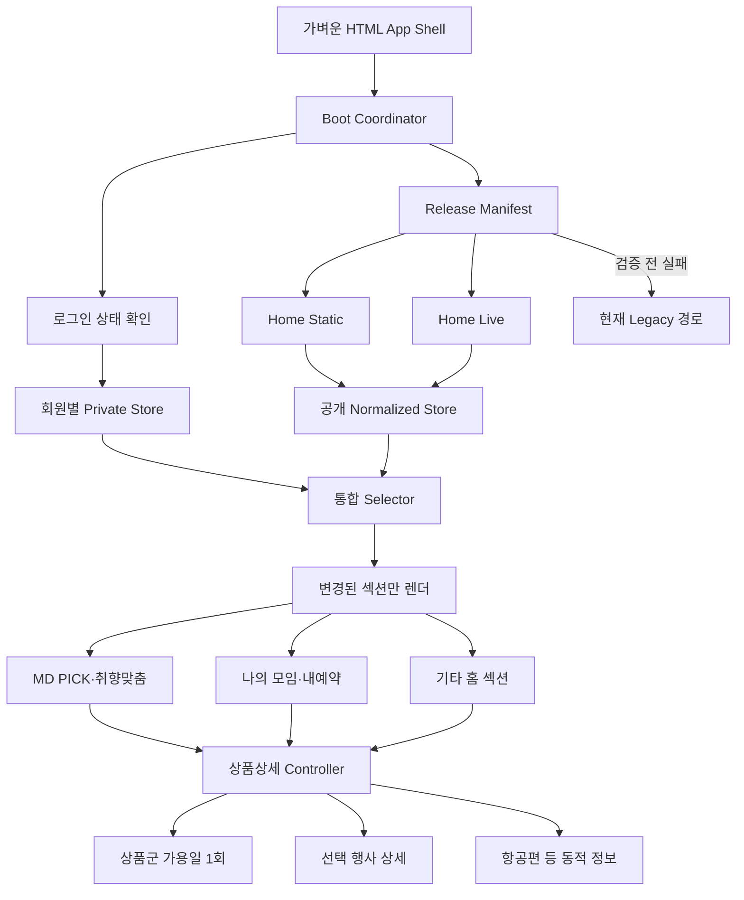

# 골프조인 메인페이지 최적화 최종 계획서

| 구분 | 내용 |
|---|---|
| 문서 버전 | 2.01 |
| 작성 기준일 | 2026-08-04 |
| 대상 화면 | `golfjoin_main.html`의 메인, 나의 모임, 내예약, 상품상세, 여행기간 선택, Builder 연계 기능 |
| 현재 상태 | 0·1·2·3단계 완료, 4단계 원격 검증 대기 — `release-manifest-v2` 계약과 관리자 전용 발행·상태·롤백 경로를 구현했다. 버전 객체 5개→원격 hash·JSON 메타데이터 검증→불변 archive→root 마지막 교체 순서를 강제하고, GCS generation 충돌·직전 리비전 롤백·누락 객체·gzip 메타데이터를 가상 원격 저장소에서 통과했다. 서버 테스트 88/88, 메인 단위 44/44이며 현재 HTML은 V2 root를 전혀 읽지 않고 계약도 `browserReadEnabled: false`만 허용한다. 다음은 Cloud Function 배포 후 관리자 전용 최초 발행·상태 확인·두 번째 발행·실제 원격 롤백 검증이다. |
| 기본 원칙 | 한 단계를 검증하고 통과한 뒤 다음 단계를 시작한다. |

---

## 1. 이 계획서의 사용 방법

이 문서는 개발자뿐 아니라 운영 담당자도 현재 진행 상태를 확인할 수 있도록 모든 실행 항목에 체크박스를 사용한다.

- [ ] 작업을 시작하기 전에 해당 단계의 목적과 위험을 작업자 전원이 확인한다. — 설명: 무엇을 바꾸는지 모른 채 수정하면 성능은 좋아져도 기존 기능이 깨질 수 있다.
- [ ] 작업이 끝났다는 이유만으로 체크하지 않고, 각 단계의 통과 조건까지 확인한 뒤 체크한다. — 설명: 코드를 작성한 것과 운영에서 안전하게 동작하는 것은 서로 다르다.
- [ ] 한 단계의 필수 통과 조건이 실패하면 다음 단계를 시작하지 않는다. — 설명: 문제가 누적되면 어느 변경 때문에 장애가 났는지 찾기 어렵다.
- [ ] 운영 반영 전에는 반드시 현재 정상 버전과 직전 정상 버전의 복구 방법을 확인한다. — 설명: 문제가 생겼을 때 몇 분 안에 이전 상태로 돌아갈 수 있어야 한다.
- [ ] 계획 변경이 필요하면 체크박스를 임의로 삭제하지 않고 변경 이유와 결정일을 기록한다. — 설명: 나중에 같은 문제를 반복 검토하지 않기 위한 기록이다.

### 전체 진행 현황 대시보드

아래 체크박스는 각 단계의 세부 항목과 통과 조건이 모두 완료됐을 때만 체크한다.

- [x] 0단계 완료 — 기준선 고정과 복구 준비
- [x] 1단계 완료 — 테스트, 데이터 계약, 관측 장치
- [x] 2단계 완료 — 저위험 체감 성능 개선
- [x] 3단계 완료 — 소스 구조화와 빌드 기반 마련
- [ ] 4단계 완료 — 통합 Release manifest와 발행 파이프라인
- [ ] 5단계 완료 — Shadow 데이터 비교
- [ ] 6단계 완료 — 비로그인 메인 V2 전환
- [ ] 7단계 완료 — Normalized Store와 선택적 렌더링
- [ ] 8단계 완료 — 로그인·개인 데이터 최적화와 보안
- [ ] 9단계 완료 — 쓰기 후 정합성 보장
- [ ] 10단계 완료 — 상품군 가용일 단일화
- [ ] 11단계 완료 — 상품상세·여행기간·항공편 개선
- [ ] 12단계 완료 — Builder·캘린더·딥링크의 전체 상품 의존 제거
- [ ] 13단계 완료 — CSS/JS 외부 자산과 HTML 경량화
- [ ] 14단계 완료 — 단계적 배포와 Legacy 축소

- [ ] 개인 캐시 기능의 일반 사용자 확대는 9단계 쓰기 정합성 검증이 끝난 뒤에만 허용한다. — 설명: 캐시를 먼저 확대하면 참여 성공 직후 오래된 조회 응답이 최신 인원을 되돌릴 수 있다.

---

## 2. 초보자를 위한 핵심 용어

| 용어 | 쉬운 설명 |
|---|---|
| Manifest | 현재 사용해야 할 데이터 파일들의 주소와 버전을 적어 둔 작은 안내 파일 |
| Revision | 데이터가 언제 만들어졌는지 구분하는 버전 번호 |
| Static 데이터 | 상품명, 대표이미지, 지역처럼 자주 바뀌지 않는 정보 |
| Live 데이터 | 현재인원, 모집상태, 참여자처럼 자주 바뀌는 정보 |
| Private 데이터 | 내가 만든 일정, 내가 참여한 일정처럼 로그인 회원에게만 보여야 하는 정보 |
| Immutable 캐시 | 버전 URL이 바뀌기 전에는 파일 내용이 절대 바뀌지 않는다고 브라우저가 믿고 오래 보관하는 방식 |
| Fallback | 신규 방식이 실패하면 기존 정상 방식으로 돌아가는 안전장치 |
| Shadow 비교 | 신규 데이터를 화면에는 사용하지 않고 기존 데이터와 결과만 몰래 비교하는 검증 방식 |
| Normalized Store | 일정과 상품을 ID별로 한 번만 저장하고 여러 화면이 같은 값을 읽게 하는 중앙 상태 저장소 |
| E2E 테스트 | 실제 사용자처럼 로그인, 스크롤, 클릭, 모달 열기까지 브라우저에서 자동 확인하는 테스트 |
| LCP | 처음 화면의 중요한 큰 이미지나 콘텐츠가 표시되는 데 걸리는 시간 |
| INP | 클릭이나 터치 후 화면이 반응하기까지 걸리는 시간 |
| CLS | 로딩 도중 화면 요소가 갑자기 밀리거나 흔들리는 정도 |
| p75 | 사용자 100명 중 느린 쪽 25명을 포함해도 만족해야 하는 성능 기준 |
| Kill switch | 서버나 HTML을 다시 배포하지 않고 신규 기능을 즉시 끄는 원격 스위치 |
| Generation | 이전 요청과 최신 요청을 구분하는 번호. 늦게 도착한 이전 응답이 최신 화면을 덮지 못하게 한다. |
| Idempotency | 같은 신청 요청이 여러 번 도착해도 실제 저장은 한 번만 되게 하는 성질 |

---

## 3. 현재 확인된 기준선

아래 값은 기존 조사 결과이며 0단계에서 동일 조건으로 다시 측정해야 한다.

| 항목 | 현재 확인값 |
|---|---:|
| 홈 HTML | 약 2.72MB |
| 인라인 CSS | 약 848KB |
| 인라인 JavaScript | 약 1.61MB |
| 활성 홈 카드 | 약 215.7KB, 상품 요약 약 150개 |
| 상품군 catalog | 약 105.9KB, 상품군 28개·상품 66개 |
| `home_bootstrap_light` | 약 29.6KB |
| 전체 상품 요약 로컬 파일 | 약 5.71MB |
| 전체 상품 fallback | 약 16.1MB |
| 비로그인 콜드 진입 데이터 요청 | 보통 5~6건 |
| 로그인 콜드 진입 데이터 요청 | 보통 11~13건 |
| 조사한 MD PICK 대표이미지 13개 | 총 약 1.18MB, 평균 약 90.9KB |

현재 구조에서 확인된 주요 문제는 다음과 같다.

- [ ] 홈 카드와 상품군 manifest가 서로 다른 시점에 발행되는 혼합 리비전 문제를 기준선에 기록한다. — 설명: 새 카드가 이전 상품군 정보와 섞이면 상품 선택 결과가 달라질 수 있다.
- [ ] 정적 카드와 `home_bootstrap_light`가 같은 공개 일정 정보를 서로 다른 시점의 값으로 제공하는 문제를 기록한다. — 설명: 처음에는 3명으로 보였다가 API 응답 후 4명으로 바뀌는 재렌더가 발생할 수 있다.
- [x] 모든 MD PICK·취향맞춤 대표이미지가 `loading="lazy"`이고 MD PICK 렌더링도 중첩해서 지연되는 상태를 기록한다. — 설명: PC 로그인 콜드 3회에서 지연 프리로드가 14.62~17.00초에 시작됐지만 다운로드는 18~42ms임을 확인했다.
- [x] 8초 후 실행되는 MD PICK 프리로드를 기준선에 기록한다. — 설명: 지연 프리로드 시작 중앙값은 16,705ms로 초기 화면에는 너무 늦다.
- [ ] 상품군 상세 진입 시 구성 상품별 가용일과 상세 HTML을 여러 번 요청하는 상태를 기록한다. — 설명: 상품군이 없는 상품보다 상품군 상품이 느린 직접적인 이유다.
- [ ] `getBuilderProductSource()` 조회 과정에서 전체 상품 로더가 암묵적으로 시작될 수 있는 상태를 기록한다. — 설명: 작은 상세 작업 하나가 수 MB 다운로드를 일으킬 수 있다.
- [ ] 스크롤 중 여러 섹션의 `getBoundingClientRect()`와 문서 높이를 반복 측정하는 상태를 기록한다. — 설명: 모바일에서 스크롤 프레임이 끊길 수 있다.
- [ ] 로그인 회원 요청이 중복되거나 나의 모임을 열 때 다시 실행될 수 있는 상태를 기록한다. — 설명: 같은 데이터를 여러 번 받아 네트워크와 렌더링 비용이 증가한다.
- [ ] 전역 로딩 닫기 작업이 새로 열린 로딩까지 닫을 수 있는 경쟁 상태를 기록한다. — 설명: 이전 요청의 닫기 작업과 새 요청의 열기 작업이 겹치면 로딩 UI 상태가 틀어질 수 있다.

---

## 4. 최종 기술 결정

### 4.1 채택할 방향

- [ ] 한 번에 전면 재작성하지 않고 기존 기능 옆에 신규 구조를 세우는 Strangler 방식으로 진행한다. — 설명: 새 기능을 한 조각씩 검증하면서 기존 기능을 대체하는 방식이다.
- [ ] 기존 경로는 신규 경로가 안정화될 때까지 fallback으로 유지한다. — 설명: 신규 데이터가 실패해도 사용자는 기존 화면을 사용할 수 있다.
- [ ] 단, 한 화면 안에서 기존 경로와 신규 경로가 동시에 데이터 권위를 갖지 않게 한다. — 설명: 두 경로가 같은 카드를 번갈아 덮어쓰면 정합성과 스크롤 문제가 다시 발생한다.
- [ ] 부팅은 `준비 → 다운로드 → 검증 → 화면 반영`의 트랜잭션으로 관리한다. — 설명: 신규 데이터를 화면에 반영하기 전까지만 전체 legacy fallback을 허용한다.
- [ ] 화면 반영 이후의 일부 오류는 전체 fallback이 아니라 실패한 섹션 내부에서 처리한다. — 설명: 취향맞춤 하나가 실패했다고 이미 정상 표시된 메인 전체를 다시 그리면 안 된다.
- [ ] 정적 상품, 공개 실시간 일정, 회원 개인 데이터를 서로 다른 저장소와 캐시 정책으로 관리한다. — 설명: 바뀌는 속도와 보안 수준이 서로 다르기 때문이다.
- [ ] 공개 일정의 최종 권위는 `home-live` 한 곳에만 둔다. — 설명: 카드와 API가 서로 다른 현재인원을 제공하는 문제를 없앤다.
- [ ] 일정은 항상 `scheduleId`, 상품은 `goodSeq + eventSeq`, 상품군은 `familyId`를 정식 식별자로 사용한다. — 설명: 이름이나 휴대폰을 이용한 느슨한 매칭은 다른 일정이 섞이는 원인이 된다.
- [ ] 조회용 네트워크 요청과 캐시 조회 함수를 분리한다. — 설명: 값을 읽는 함수가 몰래 전체 상품 다운로드를 시작하지 못하게 한다.
- [ ] 읽기 작업은 영역별 skeleton을 사용하고 전역 차단 로딩은 쓰기 작업에만 사용한다. — 설명: 정보가 늦어도 사용자는 모달을 닫거나 다른 내용을 볼 수 있어야 한다.
- [ ] 신규 기능은 기능별 원격 플래그로 독립적으로 켜고 끈다. — 설명: 이미지 로더 문제 때문에 로그인 데이터 개선까지 모두 롤백할 필요가 없어야 한다.

### 4.2 당장 채택하지 않을 방향

- [ ] React/Vue 같은 프레임워크로 전체 페이지를 한 번에 다시 만들지 않는다. — 설명: 현재 장애 원인은 프레임워크 부재보다 데이터 중복과 암묵적 로딩에 가깝다.
- [ ] Service Worker를 초기 최적화 수단으로 도입하지 않는다. — 설명: 잘못된 캐시가 회원 브라우저에 오래 남아 긴급 롤백이 어려워질 수 있다.
- [ ] 모든 이미지를 `fetchpriority="high"`로 설정하지 않는다. — 설명: 중요 이미지끼리 네트워크를 서로 빼앗아 오히려 LCP가 느려진다.
- [ ] 모든 홈 데이터를 하나의 거대한 JSON으로 합치지 않는다. — 설명: 첫 화면에 필요하지 않은 국가·월·상품 데이터까지 다시 내려받게 된다.
- [ ] 인증 구조 없이 개인정보 API를 하나로 합치지 않는다. — 설명: 클라이언트가 보낸 회원 번호를 믿으면 다른 회원 데이터가 노출될 위험이 있다.
- [ ] JSON 대신 복잡한 바이너리 포맷을 우선 도입하지 않는다. — 설명: 현재는 데이터 중복 제거와 캐시 개선 효과가 훨씬 크고 장애 분석도 JSON이 쉽다.
- [ ] 전체 상품 fallback 코드를 조기에 삭제하지 않는다. — 설명: Builder·딥링크 등 놓친 소비자가 남아 있을 수 있다.
- [ ] 초기 단계에서 CSS/JS 외부 분리와 데이터 구조 변경을 동시에 하지 않는다. — 설명: 문제가 생겼을 때 원인을 구분하기 어렵다.

---

## 5. 목표 구조



### 부팅 트랜잭션 상태

```text
LEGACY_READY
  → V2_FETCHING
  → V2_VALIDATING
  → V2_COMMITTED
  → V2_RUNNING
```

- [ ] `V2_COMMITTED` 이전 실패는 신규 요청을 중단하고 legacy 경로로 전환한다. — 설명: 아직 신규 화면을 보여주지 않았으므로 안전하게 기존 방식으로 돌아갈 수 있다.
- [ ] `V2_COMMITTED` 이후에는 legacy 데이터가 신규 화면을 덮어쓰지 못하게 한다. — 설명: 화면 반영 후 두 경로를 섞으면 인원과 카드 순서가 다시 바뀐다.
- [ ] 반영 이후 한 섹션이 실패하면 그 섹션만 재시도 또는 오류 상태를 표시한다. — 설명: 메인 전체를 다시 로딩하지 않는다.
- [ ] 같은 세션에서 신규 부팅 실패가 반복되면 circuit breaker로 신규 시도를 중지한다. — 설명: 실패하는 요청을 페이지 안에서 계속 반복하지 않게 한다.

---

## 6. 주요 리스크와 개선된 대응책

| 리스크 | 심각도 | 더 나은 대응 방법 | 통과 기준 |
|---|---:|---|---|
| 신규·기존 경로가 같은 화면을 동시에 갱신 | 매우 높음 | 부팅 트랜잭션과 단일 화면 권위 적용 | 한 세션에서 renderer owner 1개 |
| manifest는 최신인데 참조 객체가 아직 없음 | 매우 높음 | 객체 선발행·검증 후 root를 마지막에 원자 교체 | 누락 객체 0건 |
| 홈 카드와 상품군의 리비전 불일치 | 매우 높음 | 같은 release ID로 묶고 계약 검증 | 핵심 필드 불일치 0건 |
| 다른 회원 데이터가 캐시에 남음 | 매우 높음 | 회원키+세션 generation 캐시, 로그아웃 즉시 폐기 | 회원 전환 E2E 노출 0건 |
| 늦은 이전 응답이 최신 선택을 덮음 | 높음 | AbortController, request generation, mutation watermark | 빠른 연속 선택 오류 0건 |
| 이미지 우선로딩이 메인 배너를 방해 | 중간 | high 우선순위는 실제 LCP 이미지 1개로 제한 | 기존 LCP 대비 악화 없음 |
| 이미지 변형본의 화질·호환성 문제 | 중간 | AVIF/WebP/JPEG fallback과 원본 보존 | 브라우저·기기별 깨짐 0건 |
| Shadow 요청이 사용자 네트워크를 낭비 | 중간 | CI/서버 비교 우선, 내부 사용자만 클라이언트 비교 | 일반 사용자 shadow 0건 |
| 상세 스냅샷이 오래된 동적 정보를 표시 | 높음 | 공개 공통정보만 저장하고 좌석·회원가는 실시간 유지 | 동적 핵심값 불일치 0건 |
| 전역 로딩이 화면 스크롤을 막음 | 높음 | 읽기는 영역 skeleton, 쓰기만 전역 잠금 | 느린 GET에서도 닫기·스크롤 가능 |
| 외부 JS/CSS 로딩 실패 | 높음 | 소스 모듈화 후 단일 HTML 산출을 먼저 적용 | 배포 방식 변경 전 E2E 100% 통과 |
| 긴 캐시 때문에 구버전이 남음 | 높음 | 버전 URL immutable, root manifest만 짧게 캐시 | URL과 revision 일치 100% |
| fallback이 오히려 요청을 두 배로 만듦 | 중간 | timeout 발생 시 V2 요청을 취소하고 한 경로만 실행 | fallback 시 중복 renderer 0개 |
| 압축 JSON 헤더 오류 | 중간 | `Content-Type`과 `Content-Encoding` 자동 검증 | 운영 브라우저 파싱 오류 0건 |
| 전체 상품 로더를 너무 빨리 제거 | 높음 | 호출 사유 로그 2주 0건 후 자동 호출만 OFF | 주요 E2E 전체 통과 |

---

## 7. 전체 작업 순서

### 0단계 — 기준선 고정과 복구 준비

목적: 개선 전 상태를 숫자와 파일로 남겨, 개선 효과와 장애 원인을 정확히 비교한다.

- [x] 현재 `golfjoin_main.html`, 서버 코드, 운영 manifest URL과 revision을 기록한다. — 설명: 문제가 생기면 어느 버전으로 돌아가야 하는지 바로 알 수 있다. 완료 기록: `docs/home-optimization/baseline/2026-08-05/BASELINE.md`
- [x] 현재 작업트리의 미커밋 변경 목록과 목적을 별도로 기록한다. — 설명: 기존 작업을 최적화 작업이 덮어쓰지 않게 한다. 완료 기록: `docs/home-optimization/baseline/2026-08-05/BASELINE.md`
- [x] 비로그인/로그인, PC/MO, 콜드/웜 캐시의 네트워크 HAR을 각각 3회 저장한다. — 설명: 8개 조합의 공식 3회 기준선과 중앙값·편차를 모두 확정했다. 완료 기록: `docs/home-optimization/measurement/PHASE0_GATE_REVIEW.md`
- [x] HAR·Performance trace 측정 실행서와 HAR 개인정보 제거 도구를 준비한다. — 설명: 초보자도 같은 조건을 재현할 수 있고, 로그인 HAR의 Cookie·회원정보·본문을 제거한 뒤 안전하게 분석할 수 있다. 완료 기록: `docs/home-optimization/measurement/PHASE0_MEASUREMENT_RUNBOOK.md`
- [x] PC 로그인 콜드 HAR run01을 개인정보 제거 후 분석한다. — 설명: 요청 121개·5.14MiB, 로그인 API 순차 지연, MD PICK 이미지가 약 14.62초에야 요청되는 원인을 확인했다. 완료 기록: `docs/home-optimization/measurement/reports/20260805_pc_login_cold_run01.md`
- [x] PC 로그인 콜드 HAR run02를 개인정보 제거 후 분석한다. — 설명: bootstrap이 빨라도 보조 회원 API가 8초대에야 시작됐고, MD PICK 요청 지연과 이미지 482,945 bytes 재전송을 확인했다. 완료 기록: `docs/home-optimization/measurement/reports/20260805_pc_login_cold_run02.md`
- [x] PC 로그인 콜드 HAR run03을 개인정보 제거 후 분석한다. — 설명: 보조 회원 API가 9.66초, MD PICK 지연 프리로드가 17.00초에 시작되는 같은 병목을 재확인했다. 완료 기록: `docs/home-optimization/measurement/reports/20260805_pc_login_cold_run03.md`
- [x] PC 로그인 콜드 HAR 3회의 중앙값과 편차를 확정한다. — 설명: MD PICK 지연 프리로드 시작 중앙값 16,705ms, 마지막 회원 API 종료 중앙값 11,650ms를 개선 전 기준으로 고정했다. 완료 기록: `docs/home-optimization/measurement/reports/20260805_pc_login_cold_3run_baseline.md`
- [x] HAR 개인정보 제거 도구가 HTTP/2 `:path` 헤더의 민감 쿼리도 제거하도록 보강하고 세 제거본을 재검증한다. — 설명: 구조화된 쿼리만 지우고 헤더 문자열에 회원정보가 남는 일을 막는다. 완료 기록: `docs/home-optimization/measurement/SANITIZER_PRIVACY_RECHECK.md`
- [x] PC 로그인 웜 HAR run01을 개인정보 제거 후 분석하고 콜드 중앙값과 비교한다. — 설명: 캐시로 전송량이 82.7% 줄었지만 지연 프리로드와 큰 아바타 비용은 남아 있음을 확인했다. 완료 기록: `docs/home-optimization/measurement/reports/20260805_pc_login_warm_run01.md`
- [x] PC 로그인 웜 HAR run02에서 앱 캐시 TTL 만료와 홈 카드 revision 변경을 분리 진단한다. — 설명: HTTP 캐시는 웜이어도 앱 캐시가 만료되면 회원 API 지연이 콜드 수준으로 돌아가며, 변경된 revision은 신규 JSON을 내려받는다. 동일 조건 통계에서는 제외한다. 완료 기록: `docs/home-optimization/measurement/reports/20260805_pc_login_warm_run02.md`
- [x] PC 로그인 웜 대체 run02는 측정 직전에 명시적으로 예열하고 60초 안에 수집한다. — 설명: HTTP 캐시와 회원 앱 캐시 상태를 run01과 같게 맞추고 공식 두 번째 표본으로 채택했다. 완료 기록: `docs/home-optimization/measurement/reports/20260805_pc_login_warm_run02_retry.md`
- [x] PC 로그인 웜 run03에서 고정 15초 예열이 느린 서버의 회원 캐시 완료를 보장하지 못하는 경우를 진단한다. — 설명: HTTP 캐시는 정상이지만 회원 API 6개가 실행돼 동일 조건 통계에서 제외했다. 완료 기록: `docs/home-optimization/measurement/reports/20260805_pc_login_warm_run03.md`
- [x] PC 로그인 웜 대체 공식 run03은 캐시 만료 후 예열하고 `home_stats` 완료를 확인한 뒤 수집한다. — 설명: 시간만 기다리지 않고 실제 마지막 회원 API 완료를 확인해 공식 run01·run02와 같은 앱 캐시 상태를 재현했다. 완료 기록: `docs/home-optimization/measurement/reports/20260805_pc_login_warm_run03_retry.md`
- [x] PC 로그인 웜 공식 3회의 중앙값과 편차를 확정한다. — 설명: MD PICK 지연 프리로드 중앙값 12,395ms와 Cloud Function 3개를 개선 전 웜 기준으로 고정했다. 완료 기록: `docs/home-optimization/measurement/reports/20260805_pc_login_warm_3run_baseline.md`
- [x] 측정 중 로컬 기능 소스의 해시가 바뀌면 즉시 기록하고 임의로 되돌리지 않는다. — 설명: 다른 작업의 변경을 최적화 작업이 덮어쓰지 않도록 측정 스냅샷과 현재 파일을 분리 관리한다. 완료 기록: `docs/home-optimization/baseline/2026-08-05/CONCURRENT_SOURCE_CHANGE.md`
- [x] 재배포 예정 알림톡 딥링크 변경의 목적과 대상 HTML 해시를 기록한다. — 설명: 배포 전후 성능 자료가 서로 다른 코드를 측정했다는 사실을 잃지 않게 한다. 완료 기록: `docs/home-optimization/baseline/2026-08-05/BASELINE.md` 6.18절
- [x] 알림톡 딥링크 HTML의 운영 반영을 응답 코드와 변경 마커로 확인한다. — 설명: 업로드를 마친 것과 실제 사용자가 받는 운영 HTML이 바뀐 것은 별개이므로 운영 응답을 직접 확인해야 한다. 완료 기록: `docs/home-optimization/baseline/2026-08-05/BASELINE.md` 6.18절
- [x] 알림톡 딥링크 HTML 배포 후 로그인 일반 진입 콜드·웜 성능 회귀를 확인한다. — 설명: 배포 직후 콜드 검사와 이후 현재 코드의 로그인 Cold·Warm 공식 기준선에서 초기 요청·이미지·회원 API 경로를 확인했고 치명적 기능 회귀 없이 기존 반복 렌더 병목이 유지됨을 확정했다. 완료 기록: `docs/home-optimization/baseline/2026-08-05/BASELINE.md` 6.18~6.23절 및 현재 `8A853...` 3회 보고서
- [x] 배포 후 첫 로그인 HTTP 콜드 표본을 분석하고 회원 앱 캐시가 남은 혼합 표본으로 분리한다. — 설명: 정적 파일만 새로 받은 측정을 기존의 모든 회원 API가 실행된 콜드 기준과 그대로 비교하면 잘못된 결론이 된다. 완료 기록: `docs/home-optimization/measurement/reports/20260805_pc_login_postdeploy_cold_run01.md`
- [x] 배포 후 로그인 공식 콜드 run01에서 기존과 같은 회원 API 6개를 재현하고 회귀를 비교한다. — 설명: 캐시 조건이 같아야 배포 전후 숫자를 공정하게 비교할 수 있다. 완료 기록: `docs/home-optimization/measurement/reports/20260805_pc_login_postdeploy_cold_run01_retry.md`
- [x] 알림톡 배포 버전의 콜드 run02·run03 추가 계획은 이후 스크롤 수정 배포로 중단하고, 현재 운영 버전 콜드 3회로 대체한다. — 설명: 서로 다른 HTML을 한 통계에 섞지 않고 실제 현 운영 코드에서 반복 여부를 확인했다.
- [x] 상세 모달의 화면 위치 고정·닫기 복원·딥링크 기준 좌표 변경을 별도 소스 경계로 기록한다. — 설명: 이 변경은 스크롤 체감과 Performance 결과에 직접 영향을 주므로 이전 운영 HTML과 섞어 비교하면 안 된다. 완료 기록: `docs/home-optimization/baseline/2026-08-05/BASELINE.md` 6.19절
- [x] 상세 모달 스크롤 수정 HTML의 운영 배포와 변경 마커를 확인한다. — 설명: 콜드 run02·run03은 run01과 반드시 같은 운영 코드를 측정해야 중앙값이 유효하다. 완료 기록: `docs/home-optimization/baseline/2026-08-05/BASELINE.md` 6.19절
- [x] 이전 알림톡 배포 버전의 콜드 run01을 현재 스크롤 수정 버전 통계에서 분리한다. — 설명: 서로 다른 HTML 버전의 세 숫자를 평균 내면 코드 변경 효과와 우연한 편차를 구분할 수 없다.
- [x] 현재 스크롤 수정 운영 버전에서 로그인 콜드 run01·run02·run03을 같은 조건으로 측정한다. — 설명: 현 운영 코드를 최적화의 실제 비교 기준으로 다시 고정했다. 완료 기록: `docs/home-optimization/measurement/reports/20260805_pc_login_scrollfix_cold_3run_baseline.md`
- [x] 현재 운영 버전 콜드 3회 중앙값과 배포 전 회귀를 판정한다. — 설명: 초기 로딩·전송량·MD PICK은 회귀가 없고 로그인 API 완료만 20.4% 늦음을 구분했다. 완료 기록: `docs/home-optimization/measurement/reports/20260805_pc_login_scrollfix_cold_3run_baseline.md`
- [x] Performance trace run01에서 일정 응답 후 `join_applications` 시작 전 처리와 메인 스레드 작업을 분리한다. — 설명: 실제 응답 완료 뒤 간격은 55.7ms였고, 초기 진입 중 전체 홈 렌더 3회와 MD PICK 단독 렌더 3회가 약 8.90초를 점유한 것이 더 큰 병목임을 확인했다. 완료 기록: `docs/home-optimization/measurement/reports/20260805_pc_login_scrollfix_performance_run01.md`
- [x] 같은 조건 Performance trace run02에서 반복 렌더 횟수와 점유 시간을 확인한다. — 설명: 전체 홈 렌더 2회 약 4.73초와 MD PICK 단독 렌더 2회 약 0.94초가 다시 나타났고, 한 번의 전체 렌더는 최대 3.77초였다. 완료 기록: `docs/home-optimization/measurement/reports/20260806_pc_login_scrollfix_performance_run02.md`
- [x] 같은 조건 Performance trace run03에서 반복 여부를 확인하고 3회 중앙값을 확정한다. — 설명: long task 중앙값 약 9.38초, 반복 렌더 중앙값 약 5.67초이며 같은 병목이 세 번 모두 재현됐다. 완료 기록: `docs/home-optimization/measurement/reports/20260806_pc_login_scrollfix_performance_3run_baseline.md`
- [x] Performance trace 주요 실행시간의 3회 편차와 원인을 확정해 개선 단계로 이관한다. — 설명: 상대 범위 29.4~84.6%와 데이터 도착 때마다 반복되는 전체 홈·MD PICK 렌더를 확인했다. 편차를 20% 이내로 줄이는 실제 코드 작업은 2단계에서 수행한다. 완료 기록: `docs/home-optimization/measurement/PHASE0_GATE_REVIEW.md`
- [x] 현재 운영 버전 콜드 run02의 네트워크 무게와 MD PICK 시점이 기존 기준 안인지 확인한다. — 설명: 두 번째 표본에서도 첫 결과가 우연이 아닌지 확인한다. 완료 기록: `docs/home-optimization/measurement/reports/20260805_pc_login_scrollfix_cold_run02.md`
- [x] 현재 스크롤 수정 운영 버전 로그인 콜드 run01의 주요 지표가 기존 기준의 20% 안인지 확인한다. — 설명: 첫 표본에서 요청 폭증이나 초기 로딩 회귀가 없는지 빠르게 차단한다. 완료 기록: `docs/home-optimization/measurement/reports/20260805_pc_login_scrollfix_cold_run01.md`
- [x] 배포 후 PC에서 상세 열기 전 좌표, 열린 동안 배경 고정, 닫은 후 좌표 복원, 로그인 딥링크 기준 위치를 검증한다. — 설명: 일반 상세는 1,287px, 딥링크는 605px를 정확히 복원했고 골프조인 영역 가로 넘침은 0건이었다. 완료 기록: `docs/home-optimization/measurement/reports/20260806_pc_scroll_deeplink_validation.md`
- [x] 실제 모바일 UA에서 상세 열기 전 좌표, 열린 동안 배경 고정, 닫은 후 좌표 복원과 나의 모임 카드 위치를 검증한다. — 설명: 열기 전 1,241px, 열린 동안 `top: -1241px`, 닫은 뒤 1,241px로 정확히 복원됐고 나의 모임과 해외조인 BEST 첫 카드가 모두 x=25px였다. 완료 기록: `docs/home-optimization/measurement/reports/20260806_mobile_scroll_layout_validation.md`
- [x] 모바일 검증 종료 시 새 로컬 HTML 해시를 별도 소스 경계로 기록하고 기존 기준선과 분리한다. — 설명: 측정 작업이 편집하지 않은 파일이 `D46F...`에서 `CFD15...`로 바뀌었으므로 사용자 변경을 보존하고 서로 다른 코드를 한 통계에 섞지 않는다. 완료 기록: `docs/home-optimization/baseline/2026-08-05/CONCURRENT_SOURCE_CHANGE.md` 7절
- [x] 새 로컬 HTML의 변경 목적과 운영 배포 여부를 확정한다. — 설명: 사용자가 상세 모달이 열릴 때 뒤 화면이 사라지는 문제 수정본이며 운영 배포를 완료했다고 확인해 이후 측정의 새 운영 경계로 연결했다.
- [x] 배포 후 주요 지표가 20% 이상 달라지거나 API 호출 수가 변하면 해당 공식 HAR 3회를 다시 측정하는 회귀 규칙을 확정한다. — 설명: 비교 대상 코드가 크게 달라졌다면 이전 평균을 새 코드의 기준으로 사용하지 않는다.
- [x] 로그인 상태 알림톡 딥링크의 회원 데이터 로딩·대상 탐색·모달 단일 실행·좌표 복원을 검증한다. — 설명: 대상 파라미터가 처리 후 제거되고 상세 모달 하나만 열린 뒤 나의 모임 기준 605px로 복원됐다. 완료 기록: `docs/home-optimization/measurement/reports/20260806_pc_scroll_deeplink_validation.md`
- [x] 로그아웃 후 로그인 복귀와 회원 데이터 강제 지연 상황의 알림톡 딥링크 검증을 1단계 E2E로 이관한다. — 설명: 실제 인증·지연 mock·단일 실행 검사는 성능 기준선이 아니라 자동 회귀 테스트이므로 1단계에서 수행한다.
- [x] 현재 환경에서 수집 가능한 LCP, INP 후보, CLS, JavaScript long task, 스크롤·상세 기준을 3회 이상 측정하고 계측 보완을 1단계로 이관한다. — 설명: 모바일 Web Vitals 3회, PC Performance trace 3회, 웜 상세 3회와 PC/MO 스크롤 검증을 완료했다. PC Web Vitals와 상세의 통합 계측은 1단계 관측 장치에서 보완한다.
- [x] 모바일 Performance trace에서 LCP·CLS 세션 윈도우·INP 후보를 자동 추출하는 측정 도구를 준비한다. — 설명: 사람이 화면의 숫자를 옮겨 적으며 생길 수 있는 오차를 막고 세 번의 결과를 같은 계산식으로 비교한다. 테스트 8/8 통과.
- [x] 모바일 로그인 콜드 Web Vitals run01을 분석한다. — 설명: LCP 1,295.655ms는 양호하지만 CLS 0.205466과 내예약 INP 후보 650.730ms는 개선이 필요하며, 초기 long task 합계는 17,093.711ms였다. 완료 기록: `docs/home-optimization/measurement/reports/20260806_mo_login_modalbgfix_vitals_run01.md`
- [x] run01의 CLS·INP 원인 요소와 실행 경로를 연결한다. — 설명: 첫 골프조인 영역 배치 이동이 CLS 대부분을 만들고, 내예약 첫 동기 렌더가 click handler를 약 560ms 점유했다.
- [x] run01 뒤 변경된 최신 HTML의 운영 배포를 새 측정 경계로 기록한다. — 설명: 배포 완료 메시지 직후 안정된 최신 로컬 해시는 `09BB...`이며 이전 `CFD15...` run01은 참고 자료로만 보존한다.
- [x] `09BB...` run01 저장 전 UI 수정 재배포를 새 측정 경계로 교체한다. — 설명: 아직 공식 표본이 없으므로 직전 버전을 건너뛰고 안정된 최신 `8A853...` 파일에서 시작한다.
- [x] `8A853...` 모바일 로그인 콜드 Web Vitals run01을 분석한다. — 설명: LCP 1,303.790ms는 양호하지만 CLS 0.209722, 내예약 INP 769.319ms, 초기 long task 합계 22.36초로 개선이 필요하다. 완료 기록: `docs/home-optimization/measurement/reports/20260806_mo_login_8a853_vitals_run01.md`
- [x] run01의 snapshot fallback 부트스트랩 재호출과 최대 CLS 시점을 연결한다. — 설명: `home_bootstrap_light`가 초기화와 보조 갱신에서 두 번 실행되고 `home_stats` 종료와 MD PICK·칩 최대 이동이 약 21.3초에 겹쳤다.
- [x] `8A853...` 모바일 로그인 콜드 Web Vitals run02를 분석한다. — 설명: LCP 1,372.751ms, CLS 0.205466, 내예약 INP 607.656ms, 초기 long task 합계 21.66초이며 snapshot 재호출 없이도 병목이 반복됐다. 완료 기록: `docs/home-optimization/measurement/reports/20260806_mo_login_8a853_vitals_run02.md`
- [x] run01·run02의 예비 반복 여부를 판정한다. — 설명: LCP·CLS·초기 long task는 상대 범위 5.2% 이내로 안정적이고, INP와 전체 기록 long task는 20%를 넘어 run03 확인이 필요하다.
- [x] `8A853...` 모바일 로그인 콜드 Web Vitals run03을 저장하고 3회 중앙값·편차를 판정한다. — 설명: LCP 중앙값 1,306.743ms, CLS 0.205466, 내예약 INP 607.656ms, 초기 long task 합계 22.36초이며 프런트 반복 렌더와 내예약 첫 동기 렌더를 우선 병목으로 확정했다. 완료 기록: `docs/home-optimization/measurement/reports/20260806_mo_login_8a853_vitals_3run_baseline.md`
- [x] `8A853...` 모바일 로그인 콜드 HAR run01을 개인정보 제거 후 분석한다. — 설명: 홈 카드 JSON은 2.03초에 준비됐지만 대표이미지 첫 요청이 11.11초에 시작돼 9.08초 지연됐고, 회원 일정 API와 참여 API 사이에도 4.00초 공백이 있었다. 완료 기록: `docs/home-optimization/measurement/reports/20260806_mo_login_cold_run01.md`
- [x] `8A853...` 모바일 로그인 콜드 HAR run02를 개인정보 제거 후 분석한다. — 설명: 대표이미지 요청 지연 8.89초, 일정→참여 API 공백 3.66초, 골프조인 이미지 6종 이중 전송이 반복됐다. 완료 기록: `docs/home-optimization/measurement/reports/20260806_mo_login_cold_run02.md`
- [x] `8A853...` 모바일 로그인 콜드 HAR run03과 3회 중앙값을 확정한다. — 설명: 대표이미지 요청 지연 중앙값은 8.89초이며 소스의 고정 8초 타이머가 직접 원인이다. 일정→참여 API 공백은 57ms~4.00초로 데이터 순서 의존 편차임을 확인했다. 완료 기록: `docs/home-optimization/measurement/reports/20260806_mo_login_cold_3run_baseline.md`
- [x] 모바일 로그인 웜 run01을 앱 캐시 웜·HTTP no-cache 진단 표본으로 분리한다. — 설명: 회원 API는 6개에서 3개로 줄었지만 108개 요청에 `no-cache`가 붙고 immutable 홈 카드도 재전송돼 공식 HTTP 웜 표본으로 사용할 수 없다. 완료 기록: `docs/home-optimization/measurement/reports/20260806_mo_login_warm_run01_diagnostic.md`
- [x] 모바일 로그인 웜 공식 대체 run01을 주소창 이동 방식으로 다시 측정한다. — 설명: 버전 홈 카드와 대표이미지는 0 bytes로 재사용되고 회원 API는 3개만 실행돼 HTTP·앱 캐시가 함께 웜인 표본으로 채택했다. 완료 기록: `docs/home-optimization/measurement/reports/20260806_mo_login_warm_run01_retry.md`
- [x] 모바일 로그인 웜 공식 run02를 같은 조건으로 측정한다. — 설명: 최초 필터 저장본은 제외하고 전체 119개 요청을 재측정해 전송량 편차 1.6%, 로그인 API 3개, 대표이미지 0 bytes를 반복 확인했다. 완료 기록: `docs/home-optimization/measurement/reports/20260806_mo_login_warm_run02_retry.md`
- [x] 모바일 로그인 웜 공식 run03과 3회 중앙값·편차를 확정한다. — 설명: 요청 118개, 전송량 548,650 bytes, Load 4,337ms를 중앙값으로 고정하고 Cold 대비 전송량 91.3% 감소를 확인했다. 완료 기록: `docs/home-optimization/measurement/reports/20260806_mo_login_warm_3run_baseline.md`
- [x] PC 비로그인 Cold run01을 측정한다. — 설명: 홈 카드가 준비된 뒤 대표이미지 첫 요청까지 7.07초, bootstrap 뒤 `home_stats` 시작까지 7.09초가 걸리고 회원 식별 요청은 0건임을 확인했다. 완료 기록: `docs/home-optimization/measurement/reports/20260806_pc_logout_cold_run01.md`
- [x] PC 비로그인 Cold run02를 같은 조건으로 측정한다. — 설명: 요청 122개, 상품이미지 14개·1,329,351 bytes가 같고 7개·3개·1개·3개 분할 요청과 통계 API 공백이 반복됐다. 완료 기록: `docs/home-optimization/measurement/reports/20260806_pc_logout_cold_run02.md`
- [x] PC 비로그인 Cold run03과 3회 중앙값을 확정한다. — 설명: Load 10,012ms, 홈 카드→첫 이미지 7,535ms, 첫→마지막 이미지 10,035ms를 기준으로 고정하고 네 단계 타이머 체인을 확정했다. 완료 기록: `docs/home-optimization/measurement/reports/20260806_pc_logout_cold_3run_baseline.md`
- [x] PC 비로그인 Warm run01 1차 저장본을 진단 표본으로 분리한다. — 설명: 비회원 앱 캐시는 웜이었지만 122개 중 121개 요청에 `no-cache`가 붙어 6,035,843 bytes를 다시 전송했으므로 공식 통계에서 제외한다. 완료 기록: `docs/home-optimization/measurement/reports/20260806_pc_logout_warm_run01_diagnostic.md`
- [x] PC 비로그인 Warm 공식 run01을 다시 측정해 채택한다. — 설명: 121개 중 108개가 0 bytes, 상품이미지 14개가 전부 0 bytes이며 전송량이 Cold 중앙값보다 91.3% 줄어 HTTP·앱 캐시가 함께 웜인 표본으로 확정했다. 완료 기록: `docs/home-optimization/measurement/reports/20260806_pc_logout_warm_run01_retry.md`
- [x] PC 비로그인 Warm 공식 run02를 같은 조건으로 측정한다. — 설명: 전송량 523,736 bytes로 run01과 0.015% 차이이고 상품이미지 14개·0 bytes, Load 8,384ms가 반복되어 핵심 캐시 수치의 안정성을 두 번째로 확인했다. 완료 기록: `docs/home-optimization/measurement/reports/20260806_pc_logout_warm_run02.md`
- [x] PC 비로그인 Warm 공식 run03과 3회 기준선을 확정한다. — 설명: 전송량 중앙값 523,674 bytes·Load 8,426ms·마지막 이미지 15,910ms이며 주요 지표 상대 범위가 12% 이내다. 핵심 이미지 묶음 뒤 마지막 이미지까지 8,815ms 고정 지연도 확정했다. 완료 기록: `docs/home-optimization/measurement/reports/20260806_pc_logout_warm_3run_baseline.md`
- [x] 모바일 비로그인 Cold run01을 측정한다. — 설명: 전송량 5,861,623 bytes·Load 10,489ms이며 홈 카드 뒤 첫 이미지 8,382ms, bootstrap 뒤 통계 요청 8,457ms 공백이 나타나 모바일 비로그인에서도 고정 지연 경로를 확인했다. 완료 기록: `docs/home-optimization/measurement/reports/20260806_mo_logout_cold_run01.md`
- [x] 모바일 비로그인 Cold run02를 같은 조건으로 측정한다. — 설명: 상품이미지 14개·1,329,239 bytes와 마지막 이미지 8,010ms 지연이 반복됐다. 전송량 증가 265KB는 조건부 `woman3.webp` 아바타 한 장임을 분리했다. 완료 기록: `docs/home-optimization/measurement/reports/20260806_mo_logout_cold_run02.md`
- [x] 모바일 비로그인 Cold run03과 3회 기준선을 확정한다. — 설명: 전송량 중앙값 6,028,228 bytes·Load 11,738ms이며 첫 13개 뒤 마지막 이미지 지연 8,009ms의 상대 범위가 0.05%다. DCL 24.0% 편차와 조건부 배경 중복도 별도 기록했다. 완료 기록: `docs/home-optimization/measurement/reports/20260806_mo_logout_cold_3run_baseline.md`
- [x] 모바일 비로그인 Warm 공식 run01을 측정한다. — 설명: 113개 중 102개와 상품이미지 14개가 0 bytes이고 전송량이 Cold 대비 91.3% 감소했다. 그러나 마지막 이미지는 앞선 묶음보다 7,998ms 늦어 Warm에서도 고정 타이머가 유지됐다. 완료 기록: `docs/home-optimization/measurement/reports/20260806_mo_logout_warm_run01.md`
- [x] 모바일 비로그인 Warm 공식 run02를 같은 조건으로 측정한다. — 설명: 전송량 522,804 bytes로 run01과 0.017% 차이이고 상품이미지 14개·0 bytes가 반복됐다. 핵심 묶음 뒤 마지막 이미지 지연도 8,028ms로 재현됐다. 완료 기록: `docs/home-optimization/measurement/reports/20260806_mo_logout_warm_run02.md`
- [x] 모바일 비로그인 Warm 공식 run03과 3회 기준선을 확정한다. — 설명: 전송량 중앙값 522,782 bytes·Load 9,925ms이며 핵심 이미지 묶음 뒤 마지막 이미지 지연 8,005ms의 상대 범위가 0.37%다. 첫 이미지 조기 등록 편차도 분리했다. 완료 기록: `docs/home-optimization/measurement/reports/20260806_mo_logout_warm_3run_baseline.md`
- [x] MD PICK과 취향맞춤 이미지 요청 시작 시점·응답 시간·표시 지연 경로를 기록한다. — 설명: 다운로드는 수십 ms지만 요청 등록이 약 8~17초 늦으며 고정 타이머와 idle 경로가 원인임을 PC/MO Cold·Warm HAR과 trace에서 확정했다. 완료 기록: `docs/home-optimization/measurement/PHASE0_GATE_REVIEW.md`
- [x] 로그인 회원의 초기 요청을 기록하고 나의 모임 재진입 API 비교를 1단계 자동 테스트로 이관한다. — 설명: 새 탭·같은 탭·Cold·Warm의 초기 회원 API 차이는 기록했으며, 마이메뉴 재진입 시 재호출 여부는 계측 가능한 E2E로 만든다.
- [x] 로그인 PC의 같은 탭 재진입 1회와 새 탭 초기 진입 2회에서 자산 증가를 기록한다. — 설명: 정식 HAR 전 단계로, 로그인 API가 최대 6개까지 단계적으로 늘고 대표이미지가 수 초 뒤 추가되는 현상을 숫자로 확인했다. 완료 기록: `docs/home-optimization/baseline/2026-08-05/BASELINE.md` 6.5절
- [x] 운영과 같은 게시판 소스보기 방식의 스테이징 페이지를 준비한다. — 설명: 이벤트 16에 Probe와 현재 `8A853...` 전체 HTML을 차례로 등록하고 PC·모바일에서 스크롤, 상품상세, 이미지, 닫기 후 위치 복원을 검증했다. 완료 기록: `docs/home-optimization/recovery/2026-08-06/STAGING_EVENT16_VALIDATION.md`
- [x] 현재 정상 버전으로 되돌리는 복구 경로를 문서화하고 검증한다. — 설명: 운영 페이지의 실제 HTML 복원 경험, 현재 `8A853...` 복구 ZIP의 4.253초 격리 복원, 이벤트 16의 Probe→전체 HTML 등록 및 PC/MO 기능 확인으로 검증했다. 같은 HTML을 의도적으로 다시 제거·재등록하는 반복 시험은 사용자 운영 결정에 따라 생략한다. 완료 기록: `docs/home-optimization/recovery/2026-08-06/REHEARSAL_RESULT.md`, `docs/home-optimization/recovery/2026-08-06/STAGING_EVENT16_VALIDATION.md`
- [x] 현재 `8A853...` 정상 소스를 새 복구 패키지로 고정하고 격리 복원 연습을 수행한다. — 설명: 27개 파일 복원, 핵심 해시 7/7, 구문 검사, 테스트 36/36을 4.253초에 완료했다. 이전 `A6AA...` 패키지는 역사적 복구본으로 분리했다. 완료 기록: `docs/home-optimization/recovery/2026-08-06/REHEARSAL_RESULT.md`

#### 0단계 통과 조건

- [x] 동일 조건 3회 측정의 중앙값·편차가 계산되고 허용 범위 초과 지표가 후속 개선 항목으로 등록되어 있다. — 모바일 INP 후보 27.5%, PC 반복 렌더 관련 실행시간 29.4~84.6%를 1·2단계로 이관했다.
- [x] 비로그인·로그인 PC/MO Cold·Warm 기준 네트워크 요청 목록이 저장되어 있다.
- [x] 현재 정상 버전의 로컬 복구와 게시판 재등록 경로가 검증되어 있다. — 로컬 격리 복원은 4.253초이며, 운영 HTML 실제 복원과 이벤트 16 전체 HTML 등록 후 PC/MO 정상 동작을 확인했다. 의도적인 원격 제거·재등록 시간 측정은 생략한다.

---

### 1단계 — 테스트, 데이터 계약, 관측 장치

목적: 성능을 바꾸기 전에 기존 기능이 깨졌는지 자동으로 알아낼 수 있게 한다.

- [x] 홈 정적 데이터, 공개 live, 상품군, 가용일, 상세 스냅샷의 JSON Schema를 정의한다. — 설명: 필요한 필드가 빠지거나 이름이 바뀌면 화면에 사용하기 전에 차단한다.
  - [x] 홈 매니페스트·홈 카드 V2·상품 출발 가능일·상품군 카탈로그·상품군 매니페스트 5종을 정의한다. 완료 기록: `docs/home-optimization/contracts/README.md`
  - [x] 공개 모임 live 응답 계약을 정의한다. 완료 기록: A 2명 생성+B 1명 참여, 생성자 누락, 참여자 아이콘 누락, ERP 번호 불일치, 인원·성별 불일치, 공개 개인정보 차단, 관리자 40명 제한을 검사한다.
  - [x] 상품상세 스냅샷 계약을 정의한다. 완료 기록: 상품·행사·원본 URL, 기간, 항공, 포함·불포함·참고, 일정, 이미지와 영역별 완전성 상태를 검사한다.
- [x] `scheduleId`, `goodSeq`, `eventSeq`, `familyId`, 가격, 출발일, 귀국일, 모집상태를 핵심 필드로 지정한다. — 설명: 이 값들은 한 건이라도 틀리면 다른 상품이나 일정으로 연결될 수 있다.
  - [x] 정적 홈·가용일·상품군에서 `goodSeq`, `eventSeq`, `familyId`, 가격, 출발일, 귀국일, 상태와 상호 참조 일치를 검사한다.
  - [x] 공개 live의 `scheduleId`, 생성자·참여자·현재인원·모집상태를 검사한다. 신규 계약 테스트 19/19, 전체 서버 테스트 55/55, 운영 `home_bootstrap_light` HTTP 200·계약 오류 0건 통과.
- [x] 현재 경로와 신규 경로의 핵심 필드를 비교하는 계약 테스트를 만든다. — 설명: 화면 모양뿐 아니라 실제 데이터가 같은지 검사한다. 완료 기록: 홈·공개 모임·상품상세 비교 9/9, 서버 전체 72/72 통과. 결과에는 원본 ID 대신 16자리 해시만 기록한다.
- [x] 비로그인, raw CookieData 로그인, 세션 로그인, 프로필 미완성, 로그아웃 후 다른 회원 로그인 E2E를 만든다.
  - [x] 시스템 Chrome 기반 PC·모바일 비로그인 smoke와 인증정보·산출물 Git 제외 설정을 만든다. 완료 기록: `tests/e2e/README.md`
  - [x] PC에서 메인·스크롤·MD PICK 이미지·상세 열기/닫기·배경 유지·정확한 위치 복원을 통과한다.
  - [x] 모바일 상세 닫기 후 정확한 위치 복원을 3회 연속 통과한다. 실제 흐름 실패에서 클릭 좌표 684px보다 늦게 저장한 잠금 좌표 696px·718px가 직접 원인임을 trace로 확정했다. 클릭 즉시 좌표를 저장·전달하도록 수정한 `DADBD331...` HTML을 운영 배포했고, 클릭·잠금·닫기 좌표를 ±3px로 확인하는 MO 강화 검사 3/3과 PC 회귀 1/1, 단위 2/2·서버 72/72를 통과했다. 기록: `docs/home-optimization/measurement/reports/20260806_e2e_mobile_scroll_restore_instability.md`
  - [x] raw CookieData 로그인, 세션 로그인, 프로필 미완성, 로그아웃 후 다른 회원 로그인 시나리오를 추가한다. 실제 계정 대신 합성 회원·합성 API만 사용하고 알 수 없는 쓰기 요청을 차단했으며 PC 4/4·MO 4/4를 통과했다. 완료 기록: `docs/home-optimization/measurement/reports/20260806_e2e_member_auth_deeplink_cache.md`
- [x] 일정 생성, 타인 일정 참여, 모집완료, 취소, 재로그인 E2E를 만든다. — A 2명 생성, B 1명 참여 3/4, 별도 참여자 포함 4/4, B 취소와 재로그인을 합성 API로 재현해 PC 4/4·MO 4/4를 통과했다. 취소 후 직전 공개 B 미리보기 아이콘이 남는 결함을 찾아 최신 요약 적용 전 이전 공개 미리보기를 제거하도록 최소 수정했고, `86836D71...` 운영 배포 후 PC/MO 운영 소스 포함·기본 2/2·참여자 8/8을 재확인했다. 완료 기록: `docs/home-optimization/measurement/reports/20260806_e2e_participant_lifecycle.md`
- [x] 상품카드와 상품상세의 참여자 아이콘, 현재인원, 성별 구성, 나·모임장 배지를 검사한다. — 메인 나의 모임·내예약·상품상세에서 3/4 남2/여1, 4/4 남2/여2, A `모임장`, B `나`, 모집완료 우선 필터를 PC/MO 모두 확인했다. 전체 회원 회귀 20/20 통과.
- [x] GCS 실패, API 5xx, 3초 이상 지연, 잘못된 JSON, manifest 참조 누락 테스트를 만든다.
  - [x] 상품군 manifest 네트워크 실패와 `home_bootstrap_light` 500·3초 지연 후 공개 카드·초기 로딩 종료·스크롤을 PC/MO에서 확인한다.
  - [x] 홈 manifest 활성 카드 404 시 기존 홈 카드, 버전·기존 카드 JSON 오류 시 전체 홈 요약으로 복구되는지 확인한다. 완료 기록: `docs/home-optimization/measurement/reports/20260806_e2e_home_fallback.md`
- [x] 상품상세를 빠르게 열고 닫기, 기간 연속 선택, 응답 도착 전 다른 상품 열기 테스트를 만든다.
  - [x] `/goods/goods_view` 응답을 5초 지연한 상태에서 모달을 먼저 닫고, 늦은 응답 후에도 닫힘·스크롤 복원을 PC/MO에서 확인한다.
  - [x] 첫 상품의 상세 요청 전체를 보류한 뒤 두 번째 상품을 열고, 첫 응답 도착 후에도 두 번째 제목·모달·스크롤 상태가 유지되는지 PC/MO에서 확인한다. 완료 기록: `docs/home-optimization/measurement/reports/20260806_e2e_detail_response_race.md`
  - [x] 상품군 기간을 빠르게 연속 선택했을 때 버튼 비활성화로 경합을 차단하고 마지막 클릭 기간 하나만 선택되는지 PC/MO에서 확인한다.
- [x] 로그아웃→로그인 복귀 중 회원 데이터 응답을 강제로 지연하고 알림톡 딥링크가 한 번만 열리는지 검사한다. — 2.5초 지연 후 PC/MO 모두 상세 1회, 추가 3초 재실행 0회, 처리된 URL 파라미터 제거를 통과했다.
- [x] 나의 모임을 닫았다가 다시 열 때 회원 API 재호출 목록과 캐시 사용 여부를 자동 비교한다. — PC/MO 모두 회원별 캐시 키는 정상이지만 첫 진입과 재진입에 공개 생성·회원 생성·회원 참여 읽기 3건이 동일하게 반복됨을 기준선으로 고정했다. 8단계에서 재호출 감소를 검토한다.
- [x] `Performance.mark` 기반으로 부팅, 이미지, 상세, 개인 데이터 시점을 기록한다. — 설명: 어느 단계가 느린지 추측이 아니라 숫자로 찾는다. 부팅 시작·초기 화면 조작 가능·홈 상품·bootstrap, MD PICK 첫 이미지, 회원 전용 데이터, 상세 표시·ERP·항공 완료를 정적 이름으로 기록한다. 브라우저 밖으로 자동 전송하지 않으며 로컬 PC/MO 4/4와 운영 PC/MO 공개·합성 로그인 4/4를 통과했다. 완료 기록: `docs/home-optimization/measurement/reports/20260807_performance_diagnostics_privacy.md`
- [x] 오류 로그에서 휴대폰, 이메일, 회원명, 전체 쿼리스트링을 제거한다. — 설명: 성능 로그 때문에 개인정보가 새로 노출되면 안 된다. 골프조인 코드의 직접 `console.warn/error/log` 135곳을 공통 마스킹 경로로 전환했고, 중첩 객체·JSON 문자열·절대/상대 URL·현재 회원값을 검사하는 단위·브라우저 테스트를 통과했다.

#### 1단계 통과 조건

- [x] 기존 경로의 주요 E2E가 모두 통과한다. — 기본·상세 경합 8/8, 공개 장애 fallback 10/10, 전체 회원 20/20, 참여자 수정 운영 배포 후 기본 2/2·참여자 8/8 통과.
- [x] 핵심 필드 계약 테스트 불일치가 0건이다. — 서버 계약·비교 테스트 72/72 통과.
- [x] 의도적으로 실패시킨 요청이 정해진 fallback 또는 영역 오류로 처리된다. — 공개 메인 장애 fallback PC 5/5·MO 5/5 통과.
- [x] 성능 로그에 개인정보가 포함되지 않는다. — 허용된 정적 mark 이름과 숫자 시각만 공개하고 `detail` payload를 사용하지 않는다. 합성 회원명·휴대폰·이메일·회원키·회원번호·전체 쿼리스트링 브라우저 마스킹은 로컬 및 운영 PC/MO에서 모두 통과했고, 관련 단위 포함 전체 단위 7/7을 통과했다.

---

### 2단계 — 저위험 체감 성능 개선

목적: 데이터 구조를 바꾸기 전에 현재 사용자가 느끼는 MD PICK, 스크롤, 상세 로딩 문제부터 줄인다.

#### 2-1. MD PICK·취향맞춤 이미지

- [x] MD PICK의 중첩 `requestIdleCallback` 대기를 제거하고 상품 데이터 준비 즉시 대표 섹션을 만든다. — 설명: 상품·상품군의 실제 성공/실패 상태가 모두 확정되면 약 3ms 대표 카드 렌더를 긴 후처리 전에 실행하고, 초기 로딩 때문에 실행할 수 없을 때만 `requestAnimationFrame` 한 번을 fallback으로 사용한다. 완료 기록: `docs/home-optimization/measurement/reports/20260807_phase2_mdpick_image_loading.md`
- [x] 고정 8초 이미지 프리로드를 제거한다. — 설명: 현재 국가의 보이지 않는 상품까지 8초 뒤 한꺼번에 요청하던 함수와 호출 경로를 제거했다.
- [x] 실제 LCP 이미지 1개에만 `fetchpriority="high"`를 적용한다. — 설명: 기준선에서 LCP로 확인한 히어로 배너를 eager/high로 지정하고 MD PICK 카드에는 high를 사용하지 않았다.
- [x] 화면 바로 아래 MD PICK 이미지는 첫 화면 페인트 후 바로 요청한다. — 설명: 현재 국가·팩의 카드 이미지를 eager로 지정했고 최종 후보 PC 예시에서 데이터 준비 후 약 13.9ms, 홈 상품 준비 후 약 55.4ms에 요청했다. `E0DFF60E...` 운영 배포 후 PC 3/3·MO 3/3 반복검사에서 100ms 이내를 통과했다.
- [x] 취향맞춤은 화면 1,000~1,500px 전부터 `IntersectionObserver`로 선행 요청한다. — 설명: 1,200px `rootMargin` 경계에서 후속 DOM을 만들고 활성 테마 이미지만 eager로 요청한다.
- [x] MD PICK 단독 렌더 앞에서 전체 모임 목록을 다시 계산하지 않는다. — 설명: DOM 생성 뒤 약 943ms를 사용하던 `getHomeJoinSections()`를 제거하고 MD PICK·취향맞춤 네비 칩만 갱신하는 경량 경로를 사용한다.
- [x] 선택되지 않은 국가·상품군·테마 이미지는 hover, focus, touchstart 시 prefetch한다. — 설명: 국가·골프팩/항공팩·취향맞춤 탭과 모바일 넘김 의도가 확인될 때만 낮은 우선순위 큐에 넣는다. `E6B5BC77...` 운영 페이지의 PC/MO 자동검증을 통과했다.
- [x] 취향맞춤 최초 DOM에는 활성 테마 TOP3만 생성한다. — 설명: 비활성 테마의 카드와 배경 이미지는 처음부터 만들지 않고 실제 전환·모바일 접근 시 생성한다. 최초 생성 순간 3장을 `E6B5BC77...` 운영 PC/MO에서 확인했다.
- [x] `legacy-active-hidden` 중복 테마 카드를 제거하되 기존 전환 기능을 E2E로 보존한다. — 설명: 정적·동적 중복 카드와 전용 CSS를 제거하고 PC/MO에서 태국/일본·골프팩/항공팩·휴양형/시내형 전환을 통과했다.
- [x] 이미지 영역에 `aspect-ratio`와 고정 배경색을 적용한다. — 설명: 기존 MD PICK 4:3, 취향맞춤 1.34:1 비율과 `#eef2f7` 배경을 유지하는지 확인했다.
- [x] 이미지 오류 시 JPEG 또는 현재 fallback 이미지가 표시되는지 확인한다. — 설명: 깨진 MD PICK·취향맞춤 이미지에 공통 연회색 대체 UI가 표시되는지 `E6B5BC77...` 운영 PC/MO 브라우저에서 확인했다.

#### 2-2. 네트워크 연결 준비

- [x] `storage.googleapis.com`과 Cloud Function 도메인에 필요한 `preconnect`를 검토하고 실제 절감 효과가 있을 때만 적용한다. — 설명: 운영 HTML에는 기존 힌트가 없었다. PC/MO에서 기존·가상 후보를 각 3회 비교했지만 GCS는 후보도 새 연결 6/6, Cloud Function은 기존부터 연결 재사용 6/6으로 추가 이득이 없었다. 불필요한 연결 비용을 피하기 위해 적용하지 않았다. 완료 기록: `docs/home-optimization/measurement/reports/20260807_phase2_preconnect_measurement.md`
- [x] MD PICK 백그라운드 prefetch 동시성을 2개 정도로 제한한다. — 설명: 낮은 우선순위 이미지 큐와 최대 동시 실행 2개를 적용해 화면에 필요한 요청을 숨겨진 이미지가 막지 않게 했다.
- [x] 데이터 절약 모드에서는 선행 이미지 로딩 범위를 줄인다. — 설명: `saveData`, `slow-2g`, `2g`에서는 사용자 선택 전 선행 이미지 요청을 시작하지 않는다.

#### 2-3. 읽기 로딩 UI

- [x] 상품 조회와 상세 조회에서는 전역 로딩 대신 해당 영역 skeleton을 사용한다. — 설명: MD PICK 출발 가능일 조회는 클릭한 카드에만, 상품군 여행기간 전환은 기간 선택 영역에만 연회색 안내를 표시한다. 메인 배경과 상세 모달 전체를 가리는 오버레이는 열지 않는다. 완료 기록: `docs/home-optimization/measurement/reports/20260807_phase2_read_loading.md`
- [x] 150ms 안에 끝나는 읽기 요청은 로딩 UI를 표시하지 않는다. — 설명: 아주 짧은 로딩이 깜빡이는 현상을 막는다. 클릭부터 영역 안내 삽입까지 140ms 이상인지 배포된 PC/MO 운영 페이지에서 1차 2/2와 반복 4/4로 확인했다.
- [x] 일정 생성·참여·취소 같은 쓰기 작업은 전역 로딩과 중복 제출 차단을 유지한다. — 설명: 읽기 두 경로만 분리하고 참여 신청·프로필 저장·후기 저장·찜 삭제 등 쓰기 경로는 기존 전역 차단을 유지했다.
- [x] 전역 로딩을 owner token과 reference count로 관리한다. — 설명: 각 작업에 고유 토큰을 발급하고 활성 토큰 Map 크기를 참조 수로 사용한다. 먼저 끝난 작업과 중복 종료가 다른 작업의 로딩을 닫지 않는 단위검사를 통과했다.
- [x] 느린 상세 응답 중에도 모달 닫기와 모달 내부 스크롤이 가능한지 확인한다. — 설명: 배포된 `99AC710E...`의 출발일·상품군 상세 읽기 응답만 의도적으로 지연한 PC/MO 운영 검사에서 메인 스크롤, 상세 내부 스크롤, 응답 전 닫기, 늦은 응답 후 미재오픈을 1차 2/2와 반복 4/4로 통과했다. 완료 기록: `docs/home-optimization/measurement/reports/20260807_phase2_read_loading.md`
- [x] 상품 하나에서 관측된 `/goods/goods_view` 3건의 `goodSeq`·`eventSeq`와 호출 이유를 분류하고, 같은 대상의 중복일 때만 합친다. — 설명: PC/MO 모두 `30001104:30285496`, `30001126:30285589`, `30001127:30285682` 세 고유 조합이었다. 선택 상품의 화면 상세과 기간 메타데이터 호출은 같은 Promise를 공유해 네트워크 1건이며, 나머지 2건은 다른 여행기간의 골프 일정 문구를 만드는 정상 요청이다. 중복 네트워크는 0건이므로 합치지 않았다. 완료 기록: `docs/home-optimization/measurement/reports/20260807_phase2_product_detail_cpu_and_requests.md`
- [x] 상품군 전환의 출발 가능일 조회가 15초를 넘긴 회차를 측정하고, 요청 수·캐시·직렬 대기를 분리한다. — 설명: 현재 운영 계측에서 상품코드 3개의 GCS 가용일 JSON은 병렬 3건으로 PC 약 16~18ms, MO 약 21~23ms에 완료됐고 fallback URL은 실행되지 않았다. 긴 대기는 가용일 파일이 아니라 후보 선택·전체 홈 렌더와 서로 다른 `goods_view` 응답에 있었다. 완료 기록: `docs/home-optimization/measurement/reports/20260807_phase2_product_detail_cpu_and_requests.md`

#### 2-4. 반복 렌더와 실행시간 편차

- [x] 초기 데이터가 연속 도착할 때 전체 홈 렌더 요청을 한 프레임으로 합친다. — 설명: 시작 시 `home_bootstrap_light`가 데이터를 적용하며 즉시 전체 렌더한 뒤 완료 처리에서 다시 예약하던 흐름을 데이터 반영 1회·예약 렌더 1회로 합쳤다. PC 운영 계측에서 약 3.8초 렌더 2회를 확인했고 `52E51876...` 후보에서 약 3.7초 렌더 1회로 줄였다.
- [x] 전체 홈 렌더와 MD PICK 단독 렌더가 같은 데이터를 중복 처리하지 않게 한다. — 설명: MD PICK은 상품 준비 직후 전용 경량 렌더가 담당하고, 시작 상품·bootstrap은 둘 다 완료된 뒤 `deferMdPick` 전체 렌더 한 번으로 나머지 섹션만 확정한다.
- [x] 최적화 후 같은 조건 Performance trace 3회의 주요 실행시간 상대 범위를 20% 이내로 줄인다. — 세부 이벤트 위치를 보강한 `B6D09D1A...` 배포본 MO 재추적에서 Long Task 총합은 206.3/209.8/207.8ms(상대 범위 약 1.7%), 최초 전체 레이아웃은 약 4.1%, HTML 파싱·인라인 평가 작업은 약 2.8%였다. 직전 한 회차의 추가 50ms는 특정 골프조인 함수가 아니라 재현되지 않은 V8 GC로 분리했고, 내비게이션 Long Task 미재발과 CLS 0.090487 3/3도 확인했다.
  - [x] 활성 일정이 없을 때 대표 상품 후보마다 겹침 검사를 반복하지 않는다. — 설명: 결과 규칙은 유지하면서 267개 대표 선택은 약 1,674ms에서 7~10ms, 기간별 79개 선택은 약 542~591ms에서 6~11ms로 줄었다. 활성 일정이 있는 경우와 전부 겹치는 fallback은 단위검사로 보존했다.
  - [x] 외부상품 로딩 시작의 닫힌 Builder 달력·전체 홈 동기 렌더를 제거하고 완료 렌더를 한 번으로 합친다. — 설명: 상세를 열기 전에 Builder 약 0.32초와 홈 약 3.49초를 다시 그리던 경로를 제거했다.
  - [x] 외부상품 완료 홈 렌더는 상세·Builder·여행지 모달이 열려 있으면 닫힐 때까지 보류한다. — 설명: PC/MO 후보 계측에서 열린 동안 0건, 닫은 뒤 정확히 1건을 확인했다.
  - [x] 초기 부팅 중 3~4초대 전체 홈 렌더의 호출 출처를 분류하고 같은 bootstrap 주기의 중복을 합친다. — 설명: 첫 호출은 `applyHomeBootstrapLightRows()`의 즉시 렌더, 두 번째는 `initializeGolfJoinHome()`의 bootstrap 완료 예약 렌더였다. 시작 호출만 `{ render: false }`로 데이터에 적용하고 완료 렌더를 모달 인식 예약으로 바꿨다. 백그라운드 재동기화의 기본 즉시 반영 동작은 그대로 유지했다.
  - [x] MD PICK 카드 클릭부터 상세 모달이 실제로 열리기 전까지도 예약 홈 렌더를 보류한다. — 설명: `52E51876...` 운영 MO에서 출발 가능일을 읽는 동안 bootstrap 렌더가 먼저 시작해 약 4.1초 동안 상세 표시를 막는 경합을 확인했다. `5F6B5C45...` 후보는 `mdpick-availability:*` 읽기 owner가 존재하면 렌더를 보류하고, 모달 닫기 또는 모달 미노출 읽기 종료 때 정확히 한 번 재개한다. 강제 지연 검사에서 모달 전 0회·열린 동안 0회·닫은 뒤 1회를 PC/MO 모두 통과했다.
  - [x] 초기 로컬 스냅샷 렌더를 네트워크 로더보다 먼저 실행해 유휴 예약 경합을 제거한다. — 설명: 로컬 데이터 화면은 PC 약 1.0ms, MO 약 0.9ms에 먼저 보이고, 최신 상품·bootstrap 결과만 완료 후 예약 렌더 한 번이 담당한다.
  - [x] 서버가 문서에 출력한 로그인 표식을 문서 파싱 단계별 최대 한 번만 읽는다. — 설명: 기존에는 카드와 섹션을 그릴 때마다 `documentElement.innerHTML` 전체를 복사·검색해 PC 약 2.2초, MO 약 4.4초가 걸렸다. 문서 로딩 중 최초 검색과 DOM 완성 후 확정 검색만 허용하고 이후 원문을 캐시한다. 공개 로컬 화면은 먼저 표시하며 로그인 관련 초기화만 DOM 완성 뒤 실행해 뒤쪽 CookieData도 놓치지 않는다. 세션 회원 우선 규칙은 유지한다.
  - [x] 비로그인 화면은 회원 전용 나의 모임·일정 겹침 식별 검사를 건너뛴다. — 설명: 로그인 회원의 필터 결과는 바꾸지 않고, 회원키가 없는 화면에서 절대로 참이 될 수 없는 검사를 수행하지 않는다.
  - [x] 화면 최상단에서는 모든 섹션의 위치를 읽지 않고 첫 실제 섹션을 바로 활성화한다. — 설명: 느린 MO 회차에서 불필요한 55.9ms 강제 레이아웃을 특정해 `B6D09D1A...`로 제거했다. 운영 배포 후 MO trace 3회 모두 해당 함수 Long Task가 없었고, 스크롤이 시작된 뒤와 딥링크 경로는 기존 계산을 유지한다.
  - [x] `B6D09D1A...` 운영 배포 후 기능 회귀를 다시 확인한다. — 설명: PC/MO 전체 HTML·변경 마커, CLS 6/6, 스크롤·이미지·페이지 오류, 운영 진단 6/6·스모크 8/8·fallback 10/10·회원/A-B 20/20을 통과했다.

#### 2단계 통과 조건

- [x] MD PICK 데이터 준비 후 첫 이미지 요청이 100ms 이내 시작된다.
  - [x] `E0DFF60E...` 후보를 PC/MO 운영 외곽 페이지와 공개 데이터에 결합한 반복검사에서 PC 3/3·MO 3/3 모두 100ms 이내를 통과한다.
  - [x] `E0DFF60E...` 운영 배포 후 PC/MO 실제 운영 페이지에서 다시 통과한다. — 운영 공개·합성 로그인 전체 진단 4/4와 공개 페이지 PC 3/3·MO 3/3 반복검사를 통과했다.
  - [x] `E6B5BC77...` 운영 배포 후에도 PC 3/3·MO 3/3 반복검사와 전체 진단 4/4를 다시 통과해 후속 TOP3·prefetch·fallback 변경이 첫 이미지 성능을 되돌리지 않았음을 확인했다.
- [x] 기존 메인 LCP가 10% 이상 악화되지 않는다. — 설명: 같은 브라우저 반복 조건에서 배포 전 중앙값 PC 1,608ms·MO 1,620ms 대비 `EF2E2B5B...` 배포 후 PC 1,468ms·MO 1,516ms로 각각 8.7%·6.4% 개선됐다.
- [x] 선택하지 않은 숨김 테마 이미지가 초기 네트워크를 점유하지 않는다. — 설명: 최초 동적 DOM은 활성 테마 3장뿐이며, 비활성 테마는 사용자 의도 또는 실제 전환 전까지 카드·배경 이미지를 만들지 않는 것을 운영 PC/MO에서 확인했다.
- [x] 이미지가 늦게 와도 CLS가 0.1 이하이다.
  - [x] `ADDFA904...` 운영 공개 PC/MO를 각 3회 측정하고 PC 0.041671·MO 0.319454를 확인했다.
  - [x] MO 이동값 0.303135의 주원인이 뒤쪽 `normalizeEmbeddedBoardContainer()` 실행 때 원사이트 게시판 래퍼가 49px 위로 이동하는 현상임을 요소·좌표만으로 확인했다.
  - [x] 운영 무변경 가상 조기 정규화에서 MO CLS 0.090487을 확인하고, `EF2E2B5B...` 실제 후보의 운영 껍데기 검증에서 CLS 0.1 이하 자동 판정을 통과했다.
  - [x] `EF2E2B5B...` 배포 후 PC/MO 각 3회 공식 재측정에서 CLS 0.1 이하를 확인했다. — PC 0.041671/0.020476/0.041671, MO 0.090487/0.090487/0.090487.
  - [x] `B6D09D1A...` 배포 후 완전 새 브라우저 PC/MO 각 3회에서도 CLS 0.1 이하를 확인했다. — PC 0.041671/0.041671/0.041671, MO 0.090487/0.090487/0.090487.
- [x] 느린 상세 GET 중 스크롤·닫기가 정상 작동한다. — 설명: 상세 응답을 5초 지연하고 먼저 닫는 PC/MO 스모크를 포함해 8/8을 통과했다.
- [x] 기존 국가, 골프팩·항공팩, 취향맞춤 전환 기능이 모두 동작한다. — 설명: PC/MO 진단에서 태국·일본, 골프팩·항공팩, 휴양형·시내형 전환과 중복 그룹 0개를 확인했다.

---

### 3단계 — 소스 구조화와 빌드 기반 마련

목적: 2.72MB 단일 파일의 기능 책임을 나누되, 운영 배포 방식은 아직 바꾸지 않는다.

- [x] 현재 파일을 기능별 원본 모듈로 분류할 디렉터리 구조를 설계한다. — 설명: 큰 HTML 한 장을 `boot`, `data`, `store`, `sections`, `detail`, `member`, `loading`, `performance` 책임별 작업 문서로 나눴다. 아직 안전하게 분류하지 못한 코드를 위한 `legacy` 자리도 마련했지만, 1차 분류 후 실제 활성 legacy 조각은 0개다.
- [x] 원본은 모듈로 관리하지만 첫 산출물은 현재와 동일한 단일 `golfjoin_main.html`로 만든다. — 설명: 개발할 때는 작은 파일로 찾고 고치되, 게시판에는 예전처럼 HTML 한 개만 올린다. 빌드 결과: `dist/golfjoin-main/golfjoin_main.html`.
- [x] 빌드 결과가 매번 동일하게 재현되는지 hash로 확인한다. — 완료 근거: 루트·조립 소스·빌드 산출물 모두 2,767,496 bytes, SHA-256 `B6D09D1AA648D567BBF0BB5CCBF4A98D9EA653E1648C28318C56596080C773FA`로 일치한다.
- [x] 인라인 이벤트와 전역 함수 목록을 작성하고 모듈 이동 중 호환 레이어를 둔다. — 설명: 다른 코드가 이름으로 호출하는 함수를 빠뜨리지 않도록 이름 있는 함수 1,851개, `window` 공개 대입 47개·고유 이름 40개, 정적 이벤트 연결 35개를 자동 목록으로 만들었다. 첫 구조화에서는 원래 하나의 `<script>` 안에서 원래 순서를 유지하므로 별도 호환 코드 없이 기존 전역 호출 시점이 보존된다.
- [x] 이벤트 리스너를 반복 생성하지 않도록 섹션 단위 event delegation을 검토한다. — 설명: 정적 연결을 자동 집계하고 중복 위험을 검토했다. 바이트 동일성이 목적인 이번 단계에서는 이벤트 동작을 바꾸지 않았으며, `resize` 6개 등 통합 후보는 7단계 선택적 렌더링에서 측정 후 다룬다. 완료 기록: `src/golfjoin-main/EVENT_DELEGATION_REVIEW.md`.
- [x] 빌드 전후 HTML의 핵심 UI와 API 요청 결과를 E2E로 비교한다. — 완료 근거: 운영 기준 후보 진단 12/12와 빌드 산출물을 직접 읽은 PC 6/6·MO 6/6가 모두 통과했다. 두 파일 자체도 바이트가 같으므로 UI·요청 코드가 달라질 여지가 없다.
- [x] 소스맵에는 개인정보나 운영 비밀값이 들어가지 않게 하고 외부 공개 여부를 결정한다. — 설명: 3단계에서는 소스맵을 만들지도 배포하지도 않는다. manifest는 상대 경로·크기·hash만, 의존성 목록은 코드 이름·위치만 기록한다.

#### 3단계 통과 조건

- [x] 빌드 전후 기능 E2E 결과가 동일하다. — 운영 기준 후보 12/12, 동일 바이트의 조립 산출물 12/12 통과.
- [x] 운영 배포 절차가 기존과 동일하게 유지된다. — 루트 파일을 자동 덮어쓰지 않으며 운영에는 단일 `golfjoin_main.html`만 등록한다.
- [x] 구문 오류와 누락된 전역 함수가 0건이다. — 단위검사 44/44, 빌드 E2E 12/12 및 자동 의존성 목록으로 확인했다.
- [x] 빌드 산출물 생성 방법과 복구 방법이 문서화되어 있다. — `src/golfjoin-main/README.md`와 `docs/home-optimization/measurement/reports/20260811_phase3_source_structure_and_build.md`에 기록했다.

---

### 4단계 — 통합 Release manifest와 발행 파이프라인

목적: 홈 카드, 상품군, 가용일이 서로 다른 시점의 데이터로 섞이지 않게 한다.

- [x] `release-manifest-v2` 스키마를 정의한다. — 완료: `contracts/release-manifest-v2.schema.json`과 데이터 계약 검증기에 등록했다.
- [x] `releaseRevision`, `staticRevision`, `liveRevision`, `familyRevision`, `availabilityRevision`, `detailRevision`을 포함한다. — 설명: 정적 상품, 실시간 모임, 상품군, 가용일, 상세 준비 상태가 각각 어느 버전인지 한눈에 확인한다.
- [x] 현재 버전과 `previousStableRevision`을 함께 기록한다. — 설명: 두 번째 발행은 첫 리비전을 직전 정상 버전으로 자동 연결하고, 롤백 후에는 롤백 전 버전을 다시 직전 버전으로 연결한다.
- [x] 모든 데이터 객체에 동일 release ID와 원본 snapshot watermark를 기록한다. — 설명: 다섯 객체 모두 `releaseRevision`, `sourceSnapshotWatermark`, 역할, 역할별 리비전을 본문에 기록하고 원격 재검증한다.
- [x] 모든 버전 객체를 먼저 업로드하고 크기, JSON Schema, 참조 URL을 검증한다. — 로컬 완료: 논리 JSON bytes·SHA-256·스키마·공통 stamp·GCS 메타데이터를 검증한다. 운영 GCS 확인은 배포 후 진행한다.
- [x] root manifest는 모든 검증이 끝난 뒤 마지막에 교체한다. — 로컬 가상 저장소에서 저장 순서와 누락 객체 차단을 통과했다.
- [x] GCS generation 조건부 갱신으로 동시에 실행된 두 발행이 서로 덮어쓰지 못하게 한다. — 설명: generation은 큰 정수도 손실되지 않도록 문자열 그대로 전달하며, 동시 두 발행 중 한 건만 root 교체에 성공하는 시험을 통과했다.
- [x] 객체 URL은 절대 GCS URL과 content hash를 사용한다. — 설명: 객체명에 실제 논리 JSON SHA-256을 넣고 manifest에도 전체 hash와 절대 URL을 기록한다.
- [x] 압축 객체는 올바른 `Content-Type: application/json`과 `Content-Encoding`을 자동 검사한다. — 설명: 가용일 묶음은 gzip으로 저장하며 잘못된 메타데이터나 내용 hash면 root 교체 전에 중단한다.
- [x] 이 단계에서는 브라우저가 신규 객체를 화면에 사용하지 않도록 기능 플래그를 기본 OFF로 둔다. — 계약이 `browserReadEnabled: false`만 허용하고 현재 `golfjoin_main.html`에 V2 URL·action이 없음을 자동 검사한다.

#### 4단계 통과 조건

- [ ] root manifest가 참조하는 객체 누락이 0건이다.
- [ ] 홈 카드·상품군·가용일 핵심 필드 불일치가 0건이다.
- [ ] 동시에 두 번 발행해도 root manifest가 손상되지 않는다.
- [ ] 직전 정상 리비전으로 원격 전환할 수 있다.

---

### 5단계 — Shadow 데이터 비교

목적: 사용자 화면은 기존 데이터를 사용하면서 신규 데이터의 정확성만 검증한다.

- [ ] CI 또는 서버에서 같은 원본 기준의 legacy와 V2 데이터를 비교한다.
- [ ] 가격, 날짜, 상태, 대표상품, 상품군, 일정 ID, 현재인원을 필드별로 비교한다.
- [ ] 일반 사용자 브라우저에는 신규 데이터 shadow 다운로드를 실행하지 않는다.
- [ ] 클라이언트 비교가 필요하면 내부 계정 또는 고정 1% 테스트 그룹에서만 실행한다.
- [ ] 데이터 절약 모드, 느린 네트워크, 저사양 기기에서는 클라이언트 shadow를 실행하지 않는다.
- [ ] 비교 결과에는 식별자 hash만 기록하고 개인정보는 기록하지 않는다.
- [ ] 불일치 발생 시 신규 발행을 실패 처리하고 root manifest를 전환하지 않는다.

#### 5단계 통과 조건

- [ ] 핵심 필드 불일치 0건이다.
- [ ] 누락 상품·누락 일정·누락 상품군 0건이다.
- [ ] JSON Schema 오류 0건이다.
- [ ] 최소 7일 또는 충분한 발행 횟수 동안 안정적으로 비교된다.

---

### 6단계 — 비로그인 메인 V2 전환

목적: 첫 진입 데이터를 작고 명확한 세 경로로 정리한다.

목표 요청은 `release manifest`, `home-static`, `home-live`이다.

- [ ] manifest 검증 후 `home-static`과 `home-live`를 병렬로 요청한다.
- [ ] `home-static`에는 첫 화면과 초기 홈 섹션에 필요한 최소 상품 정보만 포함한다.
- [ ] 처음 필요하지 않은 국가·테마·월 데이터는 shard URL만 제공한다.
- [ ] `home-live`를 공개 일정·현재인원·모집상태의 단일 권위로 사용한다.
- [ ] 기존 카드 JSON에 실시간 공개 일정 스냅샷을 중복 저장하지 않는다.
- [ ] `home_stats`가 필요한 값은 `home-live`에 포함하거나 해당 섹션 진입 직전에 지연 요청한다.
- [ ] manifest 또는 핵심 객체 검증 실패 시 `V2_COMMITTED` 전에 신규 요청을 취소하고 legacy로 전환한다.
- [ ] fallback 시 V2 renderer가 DOM을 갱신하지 못하도록 owner를 폐기한다.
- [ ] 웜 캐시에서는 동일 `home-static`을 다시 다운로드하지 않는다.

#### 6단계 통과 조건

- [ ] 비로그인 주요 카드 순서, 가격, 날짜, 모집상태가 기존과 100% 동일하다.
- [ ] 초기 핵심 데이터 요청이 목표 구조로 동작한다.
- [ ] 웜 진입에서 static 데이터 재다운로드가 없다.
- [ ] fallback 시 동일 카드가 두 번 렌더되지 않는다.
- [ ] 모바일 LCP p75가 2.5초 이하이거나 기존 대비 유의미하게 개선된다.

---

### 7단계 — Normalized Store와 선택적 렌더링

목적: API 하나가 도착할 때마다 메인 전체를 다시 만드는 구조를 제거한다.

- [ ] 상품을 `productKey`, 일정은 `scheduleId`, 상품군은 `familyId`로 한 번만 저장한다.
- [ ] 공개 일정과 회원 관계를 별도 entity로 저장한다. — 설명: 같은 일정 정보를 여러 카드에 복사하지 않는다.
- [ ] 섹션은 Store를 직접 수정하지 않고 selector를 통해 필요한 목록만 받는다.
- [ ] 내가 만든·참여한 일정 제외, 날짜 겹침 제외, 모집상태 필터를 selector에서 계산한다.
- [ ] 각 섹션에 `dataRevision`, `userRevision`, `filterState`, `renderFingerprint`를 둔다.
- [ ] fingerprint가 같으면 HTML 문자열 생성과 DOM 교체를 모두 생략한다.
- [ ] 변경된 일정과 관련된 섹션만 다시 계산한다.
- [ ] DOM 교체 전후 가로 스크롤, 선택 탭, 필터, 포커스를 보존한다.
- [ ] 섹션 활성화 판정은 `IntersectionObserver`로 이동한다.
- [ ] 헤더·내비게이션 높이는 `ResizeObserver`로 캐시한다.
- [ ] 미지원 브라우저에는 기존 RAF 경로를 fallback으로 유지한다.
- [ ] 화면 밖 섹션의 `content-visibility`는 스크롤 높이 검증 후 별도 플래그로 적용한다.

#### 7단계 통과 조건

- [ ] 일정 한 건 변경 시 홈 전체가 재렌더되지 않는다.
- [ ] 탭과 가로 스크롤 위치가 데이터 갱신 후 유지된다.
- [ ] 스크롤 처리 p95가 4ms 이내이다.
- [ ] INP p75가 200ms 이내이다.
- [ ] 선택적 렌더링 전후 카드 결과가 동일하다.

---

### 8단계 — 로그인·개인 데이터 최적화와 보안

목적: 로그인 화면을 빠르게 하면서 다른 회원 정보가 섞이지 않게 한다.

- [x] 로그인 상태 확인 결과를 한 세션에서 재사용하되 세션 상태를 CookieData 캐시보다 우선한다. — 설명: 2-4 병목 제거 과정에서 서버 렌더 CookieData 원문을 문서 로딩 단계별 최대 1회만 검색하고 이후 캐시한다. 골프조인 스크립트 뒤에서 표식이 완성되는 경우도 DOM 완성 후 다시 확인하며, 검증된 세션 회원을 먼저 선택하는 기존 규칙을 유지했다. raw CookieData·세션 우선·추가정보·딥링크·A→B 회원 전환 PC/MO 20/20을 통과했다.
- [ ] 같은 회원의 동일 API 요청은 Request Registry의 한 Promise로 합친다.
- [ ] 공개 `home-live`에 이미 있는 새 모임 공개 목록의 중복 GET을 제거한다.
- [ ] 내가 만든 일정, 참여 일정, 참여 신청은 회원별 캐시에서 먼저 표시하고 백그라운드 재검증한다.
- [ ] 찜 데이터는 초기 메인에서 제외하고 찜 메뉴 접근 또는 유휴 시점에 요청한다.
- [ ] 모든 개인 캐시 키에 `sessionGeneration + memberKey + dataType`을 포함한다.
- [ ] 로그아웃과 회원 전환 시 이전 개인 요청을 중단하고 캐시를 즉시 폐기한다.
- [ ] 이전 세대 응답은 도착해도 Store에 반영하지 않는다.
- [ ] 개인 응답에 `Cache-Control: private, no-store`를 적용한다.
- [ ] 통합 개인 API는 same-origin BFF 또는 짧은 서명 토큰 검증 후에만 도입한다.
- [ ] 서버는 클라이언트가 보낸 memberSeq·휴대폰만 믿지 않고 인증 세션의 회원과 일치하는지 검증한다.

#### 8단계 통과 조건

- [ ] 다른 회원 정보 노출 0건이다.
- [ ] 로그아웃 후 이전 회원 일정 잔존 0건이다.
- [ ] 회원 전환 중 이전 응답 반영 0건이다.
- [ ] 나의 모임 캐시 화면이 100ms 이내 표시된다.
- [ ] 나의 모임 누락과 중복 카드가 0건이다.
- [ ] 공개·개인 요청 중복이 기준선보다 감소한다.

---

### 9단계 — 쓰기 후 정합성 보장

목적: 일정 생성·참여 직후 새 GET을 기다리지 않아도 인원과 참여자 아이콘이 정확하게 보이게 한다.

- [ ] 일정 생성·참여·취소 성공 응답에 `scheduleId`와 최신 일정 요약을 포함한다.
- [ ] 응답에 현재인원, 모집상태, 참여자 공개 요약, `participantSummarySync` 결과를 포함한다.
- [ ] 성공 응답을 즉시 normalized store에 반영한다.
- [ ] 변경된 일정에 서버 mutation revision과 로컬 mutation watermark를 기록한다.
- [ ] 변경 전에 시작된 GET 응답이 최신 일정 상태를 덮어쓰지 못하게 한다.
- [ ] 신청 요청에 고유 application ID를 사용해 중복 제출을 방지한다.
- [ ] 네트워크 재시도 시 동일 application ID를 재사용한다.
- [ ] `schedule_participant_summary` 동기화 실패를 성공으로 숨기지 않고 보완 경로를 실행한다.
- [ ] 공개 스냅샷 갱신은 백그라운드로 하되 사용자의 성공 화면을 불필요하게 기다리게 하지 않는다.

#### 9단계 통과 조건

- [ ] A회원 생성 후 B회원 참여 테스트에서 양쪽 화면의 현재인원과 참여자 아이콘이 일치한다.
- [ ] 나·모임장 배지가 모든 카드와 상세에서 정확하다.
- [ ] 성별 구성과 현재인원이 summary와 일치한다.
- [ ] 중복 일정 생성·중복 참여 저장이 0건이다.
- [ ] 오래된 GET 응답으로 화면이 되돌아가는 현상이 0건이다.

---

### 10단계 — 상품군 가용일 단일화

목적: 상품군 상품을 열 때 구성 상품 수만큼 요청하는 문제를 제거한다.

- [ ] 상품군별 가용일을 하나의 버전 객체로 발행한다.
- [ ] 상품군이 없는 단독 상품은 기존 goodSeq 단위 객체를 유지한다.
- [ ] 캐시 키를 `availabilityRevision:familyId` 또는 `availabilityRevision:goodSeq`로 사용한다.
- [ ] 250KB 또는 500개 행사를 넘는 객체는 월별 shard로 분할한다.
- [ ] 신규 상품군 가용일 객체가 없거나 검증 실패 시 기존 2~5개 요청 경로로 fallback한다.
- [ ] 같은 가용일 요청이 진행 중이면 여러 상세 모달이 하나의 Promise를 공유한다.
- [ ] 상품 업데이트 발행 시 기존 구성원과 신규 구성원의 행사 수, 가격, 날짜, 상태를 자동 비교한다.

#### 10단계 통과 조건

- [ ] 상품군 상세의 가용일 요청이 1건이다.
- [ ] 현재 최대 상품군의 행사·가격·날짜·상태 불일치가 0건이다.
- [ ] 상품군이 없는 상품의 기존 동작이 유지된다.
- [ ] 신규 객체 실패 시 legacy 가용일 경로가 정상 작동한다.

---

### 11단계 — 상품상세·여행기간·항공편 개선

목적: 상세 모달을 즉시 열고 네트워크가 느려도 사용자가 기다리는 동안 화면을 사용할 수 있게 한다.

- [ ] 카드 데이터만으로 클릭 후 100ms 이내 상세 껍데기를 연다.
- [ ] 제목, 대표이미지, 기본가격은 카드 데이터로 먼저 표시한다.
- [ ] 여행기간 버튼은 상품군 catalog와 가용일만으로 만든다.
- [ ] 골프 일수, 홀수, 출발요일 메타데이터를 대시보드 발행 시 계산한다.
- [ ] 기간 설명을 채우기 위한 나머지 상품 상세 HTML 2~5건 요청을 제거한다.
- [ ] 선택한 행사 상세만 요청한다.
- [ ] 항공편 `flight_schedule` 응답이 모달 오픈과 스크롤을 막지 않게 한다.
- [ ] 항공편은 해당 영역 skeleton과 재시도 버튼을 사용한다.
- [ ] 포함사항, 불포함사항, 참고사항, 일정 설명, 시설 이미지는 검증된 공개 상세 스냅샷으로 발행한다.
- [ ] 회원가, 개인 혜택, 실시간 좌석, 동적 항공편은 공개 스냅샷에 넣지 않는다.
- [ ] 스냅샷이 없거나 오래됐거나 스키마가 틀리면 현재 `goods_view` 파싱 경로를 사용한다.
- [ ] `getBuilderProductSource()`의 순수 캐시 조회와 명시적 전체 로딩 함수를 분리한다.
- [ ] 기간 연속 선택마다 request generation을 증가시키고 이전 응답을 폐기한다.
- [ ] 모달 닫기 시 불필요한 상세 요청은 중단한다.
- [ ] 상세 캐시 키에 `detailRevision + goodSeq + eventSeq`를 포함한다.

#### 11단계 통과 조건

- [ ] 상세 껍데기가 클릭 후 100ms 이내 표시된다.
- [ ] 콜드 상세 완료 p75가 1.5초 이내이다.
- [ ] 웜 기간 전환이 250ms 이내이다.
- [ ] 콜드 기간 전환 p75가 1초 이내이다.
- [ ] 항공편이 느려도 모달 닫기·탭 전환·내부 스크롤이 가능하다.
- [ ] 일반 상세 진입에서 전체 상품 5.71MB/16.1MB 로더가 실행되지 않는다.
- [ ] 선택한 기간과 다른 기간의 상세가 뒤늦게 표시되는 현상이 0건이다.

---

### 12단계 — Builder·캘린더·딥링크의 전체 상품 의존 제거

목적: 메인 이외 기능에서도 전체 상품 파일을 읽지 않게 한다.

- [ ] 전체 상품 인덱스를 월·지역 기준 shard로 분할한다.
- [ ] 캘린더는 현재 월과 인접 월 데이터만 읽는다.
- [ ] Builder는 선택 지역·기간에 해당하는 shard만 읽는다.
- [ ] 딥링크는 `goodSeq + eventSeq` 직접 조회를 사용한다.
- [ ] 로그인 후 복귀, 빈 나의 모임 추천, MD PICK 모집 경로를 각각 별도 전환한다.
- [ ] 각 전체 로더 호출에 호출자와 이유를 기록한다.
- [ ] 모든 소비자가 전환되기 전에는 전체 로더 fallback을 삭제하지 않는다.

#### 12단계 통과 조건

- [ ] 메인, 상세, 기간 선택, Builder, 캘린더, 딥링크 E2E가 모두 통과한다.
- [ ] 일반 사용자 흐름에서 전체 상품 로더 호출이 0회이다.
- [ ] 필요한 shard가 없을 때 관리자용 fallback이 정상 작동한다.
- [ ] 호출 사유 로그가 최소 2주 동안 실제 트래픽에서 0건이다.

---

### 13단계 — CSS/JS 외부 자산과 HTML 경량화

목적: 첫 방문뿐 아니라 재방문에서 큰 인라인 CSS/JS를 다시 다운로드하지 않게 한다.

- [ ] 현재 게시판의 CSP, 외부 script 허용, GCS CORS, MIME type을 스테이징에서 확인한다.
- [ ] critical CSS만 인라인으로 남기고 나머지 CSS를 버전 파일로 분리한다.
- [ ] 초기 부팅 JavaScript만 먼저 로드하고 상세, Builder, 내예약 코드는 사용자 접근 시 불러온다.
- [ ] 외부 자산 URL에 content hash를 포함하고 immutable 캐시를 사용한다.
- [ ] 외부 자산 로딩 실패를 탐지하고 V2 부팅 전 legacy 경로로 전환한다.
- [ ] 외부 파일과 현재 단일 HTML을 동시에 수정하는 배포를 피한다.
- [ ] 운영 전 최소 두 번의 스테이징 배포에서 캐시 갱신과 롤백을 검증한다.
- [ ] 장기적으로 HTML 전송 크기, 초기 CSS, 초기 JS에 성능 예산을 적용한다.

#### 13단계 권장 성능 예산

| 자산 | 권장 목표 |
|---|---:|
| 초기 HTML 전송 크기 | 150KB 이하 목표 |
| critical CSS 전송 크기 | 30KB 이하 목표 |
| 초기 JavaScript 압축 전송 크기 | 200KB 이하 목표 |
| `home-static` 압축 크기 | 100KB 이하 권장 |
| `home-live` 압축 크기 | 40KB 이하 권장 |
| 초기 핵심 카드 이미지 합계 | 350KB 이하 권장 |

#### 13단계 통과 조건

- [ ] 게시판 운영 환경에서 외부 CSS/JS가 안정적으로 로드된다.
- [ ] 웜 진입에서 동일 CSS/JS를 다시 다운로드하지 않는다.
- [ ] 외부 자산 실패 시 빈 화면이 아니라 legacy 화면이 표시된다.
- [ ] HTML·CSS·JS 전송량이 기준선보다 유의미하게 감소한다.

---

### 14단계 — 단계적 배포와 Legacy 축소

목적: 실제 사용자에게 한 번에 적용하지 않고 작은 그룹부터 안전하게 확대한다.

- [ ] 기능 플래그 기본값을 모두 OFF로 배포한다.
- [ ] 내부 관리자·테스트 계정에서만 먼저 활성화한다.
- [ ] 고정 사용자 hash 기준 1%에 활성화한다. — 설명: 같은 사용자는 새로고침해도 같은 경로를 사용해야 비교가 정확하다.
- [ ] 최소 관찰 기간 동안 오류율과 성능 기준을 통과하면 10%로 확대한다.
- [ ] 동일 기준 통과 후 50%, 100% 순으로 확대한다.
- [ ] 각 기능을 `homeDataV2`, `imageLoaderV2`, `renderV2`, `personalCacheV2`, `detailV2`, `assetV2`처럼 독립적으로 제어한다.
- [ ] Kill switch 사용 방법을 운영 담당자도 실행할 수 있게 문서화한다.
- [ ] 전체 상품 로더는 먼저 원격 플래그로 자동 호출만 비활성화한다.
- [ ] 최소 두 번의 안정 배포 주기와 2주 이상의 호출 0건을 확인한 후 legacy 삭제 여부를 검토한다.
- [ ] 긴급 관리자 fallback은 legacy 일반 경로 삭제 후에도 일정 기간 유지한다.

#### 14단계 통과 조건

- [ ] 각 확대 단계에서 핵심 데이터 불일치 0건이다.
- [ ] 오류율이 기존보다 유의미하게 증가하지 않는다.
- [ ] LCP, INP, 상세 p75가 기존보다 10% 이상 악화되지 않는다.
- [ ] Kill switch로 서버·HTML 재배포 없이 신규 기능을 끌 수 있다.
- [ ] 이전 안정 revision으로 원격 복구할 수 있다.

---

## 8. 기능별 쉬운 동작 설명

### 비로그인 첫 진입

- [ ] 작은 안내 파일인 release manifest를 먼저 읽는다.
- [ ] manifest가 가리키는 상품 기본정보와 현재 모임 정보를 동시에 받는다.
- [ ] 상품 기본정보가 먼저 오면 카드를 표시하고 현재인원은 live 데이터가 도착할 때 정확히 합친다.
- [ ] 두 데이터가 모두 검증되기 전에는 신규 화면을 사용자에게 확정하지 않는다.
- [ ] 실패하면 현재 정상 경로로 한 번만 전환한다.

### 로그인 첫 진입

- [ ] 공개 메인은 로그인 확인을 기다리지 않고 먼저 준비한다.
- [ ] 로그인 확인 후 해당 회원 전용 Store만 추가한다.
- [ ] 내가 생성·참여한 일정은 공개 일정과 `scheduleId`로 연결한다.
- [ ] 다른 회원으로 바뀌면 이전 회원 전용 Store와 요청을 즉시 버린다.
- [ ] 개인 데이터가 늦어도 공개 메인 스크롤과 카드 클릭은 막지 않는다.

### 상품카드 이미지

- [ ] 화면에서 정말 중요한 한 장을 가장 먼저 받는다.
- [ ] 곧 보일 이미지는 사용자가 스크롤하기 전에 준비한다.
- [ ] 아직 선택하지 않은 탭의 이미지는 탭을 누르려 할 때 준비한다.
- [ ] 모바일에는 작은 이미지를, 큰 PC 카드에는 더 큰 이미지를 내려보낸다.

### 상품상세

- [ ] 클릭 즉시 빈 모달이 아니라 카드 정보가 포함된 상세 껍데기를 보여준다.
- [ ] 여행기간은 상품군 가용일 한 번으로 만든다.
- [ ] 포함사항과 이미지는 저장된 공개 상세에서 표시한다.
- [ ] 항공편처럼 늦을 수 있는 정보는 해당 영역에서 별도로 불러온다.
- [ ] 어느 요청이 느려도 모달 전체와 페이지 스크롤을 잠그지 않는다.

### 일정 생성·참여

- [ ] 성공 응답에 최신 현재인원과 참여자 요약을 함께 받는다.
- [ ] 화면은 새 GET을 기다리지 않고 성공 응답을 즉시 반영한다.
- [ ] 이전에 시작된 조회 응답은 최신 성공 상태를 되돌리지 못한다.
- [ ] 같은 참여 버튼을 여러 번 눌러도 같은 application ID로 한 번만 저장한다.

---

## 9. 필수 테스트 조합

### 사용자 상태

- [ ] 비로그인 상태를 테스트한다.
- [ ] 일반 로그인 상태를 테스트한다.
- [ ] 프로필 미완성 회원을 테스트한다.
- [ ] A회원 로그아웃 후 B회원 재로그인을 테스트한다.
- [ ] 세션 만료 상태를 테스트한다.

### 기기와 네트워크

- [ ] PC Chrome 계열을 테스트한다.
- [ ] Android 모바일 Chrome을 테스트한다.
- [ ] iPhone Safari를 테스트한다.
- [ ] 정상 네트워크를 테스트한다.
- [ ] 느린 4G를 테스트한다.
- [ ] 오프라인 전환과 API timeout을 테스트한다.
- [ ] 콜드 캐시와 웜 캐시를 각각 테스트한다.
- [ ] 데이터 절약 모드를 테스트한다.

### 주요 사용자 흐름

- [ ] 메인 진입 후 즉시 스크롤한다.
- [ ] MD PICK 국가와 골프팩·항공팩을 연속 전환한다.
- [ ] 취향맞춤 테마를 연속 전환한다.
- [ ] 상품카드를 연속해서 열고 닫는다.
- [ ] 여행기간을 빠르게 여러 번 변경한다.
- [ ] 항공편 응답이 느린 상태에서 모달을 닫는다.
- [ ] A회원이 2명 일정을 만들고 B회원이 1명 또는 2명으로 참여한다.
- [ ] 참여중과 모집완료 양쪽에서 카드와 상세 참여자를 비교한다.
- [ ] 내예약, 최근 본 상품, 찜한 상품을 연속해서 연다.
- [ ] 로그아웃 직후 다른 회원으로 로그인한다.

### 데이터 실패

- [ ] release manifest 404를 테스트한다.
- [ ] manifest의 잘못된 JSON을 테스트한다.
- [ ] manifest가 가리키는 객체 누락을 테스트한다.
- [ ] home-static만 실패하는 경우를 테스트한다.
- [ ] home-live만 실패하는 경우를 테스트한다.
- [ ] 개인 데이터 API만 실패하는 경우를 테스트한다.
- [ ] 상세 스냅샷만 실패하는 경우를 테스트한다.
- [ ] 상품군 가용일 V2만 실패하는 경우를 테스트한다.

---

## 10. 즉시 롤백 조건

다음 중 하나라도 발생하면 관련 기능 플래그를 즉시 OFF로 전환한다.

- [ ] 다른 회원의 개인정보 또는 일정이 보인다.
- [ ] 가격, 출발일, 귀국일, 모집상태, 상품군, 대표상품 불일치가 1건 이상 발생한다.
- [ ] 참여자 아이콘, 현재인원, 성별 구성, 나·모임장 배지가 서버 요약과 다르다.
- [ ] 일정 생성 또는 참여가 중복 저장된다.
- [ ] 이전 응답이 최신 사용자 선택이나 성공 상태를 덮어쓴다.
- [ ] manifest가 존재하지만 참조 객체가 없다.
- [ ] 신규 경로 실패 후 legacy fallback이 실행되지 않는다.
- [ ] 동일 화면에서 legacy와 V2 renderer가 동시에 DOM을 갱신한다.
- [ ] 브라우저 오류율이 기존보다 유의미하게 증가한다.
- [ ] LCP, INP, 상세 진입 p75가 기존보다 10% 이상 악화된다.
- [ ] 메인 또는 상세에서 전체 상품 로더가 예상하지 않게 실행된다.
- [ ] 모바일 스크롤 불가 또는 모달 닫기 불가가 재발한다.

### 롤백 실행 순서

- [ ] 문제가 난 기능 플래그 하나만 먼저 OFF로 전환한다.
- [ ] 문제가 계속되면 해당 V2 데이터 경로 전체를 OFF로 전환한다.
- [ ] root manifest를 `previousStableRevision`으로 전환한다.
- [ ] 브라우저 캐시가 아니라 revision URL이 바뀌었는지 확인한다.
- [ ] 장애 시작 시각, 영향 사용자, 오류 코드, 복구 시각을 기록한다.
- [ ] 원인을 확인하기 전 legacy 코드나 운영 데이터를 급하게 삭제하지 않는다.

---

## 11. 최종 성능·정합성 완료 기준

- [ ] 모바일 LCP p75가 2.5초 이내이다.
- [ ] INP p75가 200ms 이내이다.
- [ ] CLS가 0.1 이내이며 권장 목표 0.05에 근접한다.
- [ ] MD PICK 데이터 준비 후 첫 대표이미지 요청이 100ms 이내 시작된다.
- [ ] 스크롤 처리 p95가 4ms 이내이다.
- [ ] 상세 모달 껍데기가 100ms 이내 표시된다.
- [ ] 상품군 가용일 요청이 1건이다.
- [ ] 콜드 상세 완료 p75가 1.5초 이내이다.
- [ ] 웜 여행기간 전환이 250ms 이내이다.
- [ ] 콜드 여행기간 전환 p75가 1초 이내이다.
- [ ] 나의 모임 캐시가 100ms 이내 표시된다.
- [ ] 일반 메인·상세·기간 선택에서 전체 상품 로더 호출이 0회이다.
- [ ] 핵심 데이터 불일치가 0건이다.
- [ ] 개인정보 노출이 0건이다.
- [ ] 중복 신청이 0건이다.
- [ ] 회원 전환 후 이전 회원 데이터 잔존이 0건이다.
- [ ] 서버·HTML 재배포 없이 기능별 원격 롤백이 가능하다.
- [ ] 현재 정상 버전과 직전 정상 버전이 모두 복구 가능하다.

---

## 12. 최종 승인 체크리스트

### 개발 승인

- [ ] 각 단계의 담당자와 검토자를 지정했다.
- [ ] 현재 미커밋 변경을 기준선에 포함했다.
- [ ] 데이터 계약과 E2E가 준비됐다.
- [ ] fallback과 Kill switch를 실제로 시험했다.
- [ ] 다음 단계로 넘어갈 통과 조건을 모두 충족했다.

### 운영 승인

- [ ] 운영 담당자가 기능 플래그를 끄는 방법을 알고 있다.
- [ ] 직전 정상 revision으로 전환하는 방법을 알고 있다.
- [ ] 장애 발생 시 확인할 지표와 로그 위치를 알고 있다.
- [ ] 테스트 계정과 실제 회원 개인정보를 구분해 사용한다.
- [ ] 단계적 배포 비율과 관찰 시간을 승인했다.

### 최종 배포 승인

- [ ] 핵심 데이터 불일치 0건을 확인했다.
- [ ] 개인정보 노출 0건을 확인했다.
- [ ] 중복 쓰기 0건을 확인했다.
- [ ] 성능 기준이 기존보다 악화되지 않았음을 확인했다.
- [ ] 모바일 스크롤과 모든 모달 닫기를 확인했다.
- [ ] 롤백 연습을 완료했다.

---

## 13. 변경 이력

| 날짜 | 버전 | 변경 내용 | 작성자 |
|---|---|---|---|
| 2026-08-04 | 1.0 | 메인페이지 최적화 최종 계획 수립 | Codex |
| 2026-08-05 | 1.1 | 0단계 기준선·미커밋 변경 기록 완료, 운영 노출 차단 상태 기록 | Codex |
| 2026-08-05 | 1.2 | 운영 HTML 재등록 확인, 비로그인 PC 반복 이동·MD PICK 이미지·가로 넘침 부분 기준선 추가 | Codex |
| 2026-08-05 | 1.3 | 상품군 상품 웜 상세 진입 3회 측정과 전역 로딩·스크롤 잠금 기준선 추가 | Codex |
| 2026-08-05 | 1.4 | 로그인 PC 초기·웜 진입 자산 3개 표본, 최대 6개 회원 API와 대표이미지 지연 구간 기준선 추가 | Codex |
| 2026-08-05 | 1.5 | 현재 정상 로컬 소스 스냅샷 생성과 2.383초 격리 복구 연습 결과 추가 | Codex |
| 2026-08-05 | 1.6 | HAR·Performance 측정 실행서와 개인정보 제거 도구 및 테스트 추가 | Codex |
| 2026-08-05 | 1.7 | PC 로그인 콜드 HAR run01 분석과 MD PICK 14.62초 요청 지연 원인 확정 | Codex |
| 2026-08-05 | 1.15 | 웜 run03을 앱 캐시 미예열 진단 표본으로 분리하고 `home_stats` 완료 기반 공식 재측정 절차 및 두 번째 동시 소스 변경 기록 보강 | Codex |
| 2026-08-05 | 1.16 | PC 로그인 웜 공식 run03 채택, 공식 3회 중앙값·편차와 개인정보 검증 완료 | Codex |
| 2026-08-05 | 1.17 | 알림톡 딥링크 HTML 변경 목적·해시와 배포 전후 기준선 분리 및 회귀 검증 절차 추가 | Codex |
| 2026-08-05 | 1.18 | 알림톡 딥링크 HTML 운영 반영 확인값 기록 및 배포 후 회귀 측정 단계 시작 | Codex |
| 2026-08-05 | 1.19 | 배포 후 첫 콜드 HAR을 HTTP 콜드·앱 캐시 웜 진단 표본으로 분리하고 대체 측정 조건 보강 | Codex |
| 2026-08-05 | 1.20 | 배포 후 공식 콜드 run01 채택, 로그인 API 26.5% 지연의 추가 2회 검증 및 세 번째 로컬 변경 경계 기록 | Codex |
| 2026-08-05 | 1.21 | 상세 모달 스크롤 고정·복원·딥링크 기준 좌표 변경을 별도 배포 경계와 PC·MO 검증 항목으로 반영 | Codex |
| 2026-08-05 | 1.22 | 상세 모달 스크롤 수정 운영 반영 확인, 이전 콜드 표본 분리 및 현재 버전 콜드 기준 재시작 | Codex |
| 2026-08-05 | 1.23 | 스크롤 수정 운영 버전 콜드 run01 채택, 주요 지표 20% 이내 및 개인정보 0건 확인 | Codex |
| 2026-08-05 | 1.24 | 스크롤 수정 운영 버전 콜드 run02 채택, 로그인 API 완료 20.4% 경계값과 2.62초 처리 구간 기록 | Codex |
| 2026-08-05 | 1.25 | 현재 운영 버전 콜드 3회 기준 확정, 초기 성능 회귀 없음과 로그인 데이터 처리 공백 3회 반복 판정 | Codex |
| 2026-08-05 | 1.26 | Performance trace run01 분석, 응답 후 간격 55.7ms와 반복 홈·MD PICK 렌더 약 8.90초 병목 확인 | Codex |
| 2026-08-06 | 1.27 | Performance trace run02 분석, 반복 렌더 약 5.67초 재현과 최대 단일 홈 렌더 3.77초 확인 | Codex |
| 2026-08-06 | 1.28 | Performance trace 3회 기준 확정, 반복 렌더 중앙값 약 5.67초와 수치 편차 조건 미통과 기록 | Codex |
| 2026-08-06 | 1.29 | PC 상세 스크롤·로그인 딥링크 운영 검증 통과, 모바일 UA 및 정식 Web Vitals 제한 기록 | Codex |
| 2026-08-06 | 1.30 | 모바일 UA 운영 검증 통과, 문서 가로 넘침 0px·카드 시작선 일치·상세 좌표 1,241px 정확 복원 기록 | Codex |
| 2026-08-06 | 1.31 | 모바일 검증 후 감지한 새 로컬 HTML 해시를 별도 소스 경계로 기록하고 기존 trace 기준선과 분리 | Codex |
| 2026-08-06 | 1.32 | `CFD15...` HTML을 상세 모달 배경 보존 수정 운영 배포본으로 확정하고 다음 Web Vitals 측정 경계로 연결 | Codex |
| 2026-08-06 | 1.33 | 모바일 URL 지원과 LCP·CLS 세션 윈도우·INP 후보 자동 추출을 trace 분석기에 추가, 측정 도구 8/8 통과 | Codex |
| 2026-08-06 | 1.34 | 모바일 로그인 콜드 Web Vitals run01 분석, CLS 0.2055와 내예약 INP 650.7ms의 원인 경로 확정 | Codex |
| 2026-08-06 | 1.35 | 최신 `09BB...` HTML 운영 배포를 새 측정 경계로 확정, 이전 run01을 참고 표본으로 분리하고 공식 3회 측정 재시작 | Codex |
| 2026-08-06 | 1.36 | run01 저장 전 UI 수정 재배포된 `8A853...` 파일로 공식 Web Vitals 3회 측정 경계 이동 | Codex |
| 2026-08-06 | 1.37 | `8A853...` 공식 run01 분석, CLS 0.2097·내예약 INP 769.3ms와 snapshot 부트스트랩 2회 경로 확인 | Codex |
| 2026-08-06 | 1.38 | `8A853...` 공식 run02 분석, snapshot 재호출 없이 CLS·내예약 INP·초기 long task 병목 반복 확인 | Codex |
| 2026-08-06 | 1.39 | `8A853...` 공식 run03과 모바일 로그인 3회 기준 확정, 반복 홈 렌더·내예약 동기 렌더·초기 CLS 우선순위 및 0단계 미통과 사유 기록 | Codex |
| 2026-08-06 | 1.40 | 모바일 로그인 콜드 HAR run01 분석, 대표이미지 요청 9.08초 지연·로그인 API 4.00초 공백·콜드 중복 이미지 기록 | Codex |
| 2026-08-06 | 1.41 | 모바일 로그인 콜드 HAR run02 분석, 대표이미지·API 공백·중복 이미지의 2회 반복과 전송량 차이 원인 기록 | Codex |
| 2026-08-06 | 1.42 | 모바일 로그인 콜드 HAR run03·3회 기준 확정, 8초 프리로드 직접 원인·데이터 순서 의존 API 편차·조건부 중복 판정 | Codex |
| 2026-08-06 | 1.43 | 모바일 로그인 웜 run01을 앱 캐시 웜·HTTP no-cache 진단 표본으로 분리하고 주소창 이동 기반 공식 재측정 절차로 수정 | Codex |
| 2026-08-06 | 1.44 | 모바일 로그인 웜 공식 run01 채택, 전송량 91.2%·Load 48.4% 감소와 홈 카드·대표이미지 0 bytes 재사용 확인 | Codex |
| 2026-08-06 | 1.45 | 모바일 로그인 웜 공식 run02 채택, 요청·전송량·API·대표이미지 캐시 재현과 `30001242` 약 8.3초 고정 지연 반복 확인 | Codex |
| 2026-08-06 | 1.46 | 모바일 로그인 웜 run03·3회 기준 확정, Cold 대비 전송량 91.3%·Load 55.8% 감소와 공용 이미지 304 왕복 후보 기록 | Codex |
| 2026-08-06 | 1.47 | PC 비로그인 Cold run01 채택, 대표이미지 7.07초 지연·네 단계 분할 요청·비회원 통계 API 7.09초 공백 확인 | Codex |
| 2026-08-06 | 1.48 | PC 비로그인 Cold run02 채택, 요청·상품이미지 고정과 네 단계 분할·통계 API 공백의 두 번째 반복 확인 | Codex |
| 2026-08-06 | 1.49 | PC 비로그인 Cold run03·3회 기준 확정, 대표이미지 10.04초 타이머 체인과 통계 API 7.61초 시작 공백 확정 | Codex |
| 2026-08-06 | 1.50 | PC 비로그인 Warm 1차 저장본의 121/122 no-cache를 확인해 공식 표본에서 제외하고 재측정 조건 보강 | Codex |
| 2026-08-06 | 1.51 | PC 비로그인 Warm 공식 run01 채택, 전송량 91.3% 감소·상품이미지 0 bytes·HTML 93.7% 비중 확인 | Codex |
| 2026-08-06 | 1.52 | PC 비로그인 Warm 공식 run02 채택, 전송량 0.015%·Load 0.5% 편차와 마지막 이미지 약 8.9초 지연 반복 확인 | Codex |
| 2026-08-06 | 1.53 | PC 비로그인 Warm run03·3회 기준 확정, 전송량 523,674 bytes·Load 8,426ms·마지막 이미지 15.91초 기준 고정 | Codex |
| 2026-08-06 | 1.54 | 모바일 비로그인 Cold run01 채택, 홈 카드→첫 이미지 8.38초·bootstrap→통계 8.46초 고정 지연 확인 | Codex |
| 2026-08-06 | 1.55 | 모바일 비로그인 Cold run02 채택, 마지막 이미지 8.01초 지연 반복과 265KB 조건부 아바타 전송량 분리 | Codex |
| 2026-08-06 | 1.56 | 모바일 비로그인 Cold run03·3회 기준 확정, 마지막 이미지 8.009초 고정과 DCL·통계 응답 편차·조건부 배경 중복 기록 | Codex |
| 2026-08-06 | 1.57 | 모바일 비로그인 Warm run01 채택, 전송량 91.3% 감소·상품이미지 0 bytes에도 마지막 이미지 7.998초 지연 확인 | Codex |
| 2026-08-06 | 1.58 | 모바일 비로그인 Warm run02 채택, 전송량 0.017% 편차·상품이미지 0 bytes·마지막 이미지 8.028초 지연 반복 | Codex |
| 2026-08-06 | 1.59 | 모바일 비로그인 Warm run03·3회 기준 확정, 전송량 522,782 bytes·마지막 이미지 8.005초 기준과 조기 이미지 편차 분리 | Codex |
| 2026-08-06 | 1.60 | 현재 `8A853...` 복구 ZIP 생성·27개 파일 격리 복원·핵심 7/7·서버 테스트 36/36을 4.253초에 검증 | Codex |
| 2026-08-06 | 1.61 | 이벤트 16 게시판 스테이징 확보·`8A853...` 전체 HTML 등록·PC/MO 스크롤·상품상세·이미지·위치 복원 검증 완료 | Codex |
| 2026-08-06 | 1.62 | 의도적인 HTML 제거·재등록 반복 시험을 제외하고 실제 운영 복원·격리 복원·이벤트 16 등록 검증을 복구 근거로 확정 | Codex |
| 2026-08-06 | 1.63 | 0단계 최종 감사 완료, HAR 8개 조합·Web Vitals·Performance·상세·복구 기준을 확정하고 개선·E2E 항목을 1·2단계로 이관 | Codex |
| 2026-08-06 | 1.64 | 1단계 착수, 홈·가용일·상품군 JSON Schema 5종과 개인정보 비노출 검증기·테스트 9개 추가, 서버 전체 45/45 통과 | Codex |
| 2026-08-06 | 1.65 | 공개 홈·참여자 요약 계약 2종과 A 생성·B 참여 교차 검증 추가, 신규 계약 19/19·서버 전체 55/55·운영 응답 오류 0건 통과 | Codex |
| 2026-08-06 | 1.66 | 상품상세 스냅샷 계약과 상품·행사·원본 URL·기간·항공·본문·이미지 교차 검증 추가, 신규 계약 27/27·서버 전체 63/63 통과 | Codex |
| 2026-08-06 | 1.67 | 홈·공개 모임·상품상세 현재/신규 경로 핵심 필드 비교기와 식별자 해시 로그 추가, 비교 9/9·서버 전체 72/72 통과 | Codex |
| 2026-08-06 | 1.68 | Playwright 비로그인 PC/MO smoke 기반 추가, PC 통과·모바일 정확 스크롤 복원 3회 중 1회 통과의 간헐 불일치를 미해결 E2E로 기록 | Codex |
| 2026-08-06 | 1.69 | 모바일 스크롤 실패를 클릭 684px 대비 늦은 잠금 696px·718px로 확정, 클릭 즉시 좌표 전달 최소 수정·단위 2/2·서버 72/72 통과 및 운영 검증 대기 기록 | Codex |
| 2026-08-06 | 1.70 | 스크롤 수정 운영 배포 후 클릭·잠금·닫기 좌표 MO 강화 검사 3/3과 PC 1/1 통과, 모바일 상세 복원 항목 완료 | Codex |
| 2026-08-06 | 1.71 | 상세 GET 5초 지연 중 닫기와 이전 응답 전 다른 상품 열기 경합 E2E 추가, PC/MO 통과 및 상품 하나의 상세 요청 3건을 2단계 관측 후보로 등록 | Codex |
| 2026-08-06 | 1.72 | 모바일 이전 응답 경합 독립 3/3 통과, 출발 가능일 조회 15초 초과와 상품 상세 요청 3건을 상태 정확성과 분리한 2단계 성능 항목으로 등록 | Codex |
| 2026-08-06 | 1.73 | 상품군 여행기간 연속 선택의 중복 실행 차단·마지막 선택·제목·스크롤을 PC/MO에서 통과하고 상품상세 경합 E2E 항목 완료 | Codex |
| 2026-08-06 | 1.74 | 기본·지연 닫기·이전 응답 경합·기간 연속 선택의 PC 4/4·MO 4/4 전체 회귀 묶음 8/8 통과 | Codex |
| 2026-08-06 | 1.75 | 상품군 manifest 실패·bootstrap 500/3초 지연·manifest 참조 누락·잘못된 홈 카드 JSON fallback을 PC 5/5·MO 5/5, 총 10/10 통과 | Codex |
| 2026-08-06 | 1.76 | 합성 회원 로그인·세션 우선·프로필 미완성·회원 전환·2.5초 지연 딥링크 단일 실행·내예약 재진입 API/캐시 비교를 PC 6/6·MO 6/6, 총 12/12 통과 | Codex |
| 2026-08-06 | 1.77 | A 2명 생성·B 참여 3/4·모집완료 4/4·취소·재로그인 및 메인·내예약·상세 참여자 UI를 PC 4/4·MO 4/4 통과, 취소 후 이전 공개 B 아이콘 잔존 최소 수정·단위 3/3·전체 회원 20/20 통과 | Codex |
| 2026-08-07 | 1.78 | `86836D71...` 참여자 정합성 수정 운영 배포 확인, PC/MO 운영 소스에 최신 코드 포함·구버전 단독 코드 없음 및 기본 2/2·참여자 생명주기 8/8 재통과 | Codex |
| 2026-08-07 | 1.79 | `0433224F...` 개인정보 안전형 성능 mark·로그 마스킹 구현, 관측 PC/MO 4/4·단위 7/7·기본/경합 8/8·fallback 10/10·회원 20/20·참여자 8/8·서버 72/72 통과, 운영 배포 확인 대기 | Codex |
| 2026-08-07 | 1.80 | `0433224F...` 운영 배포와 PC/MO 소스 반영 확인, 운영 공개·합성 로그인 진단 4/4·배포 후 기본 메인 회귀 2/2·단위 7/7 통과로 1단계 완료 및 2단계 착수 준비 | Codex |
| 2026-08-07 | 1.81 | 2-1 첫 단위로 MD PICK 중첩 idle·8초 프리로드·취향맞춤 중복 카드 제거, 히어로 LCP 우선순위·활성 MD PICK eager 적용, PC/MO 100ms 요청·전환·회귀 검증 통과 및 `D1BA1B9C...` 운영 배포 대기 | Codex |
| 2026-08-07 | 1.82 | `D1BA1B9C...` 운영 100ms 미달을 기록하고 상품·상품군 상태 기반 렌더, 취향맞춤 1,200px 지연 렌더, MD PICK 네비 경량 갱신으로 `getHomeJoinSections()` 약 943ms 선행 병목을 제거했다. `965F53BA...` 후보는 PC/MO 운영 셸 100ms·진단 6/6·기본 8/8·fallback 10/10·참여자 8/8·회원 20/20·단위 10/10을 통과했고 운영 배포를 대기한다. | Codex |
| 2026-08-07 | 1.83 | `965F53BA...` 운영 반영 후 MO 초기 정적 렌더가 최종 성능 마크를 선점하는 경합을 발견했다. `data-ready` 이후에만 마크·이미지 관찰을 시작하고 대표 카드를 긴 후처리 전에 즉시 렌더하며 선행 이미지 요청은 0ms로 판정하도록 보정한 `E0DFF60E...` 후보가 PC 3/3·MO 3/3 반복 100ms와 전체 진단 6/6·단위 10/10을 통과했다. | Codex |
| 2026-08-07 | 1.84 | `E0DFF60E...` 운영 배포와 PC/MO 소스 반영을 확인했다. 운영 공개·합성 로그인 전체 진단 4/4와 공개 페이지 PC 3/3·MO 3/3 반복검사를 통과해 데이터 준비 직후 대표 카드·첫 이미지 100ms 단위를 완료했고, 2-1의 남은 선택 전 이미지·TOP3 DOM·오류 fallback 검증으로 이동했다. | Codex |
| 2026-08-07 | 1.85 | `E6B5BC77...` 후보에 interaction prefetch 동시 2개·데이터 절약/2G 차단, 취향맞춤 최초 활성 TOP3 DOM, 비활성 테마 지연 생성, 오류 이미지 fallback 검증을 추가했다. 후보 핵심 2/2·전체 진단 6/6·단위 12/12·fallback 10/10·회원 20/20을 통과했고 기본 상품군 기간 응답 지연과 참여자 HTML `ECONNRESET` 각 1건은 단독 재검사를 통과했다. | Codex |
| 2026-08-07 | 1.86 | `E6B5BC77...` 운영 배포와 PC/MO 소스 반영을 확인했다. 운영 공개·합성 로그인 전체 진단 4/4와 공개 페이지 PC 3/3·MO 3/3 반복검사에서 첫 이미지 100ms, 최초 테마 DOM 3장, 선택 전 prefetch, 테마 전환, 이미지 fallback을 모두 통과해 2-1을 완료하고 2-2 preconnect 검토로 이동했다. | Codex |
| 2026-08-07 | 1.87 | GCS·Cloud Function preconnect 기존/가상 후보를 PC/MO 각 3회, 총 12회 측정했다. GCS 후보는 연결 재사용 0/6으로 일관된 이득이 없고 Cloud Function은 기존부터 6/6 재사용돼 추가 이득이 없어 미적용으로 2-2를 완료하고 2-3 읽기 로딩 UI로 이동했다. | Codex |
| 2026-08-07 | 1.88 | `99AC710E...` 후보에서 MD PICK 출발일·상품군 기간 읽기를 150ms 지연 영역 로딩으로 분리하고 쓰기 전역 로딩을 소유자 토큰·참조 수로 보강했다. 단위 17/17·후보 진단 8/8·기본 8/8·fallback 10/10·회원 20/20·참여자 8/8을 통과해 운영 배포를 대기한다. | Codex |
| 2026-08-07 | 1.89 | `99AC710E...` 운영 배포와 PC/MO 소스 반영을 확인했다. 읽기 로딩 운영 2/2·반복 4/4, 운영 전체 진단 6/6, 단위 17/17, 기본 8/8, 회원·인증·캐시·A/B 참여자 20/20을 통과해 2-3 첫 배포 단위를 확정하고 요청 중복·장기 지연 관측으로 이동한다. | Codex |
| 2026-08-07 | 1.90 | 운영 상세 3건이 서로 다른 상품군 구성원이며 네트워크 중복 0건임을 확정했다. `0F8FD112...` 후보는 활성 일정 목록을 1회 읽어 후보 선택을 1.67초에서 7~10ms로 줄이고, 외부상품 동기·중복 홈 렌더를 합쳐 모달 열린 동안 0건·닫은 뒤 1건으로 보류한다. 단위 21/21·후보 진단 8/8·기본 8/8·fallback 10/10·회원 20/20을 통과해 운영 배포를 대기한다. | Codex |
| 2026-08-07 | 1.91 | `0F8FD112...` 운영 반영과 PC/MO 핵심 동작을 확인했다. 호출 경로 계측으로 PC 시작 과정의 `home_bootstrap_light` 즉시 렌더와 완료 예약 렌더가 약 3.8초씩 연속 실행됨을 확정했고, `52E51876...` 후보에서 시작 데이터 반영은 유지하며 전체 렌더를 2회에서 1회로 합쳤다. 단위 23/23·후보 진단 12/12·기본 8/8·fallback 10/10·회원 20/20과 PC/MO 상품 상세 계측을 통과해 운영 배포를 대기한다. | Codex |
| 2026-08-07 | 1.92 | `52E51876...` 운영 배포와 PC/MO 소스 반영, bootstrap 대형 렌더 2회→1회를 확인했다. MO에서 카드 클릭 후 모달이 열리기 전 `mdpick-availability` 읽기와 예약 렌더가 경합해 약 4.1초 지연되는 조건을 찾았다. `5F6B5C45...` 후보는 읽기 owner까지 렌더 보류 조건에 포함하고 모달 미노출 실패 경로의 재개도 보장한다. 강제 경합 PC/MO·단위 24/24·진단 12/12·기본 8/8·fallback 10/10·회원 20/20을 통과해 운영 배포를 대기한다. | Codex |
| 2026-08-07 | 1.93 | `5F6B5C45...` 운영 반영 후 클릭 준비 구간 보호와 상세 요청 중복 0건을 확인했다. `8AE2DF53...` 후보는 초기 로컬 화면을 네트워크 전에 직접 렌더하고 상품·bootstrap 완료 렌더를 합치며, 반복적인 전체 HTML CookieData 검색을 페이지당 1회로 줄였다. 후보 전체 렌더는 PC 약 2ms·MO 약 8.2ms, 로컬 화면은 PC 약 1.0ms·MO 약 0.9ms였고 단위 26/26·진단 11/12+단독 1/1·기본 8/8·fallback 10/10·회원 20/20을 통과해 운영 배포를 대기한다. | Codex |
| 2026-08-07 | 1.94 | `8AE2DF53...` 운영 배포 후 초기 렌더·상세·스크롤은 통과했지만 뒤쪽에서 늦게 파싱된 CookieData의 최초 없음 결과가 고정돼 raw 로그인·추가정보·딥링크가 실패하는 경계를 발견했다. `ADDFA904...` 후보는 공개 로컬 렌더 뒤 로그인 초기화만 DOM 완성까지 기다리고 문서 검색을 로딩 단계별 최대 1회로 제한한다. 단위 27/27·후보 진단 12/12·실패 시나리오 반복 12/12·회원 및 A/B 참여자 20/20·fallback 재검사 2/2를 통과했고 PC 2.3ms·로컬 PC/MO 1.2/1.1ms·클릭 중 렌더 0회·상세 중복 0건을 유지했다. | Codex |
| 2026-08-11 | 1.95 | `ADDFA904...` 운영 배포와 변경 마커를 확인했다. 운영 로컬 화면 PC 1.4ms·MO 1.1ms, 클릭 전 후속 렌더 합계 PC 9.5ms·MO 6.8ms, 클릭·상세 중 렌더 0회·닫은 뒤 1회·상세 중복 0건을 확인했다. 운영 진단 6/6·기본 8/8·fallback 10/10·raw 로그인·추가정보·딥링크·회원 캐시·A/B 참여자 20/20을 통과해 기능 회귀 검증을 완료하고, 2단계 공식 Performance trace·LCP·CLS 3회 재측정으로 이동한다. | Codex |
| 2026-08-11 | 1.96 | 운영 공개 3회에서 PC CLS 0.041671·MO CLS 0.319454를 확인했다. MO 주원인은 약 3만 줄 뒤 정규화가 원사이트 게시판 래퍼를 49px 늦게 올리는 것이었다. 기존 정규화를 첫 스타일 전에 실행하는 `EF2E2B5B...` 후보는 운영 무변경 가상 적용에서 MO CLS 0.090487, 실제 후보 PC/MO 진단 12/12·단위 및 문법 28/28을 통과해 배포를 대기한다. | Codex |
| 2026-08-11 | 1.97 | `EF2E2B5B...` 운영 배포 후 PC/MO CLS 3/3, LCP 무회귀, 운영 회귀 44/44를 통과했다. DevTools trace로 느린 MO 회차의 최상단 섹션 내비게이션 전체 위치 계산 55.9ms를 특정했다. `B6D09D1A...` 후보는 최상단 빠른 경로로 해당 Long Task를 제거했고 후보 CLS 0.080362 3회·단위/문법 29/29·후보 진단 12/12를 통과했다. 남은 실행시간 편차는 대형 인라인 HTML의 초기 파싱·스타일·레이아웃 구조로 분리했다. | Codex |
| 2026-08-11 | 1.98 | `B6D09D1A...` 운영 배포와 PC/MO 전체 HTML·마커를 확인했다. 완전 새 브라우저에서 PC CLS 0.041671 3/3·MO CLS 0.090487 3/3, 스크롤·이미지·페이지 오류 0건을 통과했고 MO trace 3회에서 기존 55.9ms 내비게이션 Long Task가 사라졌다. 운영 회귀 44/44도 재통과했다. 남은 Long Task 총합 상대 범위는 약 24.5%로, 2.72MB 단일 HTML의 초기 파싱·스타일·레이아웃을 다음 구조 단계에서 개선하도록 2-4를 진행 상태로 유지했다. | Codex |
| 2026-08-11 | 1.99 | trace 요약에 안전한 세부 이벤트 경로를 추가하고 MO 운영 페이지를 새 브라우저로 3회 재추적했다. Long Task 총합 상대 범위 약 1.7%, 최초 레이아웃 약 4.1%, HTML 파싱·인라인 평가 약 2.8%로 20% 조건을 통과했다. 직전 추가 50ms는 재현되지 않은 V8 GC로 분리하고 최상단 내비게이션 Long Task 미재발·CLS 0.090487 3/3·오류 0건을 확인해 2단계를 완료했다. | Codex |
| 2026-08-11 | 2.00 | 운영 `B6D09D1A...`를 기능별 소스 15개로 기계적으로 분류하고, 2,767,496 bytes와 전체 SHA-256이 같은 단일 HTML로 재조립하는 빌드·검증·복구 경로를 마련했다. 함수 1,851개·고유 전역 40개·정적 이벤트 35개를 목록화하고 단위 44/44·조립 산출물 PC/MO E2E 12/12를 통과해 3단계를 완료했다. | Codex |
| 2026-08-11 | 2.01 | `release-manifest-v2`와 관리자 전용 publish/status/rollback을 구현했다. 다섯 불변 객체·공통 watermark·content hash·gzip 메타데이터 검증 후 root를 generation 조건으로 마지막 교체하며, 동시 발행·누락 차단·직전 리비전 롤백을 가상 GCS에서 통과했다. 서버 88/88·메인 44/44 및 브라우저 OFF를 확인했고 4단계 통과 조건은 실제 GCS 검증 전까지 열어 둔다. | Codex |
